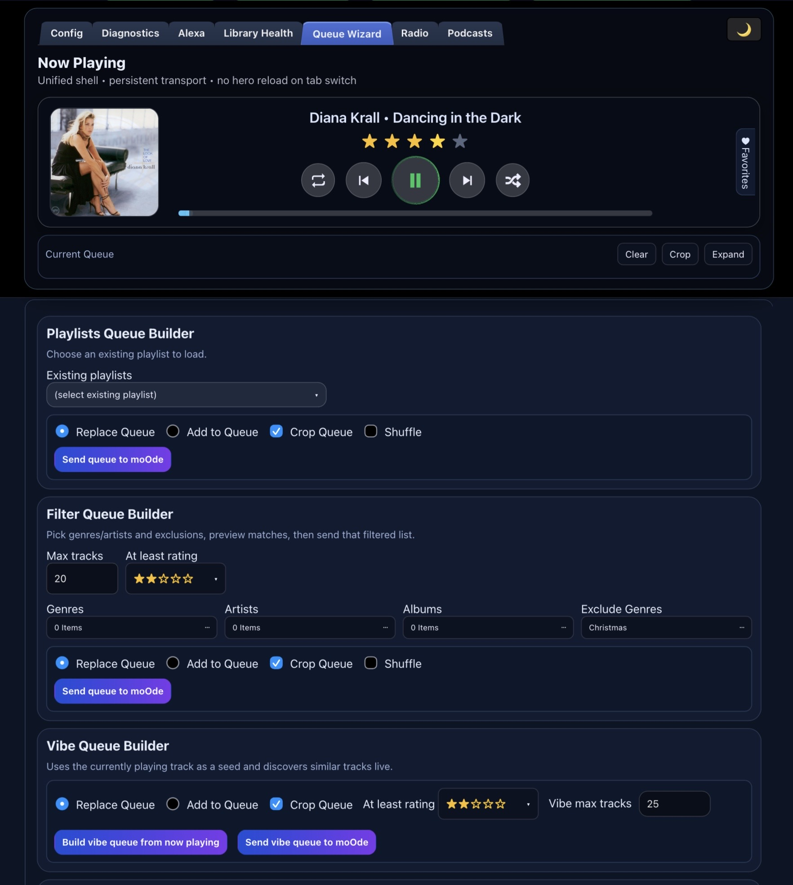
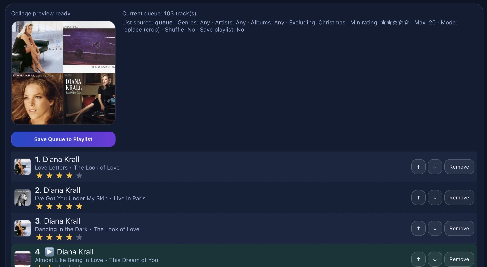

# now-playing

A moOde-focused now-playing API + UI stack with optional Alexa integration that you run on a separate pi. The project began as a way to display enhanced information (like performers) on a dedicated display (like your TV), especially useful if you like to have Peppymeter running on your moOde box! The project grew from there to add library maintance tools, a full podcasts module, ratings support and more. 

Note: Heavily vibe-coded with openclaw/chatGPT.

NOTE: Developed/tested to run on a separate pi than your moOde pi so moOde's famous reliability is not compromosed. It's possible the project could work from the moOde pi but I have not tested it, so you would be trying that at your own risk.

## What this project does

- Serves a Now Playing API (`/now-playing`, `/next-up`, artwork routes, queue/rating controls)
- Hosts adaptive UI pages (`index.html`, `podcasts.html`, `library-health.html`, `queue-wizard.html`, `config.html`, `diagnostics.html`)
- Manages podcast subscriptions/downloads/playlists
- Provides highly flexible queue creation (especially if you add Lastfm api key)
- Supports optional Alexa endpoint flow when enabled
- Allows for considerable library metadata and art maintanence
- Supports push notifcations (great for headless moOde setup) with album art
- Keeps display behavior as consistent as possible across listening modes:
  - local library music/podcasts
  - radio streams (includes iTunes art (even animated!) if it finds it, and album link
  - AirPlay (some mods made to aplmeta.txt to help with this)
  - UPnP

## Installer (systemd Linux)

For host installs (intended GitHub invocation path):

```bash
curl -fsSL https://raw.githubusercontent.com/teacherguy2020/now-playing/main/scripts/install.sh | bash -s -- --ref main
```

Useful flags:

- `--ref <branch|tag|sha>` (example: `jarvis/refactor-api-structure`)
- `--repo <url>`
- `--install-dir <path>`
- `--port <number>`
- `--mode <split|single-box>`

Example:

```bash
curl -fsSL https://raw.githubusercontent.com/teacherguy2020/now-playing/main/scripts/install.sh | bash -s -- --ref main --install-dir /opt/now-playing --port 3101
```

> Current installer target: **systemd-based Linux**.

## Uninstall (systemd Linux)

Safe uninstall (keeps install directory/config by default):

```bash
curl -fsSL https://raw.githubusercontent.com/teacherguy2020/now-playing/main/scripts/uninstall.sh | bash
```

Purge uninstall (removes install directory too):

```bash
curl -fsSL https://raw.githubusercontent.com/teacherguy2020/now-playing/main/scripts/uninstall.sh | bash -s -- --purge -y
```

## UX highlights

- **Clickable stars for ratings**: users can click star ratings in the now-playing UI to update track rating.
- **Adaptive layout**: `index.html` adapts to screen/environment, including portrait behavior with on-screen playback controls.
- **Alexa-aware display mode**: UI can auto-switch to Alexa playback state using `/alexa/was-playing` (with explicit lifecycle active/inactive state).
- **iTunes enrichment**: track-specific album-art lookup, album release year augmentation, and Apple Music deep-link support when found.
- **AirPlay metadata hardening**: AirPlay metadata handling is enhanced/stabilized to improve continuity and display quality.

## Runtime config

Primary source of truth:

- `config/now-playing.config.json`

Optional overrides via env vars still work (env wins).

You can point to a different config file with:

```bash
export NOW_PLAYING_CONFIG_PATH=/path/to/now-playing.config.json
```

## Key config fields

- `nodes[]` – Pi hosts, IPs, and roles (`api`, `display`, `both`)
- `trackKey`
- `ports.api` / `ports.ui`
- `mpd.host` / `mpd.port`
- `moode.sshHost` / `moode.sshUser` / `moode.baseUrl`
- `runtime.publicBaseUrl` (optional advanced override)
- `alexa.enabled` + `alexa.publicDomain`
- `lastfmApiKey`
- `notifications.trackNotify.*` + `notifications.pushover.*`
- `paths.musicLibraryRoot`, `paths.moodeUsbMount`, `paths.piMountBase`, `paths.podcastRoot`

## Optional: iOS track-start push notifications (Pushover)

The API can send push notifications when a new track starts.

Source selection is automatic:
- If Alexa state is active/fresh (`/alexa/was-playing`) → notify from Alexa track
- Otherwise (normal playback) → notify from `/now-playing` track

Preferred configuration is in the master JSON (`config/now-playing.config.json`):

```json
"notifications": {
  "trackNotify": {
    "enabled": true,
    "pollMs": 3000,
    "dedupeMs": 15000,
    "alexaMaxAgeMs": 21600000
  },
  "pushover": {
    "token": "<your app token>",
    "userKey": "<your user key>"
  }
}
```

Environment variables still override config when present:
- `TRACK_NOTIFY_ENABLED`
- `TRACK_NOTIFY_POLL_MS`
- `TRACK_NOTIFY_DEDUPE_MS`
- `TRACK_NOTIFY_ALEXA_MAX_AGE_MS`
- `PUSHOVER_TOKEN`
- `PUSHOVER_USER_KEY`

After config/env changes:

```bash
pm2 restart api --update-env
pm2 save
```

### Queue Wizard (`queue-wizard.html`)


Queue Wizard now supports two explicit build modes:
- **Filter Queue Builder** (genre/artist/excludes/rating threshold)
- **Vibe Queue Builder** (seed from now-playing with live progress)

⚠️ **Vibe mode requires a Last.fm API key.**
- You can create one free at: <https://www.last.fm/api/account/create>
- Add it in `config.html` under **Last.fm (Vibe)**
- If not configured, the Vibe module is automatically hidden

Recent behavior highlights:
- Real vibe progress via async job endpoints (`vibe-start`, `vibe-status`, `vibe-cancel`)
- Live per-track feed while vibe builds
- Separate send actions for filtered vs vibe list
- Shared playlist-save controls in the lower cover module
- Collage preview is generated for both filtered and vibe lists
- Vibe is automatically hidden when Last.fm is not configured 

Queue Wizard will also save your built queue to a playlist, and create a collage cover for it.


### Radio page (`radio.html`)

`radio.html` is the dedicated radio control surface.

Highlights:
- Uses the shared hero transport card for now-playing context and transport actions.
- Includes a right-side favorites drawer for one-tap station actions.
- Shows stream-focused metadata in hero mode (for example `Live • <station name>` when no progress bar is available).
- Keeps status pill parity with other pages (API / Web / moOde / Alexa).
- Uses the same runtime key + API patterns as other UI pages.

### Web config page

You can edit core settings in-browser at:

- `https://<IP of pi running now-playing>/config.html`

The page reads/writes via:
- `GET /config/runtime`
- `POST /config/runtime` (requires `x-track-key`)

It supports both:
- guided field editing (feature toggles, network/runtime, Alexa, Last.fm, Pushover)
- advanced full JSON editing (entire config object)

After save, the UI prompts to restart API. On PM2 hosts, uses the built-in "Restart API now" action.

Notes:
- Track key field supports masked/unmasked toggle.
- Track key is preloaded from effective runtime config (and cached in browser localStorage).
- Notification values are shown as effective values (config + env overrides).

### Library Health page (`library-health.html`)

`library-health.html` is a maintenance dashboard for library cleanup and tagging workflows.

Main capabilities:
- Summary cards: total tracks/albums, unrated/low-rated, missing MBID, missing genre
- Charts: full genre distribution + rating distribution
- Missing genre batch tagging (folder/track selection)
- Unrated batch rating assignment
- Genre retag-by-folder workflow:
  - pick a source genre
  - load folders containing that genre
  - retag selected folders to a new genre
- Missing artwork workflow (on-demand deep scan):
  - "Search for missing art" confirms before a full scan
  - results list opens directly into album-art update module
- Album-art update module:
  - select album folder
  - preview existing `cover.jpg` if present
  - upload replacement art (normalized to square)
  - apply mode: **Add cover.jpg**, **Embed image**, or **Both**

Related API routes:
- `GET /config/library-health`
- `GET /config/library-health/albums`
- `GET /config/library-health/album-art`
- `POST /config/library-health/album-art`
- `GET /config/library-health/missing-artwork`
- `GET /config/library-health/genre-folders`
- `POST /config/library-health/genre-batch`
- `POST /config/library-health/rating-batch`

## Ratings (MPD stickers)

If ratings are enabled, ensure MPD has `sticker_file` configured and writable.

Example in `mpd.conf`:

```conf
sticker_file "/var/lib/mpd/sticker.sql"
```

## Deployment notes

Many setups copy files to Pi hosts (`scp`/`rsync`) instead of pulling directly from git.
If so, deploy to the folder actually served by your web/API processes, then restart service manager (PM2/systemd).

## SSH prerequisite (API host → moOde host)

Several config/runtime features (cover generation, ratings DB backup/restore, environment checks) require SSH from the API host to the moOde host.

Expected model:
- key-based SSH (no password prompt)
- `sudo -n` works for required file operations on moOde

Typical setup:

```bash
# on API host (e.g., 10.0.0.233)
ssh-keygen -t ed25519 -C "now-playing-api"
ssh-copy-id moode@<moode-host>
ssh moode@<moode-host> 'echo ok'
ssh moode@<moode-host> 'sudo -n true && echo sudo_ok'
```

If `sudo -n true` fails, configure sudoers on moOde for the `moode` user (or your configured SSH user) to allow the minimum commands needed by this project.

Use **Config → Network & Runtime → Check SSH + Paths** as your verification step after setup.

## License

MIT
