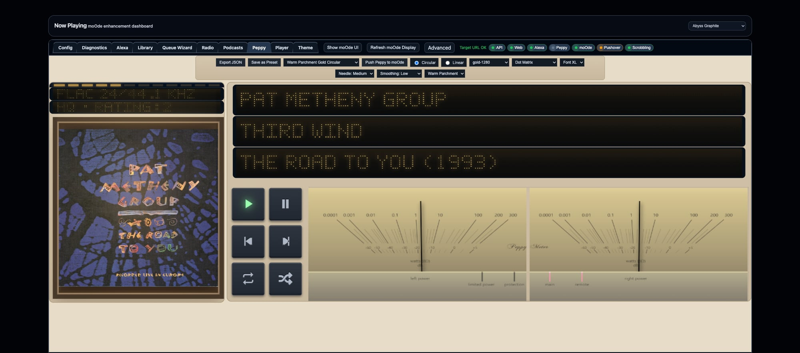
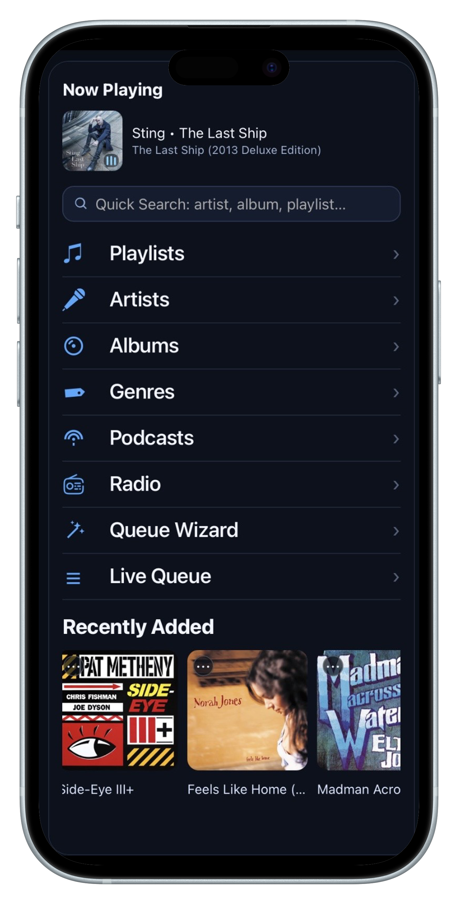

# now-playing

<p align="left"><strong>Now Playing for moOde</strong></p>

A moOde-focused now-playing API + UI stack with optional Alexa integration.






Six ways to use:

1. Browser toolkit/dashboard
2. Display html page
3. Player screen for moOde box
4. Peppymeter+track info screen for moOde box
5. Mobile app
6. Alexa skill

> Recommended topology: run this project on a separate Pi from your moOde host.

## Quick start

1. Install on API/UI host.
2. Open `config.html` and set core fields (`trackKey`, `mpd.host`, `moode.baseUrl`, SSH settings).
3. Run **Check SSH + Paths**.
4. Open `app.html` (shell) or `index.html` (display view) or `player.html` (player view) `controller.html` (mobile view).

## Docs (tab-ordered)

👉 **Start here for full documentation:** [docs/README.md](./docs/README.md)

- Config
- Diagnostics
- Alexa
- Library Health (Album Workbench flow, cached scans + full refresh, inventory sort modes, album-row queue/play actions)
- Queue Wizard
- Radio
- Podcasts
- Theme (for desktop)
- moOde Display Enhancement (custom Peppy/Player push flow)
- Mobile Builder + Controller pages

Plus cross-cutting chapters for hero shell, index-vs-app parity, random-vs-shuffle, deploy/rollback, and troubleshooting.

## Licensing

- Project root license: [Unlicense](./LICENSE), unless otherwise noted.
- Third-party license notices: [THIRD_PARTY_LICENSES.md](./THIRD_PARTY_LICENSES.md)
- `integrations/moode/aplmeta.py` is moOde-derived and remains licensed under GPL-3.0-or-later (per file header/SPDX).

## Install (systemd Linux)

Prerequisite:
- Node.js must be installed on the target machine (`node` and `npm` available in PATH).

Quick check:

```bash
node -v && npm -v
```

If missing (Debian/Raspberry Pi OS), install Node.js first, then run:

```bash
curl -fsSL https://raw.githubusercontent.com/teacherguy2020/now-playing/main/scripts/install.sh | bash -s -- --ref main
```

Useful flags:
- `--ref <branch|tag|sha>`
- `--repo <url>`
- `--install-dir <path>`
- `--port <number>`
- `--mode <split|single-box>`

## Uninstall

```bash
curl -fsSL https://raw.githubusercontent.com/teacherguy2020/now-playing/main/scripts/uninstall.sh | bash
```

Purge:

```bash
curl -fsSL https://raw.githubusercontent.com/teacherguy2020/now-playing/main/scripts/uninstall.sh | bash -s -- --purge -y
```
