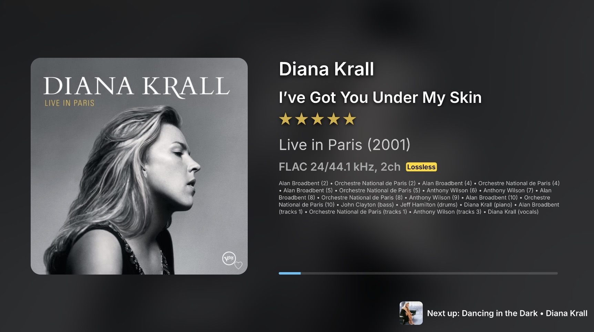
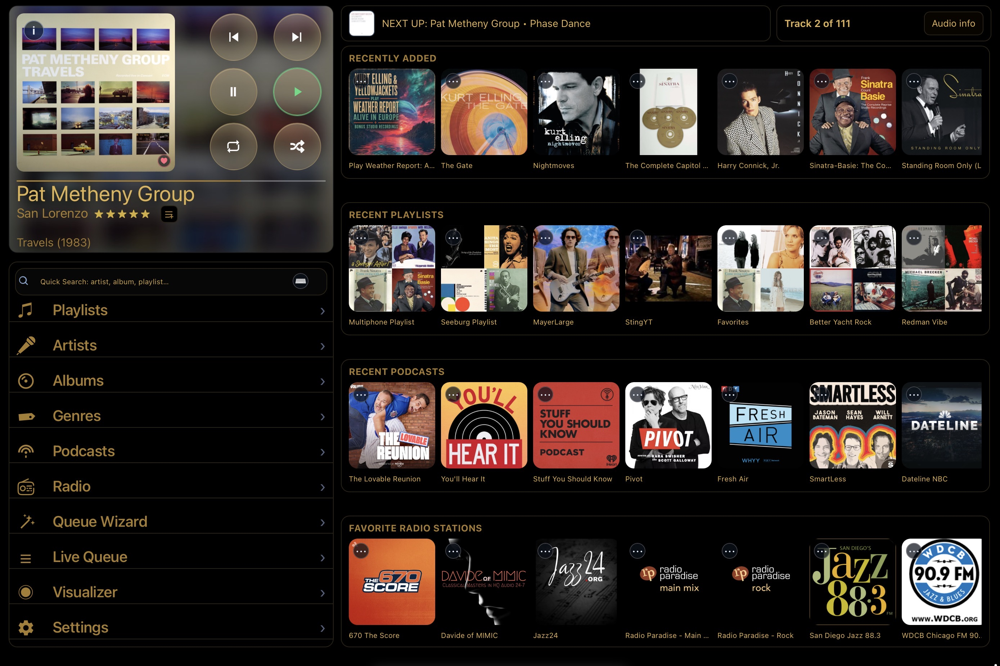
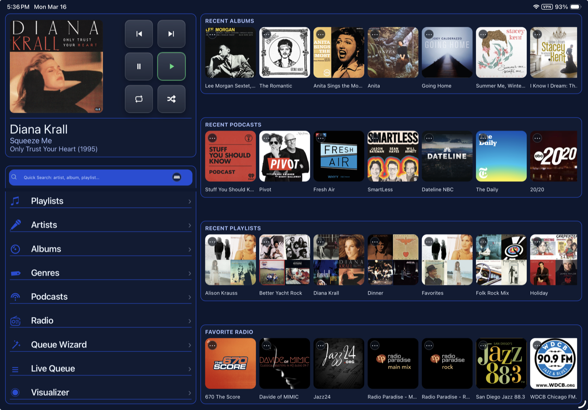

# Now Playing for moOde

Now Playing is a moOde-focused enhancement stack for richer playback state,
metadata, queue control, displays, controllers, and integrations. It runs a
web UI and API on an app host and communicates with a moOde/MPD player over the
LAN.





## What it provides

- Browser dashboard and phone/tablet/computer controllers
- Now Playing, Player, Peppy, Visualizer, and Kiosk display paths
- Queue management, Queue Wizard/Vibe Radio, playlists, ratings, and library health
- Radio, podcasts, YouTube audio, and Listen on Device webstream playback
- Alexa control and validated Seeburg, Multiphone/Mabel, and Mills integrations
- Theme/customization tools and operator diagnostics

## Architecture at a glance

The recommended topology runs Now Playing on a separate host from moOde:

```text
Browser / display clients
          ↓
Now Playing UI :8101  ↔  Now Playing API :3101
                              ↓ MPD / SSH / HTTP
                         moOde player host
```

The API host owns Now Playing state normalization, routes, queue integration,
display/control bridges, and the web UI. MPD/moOde remains the playback
authority unless a documented physical or external mode owns the audio path.

## Quick start

1. Install Node.js, npm, `mpc`, and PM2 on the Now Playing host.
2. Install the project:

   ```sh
   curl -fsSL https://raw.githubusercontent.com/teacherguy2020/now-playing/main/scripts/install.sh | bash -s -- --ref main
   ```

3. Open `config.html`, set the moOde/MPD connection, paths, SSH access, and a
   strong `trackKey`.
4. Run **Check SSH + Paths**, save, and verify `/now-playing` and a controller
   page.

The full first-run path is in [Getting Started](./docs/wiki-source/getting-started.md).

## Documentation

Start with the canonical documentation landing page:

**[docs/wiki-source/README.md](./docs/wiki-source/README.md)**

Audience entry points:

- [Getting Started](./docs/wiki-source/getting-started.md)
- [Using Now Playing](./docs/wiki-source/using-now-playing.md)
- [Displays](./docs/wiki-source/displays.md)
- [Integrations](./docs/wiki-source/integrations.md)
- [Configuration and Administration](./docs/wiki-source/configuration-and-administration.md)
- [Developer Reference](./docs/wiki-source/developer-reference.md)
- [Troubleshooting and Technical Notes](./docs/wiki-source/troubleshooting-and-technical-notes.md)

The editable source is `docs/wiki-source/`. `docs/wiki-site/` and the
GitHub-hosted Wiki are published outputs; do not edit those copies directly.

## moOde display integration

For moOde's local display target, use the LAN proxy URL without an explicit
`:8101` port on current moOde releases:

```text
http://<now-playing-host>/display.html?kiosk=1
```

The display and upgrade runbooks cover Peppy/Player/Visualizer setup, target
URL persistence, blanking/wake compatibility, and rollback:

- [Displays](./docs/wiki-source/displays.md)
- [Display enhancement flow](./docs/wiki-source/display-enhancement-peppy-player-flow.md)
- [moOde upgrade runbook](./docs/22-moode-upgrade-runbook.md)

## Supported integration boundaries

- **moOde/MPD** — primary playback runtime
- **Alexa** — custom skill plus Homebridge/Matter lifecycle bridge
- **Last.fm** — scrobbling and Vibe/queue enrichment
- **Seeburg wallbox** — separate Pico project with Now Playing selection API
- **Shyvers Multiphone/Mabel** — separate repository for conversation/hardware;
  this repository owns bounded integration endpoints
- **Mills Throne of Music** — physical jukebox observation/display bridge

See [Integrations](./docs/wiki-source/integrations.md) for ownership and
authority boundaries.

## Related projects and licensing

- [Seeburg Now Playing Pico](https://github.com/teacherguy2020/seeburg-nowplaying-pico)
- [Shyvers Multiphone/Mabel](https://github.com/teacherguy2020/shyvers-multiphone-mabel)
- [Unlicense](./LICENSE), with third-party notices in
  [THIRD_PARTY_LICENSES.md](./THIRD_PARTY_LICENSES.md)

`integrations/moode/aplmeta.py` remains GPL-3.0-or-later per its file header.
