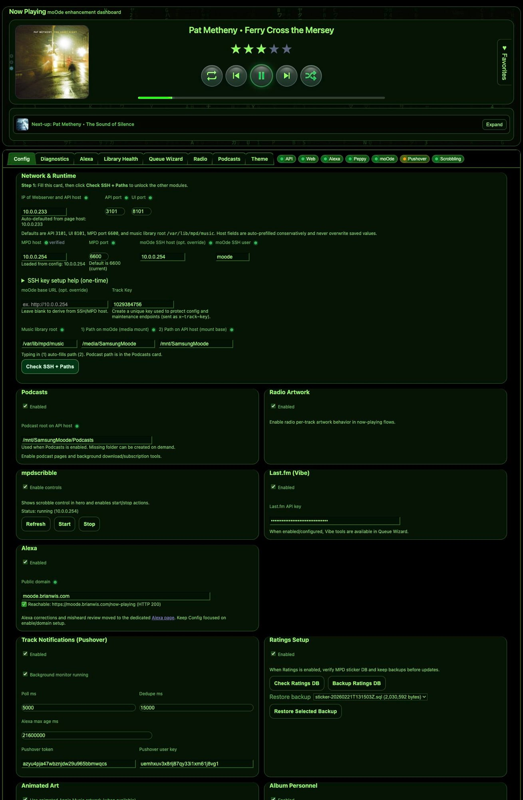

# Config

Use this page to set up how the app connects to your system.

## What this page is for
- Telling the app where moOde and MPD live
- Turning features on/off (Alexa, podcasts, notifications, animated art)
- Saving runtime settings

## What the main controls do
- **Save settings / Save configuration**: writes your changes to config.
- **Check SSH + Paths**: tests your SSH/path setup so jobs can run correctly.
- **Reload**: reloads current config values from disk.

## Common tasks
### First-time setup
1. Enter MPD host/port and web/API ports.
2. Enter moOde host/base URL.
3. Set your `trackKey`.
4. Click **Check SSH + Paths**.
5. Save settings.

### Turn features on/off
- Toggle feature checkboxes (Alexa, podcasts, etc.)
- Save settings

## If something looks wrong
- API/Web badges wrong? Re-check host/port fields here.
- Alexa not behaving? Re-check Alexa/domain fields and save.
- Changes not taking effect? Restart API/webserver.
