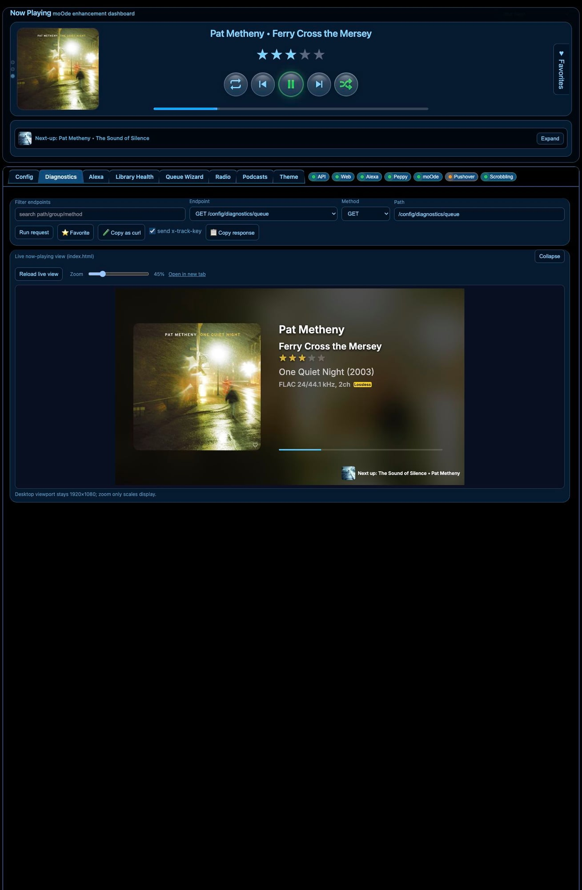

# Diagnostics

Use this page to test endpoints and see live JSON/output quickly.

## What this page is for
- Running API calls by hand
- Copying responses/curl commands
- Comparing shell view with embedded `index.html`

## What the main controls do
- **Endpoint / Method / Path**: choose what request to run.
- **Run request**: executes the request.
- **Copy as curl**: copies a terminal-ready curl command.
- **Copy response**: copies the latest JSON result.
- **send x-track-key**: includes auth key on requests that need it.

## Common tasks
### Check now-playing quickly
1. Set path to `/now-playing`
2. Click **Run request**
3. Review JSON in the response panel

### Check queue state
1. Set path to `/config/diagnostics/queue`
2. Run request
3. Look at `headPos`, `items`, `randomOn`

## Tip
This is the best page for troubleshooting before changing code.
