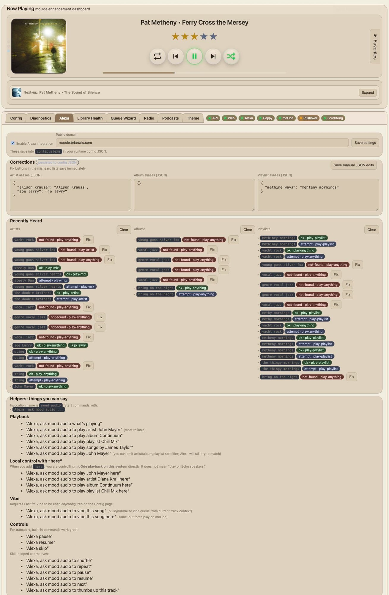

# Alexa

Use this page to manage Alexa integration and voice command behavior.

## What this page is for
- Enabling/disabling Alexa integration
- Managing correction maps (artist/album/playlist spellings)
- Reviewing recent Alexa command outcomes

## What the main controls do
- **Enable Alexa integration**: turns Alexa handling on/off.
- **Save settings**: saves Alexa/domain settings.
- **Save manual JSON edits**: saves correction map edits.
- **Clear** buttons: clear recent history lists.

## Common tasks
### Fix misheard names
1. Add correction in artist/album/playlist aliases
2. Save manual JSON edits
3. Retry voice command

### Confirm Alexa activity
- Check “Recently Heard” lists for command results
- Verify status labels (`ok`, `attempt`, `not-found`)

## Behavior note
In Alexa mode, queue behavior is different from normal playback. The UI treats queue head as queued-next.

## Full phrase coverage (from interaction model)
Source: `alexa/interaction-model.v2.json`

### NowPlayingIntent
- what's playing
- what is playing
- what song is this
- what track is this
- what's this
- what song is playing
- what track is playing
- name the song
- name the track
- who is this
- who is singing

### PlayAlbumIntent
- play album {album}
- play the album {album}
- start album {album}
- queue album {album}
- queue the album {album}
- play the album called {album}
- start the album called {album}

### PlayPlaylistIntent
- play playlist {playlist}
- play the playlist {playlist}
- start playlist {playlist}
- start the playlist {playlist}
- queue playlist {playlist}
- queue the playlist {playlist}
- play my playlist {playlist}
- start my playlist {playlist}
- play the playlist called {playlist}
- start the playlist called {playlist}

### PlayMixIntent
- play a mix of {mixQuery}
- play mix of {mixQuery}
- play a mix with {mixQuery}
- play mix with {mixQuery}
- mix {mixQuery}
- create a mix of {mixQuery}
- queue a mix of {mixQuery}
- make a mix of {mixQuery}

### PlayQueueIntent
- play the queue
- play queue
- start the queue
- start queue
- resume the queue
- resume queue

### PlayHereIntent
- play {query} here
- start {query} here
- queue {query} here
- play artist {query} here
- start artist {query} here
- queue artist {query} here
- play album {query} here
- start album {query} here
- queue album {query} here
- play playlist {query} here
- start playlist {query} here
- queue playlist {query} here
- play song {query} here
- play track {query} here
- play music by {query} here

### PlayAnythingIntent
- play {query}
- start {query}
- queue {query}

### VibeThisSongHereIntent
- vibe this song here
- vibe this track here
- make a vibe from this song here
- build a vibe from this song here

### VibeThisSongIntent
- vibe this song
- vibe this track
- make a vibe from this song
- make a vibe from this track
- build a vibe from this song

### PlayArtistIntent
- play artist {artist}
- play music by {artist}
- start artist {artist}
- queue artist {artist}
- play songs by {artist}
- play tracks by {artist}
- play songs from {artist}
- play tracks from {artist}
- to play songs by {artist}
- to play tracks by {artist}
- play songs by artist {artist}
- play tracks by artist {artist}
- play songs from artist {artist}
- play tracks from artist {artist}

### PlayTrackIntent
- play song {track}
- play the song {track}
- play track {track}
- play the track {track}
- queue song {track}
- queue track {track}

### ShuffleIntent
- shuffle {state}
- turn shuffle {state}
- set shuffle {state}
- shuffle mode {state}

### RepeatIntent
- set repeat to {mode}
- repeat {mode}
- repeat mode {mode}
- turn repeat {mode}

### RateTrackIntent
- rate this {rating}
- set rating to {rating}
- rate this track {rating}
- give this {rating}
- thumbs {rating}
