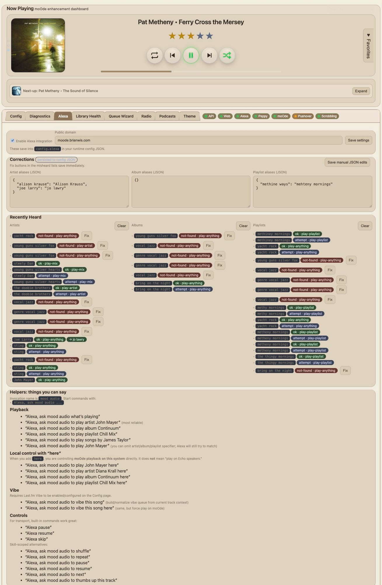

# Alexa



Use this page to manage Alexa integration and voice command behavior.

## What this page is for
- Managing correction maps (artist/album/playlist spellings)
- Reviewing recent Alexa command outcomes
- Clearing recently heard Alexa history

> **Important:** Alexa enable + public domain are configured on the **Config** page (source of truth), not this page.

## What the main controls do
- **Save manual JSON edits**: saves correction map edits.
- **Clear** buttons: clear recent history lists.

## Common tasks
### Fix misheard names
1. Add correction in artist/album/playlist aliases
2. Save manual JSON edits
3. Retry voice command

### Confirm Alexa activity
- Check “Recently Heard” lists for command results
- Verify status labels (`ok`, `attempt`, `not-found`)

## Behavior note
In Alexa mode, queue behavior is different from normal playback. The UI treats queue head as queued-next.

## Public domain requirements (critical)
Alexa cloud requests must reach your public domain (example: `moode.YOURDOMAIN.com`) and then be reverse-proxied to local services.

### Required network forwards (router/eero)
Forward these ports to the host running Caddy (current primary: `nowplaying.local`):
- **TCP 80** -> `nowplaying.local:80`
- **TCP 443** -> `nowplaying.local:443`

If these are missing or pointed at an old host, domain checks fail and Alexa cannot connect.

### Required reverse proxy routes (Caddy)
At minimum:
- `/now-playing`, `/alexa/*`, `/config*`, `/art/*`, etc. -> `127.0.0.1:3101` (Node API)
- fallback `/` -> `127.0.0.1:8101` (web UI)
- `/coverart.php*` + `/images/*` -> `IPOFYOURMOODEBOX:80` (moOde art)
- `/stream*` -> `IPOFYOURMOODEBOX:8000` (moOde stream)

Use `header_down X-Upstream ...` during setup to verify which backend served each path.

## Caddy bring-up checklist (new host migration)
1. Install Caddy on the new host.
2. Install production Caddyfile.
3. Ensure access-log path permissions are valid for user `caddy`:
   - `/var/log/caddy` owner `caddy:caddy`
   - `/var/log/caddy/moode_access.log` owner `caddy:caddy`
4. Validate + restart:
   - `sudo caddy validate --config /etc/caddy/Caddyfile`
   - `sudo systemctl restart caddy`
5. Verify:
   - `curl -I https://<domain>/now-playing` -> `200`, `x-upstream: node:3101`
   - `curl -I https://<domain>/` -> `200`, `x-upstream: albumart:8101`

## Example Caddyfile (copy/paste baseline)
```caddy
{
  # ACME notices
  email you@YOURDOMAIN.com
}

moode.YOURDOMAIN.com {
  log {
    output file /var/log/caddy/moode_access.log
    format json
  }

  header {
    X-Site moode.YOURDOMAIN.com
  }

  @moode_art {
    path /coverart.php* /images/*
  }
  handle @moode_art {
    reverse_proxy IPOFYOURMOODEBOX:80 {
      header_down -Set-Cookie
      header_down X-Upstream "moode:80"
    }
  }

  @node_api {
    path /now-playing /next-up /favorites/toggle /queue/advance* /queue/play_item* /queue/mix* /mpd/* /track /track/* /art/* /_debug/* /alexa/* /podcasts* /rating* /config*
  }
  handle @node_api {
    reverse_proxy 127.0.0.1:3101 {
      header_down X-Upstream "node:3101"
    }
  }

  @moode_stream {
    path /stream*
  }
  handle @moode_stream {
    reverse_proxy IPOFYOURMOODEBOX:8000 {
      header_down X-Upstream "moode:8000"
    }
  }

  handle {
    reverse_proxy 127.0.0.1:8101 {
      header_down X-Upstream "albumart:8101"
    }
  }
}
```

> Note: Let Caddy manage automatic HTTPS/challenge handling; avoid adding a manual `:80 { redir ... }` block during initial cert bring-up.

## Common failure signatures and fixes
- **`502` on all public URLs**
  - Caddy missing/not running on current host, or forwards still pointed at old host.
- **Caddy start fails with `permission denied` on `/var/log/caddy/moode_access.log`**
  - Fix ownership/permissions for log directory and file.
- **ACME challenge errors (`tls-alpn-01` / `http-01`)**
  - Ensure TCP 80/443 forward to correct host.
  - Ensure DNS resolves to the active WAN endpoint.
  - Avoid conflicting manual `:80` redirect blocks that can interfere with challenge flow; prefer Caddy automatic HTTPS handling.

## Full phrase coverage (from interaction model)
Source: `alexa/interaction-model.v2.json`

### NowPlayingIntent
- what's playing
- what is playing
- what song is this
- what track is this
- what's this
- what song is playing
- what track is playing
- name the song
- name the track
- who is this
- who is singing

### PlayAlbumIntent
- play album {album}
- play the album {album}
- start album {album}
- queue album {album}
- queue the album {album}
- play the album called {album}
- start the album called {album}

### PlayPlaylistIntent
- play playlist {playlist}
- play the playlist {playlist}
- start playlist {playlist}
- start the playlist {playlist}
- queue playlist {playlist}
- queue the playlist {playlist}
- play my playlist {playlist}
- start my playlist {playlist}
- play the playlist called {playlist}
- start the playlist called {playlist}

### PlayMixIntent
- play a mix of {mixQuery}
- play mix of {mixQuery}
- play a mix with {mixQuery}
- play mix with {mixQuery}
- mix {mixQuery}
- create a mix of {mixQuery}
- queue a mix of {mixQuery}
- make a mix of {mixQuery}

### PlayQueueIntent
- play the queue
- play queue
- start the queue
- start queue
- resume the queue
- resume queue

### PlayHereIntent
- play {query} here
- start {query} here
- queue {query} here
- play artist {query} here
- start artist {query} here
- queue artist {query} here
- play album {query} here
- start album {query} here
- queue album {query} here
- play playlist {query} here
- start playlist {query} here
- queue playlist {query} here
- play song {query} here
- play track {query} here
- play music by {query} here

### PlayAnythingIntent
- play {query}
- start {query}
- queue {query}

### VibeThisSongHereIntent
- vibe this song here
- vibe this track here
- make a vibe from this song here
- build a vibe from this song here

### VibeThisSongIntent
- vibe this song
- vibe this track
- make a vibe from this song
- make a vibe from this track
- build a vibe from this song

### PlayArtistIntent
- play artist {artist}
- play music by {artist}
- start artist {artist}
- queue artist {artist}
- play songs by {artist}
- play tracks by {artist}
- play songs from {artist}
- play tracks from {artist}
- to play songs by {artist}
- to play tracks by {artist}
- play songs by artist {artist}
- play tracks by artist {artist}
- play songs from artist {artist}
- play tracks from artist {artist}

### PlayTrackIntent
- play song {track}
- play the song {track}
- play track {track}
- play the track {track}
- queue song {track}
- queue track {track}

### ShuffleIntent
- shuffle {state}
- turn shuffle {state}
- set shuffle {state}
- shuffle mode {state}

### RepeatIntent
- set repeat to {mode}
- repeat {mode}
- repeat mode {mode}
- turn repeat {mode}

### RateTrackIntent
- rate this {rating}
- set rating to {rating}
- rate this track {rating}
- give this {rating}
- thumbs {rating}
