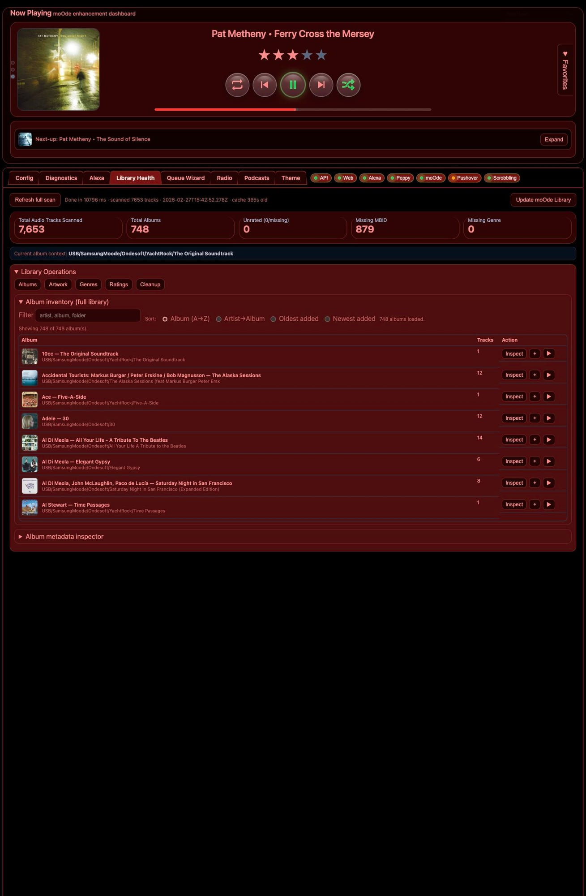

# Library Health

Library Health gives a metadata quality dashboard and repair actions.

## What you can inspect
- track totals, rating distribution, genre distribution
- missing or inconsistent metadata classes
- artwork and animated-art candidate coverage

## Typical actions
- normalize genres
- fix artist/album metadata drift
- run targeted cleanup tasks from sampled rows

## Why this tab exists
Queue quality and recommendations depend heavily on clean metadata. This tab keeps the music corpus healthy over time.
