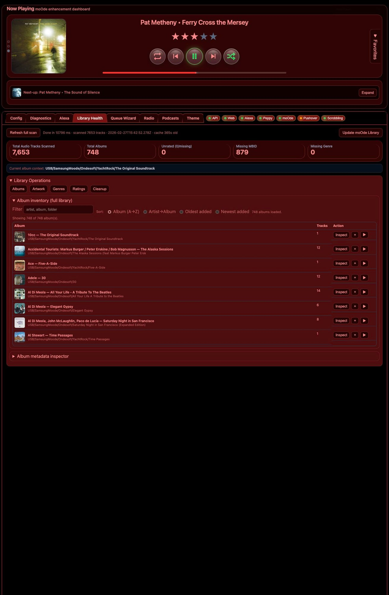

# Library Health

Use this page to audit, fix, and queue library content without re-selecting albums.

## Current flow (Album Workbench)
1. Open **Library Operations → Albums → Album inventory**.
2. Pick an album once with **Inspect**.
3. Work in one place under **Album metadata inspector**, where album-specific tools are now grouped:
   - Metadata inspector
   - Update album art
   - Update album genre

Album context is shared across these modules so you don’t have to find the same album repeatedly.

## Scan behavior
- Page load is **manual-first**: controls render without forcing a fresh heavy scan.
- The UI requests cache-only snapshot data on open; if cache exists, it is shown.
- If no cache exists, controls still render and status explains manual mode.
- Use **Run** / **Refresh full scan** when you explicitly want recompute.
- Results are cached for fast reopen.

## Album inventory features
- Filter by artist/album/folder text.
- Sort modes (persisted in browser):
  - Album (A→Z)
  - Artist→Album
  - Oldest added
  - Newest added
- Row actions:
  - **Inspect** (loads album workbench)
  - **+** add album to queue
  - **▶** play album now
- Album thumbnails attempt, in order:
  - Folder art files (`cover|folder|front` jpg/jpeg/png)
  - Embedded artwork extraction fallback from album tracks

## Other maintenance modules
- Missing artwork finder
- Genre retagging (sample + batch)
- Ratings and unrated workflows
- MBID and artist cleanup tools
- Animated art cache management

## Tip
Run broad fixes in small batches first, verify, then continue.
