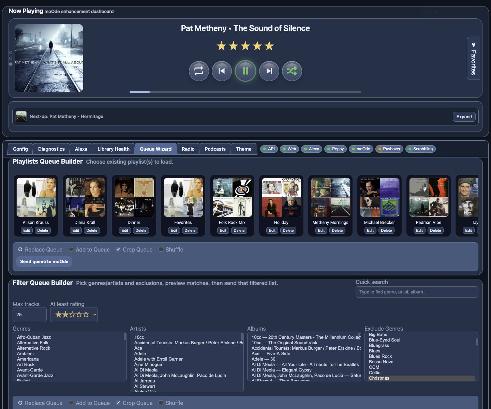

# Queue Wizard

Use this page to build and send queues fast.

## What this page is for
- Building queue from playlists
- Building queue from filters (genre/artist/album)
- Building vibe queues from current track context

## What the main controls do
- **Replace Queue / Add to Queue**: choose how to send results.
- **Crop Queue**: trim existing queue before sending.
- **Random**: random playback mode behavior (does not reorder items).
- **Send queue to moOde**: applies current selection.
- **Save playlist**: stores generated set as playlist.

## Common tasks
### Build from existing playlists
1. Select playlist cards
2. Choose replace/add mode
3. Click **Send queue to moOde**

### Build a filtered queue
1. Set max tracks + rating
2. Pick genre/artist/album filters
3. Send queue

### Build a vibe queue
1. Click **Build vibe queue from now playing**
2. Review
3. Send to moOde
