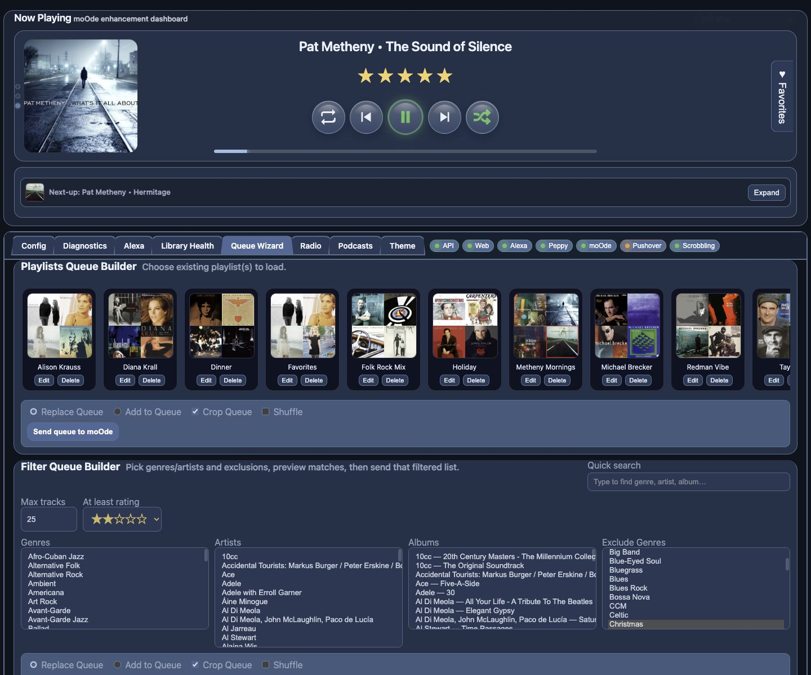

# Queue Wizard



Use this page to build and send queues fast.

## What this page is for
- Building queue from playlists
- Building queue from filters (genre/artist/album)
- Building vibe queues from current track context

## Vibe prerequisites (API host)
For Last.fm Vibe to work, the now-playing API host needs:

- `python3-mpd`
- `python3-requests`
- `python3-mutagen`

Install on Debian/Ubuntu:

```bash
sudo apt install -y python3-mpd python3-requests python3-mutagen
```

Also ensure `moode_library_index.json` is present on the API host (project root by default).

## What the main controls do
- **Replace Queue / Add to Queue**: choose how to send results.
- **Crop Queue**: trim existing queue before sending.
- **Random**: random playback mode behavior (does not reorder items).
- **Send queue to moOde**: applies current selection.
- **Save playlist**: stores generated set as playlist.

## Common tasks
### Build from existing playlists
1. Select playlist cards
2. Choose replace/add mode
3. Click **Send queue to moOde**

### Build a filtered queue
1. Set max tracks + rating
2. Pick genre/artist/album filters
3. Send queue

### Build a vibe queue
1. Click **Build vibe queue from now playing**
2. Review
3. Send to moOde

### Use Endless Vibe from Live Queue
The tablet controller's **Live Queue** page has an **Endless Vibe** toggle beside **Route to Alexa**.
When enabled, it watches for the currently playing track to become the final item in the queue. It then:

1. Crops the queue to the playing track, preserving its playback position.
2. Uses that track as the new Last.fm Vibe seed.
3. Builds and appends a new queue without intentionally interrupting playback.

The toggle is off by default and is remembered by that browser. Endless Vibe ignores radio, podcast, and other stream entries. If Last.fm cannot produce usable local matches, the seed remains in place rather than being discarded.
