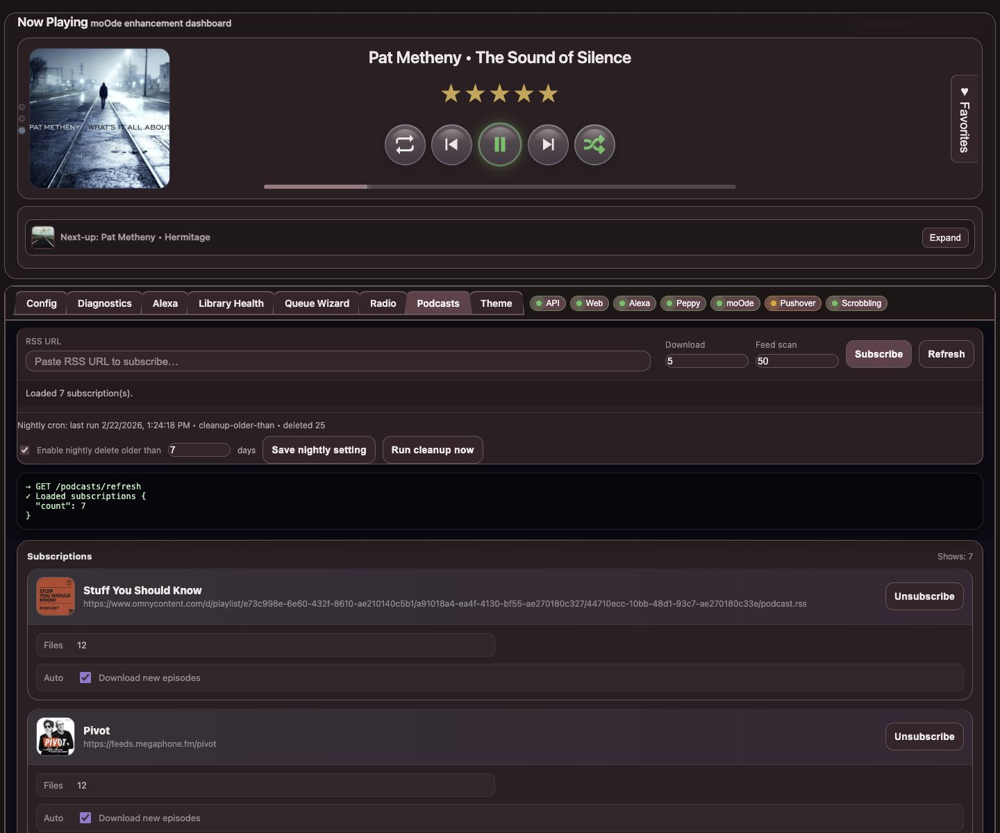

# Podcasts

Use this page to manage podcast subscriptions and episode downloads.

## What this page is for
- Subscribing by RSS URL
- Refreshing feeds
- Controlling auto-download + retention behavior

## What the main controls do
- **Subscribe**: add new podcast feed.
- **Refresh**: scan feeds now.
- **Download / Feed scan counts**: set batch sizes.
- **Nightly delete settings**: clean older files automatically.
- **Unsubscribe**: remove a show.
- **Auto download new episodes**: per-show toggle.

## Common tasks
### Add a new podcast
1. Paste RSS URL
2. Set download/scan counts
3. Click **Subscribe**

### Force a refresh now
1. Click **Refresh**
2. Confirm episode counts update in subscription cards

### Keep storage under control
- Enable nightly delete and set days threshold
