# moOde Display Enhancement (Peppy + Player)

This chapter documents the custom display flow hosted on the API/Web server (`:8101`) and pushed to moOde's Chromium target.

## Overview

When **moOde Display Enhancement** is enabled in `config.html`, the app exposes:

- `peppy.html` (custom peppy builder/view)
- `player.html` (builder)
- `player-render.html` (actual player renderer)
- `display.html` (stable router URL for moOde)

### How Peppy meter + spectrum data works (ALSA -> HTTP bridge)

The custom Peppy view does not read ALSA directly in browser JavaScript.

Instead, the audio path is split into two HTTP feeds:

1. **VU feed (meters)**
   - Producer: moOde peppymeter path
   - API ingest: `PUT /peppy/vumeter`
   - UI read: `GET /peppy/vumeter`
2. **Spectrum feed (bands)**
   - Producer: peppyspectrum FIFO reader bridge
   - API ingest: `PUT /peppy/spectrum`
   - UI read: `GET /peppy/spectrum`

`peppy.html` consumes both and chooses rendering by meter type:

- `circular` -> VU needles
- `linear` -> VU rails
- `spectrum` -> 30/32-band spectrum renderer

Important runtime note:

- Fullscreen native `spectrum.py` and the HTTP spectrum bridge should not be active as concurrent readers of `/tmp/peppyspectrum`.
- Use explicit mode switching:
  - **Skins/WebUI mode:** bridge ON, native fullscreen spectrum OFF
  - **Native fullscreen spectrum:** bridge OFF, native spectrum ON

## Why this is different (builder-first display design)

This project does not treat meter skins and now-playing text as separate worlds.

The custom flow is intentionally **builder-first**:

- Build a single display composition that combines:
  - meter geometry (`circular` or `linear`)
  - meter skin + theme
  - typography (artist/title/album/metadata)
  - progress style and source behavior
- Push that composition to moOde through a stable router URL.
- Keep app-shell theme independent from peppy/player display theme.

In practice, this lets users design complete display experiences (not just switch meter art):

- classic or modern meter language
- dot-matrix vs modern font behavior
- linear/circular meter families
- metadata visibility choices per use case (local/radio/airplay/upnp/podcast)

The goal is creative control with predictable deployment: **design in-builder, push to moOde, render from one stable target URL**.

### No-config-file workflow (important)

A core design goal of this project is that users can tune Peppy behavior from the UI without hand-editing config files.

In practice, that means meter/spectrum composition and behavior are exposed directly in the builder (presets, meter type, linear/circular/spectrum styling, sensitivity, smoothing, spectrum color, energy, and peak behavior), then saved/pushed as profile JSON.

For normal use, there is no need to open or edit moOde-side config files manually.

## Stable target URL (how users switch from moOde Web UI)

In moOde, go to:

- **Configure -> Peripherals -> Local display -> Web UI target URL**

Set it to:

- `http://<WEB_HOST>:8101/display.html?kiosk=1`

This is the recommended handoff URL for the display system in this project.

Then in the app:

- use **Push Player to moOde** to render `player-render.html`
- use **Push Peppy to moOde** to render `peppy.html`

So users only change moOde's target once; mode switching then happens from app push actions.

`display.html` reads saved profile JSON and renders one of:

- `displayMode=peppy` -> `peppy.html`
- `displayMode=player` -> `player-render.html`
- `displayMode=moode` -> `http://moode.local/index.php`

## Builder choices (Peppy) and what they do

`peppy.html` is a composition builder. The key controls are:

- **Preset**
  - Loads a saved profile (built-in or custom).
  - Presets include full profile fields and are normalized for backward compatibility.

- **Meter type**
  - **Circular**: classic dual VU meter art.
  - **Linear**: dual horizontal rails with selectable style/size.
  - **Spectrum**: 30/32-band renderer in the same meter area.

- **Circular skin** (shown when Circular is selected)
  - Selects artwork family (`blue-1280`, `gold-1280`, etc.).

- **Linear style** (shown when Linear is selected)
  - `Cassette (segmented)`
  - `Continuous (green→yellow→red)`
  - `Continuous (theme color)`

- **Linear size** (shown when Linear is selected)
  - `Small`, `Medium`, `Large`

- **Spectrum color/theme** (shown when Spectrum is selected)
  - `Theme`, `Cyan`, `Lime`, `Amber`, `Magenta`, `Mono`
  - `Vintage EQ`, `Vintage Smooth`

- **Spectrum energy** (shown when Spectrum is selected)
  - `Off`, `Low`, `Medium`, `High`
  - controls motion/reactivity intensity (vintage and modern variants)

- **Font style**
  - `UI Sans`, `UI Sans Condensed`, `Inter Tight`, `Montserrat`, `Dot Matrix`

- **Font size**
  - `S`, `M`, `L`, `XL`

- **Sensitivity / smoothing**
  - `Sensitivity`: `Low`, `Medium`, `High`, `Ultra`
  - `Smoothing`: `Off`, `Low`, `Medium`, `High`
  - Applies to meter animation and spectrum behavior.

- **Theme preset**
  - Applies color system for cards, rails, progress, dot/LED look, etc.

### Save vs Push

- **Save as Preset**
  - Stores profile in local preset list (builder convenience).
  - Does *not* change moOde display target by itself.

- **Push Peppy to moOde**
  - Sends active profile state to API (`/peppy/last-profile`).
  - Updates moOde Chromium app URL to stable router target.
  - `display.html` resolves and renders the pushed mode/profile.

## Push actions

Push actions are now inside each tab/card:

- Peppy tab: **Push Peppy to moOde**
- Player tab: **Push Player to moOde**

These update profile state and refresh moOde display through the stable router URL.

## Config flag

In `config.html`:

- **moOde Display Enhancement**
  - key: `features.moodeDisplayTakeover`

When disabled, Peppy/Player display flows are hidden in app shell navigation.

## Native moOde peppymeter

Custom router mode and native peppymeter are separate display paths.

Advanced control is available via:

- **Native Peppy Takeover** (advanced)

Guardrail: native takeover checks `/etc/peppymeter/config.txt` and blocks if `output.display = False`.

## Peppy built-in preset gallery

Current built-in presets are documented below with captured screenshots from the Peppy builder in Chrome.

### 1) Modern Blue Circular

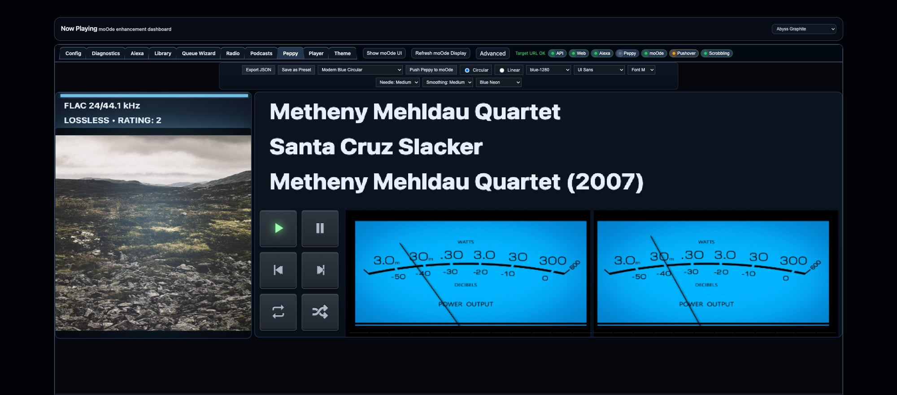

### 2) Matrix Classic Needle

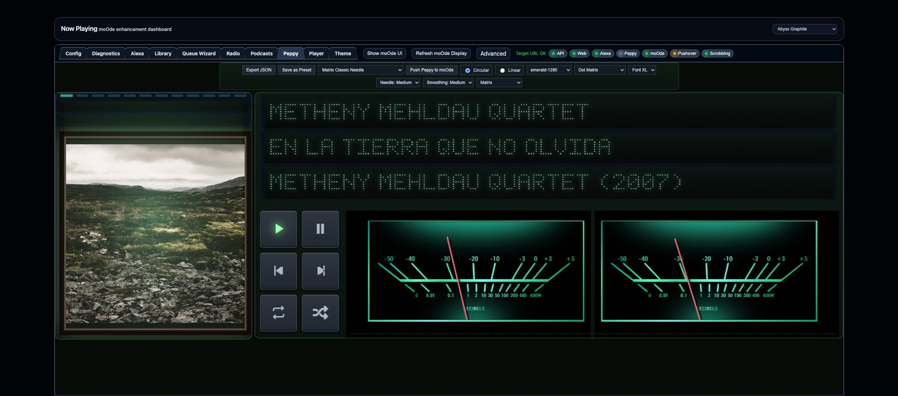

### 3) Red Neon Studio

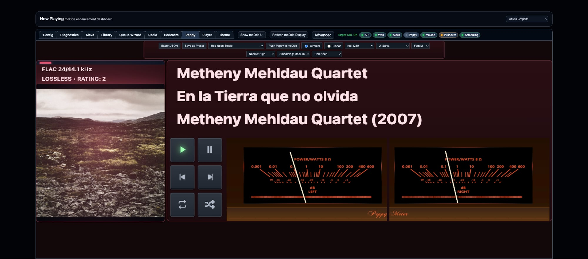

### 4) Cassette Linear Classic

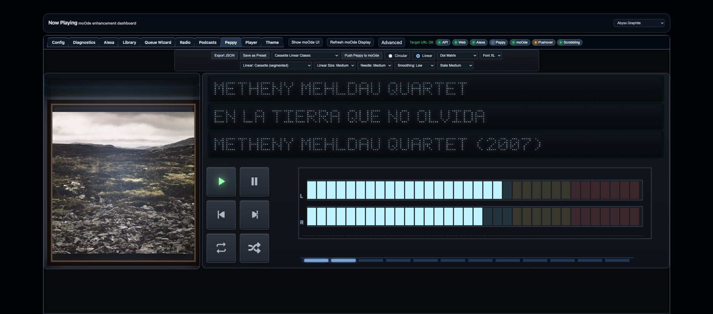

### 5) Obsidian Ember Matrix

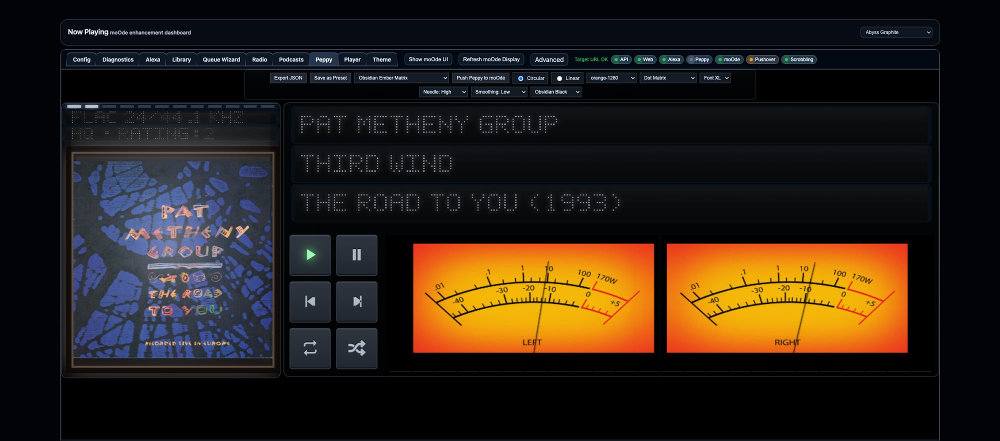

### 6) Gray Ghost

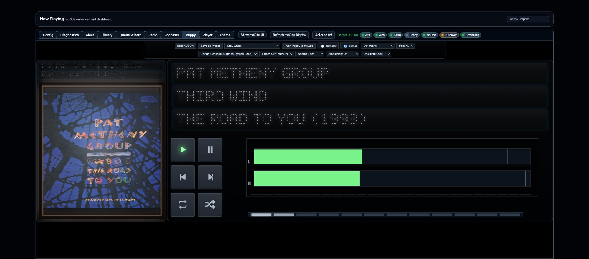

### 7) Modern Condensed Linear Theme (S)

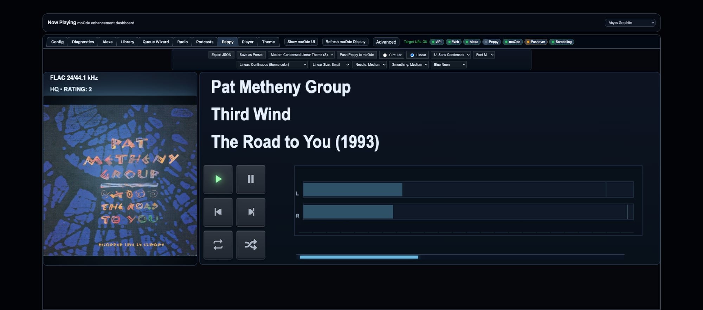

### 8) Inter Tight Studio Linear (L)

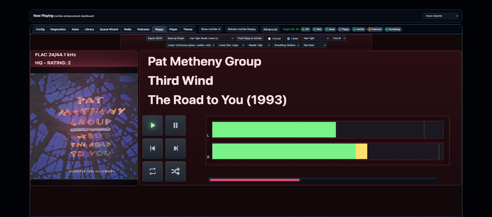

### 9) Montserrat Circular Clean

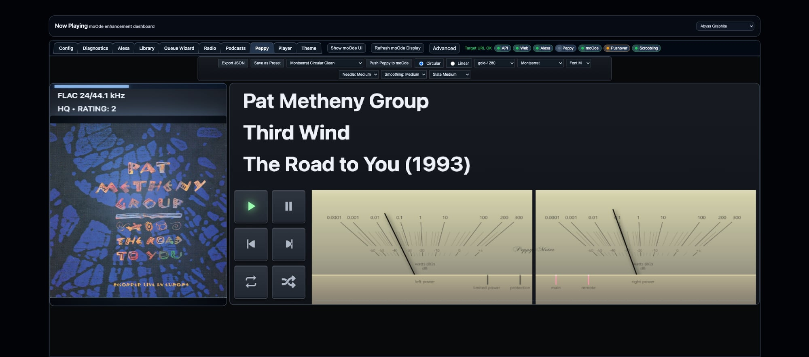

### 10) Warm Parchment Gold Circular


## Player screen size gallery

The Player builder supports the following target sizes:

### 1) 1280x400

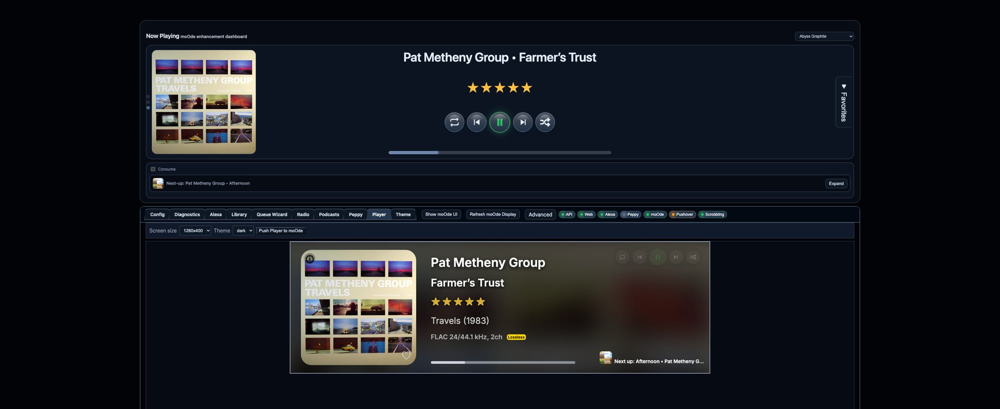

### 2) 1024x600

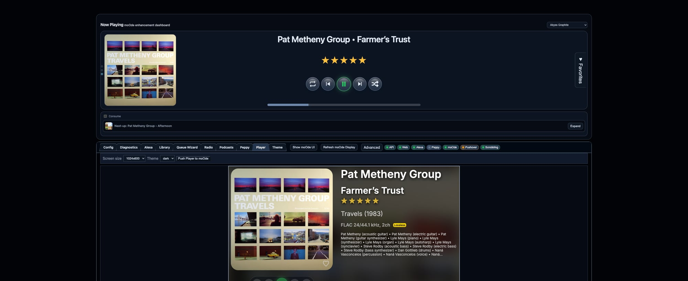

### 3) 800x480

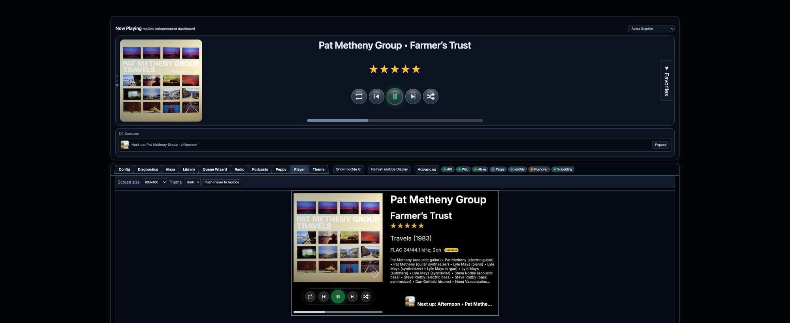

### 4) 480x320

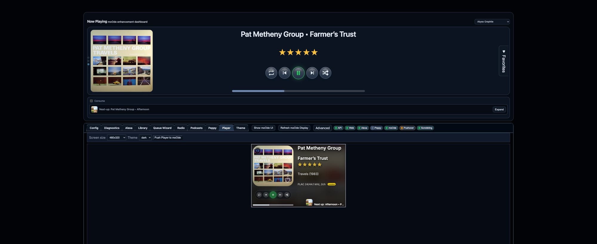

### 5) 320x240

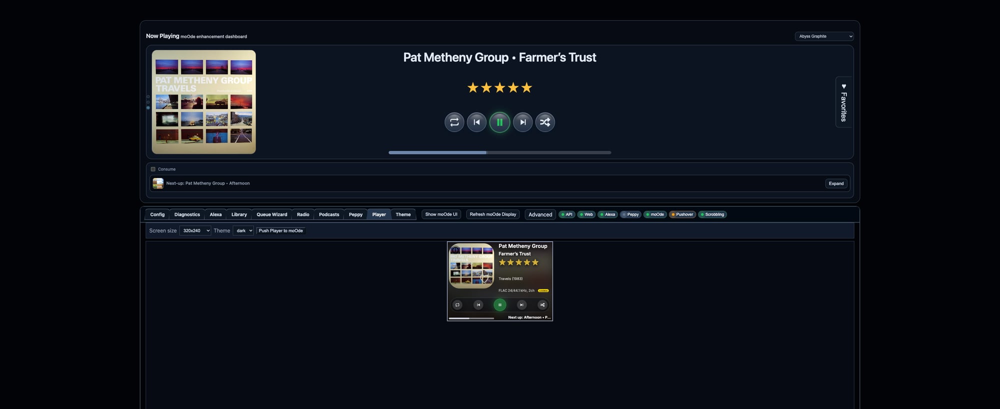

## Verification

SSH check on moOde:

```bash
grep -E -- '--app=' /home/moode/.xinitrc
```

Expected:

```bash
--app="http://<WEB_HOST>:8101/display.html?kiosk=1"
```

Optional runtime check:

```bash
pgrep -af "chromium-browser.*--app="
```
