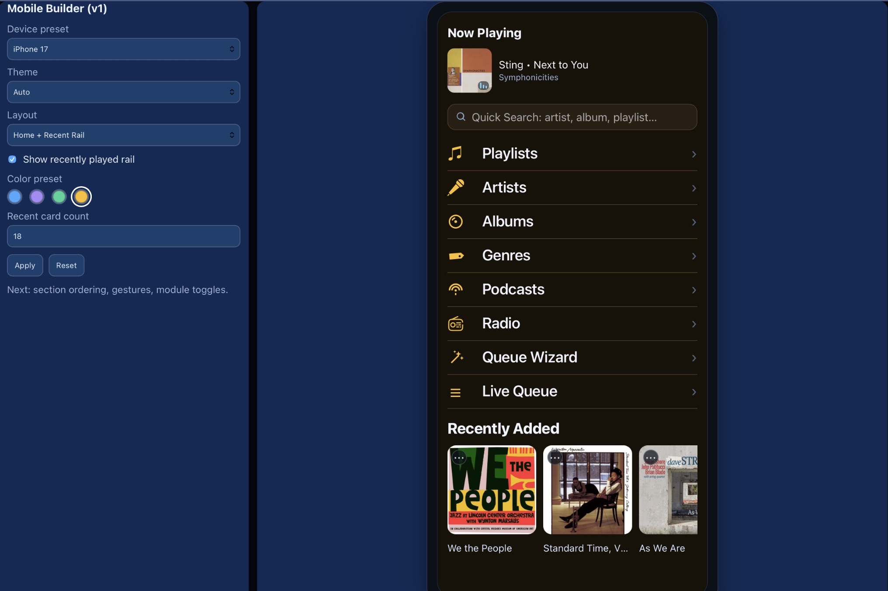
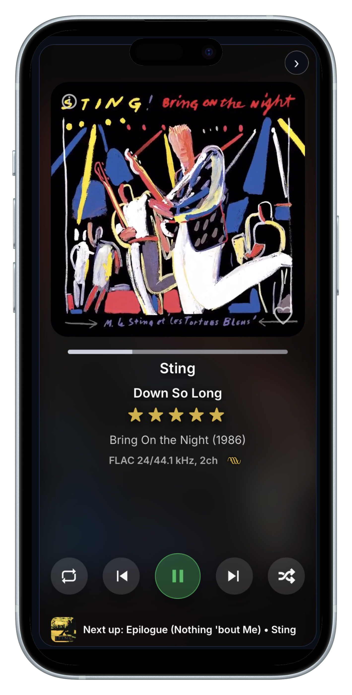

# Mobile Builder + Controller Pages

This chapter documents the mobile-first controller stack and the visual builder workflow.

## What this covers

- `mobile.html` — builder UI used to configure preview profile options.
- `controller.html` — mobile home surface.
- Controller-native pages:
  - `controller-now-playing.html`
  - `controller-queue.html`
  - `controller-albums.html`
  - `controller-artists.html`
  - `controller-genres.html`
  - `controller-playlists.html`
  - `controller-radio.html`
  - `controller-podcasts.html`
  - `controller-queue-wizard.html`

## Builder profile model

`mobile.html` writes a profile payload to localStorage and persists the same profile to the server controller-profile endpoint.

For preview, it passes the profile via the `profile` query parameter to the target controller page.
For copied or pushed device URLs, it should also include the encoded `profile` payload, not only `devicePreset`.
That matters because real phone devices may prefer local profile mode and otherwise fall back to the default Ocean palette even when the shared server profile was already saved.

Current profile controls include:

- Device preset
- Theme mode
- Layout mode
- Show/hide recent rail
- Recent card count
- Color preset (dot palette)

## Color presets

Color dots in `mobile.html` now drive controller visual tokens (icon accent and core backgrounds/lines) via `profile.colorPreset`.

## Screenshots

### Mobile Builder

### Controller Now Playing / Mobile Surface

## Notes

- Quick Search interactions in `controller.html` include instant actions (play/add) for artist/album/playlist.
- Recently Added rail is sourced from album inventory and sorted newest → oldest.
- `controller-now-playing.html` is currently based on portrait `index.html` behavior with controller-specific navigation transitions.
- 2026-04-06 mobile-builder fix: copied/pushed phone URLs must carry the full encoded profile payload. A URL that only includes `devicePreset=mobile` can open with the default Ocean palette on a clean phone even when the builder already saved a black/red or other custom profile to the server.

## See also

- [Controller Recents + Last.fm (Tablet)](./20-controller-recents-lastfm.md) for row-source customization, Last.fm modes, URL one-time seeding, and recents stability guardrails.
