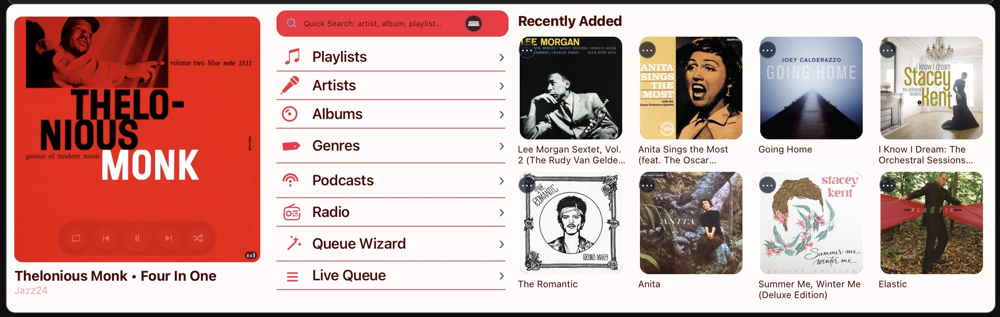

# 18) Kiosk Mode

Kiosk mode is the 1280×400 control surface optimized for always-on display use.

---

## Switching moOde to Kiosk

To run kiosk on moOde local display, set moOde Web UI target URL to:

- `http://<WEB_HOST>:8101/kiosk.html`

Path in moOde:

- **Configure -> Peripherals -> Local display -> Web UI target URL**

> **Important (moOde blanking/wake compatibility):**
> For external kiosk targets, apply the watchdog remote-display patch in [Chapter 15](./15-moode-remote-display-blanking-fix.md) to avoid false wakes / blanking issues.

Verification on moOde host:

```bash
grep -E -- '--app=' /home/moode/.xinitrc
pgrep -af "chromium-browser.*--app="
```

## Pages and roles

- `kiosk-designer.html`
  - Design-time page with full kiosk theming controls + push flow
  - Used for iteration and applying changes to moOde browser display
- `kiosk.html`
  - Runtime entrypoint for display use
  - Redirects into controller kiosk runtime with persisted profile
- `controller.html?kiosk=1`
  - Core kiosk runtime layout and interactions

---

## Layout model (1280×400)

Kiosk runtime uses 3 columns:

1. **Now Playing** (art + text)
2. **Library nav list** (Playlists, Artists, Albums, etc.)
3. **Recents / Internal pane**

Column 3 behavior:

- Default: recents rail (albums/podcasts/playlists/radio)
- On list selection: recents are hidden and an embedded internal page is shown in-place
- Internal page back/title sends a message to parent to hide pane and restore recents

---

## Internal page naming convention

Kiosk routes follow `kiosk-*.html` naming for parity with controller pages:

- `kiosk-now-playing.html`
- `kiosk-playlists.html`
- `kiosk-artists.html`
- `kiosk-albums.html`
- `kiosk-genres.html`
- `kiosk-podcasts.html`
- `kiosk-radio.html`
- `kiosk-queue-wizard.html`
- `kiosk-queue.html`

Current implementation uses thin wrappers to corresponding `controller-*.html` pages.

---

## Transport interactions in kiosk

Now Playing art gestures:

- **Single tap** → Player display mode push flow
- **Double tap** → Peppy display mode push flow

In Peppy/Player, tapping art routes back to kiosk runtime.

---

## Theme/palette persistence

Kiosk profile keys:

- `nowplaying.kiosk.profile.v1`
- `nowplaying.mobile.profile.v1`

`kiosk.html` syncs/uses these so runtime returns with the same applied theme/color/recents context.

Designer behavior:

- Control changes update preview and persist profile state
- Push to moOde acts as apply/commit point for runtime display target

### Kiosk Designer theme controls (current)

`kiosk-designer.html` now provides direct UI control for kiosk color system, with no manual file edits required:

- **Primary Theme Color**
- **Secondary Theme Color**
- **Primary Text Color**
- **Secondary Text Color**

Additional designer capabilities:

- built-in **preset** selection
- **Save/Delete** custom presets
- **Import/Export** preset JSON
- **live preview** in embedded kiosk frame
- **Push to moOde** deployment action

This keeps kiosk theming fully builder-driven: tune visually, save, and push — no need to open/edit config files for normal customization.

### Example: red kiosk theme



---

## Embedded page theming

Embedded controller pages in kiosk pane resolve palette from:

1. URL params (`theme`, `colorPreset`)
2. Local persisted profile
3. Server profile fallback

This prevents color mismatch between kiosk surface and embedded internal pages.

---

## Kiosk-specific UI refinements

- Non-selectable runtime text (`user-select: none`)
- No extra wrapper chrome around runtime canvas
- Recents spacing tuned for 1280×400 readability
- Embedded albums/podcasts/radio support denser 4-across layout
- `kiosk-albums` excludes podcast entries
