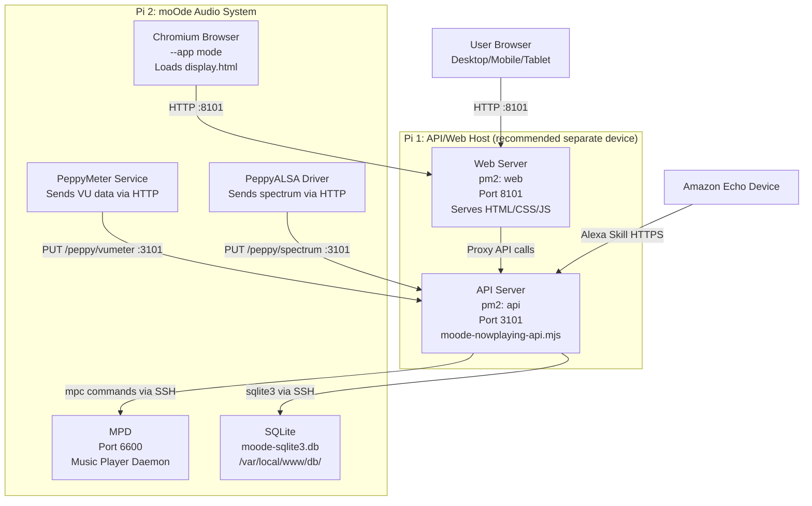
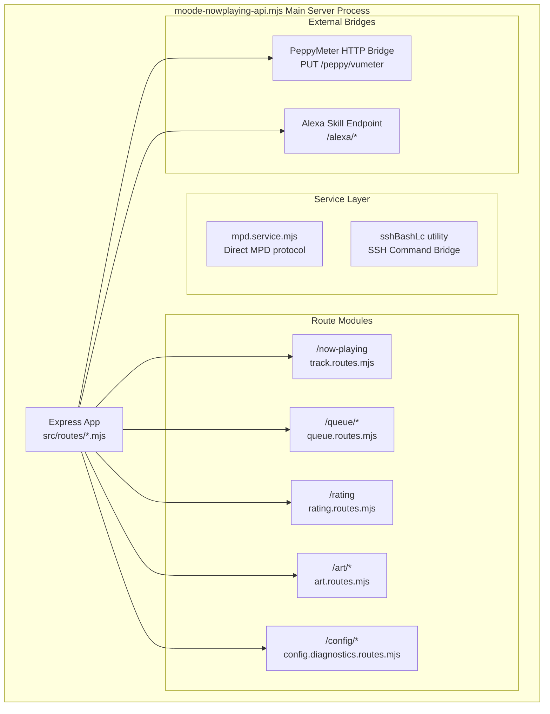

# Overview

Relevant source files

The following files were used as context for generating this wiki page:

- [ARCHITECTURE.md](ARCHITECTURE.md)
- [INSTALLER_PLAN.md](INSTALLER_PLAN.md)
- [README.md](README.md)
- [TESTING_CHECKLIST.md](TESTING_CHECKLIST.md)
- [URL_POLICY.md](URL_POLICY.md)
- [docs/14-display-enhancement.md](docs/14-display-enhancement.md)
- [docs/18-kiosk.md](docs/18-kiosk.md)
- [docs/images/kioskred.jpg](docs/images/kioskred.jpg)
- [docs/images/readme-spectrum.jpg](docs/images/readme-spectrum.jpg)
- [moode-nowplaying-api.mjs](moode-nowplaying-api.mjs)
- [scripts/index.js](scripts/index.js)
- [src/routes/config.moode-audio-info.routes.mjs](src/routes/config.moode-audio-info.routes.mjs)
- [src/routes/config.routes.index.mjs](src/routes/config.routes.index.mjs)
- [src/routes/track.routes.mjs](src/routes/track.routes.mjs)

## Purpose and Scope

This document provides a high-level introduction to the **now-playing** system, a moOde audio player enhancement suite that adds display customization, queue management, voice control, and library health tools without modifying the moOde installation itself.

**Scope of this page:**
- System purpose and deployment topology.
- Core architectural components and communication patterns.
- Key capabilities and integration points.
- Navigation to detailed subsystem documentation.

**For detailed coverage, see:**
- System architecture and communication protocols: [System Architecture](#1.1)
- Installation procedures and prerequisites: [Installation & Setup](#1.2)
- Core terminology and data models: [Key Concepts](#1.3)

---

## System Purpose

The now-playing system extends moOde audio player capabilities across eight distinct use cases:

| Use Case | Entry Point | Description |
|----------|-------------|-------------|
| Browser Toolkit | `app.html` | Desktop dashboard with embedded tools. |
| Display HTML | `index.html` | Standalone now-playing display. |
| Player Screen | `player-render.html` | Custom now-playing renderer for moOde display. |
| Peppy Meter Screen | `peppy.html` | VU meter + spectrum visualization. |
| Visualizer Screen | `visualizer.html` | Audio-reactive visual display. |
| Kiosk Mode | `kiosk.html` | Library navigation for moOde display (1280x400). |
| Mobile App | `controller.html` | Touch-optimized library browser. |
| Voice Control | Alexa Skill | Voice-driven queue management. |

**Sources:** [README.md:21-30]()

---

## Deployment Topology

### Recommended Configuration

**Key deployment characteristics:**
- **Separation of concerns:** API/web host runs independently of moOde [ARCHITECTURE.md:7-10]().
- **No moOde modification:** All interactions via SSH, `mpc`, and HTTP [README.md:7]().
- **Single target URL:** moOde's Chromium points to a stable router [ARCHITECTURE.md:38-39]().
- **Default Ports:** API on `3101`, Web UI on `8101` [ARCHITECTURE.md:14-15]().

**Sources:** [README.md:32](), [ARCHITECTURE.md:1-41]()

---

## Core Components

### Web UI Layer (Port 8101)

The web server delivers multiple specialized interfaces defined in [URL_POLICY.md]():

| File | Purpose | Target Audience |
|------|---------|-----------------|
| `app.html` | Application shell with iframe embedding and theme bridge. | Desktop users. |
| `index.html` | Full-featured now-playing display with motion art. | Desktop/browser displays. |
| `player.html` | Player composition builder. | Desktop users. |
| `player-render.html` | Minimal player renderer (pushed to moOde). | moOde local display. |
| `peppy.html` | VU meter/spectrum builder and renderer. | Desktop/moOde display. |
| `controller.html` | Mobile-optimized library browser. | Phone/tablet users. |
| `controller-now-playing.html` | Mobile now-playing view. | Phone/tablet users. |
| `config.html` | System configuration interface. | Administrators. |
| `diagnostics.html` | API testing and live preview tool. | Developers. |
| `display.html` | Router for moOde display (stable target). | moOde Chromium. |

**Sources:** [URL_POLICY.md:5-38](), [ARCHITECTURE.md:42-52]()

---

### API Server (Port 3101)

The API server implemented in `moode-nowplaying-api.mjs` manages the core business logic:

**Core route groups:**

| Route Pattern | Purpose | Protection |
|---------------|---------|------------|
| `/now-playing` | Current track metadata and state. | Public (Read) |
| `/queue/*` | Queue manipulation (add, remove, reorder). | Key-protected |
| `/rating` | MPD sticker-based track ratings. | Key-protected |
| `/art/*` | Album art, motion art, radio logos. | Public (Read) |
| `/config/*` | System configuration and diagnostics. | Key-protected |
| `/peppy/*` | VU meter and spectrum data bridge. | Public (Read/Write) |

**Sources:** [moode-nowplaying-api.mjs:5-15](), [ARCHITECTURE.md:54-65](), [src/routes/config.routes.index.mjs:21-116]()

---

### moOde Integration Layer

The API server communicates with moOde via two primary mechanisms:

1.  **SSH Command Bridge:** Uses the `sshBashLc` utility to execute `mpc` commands and query the `moode-sqlite3.db` database [src/routes/config.moode-audio-info.routes.mjs:39-40]().
2.  **MPD Protocol:** Communicates directly with MPD for status polling and sticker-based ratings [ARCHITECTURE.md:78]().

**Watchdog Fix:** When using a remote display host, a patch to moOde's `/var/www/daemon/watchdog.sh` is required to ensure proper screen blanking/wake behavior [README.md:67]().

**Sources:** [ARCHITECTURE.md:21-26](), [src/routes/config.moode-audio-info.routes.mjs:34-49]()

---

## Key Capabilities

### Display Enhancement System
A **builder-first** design allows users to design compositions (meters, typography, themes) in `peppy.html` or `player.html` and "push" them to moOde [docs/14-display-enhancement.md:49-70]().
- **Stable Router:** moOde is configured to point to `display.html?kiosk=1`, which routes to the active renderer based on the last pushed profile [docs/14-display-enhancement.md:84-113]().
- **Audio Bridge:** Real-time VU and spectrum data is bridged from moOde to the UI via HTTP `PUT` requests to `/peppy/vumeter` and `/peppy/spectrum` [docs/14-display-enhancement.md:15-28]().

### Queue & Library Management
- **Queue Wizard:** Multi-source queue builder with filters, playlists, and Last.fm vibe discovery [README.md:107]().
- **Library Health:** Tools for identifying missing metadata, unrated tracks, and missing album art [README.md:106]().
- **Radio & Podcasts:** Integrated browser for radio stations and podcast subscriptions [README.md:108-109]().

---

## Related Documentation

**Architecture and setup:**
- [System Architecture](#1.1) — Three-tier design, communication protocols.
- [Installation & Setup](#1.2) — Prerequisites, PM2 management, configuration.
- [Key Concepts](#1.3) — Track keys, album keys, display modes.

**User interfaces:**
- [User Interfaces](#2) — Overview of UI entry points.
- [Application Shell (app.html)](#2.1) — Theme bridging, iframe embedding.
- [Now Playing Displays](#2.2) — Desktop and mobile interfaces.

**Core features:**
- [Display Enhancement System](#3) — Peppy/Player push model.
- [Queue Management](#4) — Multi-source queue building.
- [Media Library](#5) — Health dashboard, metadata tools.

**Sources:** [README.md:99-115](), [ARCHITECTURE.md:1-86](), [docs/14-display-enhancement.md:1-182]()
