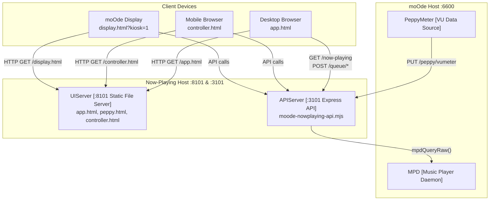
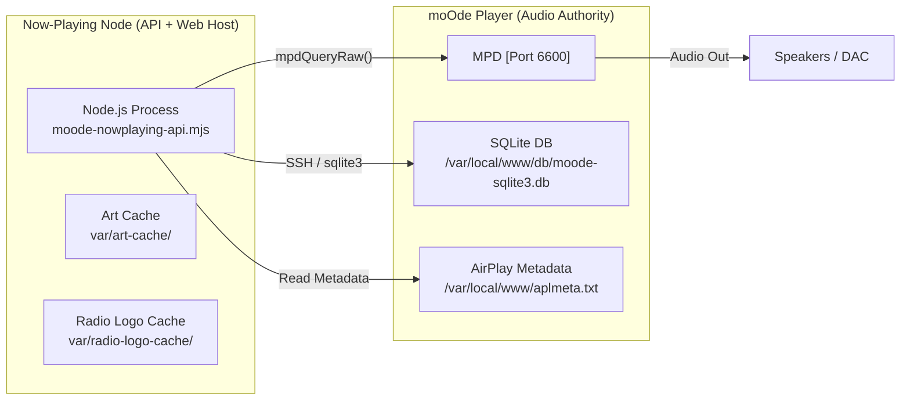
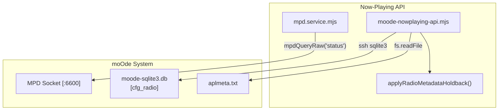
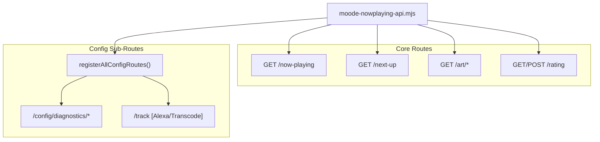
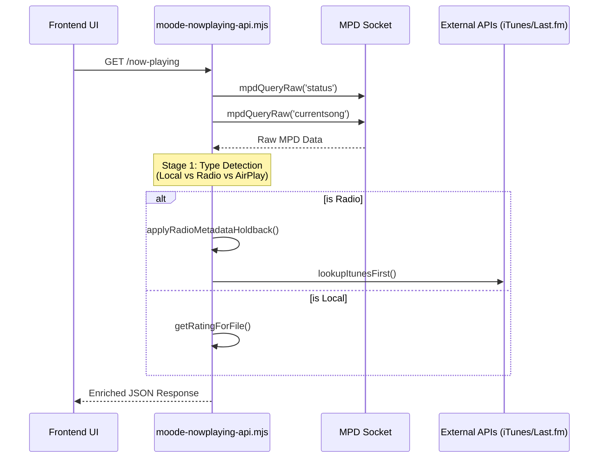

# System Architecture

Relevant source files

The following files were used as context for generating this wiki page:

- [ARCHITECTURE.md](ARCHITECTURE.md)
- [INSTALLER_PLAN.md](INSTALLER_PLAN.md)
- [README.md](README.md)
- [TESTING_CHECKLIST.md](TESTING_CHECKLIST.md)
- [URL_POLICY.md](URL_POLICY.md)
- [docs/14-display-enhancement.md](docs/14-display-enhancement.md)
- [docs/18-kiosk.md](docs/18-kiosk.md)
- [docs/images/kioskred.jpg](docs/images/kioskred.jpg)
- [docs/images/readme-spectrum.jpg](docs/images/readme-spectrum.jpg)
- [moode-nowplaying-api.mjs](moode-nowplaying-api.mjs)
- [scripts/index.js](scripts/index.js)
- [src/routes/config.moode-audio-info.routes.mjs](src/routes/config.moode-audio-info.routes.mjs)
- [src/routes/config.routes.index.mjs](src/routes/config.routes.index.mjs)
- [src/routes/track.routes.mjs](src/routes/track.routes.mjs)

## Purpose and Scope

This document describes the high-level architecture of the **now-playing** system, a distributed three-tier solution for enhancing the moOde audio player. It details the client-server design, the dual-port structure (8101/3101), physical deployment topology, and the strict separation of concerns between the data/control API and the pixel-rendering UI.

The system is designed with a **builder-first** philosophy, where display configurations are designed in a web UI and pushed to the playback hardware [docs/14-display-enhancement.md:53-60]().

---

## Dual-Port Architecture

The now-playing system operates on **two independent ports** on the same host machine to separate the concerns of data delivery and static asset serving [ARCHITECTURE.md:12-15]().

| Port | Server Type | Purpose | Primary Files |
|------|-------------|---------|---------------|
| **3101** | Express API Server | RESTful backend, MPD integration, external service proxies, metadata enrichment | `moode-nowplaying-api.mjs` [moode-nowplaying-api.mjs:1-19]() |
| **8101** | Static File Server | Serves HTML/CSS/JS for all UI variants (Desktop, Mobile, Kiosk) | `app.html`, `index.html`, `peppy.html`, `controller.html` [URL_POLICY.md:5-38]() |

This separation allows:
- **Independent scaling**: The API and UI can be restarted or updated independently.
- **Security isolation**: API key (`trackKey`) enforcement occurs at the API layer only [moode-nowplaying-api.mjs:199]().
- **Multi-client support**: Multiple UIs (desktop, mobile, kiosk) share the same stateful backend.
- **Default Port Configuration**: These are configurable via runtime config `ports.api` and `ports.ui` [ARCHITECTURE.md:14-17]().

**Architecture Diagram: Dual-Port Topology**

**Sources**: [ARCHITECTURE.md:12-18](), [moode-nowplaying-api.mjs:1-19](), [URL_POLICY.md:55-59]()

---

## Physical Deployment Topology

The now-playing system typically runs on a **separate host** from the moOde audio player, though they can coexist on one machine. This "API node vs Web node" model separates data/control from pixels [ARCHITECTURE.md:5-10]().

**Deployment Diagram**

**Network Assumptions**:
- moOde host is identified by `MOODE_SSH_HOST` and `MPD_HOST` [src/routes/config.moode-audio-info.routes.mjs:3]().
- SSH key-based authentication is used for remote commands like `sqlite3` queries on the moOde database [src/routes/config.moode-audio-info.routes.mjs:39-40]().

**Sources**: [ARCHITECTURE.md:19-34](), [src/routes/config.moode-audio-info.routes.mjs:34-49]()

---

## Separation from moOde

The system follows a "read-only/remote-control" philosophy where it **does not modify moOde's core codebase**. Instead, it interacts through stable interfaces:

1. **MPD Authority**: Communicates via `mpdQueryRaw` to the MPD socket on port 6600 [src/routes/config.routes.index.mjs:86]().
2. **Database Access**: Queries the moOde SQLite database (`moode-sqlite3.db`) via SSH to retrieve device metadata and configuration [src/routes/config.moode-audio-info.routes.mjs:39-41]().
3. **Metadata Enrichment**: Enhances raw moOde data using external services (iTunes, Last.fm) and local caches [moode-nowplaying-api.mjs:196-204]().
4. **Radio Stabilization**: Implements `applyRadioMetadataHoldback` to prevent UI flickering during rapid stream metadata updates [moode-nowplaying-api.mjs:71-158]().

**Integration Points**

**Sources**: [ARCHITECTURE.md:21-25](), [moode-nowplaying-api.mjs:71-158](), [src/routes/config.moode-audio-info.routes.mjs:34-49]()

---

## Backend API Architecture

The backend is an Express-based API server that uses a registration pattern to load domain-specific routes [src/routes/config.routes.index.mjs:21-116]().

**Core API Structure**

**Key Backend Contracts**:
- **Public Read**: `GET /now-playing`, `GET /next-up`, `GET /art/current.jpg` [ARCHITECTURE.md:56-60]().
- **Key-Protected Control**: Endpoints under `/config/` and `/queue/` require `x-track-key` validation via `requireTrackKey` middleware [src/routes/config.routes.index.mjs:23-109]().
- **Audio Data Pipeline**: The API acts as a bridge for VU and spectrum data via `PUT /peppy/vumeter` and `PUT /peppy/spectrum` [docs/14-display-enhancement.md:21-28]().

**Sources**: [ARCHITECTURE.md:54-65](), [moode-nowplaying-api.mjs:1-19](), [src/routes/config.routes.index.mjs:21-116]()

---

## Frontend Architecture & Display Routing

The UI layer is "pixels-only," meaning no metadata or control logic resides on the display device [ARCHITECTURE.md:40]().

**Display Router (`display.html`)**:
This serves as the stable target for moOde kiosk displays. It reads the `last-profile` state and routes to the specific renderer (Peppy, Player, or Visualizer) without requiring a Chromium restart [docs/14-display-enhancement.md:107-113]().

| Mode | Target Page | Use Case |
|------|-------------|----------|
| `peppy` | `peppy.html` | VU meters and spectrum visualizers [docs/14-display-enhancement.md:9]() |
| `player` | `player-render.html` | Hardware-optimized now-playing displays [docs/14-display-enhancement.md:11]() |
| `visualizer` | `visualizer.html` | Audio-reactive visual display [docs/14-display-enhancement.md:12]() |
| `moode` | `index.php` | Fallback to native moOde UI [docs/14-display-enhancement.md:113]() |

**Sources**: [ARCHITECTURE.md:36-41](), [docs/14-display-enhancement.md:107-113](), [URL_POLICY.md:5-15]()

---

## Data Flow: Polling & Enrichment

The system uses a **poll-and-diff** model. Clients poll `/now-playing` every 2 seconds, and the API performs a multi-stage enrichment.

**Sequence Diagram: /now-playing Enrichment Pipeline**

**Sources**: [moode-nowplaying-api.mjs:71-158](), [TESTING_CHECKLIST.md:12-20]()
