# Installation & Setup

<details>
<summary>Relevant source files</summary>

The following files were used as context for generating this wiki page:

- [CONFIG.md](CONFIG.md)
- [build_moode_index.py](build_moode_index.py)
- [config/now-playing.config.example.json](config/now-playing.config.example.json)
- [docs/INSTALL_VALIDATION.md](docs/INSTALL_VALIDATION.md)
- [ecosystem.config.cjs](ecosystem.config.cjs)
- [lastfm_vibe_radio.py](lastfm_vibe_radio.py)
- [notes/refactor-endpoint-inventory.md](notes/refactor-endpoint-inventory.md)
- [now-playing.config.example.json](now-playing.config.example.json)
- [scripts/deploy-pi4-safe.sh](scripts/deploy-pi4-safe.sh)
- [scripts/install.sh](scripts/install.sh)
- [scripts/uninstall.sh](scripts/uninstall.sh)
- [src/config/load-config.mjs](src/config/load-config.mjs)
- [src/routes/config.alexa-alias.routes.mjs](src/routes/config.alexa-alias.routes.mjs)
- [src/routes/config.queue-wizard-vibe.routes.mjs](src/routes/config.queue-wizard-vibe.routes.mjs)

</details>


This document covers the installation process, prerequisite verification, initial configuration, and service management for the `now-playing` system. The system is designed to run on a host machine (typically a Raspberry Pi or Linux VM) and communicate with a moOde audio player via MPD and SSH.

---

## Prerequisites

The system requires the following components on the host machine. The installer targets `systemd` based Linux distributions [scripts/install.sh:107-110]().

| Component | Purpose | Minimum Version |
|-----------|---------|-----------------|
| **Node.js** | API runtime | `>=18` [package.json:6-8]() |
| **npm** | Dependency management | Included with Node |
| **Python 3** | Static web server & Vibe scripts | `3.x` [scripts/install.sh:238-238]() |
| **rsync** | File synchronization | Standard |
| **git** | Source control | Standard |

### System Privileges
The installation requires `sudo` access to write to `/opt/now-playing` and to create `systemd` unit files [scripts/install.sh:112-115]().

---

## Installation Methods

### Automated Installation (Recommended)
The primary installation method uses `scripts/install.sh`. This script handles directory creation, repository cloning, dependency installation, and service registration.

**Standard Command:**
```bash
curl -fsSL https://raw.githubusercontent.com/teacherguy2020/now-playing/main/scripts/install.sh | bash -s -- --ref main
```

### Installation Flags
The `install.sh` script supports several flags for customization [scripts/install.sh:24-34]():

| Flag | Description | Default |
|------|-------------|---------|
| `--mode <split\|single-box>` | Deployment topology | `split` |
| `--install-dir <path>` | Target directory | `/opt/now-playing` |
| `--port <number>` | API port | `3101` |
| `--ref <branch\|tag\|sha>` | Git ref to deploy | `main` |
| `--fresh` | Destructive refresh (wipes state) | `false` |
| `--allow-root` | Permit running as root user | `false` |

**Sources:** [scripts/install.sh:4-35](), [docs/INSTALL_VALIDATION.md:14-35]()

---

## Installation & Service Flow

The following diagram illustrates the logic within `install.sh` and how it transitions from Natural Language requirements to Code Entities.

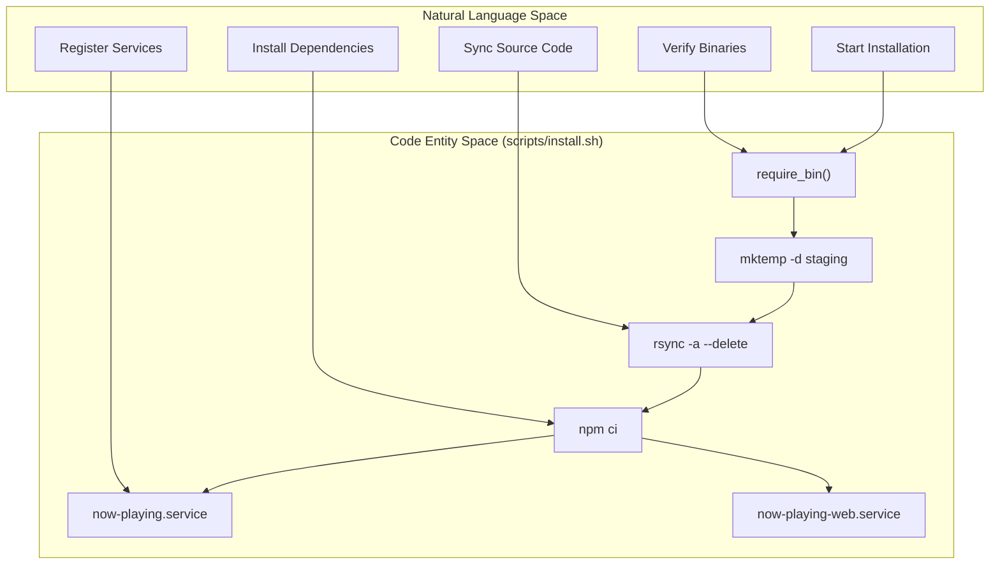

**Sources:** [scripts/install.sh:40-42](), [scripts/install.sh:123-124](), [scripts/install.sh:153-172](), [scripts/install.sh:211-245]()

---

## Initial Configuration

Configuration is managed via a JSON file and environment variables. The system uses a template-based approach for initial setup.

### 1. Configuration Files
- **Template**: `config/now-playing.config.example.json` [config/now-playing.config.example.json:1-52]()
- **Active**: `config/now-playing.config.json` [CONFIG.md:8-8]()

### 2. Environment Variables (.env)
The installer generates a `.env` file in the installation directory to hold runtime overrides [scripts/install.sh:183-199]():
- `PORT`: API server port (Default: 3101) [scripts/install.sh:189-189]()
- `WEB_PORT`: UI server port (Default: 8101) [scripts/install.sh:190-190]()
- `TRACK_KEY`: Security token for sensitive routes [scripts/install.sh:191-191]()
- `MOODE_BASE_URL`: HTTP address of the moOde player [scripts/install.sh:192-192]()

### 3. Config Logic Entity Mapping
The following diagram maps configuration concepts to the specific code entities that handle them.

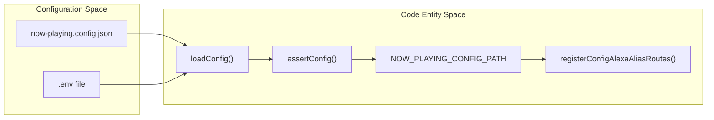

**Sources:** [src/config/load-config.mjs:12-32](), [src/config/load-config.mjs:34-43](), [src/routes/config.alexa-alias.routes.mjs:6-6]()

---

## Service Management

The system utilizes `systemd` for process management. Two distinct services are created during installation. For development environments, PM2 management is supported via `ecosystem.config.cjs`.

### Service Definitions

| Service Name | Executable | Port | Role |
|--------------|------------|------|------|
| `now-playing.service` | `node moode-nowplaying-api.mjs` | 3101 | Backend API, MPD bridge, SSH execution [scripts/install.sh:220-220]() |
| `now-playing-web.service` | `python3 -m http.server` | 8101 | Serves HTML/JS frontend assets [scripts/install.sh:238-238]() |

### Management Commands
A sudoers rule is automatically added to `/etc/sudoers.d/now-playing-restart` to allow the install user to restart these services without a password [scripts/install.sh:248-251]().

- **Restart API**: `sudo systemctl restart now-playing.service`
- **Restart Web**: `sudo systemctl restart now-playing-web.service`
- **Check Logs**: `journalctl -u now-playing.service -f`

### Development Deployment
For active development, `scripts/deploy-pi4-safe.sh` provides an `rsync`-based sync that preserves runtime state (`data/`, `var/`, `.env`) on the target machine while updating source code [scripts/deploy-pi4-safe.sh:16-24]().

---

## Runtime Verification Checklist

After installation, verify the setup using the following checks:

1. **Endpoint Health**: `curl -i http://localhost:3101/healthz` should return 200 [docs/INSTALL_VALIDATION.md:60-60]().
2. **Environment**: Ensure `.env` exists at `/opt/now-playing/.env` [docs/INSTALL_VALIDATION.md:77-77]().
3. **Ownership**: Verify `/opt/now-playing` is owned by the installation user [scripts/install.sh:174-174]().
4. **Connectivity**: If `MPD` is configured, `curl http://localhost:3101/now-playing` should return valid JSON [docs/INSTALL_VALIDATION.md:61-61]().

**Sources:** [docs/INSTALL_VALIDATION.md:42-70]()

---

## Uninstallation

To remove the system and its associated services, use the `scripts/uninstall.sh` script.

**Options:**
- `--purge`: Removes the installation directory and all local data/configs [scripts/uninstall.sh:107-111]().
- `-y`: Skips the confirmation prompt [scripts/uninstall.sh:61-79]().

**Command:**
```bash
bash scripts/uninstall.sh --purge -y
```

**Sources:** [scripts/uninstall.sh:16-26](), [scripts/uninstall.sh:81-105]()
1a:T22da,
# Key Concepts

<details>
<summary>Relevant source files</summary>

The following files were used as context for generating this wiki page:

- [ARCHITECTURE.md](ARCHITECTURE.md)
- [INSTALLER_PLAN.md](INSTALLER_PLAN.md)
- [README.md](README.md)
- [TESTING_CHECKLIST.md](TESTING_CHECKLIST.md)
- [URL_POLICY.md](URL_POLICY.md)
- [docs/08-hero-shell.md](docs/08-hero-shell.md)
- [docs/09-index-vs-app.md](docs/09-index-vs-app.md)
- [docs/10-random-vs-shuffle.md](docs/10-random-vs-shuffle.md)
- [docs/14-display-enhancement.md](docs/14-display-enhancement.md)
- [docs/18-kiosk.md](docs/18-kiosk.md)
- [docs/images/kioskred.jpg](docs/images/kioskred.jpg)
- [docs/images/readme-spectrum.jpg](docs/images/readme-spectrum.jpg)
- [scripts/index.js](scripts/index.js)
- [src/routes/track.routes.mjs](src/routes/track.routes.mjs)

</details>


This page defines core terminology and architectural patterns used throughout the now-playing system. Understanding these concepts is essential for configuration, customization, and troubleshooting.

---

## Track and Album Identification

The system uses deterministic keys to identify tracks and albums across API calls, queue operations, and caching.

### Track Key

The **track key** is a secret string used to authenticate API requests that modify state (queue operations, ratings, configuration changes). It acts as a simple bearer token.

**Configuration:**
- Set via environment variable `TRACK_KEY` or in `config/now-playing.config.json` as `trackKey` [README.md:41]().
- Required for all protected API operations, including configuration and maintenance endpoints [ARCHITECTURE.md:62-65]().

**Code locations:**
- Authentication middleware: `requireTrackKey` in [src/routes/track.routes.mjs:111]().
- Used as a dependency in route registration: [src/routes/track.routes.mjs:123]().

### Album Key

An **album key** is a stable identifier for an album, typically derived from the album name and artist. Used for:
- Album art caching and resolution [ARCHITECTURE.md:31]().
- Library health scans and inventory management [README.md:104]().
- Queue wizard grouping and filtering [README.md:105]().

**Format:** Usually `"Artist - Album"` with whitespace normalized.

---

## moOde Integration Layer

The system integrates with moOde audio players through three primary channels:

Title: moOde Integration Topology
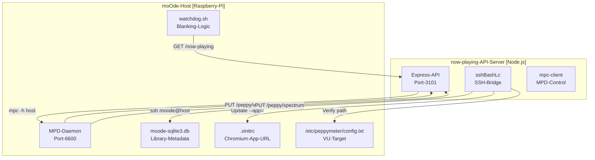
Sources: [ARCHITECTURE.md:21-34](), [README.md:78-84](), [docs/14-display-enhancement.md:15-28]()

### SSH Bridge Pattern

The `sshBashLc` utility executes shell commands on the moOde host with proper environment setup. It is critical for managing the moOde display state and system services.

**Common use cases:**
- **Path verification:** Checking for music library or mount points [README.md:42]().
- **Service control:** Restarting moOde services like `mpdscribble` [README.md:103]().
- **Display URL updates:** Modifying the Chromium `--app=` target in `.xinitrc` [README.md:69-74]().
- **Watchdog Patches:** Applying remote-display wake-on-play fixes [README.md:67]().

### MPD Client (`mpc`)

All playback control and queue operations execute via the `mpc` command-line client on the API host.

**Common operations:**
- `mpc status` — Get playback state [ARCHITECTURE.md:24]().
- `mpc current` — Get metadata for current song [ARCHITECTURE.md:23]().
- `mpc add` — Add tracks to the queue [README.md:107]().

---

## Display Modes and Routing

The system provides multiple display renderers that can be switched dynamically without changing moOde's configured URL.

Title: Display Routing Logic
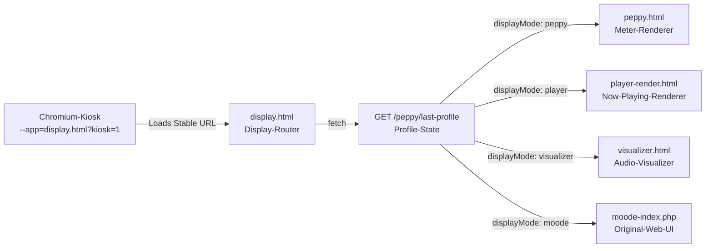
Sources: [docs/14-display-enhancement.md:107-113](), [ARCHITECTURE.md:36-40](), [URL_POLICY.md:9-14]()

### Display Mode Values

| Mode | Renders | Configuration Source |
|------|---------|---------------------|
| `peppy` | `peppy.html` with active skin/theme/meter settings | Peppy builder push action [docs/14-display-enhancement.md:101]() |
| `player` | `player-render.html` with layout profile | Player builder push action [docs/14-display-enhancement.md:101]() |
| `visualizer` | `visualizer.html` | Visualizer push action [docs/14-display-enhancement.md:103]() |
| `moode` | Original moOde web UI (`index.php`) | Config restore action [docs/14-display-enhancement.md:112]() |

### Builder-First Design

Display compositions are designed in builder UIs (`peppy.html`, `player.html`), then **pushed** to moOde as a complete profile.

**Workflow:**
1. Open builder in app shell (e.g., `peppy.html` for meters or `player.html` for layout) [docs/14-display-enhancement.md:9-10]().
2. Configure skin, typography, sensitivity, and smoothing [docs/14-display-enhancement.md:141-182]().
3. Click **Push to moOde** — saves profile and updates the moOde display target [docs/14-display-enhancement.md:101-105]().
4. Router (`display.html`) reads saved profile and renders the specified mode [docs/14-display-enhancement.md:107-113]().

**Key insight:** Users never manually edit moOde config files for display tuning.

---

## Audio Data Pipeline

Peppy meter and spectrum visualization require real-time audio level data from moOde via an HTTP bridge.

### VU Meter and Spectrum Data Flow

Title: Audio Data HTTP Bridge
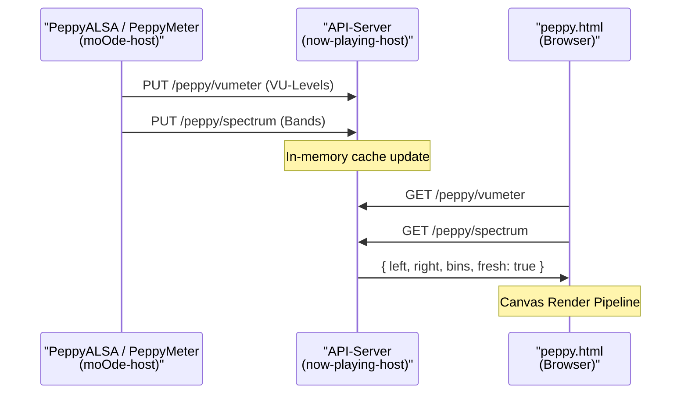
Sources: [docs/14-display-enhancement.md:15-35](), [README.md:78-95]()

**Configuration requirement:**
- `/etc/peppymeter/config.txt` on moOde must point to `http://<api-host>:3101/peppy/vumeter` [README.md:81]().
- `/etc/peppyspectrum/config.txt` on moOde must point to `http://<api-host>:3101/peppy/spectrum` [README.md:83]().

---

## Poll-and-Diff Model

The UI does not use WebSockets for now-playing updates. Instead, it employs a **poll-and-diff** strategy:

1. **Poll:** UI requests `GET /now-playing` at a regular interval.
2. **Signature:** The API generates a unique signature based on track metadata and playback state.
3. **Diff:** The UI compares the new signature with the previous one.
4. **Update:** If signatures differ, the UI triggers a re-render (e.g., crossfading album art, updating titles).

Sources: [ARCHITECTURE.md:30-32](), [README.md:113]()

---

## Key Takeaways

| Concept | Code Symbol | Purpose |
|---------|-------------|---------|
| **Track Key** | `trackKey` | Authenticates state-changing API requests [src/routes/track.routes.mjs:111](). |
| **Display Router** | `display.html` | Stable URL that routes to Peppy, Player, or Visualizer [docs/14-display-enhancement.md:13](). |
| **Push Model** | `Push Peppy to moOde` | Sends UI-configured profiles to the API and refreshes moOde [docs/14-display-enhancement.md:101](). |
| **HTTP Bridge** | `/peppy/vumeter` | Ingests real-time audio data from moOde for UI rendering [docs/14-display-enhancement.md:23](). |
| **Kiosk Mode** | `kiosk.html` | 1280x400 control surface optimized for always-on display [docs/18-kiosk.md:3](). |

Sources: [docs/14-display-enhancement.md:1-180](), [docs/18-kiosk.md:1-40](), [ARCHITECTURE.md:1-86]()
1b:T2442,
# User Interfaces

<details>
<summary>Relevant source files</summary>

The following files were used as context for generating this wiki page:

- [app.html](app.html)
- [controller-now-playing.html](controller-now-playing.html)
- [controller.html](controller.html)
- [index.html](index.html)
- [peppy.html](peppy.html)
- [player-render.html](player-render.html)
- [player.html](player.html)
- [scripts/index-ui.js](scripts/index-ui.js)
- [src/routes/config.runtime-admin.routes.mjs](src/routes/config.runtime-admin.routes.mjs)
- [styles/hero.css](styles/hero.css)
- [styles/index1080.css](styles/index1080.css)
- [theme.html](theme.html)

</details>


## Purpose and Scope

This page provides an overview of the different user interface entry points in the now-playing system, their purposes, and when to use each one. The system offers multiple specialized UIs optimized for different devices, screen sizes, and use cases—all communicating with the same backend API on port 3101. [src/routes/config.runtime-admin.routes.mjs:25]()

The architecture follows a **shell-and-frame** model where a high-level container (the App Shell) embeds functional modules via iframes, or dedicated full-screen renderers (Now Playing Displays) provide immersive visualizations. [app.html:52-54]()

For detailed information about specific interfaces, see:
- [Application Shell (app.html)](#2.1) — The main administrative and control dashboard.
- [Now Playing Displays](#2.2) — Immersive desktop and hardware-optimized playback screens.
- [Mobile Controller Dashboard](#2.3) — Touch-optimized library browsing and remote control.
- [Kiosk Mode](#2.4) — 1280x400 grid-based hardware interfaces.
- [Diagnostics Interface](#2.5) — API testing and system inspection tools.

## Architecture Overview

The now-playing system implements a dual-port architecture with clear separation between static UI delivery and dynamic API operations:

- **UI Server (port 8101):** Static file server for HTML, CSS, JavaScript, and assets. [app.html:183]()
- **API Server (port 3101):** RESTful API handles all business logic and moOde/MPD communication. [scripts/index-ui.js:187]()
- **Unified Backend:** All UI variants communicate with the same API endpoints, ensuring consistent data across desktop, mobile, and kiosk contexts. [scripts/index-ui.js:195-201]()

### Diagram: UI Architecture and API Communication

```mermaid
graph TB
    subgraph "UserAccess[User Access Patterns]"
        "Desktop[Desktop Browser]"
        "Mobile[Mobile Browser]"
        "Chromium[moOde Chromium Kiosk]"
    end
    
    subgraph "UIServer[UI Server :8101 Static Files]"
        "appHTML[app.html Shell]"
        "indexHTML[index.html Display]"
        "playerRenderHTML[player-render.html]"
        "peppyHTML[peppy.html Bridge]"
        "controllerHTML[controller.html Hub]"
        "controllerNPHTML[controller-now-playing.html]"
    end
    
    subgraph "APIServer[API Server :3101 Express]"
        "nowPlayingRoute[/now-playing]"
        "nextUpRoute[/next-up]"
        "peppyVURoute[/peppy/vumeter]"
        "configRuntimeRoute[/config/runtime]"
        "artCurrentRoute[/art/current.jpg]"
    end
    
    "Desktop" --> "appHTML"
    "Mobile" --> "controllerHTML"
    "Chromium" --> "indexHTML"
    
    "appHTML" -->|"embeds iframe"| "peppyHTML"
    "appHTML" -->|"fetch()"| "nowPlayingRoute"
    "indexHTML" -->|"poll 2s"| "nowPlayingRoute"
    "peppyHTML" -->|"poll 60fps"| "peppyVURoute"
    "controllerNPHTML" -->|"fetch()"| "nowPlayingRoute"
```

**Sources:** [app.html:52-54](), [peppy.html:404-473](), [controller.html:18-20](), [index.html:1-50](), [scripts/index-ui.js:194-200](), [src/routes/config.runtime-admin.routes.mjs:25]()

## 2.1 Application Shell (app.html)

The **Application Shell** is the primary entry point for desktop users. It provides a unified header with playback controls (Hero Transport), system status indicators, and a navigation rail to switch between sub-modules. [app.html:57-84]()

- **Iframe Embedding:** Modules like the Queue Wizard or Library Health are loaded into the `#appFrame` iframe. [app.html:54]()
- **Theme Bridging:** The shell manages CSS custom properties (tokens) and synchronizes them with embedded frames via `postMessage` using the `np-theme-sync` protocol. [app.html:24-49](), [theme.html:57-70]()
- **Status Pills:** Real-time connectivity status for API, Alexa, and Peppy services. [app.html:64-71]()

For details, see [Application Shell (app.html)](#2.1).

**Sources:** [app.html:1-100](), [app.html:385-400](), [theme.html:57-70]()

## 2.2 Now Playing Displays

The system provides multiple "Now Playing" renderers optimized for different viewing distances and hardware.

- **Desktop Display (index.html):** Features high-resolution motion art, double-buffer background crossfades (`#background-a` and `#background-b`), and rich metadata. [index.html:54-142](), [scripts/index-ui.js:4-5]()
- **Hardware Renderers (player-render.html):** Optimized for specific small-screen resolutions (e.g., 800x480, 480x320) with high-legibility typography using `player-size-*` classes. [player-render.html:51-100]()
- **Mobile Now Playing (controller-now-playing.html):** A vertical, touch-first layout with "brass-ring" transport controls and grid-area positioning. [controller-now-playing.html:104-127]()

For details, see [Now Playing Displays](#2.2).

**Sources:** [index.html:1-50](), [player-render.html:1-50](), [controller-now-playing.html:1-50](), [scripts/index-ui.js:1-15]()

## 2.3 Mobile Controller Dashboard (controller.html)

The **Mobile Hub** is designed as a Progressive Web App (PWA) for iPhone/iPad. It uses a "hub-and-spoke" navigation model where the main dashboard provides quick access to search, recent albums, and system-wide navigation. [controller.html:5-15]()

- **Quick Search:** Instant library search with play/append actions via `.quickWrap`. [controller.html:64-73]()
- **Device Profiles:** Adaptive layouts for iPhone portrait and iPad landscape using CSS media queries and the `.phone-ui` class. [controller.html:133-165](), [controller-now-playing.html:93-127]()
- **Now Playing Card:** A mini-player card (`.npTap`) that provides status and transitions to the full-screen controller. [controller.html:24-40]()

For details, see [Mobile Controller Dashboard](#2.3).

**Sources:** [controller.html:1-100](), [controller-now-playing.html:93-127]()

## 2.4 Kiosk Mode (peppy.html / player.html)

**Kiosk Mode** is specialized for wide-aspect hardware displays (like 1280x400) or standard small TFTs. [peppy.html:26-27](), [player.html:24]()

- **Three-Column Grid:** In `peppy.html`, the layout uses a grid template with a dedicated column for album art and metadata. [peppy.html:33]()
- **Peppy Bridge:** Integrates real-time VU meters and spectrum analyzers via the PeppyMeter audio pipeline using a canvas-based renderer. [peppy.html:283-289]()
- **Builder Flow:** Users can configure display sizes and themes in `player.html` and "push" the configuration to the moOde hardware. [player.html:21-30](), [player.html:97]()

For details, see [Kiosk Mode](#2.4).

**Sources:** [peppy.html:1-50](), [player.html:1-45](), [player.html:97]()

## 2.5 Diagnostics Interface (diagnostics.html)

The **Diagnostics Interface** serves as a developer and power-user tool for inspecting the system state.

- **API Testing:** Manual request builder for all backend endpoints.
- **Live Previews:** Scaled iframe previews of all display modes (Kiosk, Mobile, Desktop) side-by-side using the `applyScaleOnly` logic. [player.html:46-51]()
- **Queue Inspection:** Detailed view of the current MPD queue with metadata enrichment status.

For details, see [Diagnostics Interface](#2.5).

**Sources:** [app.html:401](), [player.html:46-51]()

## UI Comparison Matrix

| Interface | File | Target Device | Primary Purpose |
| :--- | :--- | :--- | :--- |
| **App Shell** | `app.html` | Desktop Browser | System Admin & Dashboard |
| **Desktop Display** | `index.html` | Monitor / TV | Immersive Visualization |
| **Mobile Hub** | `controller.html` | iPhone / Android | Library Browsing |
| **VU Meter Bridge** | `peppy.html` | Kiosk Display | Real-time Audio Visuals |
| **Compact Player** | `player-render.html` | Small TFT Screens | Hardware-bound Display |

### Diagram: Display Routing and Configuration

This diagram maps the relationship between the configuration builders and the final hardware renderers.

```mermaid
graph TD
    subgraph "ConfigurationSpace[Configuration & Builders]"
        "PlayerBuilder[player.html Builder]"
        "PeppyBuilder[peppy.html UI Mode]"
        "ThemeEditor[theme.html Editor]"
    end
    
    subgraph "RendererSpace[Display Renderers]"
        "PlayerRender[player-render.html]"
        "IndexRender[index.html]"
        "PeppyRender[peppy.html Canvas]"
    end

    "PlayerBuilder" -->|"selects size/theme"| "PlayerRender"
    "PeppyBuilder" -->|"selects skin"| "PeppyRender"
    "ThemeEditor" -->|"postMessage np-theme-sync"| "RendererSpace"
    
    "PlayerBuilder" -.->|"Push Player to moOde"| "SSH[sshBashLc /config/moode/browser-url]"
```

**Sources:** [player.html:21-45](), [player.html:97](), [peppy.html:33-80](), [theme.html:57-70](), [src/routes/config.runtime-admin.routes.mjs:147-152]()
1c:T2a2b,
# Application Shell (app.html)

<details>
<summary>Relevant source files</summary>

The following files were used as context for generating this wiki page:

- [alexa.html](alexa.html)
- [app.html](app.html)
- [docs/08-hero-shell.md](docs/08-hero-shell.md)
- [docs/09-index-vs-app.md](docs/09-index-vs-app.md)
- [docs/10-random-vs-shuffle.md](docs/10-random-vs-shuffle.md)
- [peppy.html](peppy.html)
- [radio.html](radio.html)
- [scripts/hero-transport.js](scripts/hero-transport.js)
- [src/routes/config.runtime-admin.routes.mjs](src/routes/config.runtime-admin.routes.mjs)
- [styles/hero.css](styles/hero.css)
- [theme.html](theme.html)

</details>


The application shell (`app.html`) is the primary container interface that orchestrates the Now Playing system's multi-page UI architecture. It provides unified navigation, theme synchronization across embedded pages, integrated queue management, and system health monitoring. The shell embeds individual feature pages via an `iframe` while maintaining a persistent header with transport controls, queue display, and navigation tabs.

For information about the embedded now-playing displays, see [Now Playing Displays](#2.2). For theme customization, see [Theme Editor](#8.2).

---

## Architecture Overview

The shell implements a three-tier layout: a sticky hero rail containing transport controls and queue display, a tab navigation bar, and a main content iframe that loads feature pages. All components share a unified theme token system synchronized via `postMessage`.

### Component Topology

Title: Application Shell Component Map
```mermaid
graph TB
    subgraph "app.html Shell Container"
        HERO_RAIL[".heroRail<br/>Sticky header container"]
        HERO_WRAP[".heroWrap<br/>Transport + Queue wrapper"]
        HERO_TRANSPORT["#heroTransport<br/>Now playing transport<br/>from hero-transport.js"]
        HERO_QUEUE["#heroQueueCard<br/>Live queue display"]
        VIEW_WRAP[".viewWrap<br/>Frame container"]
        TAB_NAV["#appTabs<br/>Navigation tabs"]
        APP_FRAME["#appFrame<br/>Content iframe"]
        STATUS_PILLS["#statusInline<br/>Status pills"]
        QUICK_SEARCH["#heroQuickSearch<br/>Quick search input"]
        THEME_SELECT["#quickThemeSelect<br/>Theme preset dropdown"]
    end
    
    subgraph "Embedded Pages (via iframe)"
        CONFIG["config.html"]
        DIAG["diagnostics.html"]
        ALEXA["alexa.html"]
        LIBRARY["library-health.html"]
        QUEUE_WIZ["queue-wizard.html"]
        RADIO["radio.html"]
        PODCASTS["podcasts.html"]
        YOUTUBE["youtube.html"]
        DISPLAYS["displays.html"]
        THEME["theme.html"]
        PEPPY["peppy.html"]
        PLAYER["player.html"]
    end
    
    subgraph "External Scripts"
        HERO_JS["hero-transport.js<br/>Transport + Queue logic"]
    end
    
    HERO_RAIL --> HERO_WRAP
    HERO_WRAP --> HERO_TRANSPORT
    HERO_WRAP --> HERO_QUEUE
    HERO_RAIL --> VIEW_WRAP
    VIEW_WRAP --> TAB_NAV
    VIEW_WRAP --> APP_FRAME
    TAB_NAV --> STATUS_PILLS
    TAB_NAV --> QUICK_SEARCH
    TAB_NAV --> THEME_SELECT
    
    APP_FRAME -.->|"loads via src"| CONFIG
    APP_FRAME -.->|"loads via src"| DIAG
    APP_FRAME -.->|"loads via src"| LIBRARY
    APP_FRAME -.->|"loads via src"| THEME
    
    HERO_JS -->|"initializes"| HERO_TRANSPORT
    HERO_JS -->|"manages"| HERO_QUEUE
    
    style HERO_TRANSPORT fill:none
    style APP_FRAME fill:none
    style HERO_JS fill:none
```

**Sources:** [app.html:52-61](), [app.html:282-397](), [app.html:398]()

---

## Theme Token System

The shell defines CSS custom properties that control the visual appearance of all UI components. These tokens cascade to embedded iframes via `postMessage` synchronization, ensuring visual consistency.

### Token Definitions

| Token | Purpose | Default Value |
|-------|---------|---------------|
| `--theme-bg` | App background | `#0c1526` |
| `--theme-text` | Primary text | `#e7eefc` |
| `--theme-text-secondary` | Secondary text | `#9fb1d9` |
| `--theme-rail-bg` | Surface tint | `#0b1426` |
| `--theme-frame-fill` | Frame fill | `#0c1526` |
| `--theme-rail-border` | Shell + frame border | `#2a3a58` |
| `--theme-tab-bg` | Inactive tabs background | `#0f1a31` |
| `--theme-tab-text` | Tab text | `#e7eefc` |
| `--theme-tab-border` | Tab border | `#2a3a58` |
| `--theme-tab-hover-bg` | Tab hover background | `#2f4f93` |
| `--theme-tab-active-bg` | Tab active background | `#3357d6` |
| `--theme-tab-active-text` | Tab active text | `#ffffff` |
| `--theme-hero-card-bg` | Card background | `rgba(10,18,34,.45)` |
| `--theme-hero-card-border` | Card border | `#2a3a58` |
| `--theme-picker-card-bg` | Picker card background | `#30436b` |
| `--theme-pill-border` | Stars/pill border | `rgba(148,163,184,.45)` |
| `--theme-pill-glow` | Pill hover glow | `rgba(125,211,252,.34)` |
| `--theme-progress-fill` | Progress bar fill | `#2a3a58` |

**Sources:** [app.html:24-49](), [app.html:214-279]()

---

## Theme Synchronization via postMessage

The shell listens for theme updates from the embedded `theme.html` page and propagates changes to all components, including the iframe content.

Title: Theme Synchronization Data Flow
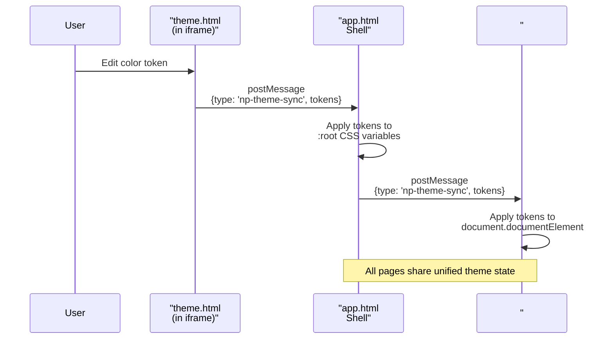

The message handler receives theme updates and applies them to `document.documentElement.style`, then forwards to the iframe. Embedded pages (like `alexa.html`, `radio.html`, or `peppy.html`) utilize unified token mapping to respond to these changes.

**Sources:** [app.html:1095-1107](), [theme.html:57-80](), [alexa.html:49-71](), [radio.html:49-69](), [peppy.html:13-29]()

---

## Navigation and Iframe Embedding

### Tab Navigation

The shell provides a horizontal tab bar linking to feature pages. Each tab uses `data-page` attributes to identify the target page.

**Tab management logic:**
- Reads `?page=` query parameter from URL.
- Validates page name against a set of allowed files.
- Sets iframe `src` attribute.
- Updates tab `active` class and `aria-current="page"` attribute.

**Sources:** [app.html:348-359](), [app.html:456-551]()

### normalizeEmbeddedDoc and Height Sync

The shell dynamically adjusts the iframe height to match the embedded page's content height, eliminating double scrollbars. This uses `ResizeObserver` and `MutationObserver` to monitor iframe document changes.

| Mechanism | Purpose |
|----------|---------|
| `frameResizeObserver` | Detects content height changes via `iframe.contentDocument.body`. |
| `frameMutationObserver` | Detects DOM mutations within the iframe. |
| `syncFrameHeight()` | Updates `#appFrame` height based on `scrollHeight`. |

**Sources:** [app.html:589-630](), [app.html:631-651]()

---

## Hero Transport Integration

The shell embeds a persistent now-playing transport control bar at the top via `scripts/hero-transport.js`. This component polls the `/now-playing` API endpoint and renders album art, track metadata, and playback controls.

Title: Hero Transport Code Entity Bridge
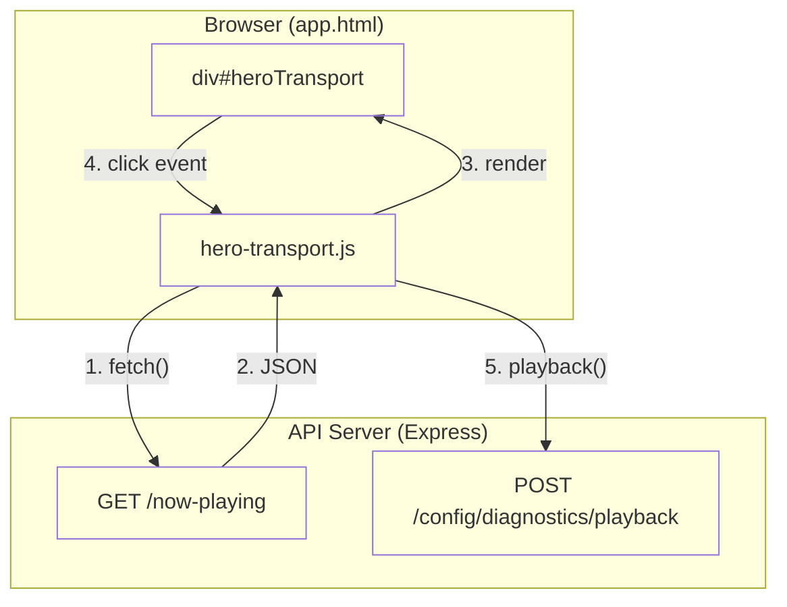

The transport initializes by loading `hero-transport.js`, which injects controls into `#heroTransport`. It includes logic for `applyHeroArtBackground`, `ensureRuntimeKey`, and `playback` actions. It also supports specialized rendering for classical metadata via `expandInstrumentAbbrevs`.

**Sources:** [app.html:298-301](), [scripts/hero-transport.js:11-31](), [scripts/hero-transport.js:65-85](), [scripts/hero-transport.js:92-103](), [scripts/hero-transport.js:105-114]()

---

## Queue Card Component

The shell includes a live queue display (`#heroQueueCard`) below the transport, showing upcoming tracks with reordering, star ratings, and management actions.

### Queue Operations

| Operation | Element ID | Action |
|-----------|-----------|--------|
| Shuffle | `#heroQueueShuffle` | POST `/mpd/shuffle` |
| Clear | `#heroQueueClear` | POST `/mpd/clear` |
| Crop | `#heroQueueCrop` | POST `/queue/crop` |
| Save Playlist | `#heroQueueSavePlaylist` | POST `/queue/save-playlist` |
| Consume Mode | `#heroQueueConsume` | POST `/mpd/consume` |

The project distinguishes between **Random** (MPD state) and **Shuffle** (queue reordering).

**Sources:** [app.html:302-341](), [scripts/hero-transport.js:116-121](), [docs/10-random-vs-shuffle.md:5-12]()

---

## Status Pills and System Health

The shell displays real-time system health indicators as interactive pills. Each pill shows service status and provides quick actions.

| Pill ID | Service |
|---------|---------|
| `#apiPill` | API Server connectivity. |
| `#alexaPill` | Alexa Public Domain reachability. |
| `#peppyPill` | moOde Display Mode (Peppy, Player, WebUI). |
| `#peppyAlsaPill`| PeppyALSA Driver status. |
| `#scrobblePill` | mpdscribble service status. |

The backend logic for these pills is managed via `getMpdscribbleStatus` and `sshBashLc` to query `systemctl` on the moOde host.

**Sources:** [app.html:368-377](), [src/routes/config.runtime-admin.routes.mjs:147-152](), [src/routes/config.runtime-admin.routes.mjs:164-179]()

---

## Responsive Behavior

The shell adapts its layout based on viewport width using CSS media queries in `styles/hero.css`. The hero transport switches from a horizontal desktop layout to a compact grid for mobile.

### Breakpoint Strategy

| Breakpoint | Layout Mode |
|------------|-------------|
| `> 1201px` | Desktop: `#heroTransport` uses `align-items: stretch`. |
| `< 980px` | Narrow/Tablet: Grid layout with `100px` art. |
| `< 700px` | Phone: Grid layout with `92px` art and compact `tbtn` buttons. |

**Sources:** [styles/hero.css:7-14](), [styles/hero.css:17-39](), [styles/hero.css:42-61]()
1d:T262a,
# Now Playing Displays

<details>
<summary>Relevant source files</summary>

The following files were used as context for generating this wiki page:

- [README.md](README.md)
- [controller-now-playing.html](controller-now-playing.html)
- [controller.html](controller.html)
- [docs/14-display-enhancement.md](docs/14-display-enhancement.md)
- [docs/18-kiosk.md](docs/18-kiosk.md)
- [docs/images/kioskred.jpg](docs/images/kioskred.jpg)
- [docs/images/readme-spectrum.jpg](docs/images/readme-spectrum.jpg)
- [index.html](index.html)
- [player-render.html](player-render.html)
- [player.html](player.html)
- [scripts/index-ui.js](scripts/index-ui.js)
- [styles/index1080.css](styles/index1080.css)

</details>


## Purpose and Scope

This page provides an overview of the now-playing display system, which presents currently playing track information across multiple interface contexts. The system provides three primary display implementations optimized for different use cases: desktop/tablet full-featured displays, mobile phone-optimized displays, and compact player renderers for embedded hardware displays.

For details on specific implementations, see:
- Desktop full-featured interface: [Desktop Display (index.html)](#2.2.1)
- Mobile phone-optimized interface: [Mobile Display (controller-now-playing.html)](#2.2.2)

For the player builder and Peppy display system, see [Display Enhancement System](#3).

---

## Display Variant Architecture

The system provides three primary now-playing display implementations that share common components but differ in layout, feature set, and optimization targets.

### System Topology to Code Mapping

The following diagram bridges the high-level display contexts to the specific file entities that implement them.

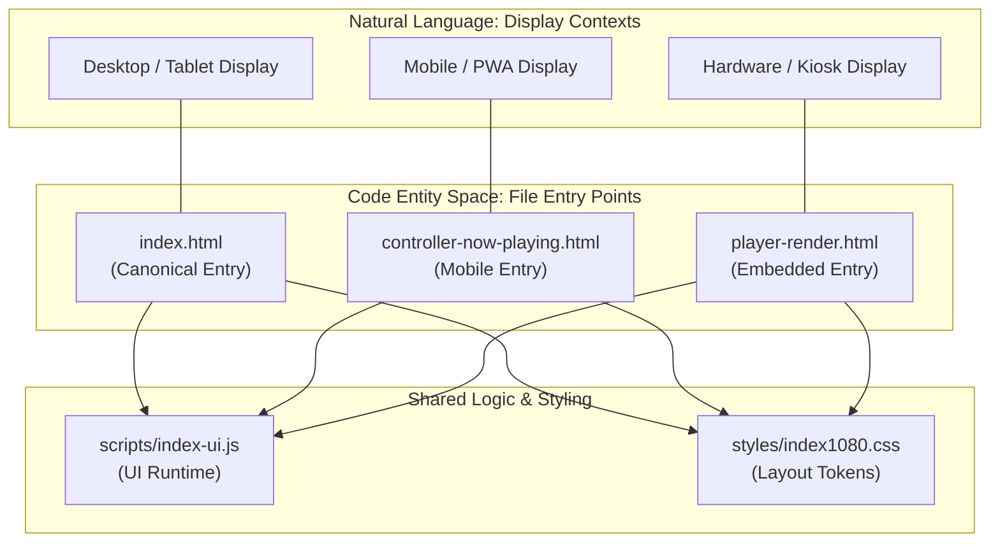

**Sources:** [index.html:1-51](), [controller-now-playing.html:1-87](), [player-render.html:1-51](), [scripts/index-ui.js:1-15]()

---

## Display Variant Comparison

| Feature | Desktop (`index.html`) | Mobile (`controller-now-playing.html`) | Player Renderer (`player-render.html`) |
|---------|----------------------|--------------------------------------|-------------------------------------|
| **Primary Context** | Desktop browsers, tablets | Mobile phones, PWA | Embedded displays (800×480, 1024×600) |
| **Layout Engine** | Flexbox (horizontal) | CSS Grid (vertical) | Grid (2-column) |
| **Transport Controls** | `#phone-controls` (conditional) | `#phone-controls` (always visible) | `#phone-controls` (floating overlay) |
| **Progress Bar** | Bottom of text column | Fixed position below art | Fixed position below art |
| **Next-up Display** | Bottom-right corner | Bottom footer | Bottom-right corner |
| **Personnel Info** | `#personnel-info` visible | Hidden on phone-ui | Hidden on small sizes |
| **Background Layers** | `#background-a`, `#background-b` crossfade | Disabled (uses body background) | Disabled on small sizes |
| **Motion Art** | Supported via `#album-art-video` | Supported | Supported |
| **Responsive Mode** | Triggers `phone-ui` on narrow viewports | Always applies `phone-ui` | Fixed size profiles |

**Sources:** [index.html:58-142](), [controller-now-playing.html:104-127](), [player-render.html:53-100](), [styles/index1080.css:22-50]()

---

## Shared DOM Structure

All now-playing displays share a common DOM hierarchy defined by consistent element IDs and class names, allowing `scripts/index-ui.js` to operate across all variants.

```mermaid
graph TD
    BODY["body"]
    BG_A["#background-a<br/>Background Layer A"]
    BG_B["#background-b<br/>Background Layer B"]
    CONTENT["#content<br/>Main Container"]
    
    subgraph "Art Section"
        ART_WRAP["#album-art-wrapper<br/>Art Container"]
        ART_BG["#album-art-bg<br/>Blurred Halo"]
        ART_IMG["#album-art<br/>Static Image"]
        ART_VID["#album-art-video<br/>Motion Video"]
        HOTSPOT["#art-info-hotspot<br/>Personnel Button"]
        FAV["#fav-heart<br/>Favorites Toggle"]
    end
    
    subgraph "Metadata Section"
        TEXT_COL[".text-column<br/>Metadata Container"]
        ARTIST["#artist-name<br/>Artist Display"]
        TITLE_LINE["#titleLine<br/>Title Container"]
        TITLE["#track-title<br/>Track Title"]
        RATING["#ratingStars<br/>Rating Stars"]
        ALBUM_LINK["#album-link<br/>Album Name"]
        FILE_INFO["#file-info<br/>Format & Bitrate"]
        PERSONNEL["#personnel-info<br/>Album Personnel"]
    end
    
    subgraph "Status & Controls"
        PROGRESS_WRAP["#progress-bar-wrapper<br/>Progress Container"]
        NEXTUP_WRAP["#next-up<br/>Next Track Display"]
        CONTROLS_WRAP["#phone-controls<br/>Transport Controls"]
    end
    
    BODY --> BG_A
    BODY --> BG_B
    BODY --> CONTENT
    
    CONTENT --> ART_WRAP
    CONTENT --> TEXT_COL
    CONTENT --> PROGRESS_WRAP
    CONTENT --> NEXTUP_WRAP
    BODY --> CONTROLS_WRAP
```

**Sources:** [index.html:58-180](), [controller-now-playing.html:498-629](), [styles/index1080.css:92-485]()

---

## Responsive Layout System

The now-playing displays use a JavaScript-driven responsive system that applies the `phone-ui` class to `body` based on device characteristics and viewport geometry.

### Phone-UI Detection Flow

The logic in `scripts/index-ui.js` determines the layout mode.

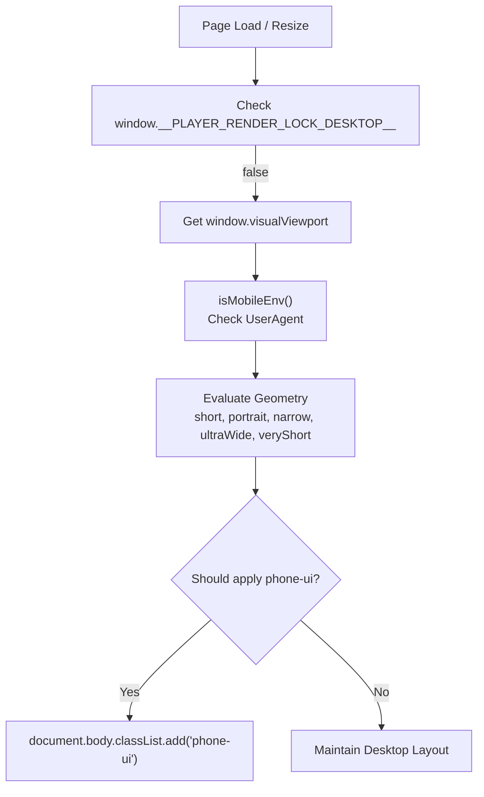

**Sources:** [scripts/index-ui.js:684-760]()

### Detection Implementation

The `computePhoneUI()` function determines whether to apply phone layout based on a combination of environment flags and viewport dimensions.

```javascript
function computePhoneUI() {
  if (window.__PLAYER_RENDER_LOCK_DESKTOP__) return false;
  const vv = window.visualViewport;
  const w = Math.round(vv?.width  ?? window.innerWidth  ?? 0);
  const h = Math.round(vv?.height ?? window.innerHeight ?? 0);
  const aspect = (h > 0) ? (w / h) : 0;
  
  const mobileEnv = isMobileEnv();
  
  // Geometry classifications
  const short     = (h > 0 && h <= 560);
  const portrait  = (aspect > 0 && aspect < 0.9);
  const narrow    = (w > 0 && w <= 680);
  
  if (mobileEnv) {
    return short || portrait || narrow;
  } else {
    // Desktop "mini-player" or ultra-wide mode
    return (aspect >= 1.85) || (h <= 420);
  }
}
```

**Sources:** [scripts/index-ui.js:705-760]()

---

## Background Crossfade System

Desktop displays use a double-buffer background system for smooth transitions between album art.

1. **Layers**: Two fixed-position divs, `#background-a` and `#background-b`, sit at the bottom of the stack. [index.html:55-56]()
2. **Transition**: When art changes, the "back" layer's `background-image` is updated, and its `opacity` is transitioned to `1` while the "front" layer fades to `0`. [scripts/index-ui.js:4-5]()
3. **Styling**: Layers are styled with `filter: blur(18px) brightness(0.3)` and `transform: scale(1.08)` to create an immersive backdrop. [styles/index1080.css:75-88]()

**Sources:** [styles/index1080.css:75-88](), [scripts/index-ui.js:4-5](), [index.html:55-56]()

---

## Core UI Components

### Motion Art Integration
The system prioritizes motion art (MP4) over static images. The `setMotionArtVideo` function manages the visibility of `#album-art-video` and `#album-art`. If a valid `_motionMp4` URL is present in the track metadata, the video element is shown and looped. [scripts/index-ui.js:421-445]()

**Sources:** [scripts/index-ui.js:421-445](), [index.html:70]()

### Pause Screensaver
When playback is paused, the UI can enter a screensaver mode. The `body.pause` class triggers CSS rules that hide the blurred halo (`#album-art-bg`) and show a simplified clock overlay managed by `setIdleOverlayVisible(on)`. [styles/index1080.css:190-204]()

**Sources:** [styles/index1080.css:190-204](), [scripts/index-ui.js:108-131]()

### Handoff and Navigation
Tapping the album art in a now-playing display triggers a handoff back to the Kiosk runtime or library view via `switchToKioskFromArt`. [scripts/index-ui.js:58-76]()

**Sources:** [scripts/index-ui.js:49-95]()

---

## Related Pages

- **Desktop implementation details:** [Desktop Display (index.html)](#2.2.1)
- **Mobile implementation details:** [Mobile Display (controller-now-playing.html)](#2.2.2)
- **Embedded display rendering:** [Player Builder & Renderer](#3.3)
- **UI Styling Tokens:** [Theme Token System](#8.1)
1e:T2ce8,
# Desktop Display (index.html)

<details>
<summary>Relevant source files</summary>

The following files were used as context for generating this wiki page:

- [index.html](index.html)
- [index1080.html](index1080.html)
- [player-render.html](player-render.html)
- [player.html](player.html)
- [scripts/index-ui.js](scripts/index-ui.js)
- [src/routes/podcasts-episodes.routes.mjs](src/routes/podcasts-episodes.routes.mjs)
- [styles/index1080.css](styles/index1080.css)

</details>


The desktop display (`index.html`) is the primary now-playing interface designed for desktop browsers, tablets, and responsive mobile layouts. It provides a full-featured music visualization experience with album art, motion video support, metadata enrichment, playback controls, and real-time progress tracking.

For the mobile-optimized controller interface, see [Mobile Display (controller-now-playing.html)](#2.2.2). For the player builder and renderer system, see [Player Builder & Renderer](#3.3).

---

## System Architecture

The architecture separates the declarative HTML structure from the procedural runtime logic in `scripts/index-ui.js` and the scaling/responsive logic in `styles/index1080.css`.

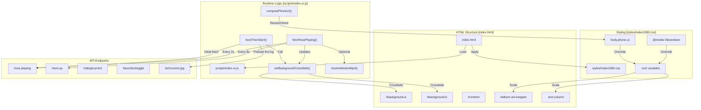
**Sources:** [index.html:1-182](), [scripts/index-ui.js:1-100](), [styles/index1080.css:1-50]()

---

## HTML Structure and DOM Elements

The display uses a layered DOM structure with fixed background layers, a central content area, and overlays for modals and controls.

### Core Layout Elements

| Element ID/Class | Purpose | Z-Index |
|-----------------|---------|---------|
| `#background-a` | Front buffer for blurred album art background | -2 |
| `#background-b` | Back buffer for crossfade transitions | -2 |
| `#content` | Main flex container (desktop) or grid (phone-ui) | 1 |
| `#album-art-wrapper` | Album art container with blurred halo | relative |
| `#album-art` | Static album artwork `` | 2 |
| `#album-art-video` | Motion art `<video>` element | 3 |
| `#album-art-bg` | Blurred halo background layer | 1 |
| `#fav-heart` | Favorites toggle button overlay | 9999 |
| `#art-info-hotspot` | Personnel modal trigger (phone-ui only) | 65 |
| `.text-column` | Metadata display column | relative |
| `#progress-bar-wrapper` | Progress bar container | varies |
| `#phone-controls` | Transport controls (phone-ui only) | 149 |
| `#next-up` | Next track preview footer | 126 |

**Sources:** [index.html:54-179](), [styles/index1080.css:75-150](), [styles/index1080.css:210-236]()

---

## Boot Sequence and State Management

The display uses a boot gating system to prevent flickering and ensure smooth initial render.

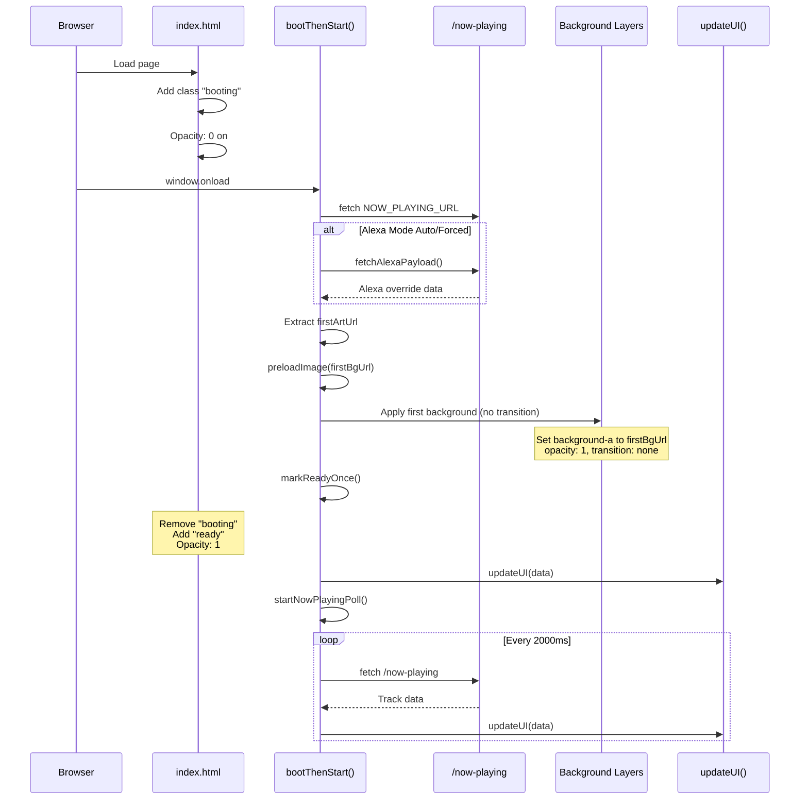
**Sources:** [scripts/index-ui.js:1255-1350](), [styles/index1080.css:55-70]()

---

## Double-Buffer Background Crossfade

The background uses two fixed layers (`#background-a` and `#background-b`) that alternate as front/back buffers to achieve smooth crossfades.

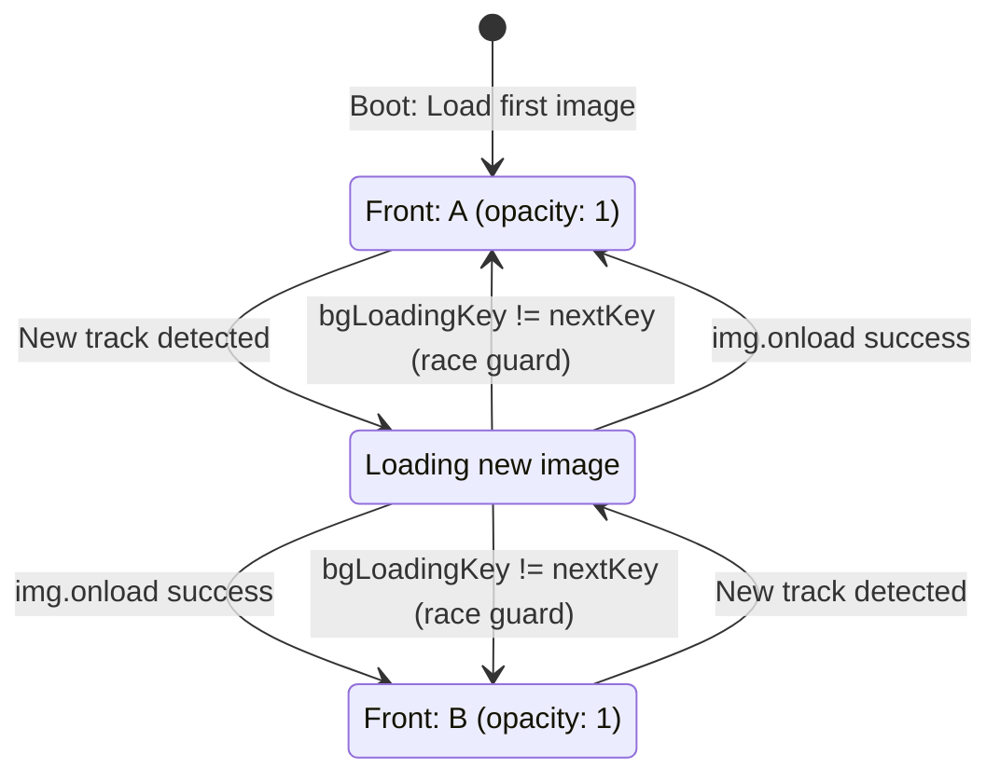
**Sources:** [scripts/index-ui.js:1360-1418](), [styles/index1080.css:75-88]()

### Crossfade Implementation
The `setBackgroundCrossfade(url, keyOverride)` function handles the swap by preloading the image before applying it to the back buffer and toggling opacities. It uses a `bgLoadingKey` to ensure that late-arriving image loads from previous tracks do not overwrite the current background [scripts/index-ui.js:1360-1418]().

---

## Album Art Display System

The album art wrapper contains three layers: a blurred halo, static image, and optional motion video.

```mermaid
graph TB
    subgraph "Album Art Wrapper"
        HALO["#album-art-bg<br/>Blurred halo"]
        IMG["#album-art<br/>Static image"]
        VID["#album-art-video<br/>Motion video"]
        HEART["#fav-heart<br/>Favorites toggle"]
    end
    
    subgraph "Motion Art Resolution"
        LOCAL["resolveLocalMotionMp4()"]
        REMOTE["resolveMotionMp4()"]
        LOCAL_API["/config/library-health/animated-art/lookup"]
    end
    
    UPDATE["updateUI(data)"] -->|albumArtUrl| IMG
    UPDATE -->|Local track?| LOCAL
    UPDATE -->|Alexa mode?| REMOTE
    
    LOCAL -->|Query| LOCAL_API
    LOCAL_API -->|Cache hit| VID
    
    VID -->|setMotionArtVideo()| IMG
```
**Sources:** [index.html:60-101](), [scripts/index-ui.js:305-389](), [scripts/index-ui.js:391-445]()

---

## Responsive Layout System

The display uses JavaScript-based responsive detection (`computePhoneUI()`) rather than pure CSS media queries to apply the `body.phone-ui` class.

### Detection Logic
The system calculates viewport geometry and checks for touch capabilities [scripts/index-ui.js:710-738]().
- **Short Viewports:** Height ≤ 560px [scripts/index-ui.js:725]().
- **Portrait Viewports:** Aspect ratio ≤ 0.85 [scripts/index-ui.js:726]().
- **Narrow Viewports:** Width ≤ 900px [scripts/index-ui.js:727]().
- **Kiosk Mode:** Specifically handles 1280x400 "landscape strip" displays [scripts/index-ui.js:720-723]().

### Player Size Classes
The `player-render.html` template uses specific CSS classes (e.g., `player-size-800x480`, `player-size-1024x600`) to adapt the layout for various hardware display dimensions, modifying grid columns and font sizes [player-render.html:52-150]().

**Sources:** [scripts/index-ui.js:697-738](), [styles/index1080.css:618-863](), [player-render.html:52-150]()

---

## Next Up Preview System

The Next Up feature displays the upcoming track with thumbnail art and marquee text.

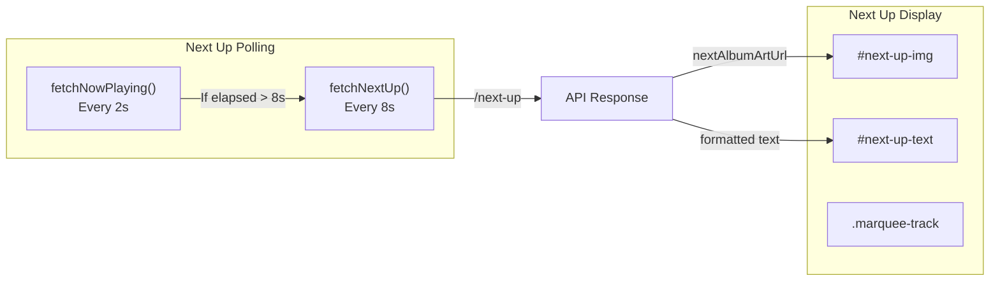
**Sources:** [scripts/index-ui.js:451-453](), [styles/index1080.css:417-455]()

---

## Ratings and Favorites System

The ratings display integrates with MPD sticker database via the `/rating/current` API endpoint [scripts/index-ui.js:1020-1074]().

### Optimistic Updates
Both ratings and favorites use an optimistic hold mechanism (`pendingRating` and `pendingFavorite`) for 3500ms to prevent the polling loop from overwriting user interactions before the server state stabilizes [scripts/index-ui.js:1120-1130](), [scripts/index-ui.js:1440-1450]().

**Sources:** [scripts/index-ui.js:612-624](), [scripts/index-ui.js:1091-1149](), [index.html:86-101]()

---

## Pause Screensaver and Radio Stabilization

### Pause Screensaver
When playback is paused or stopped for more than 5 seconds, the display enters `body.pause` mode [scripts/index-ui.js:641-650]().
- **Move Interval:** The album art moves to a random position every 8 seconds [scripts/index-ui.js:645]().
- **Styling:** The background halo is hidden, and art is simplified [styles/index1080.css:190-203]().

### Radio Stabilization
For radio streams, the UI implements stabilization logic to handle frequent or inconsistent metadata updates. It also includes special formatting for classical music, expanding instrument abbreviations and properly identifying composers and works [scripts/index-ui.js:8-10]().

### Idle Clock
If the queue is empty, a fixed radial-gradient overlay (`#np-idle-overlay`) appears, displaying a large digital clock and a prompt to use the Queue Wizard [scripts/index-ui.js:97-131]().

**Sources:** [scripts/index-ui.js:641-650](), [styles/index1080.css:190-203](), [scripts/index-ui.js:97-131]()

---

## Summary of Key Functions

| Function | Purpose | File Location |
|----------|---------|---------------|
| `bootThenStart()` | Initial boot gating and first render | [scripts/index-ui.js:1255]() |
| `setBackgroundCrossfade()` | Smoothly transitions blurred background layers | [scripts/index-ui.js:1360]() |
| `computePhoneUI()` | Multi-signal responsive layout detection | [scripts/index-ui.js:710]() |
| `resolveMotionMp4()` | Resolves remote Apple Music motion art URLs | [scripts/index-ui.js:350]() |
| `resolveLocalMotionMp4()` | Resolves local H.264 motion art from cache | [scripts/index-ui.js:305]() |
| `setIdleOverlayVisible()` | Manages the "Queue is empty" clock screensaver | [scripts/index-ui.js:108]() |
| `onToggleFavorite()` | Handles optimistic favorite state and API sync | [scripts/index-ui.js:1425]() |

**Sources:** [scripts/index-ui.js:1-1500]()
1f:T403b,
# Mobile Display (controller-now-playing.html)

<details>
<summary>Relevant source files</summary>

The following files were used as context for generating this wiki page:

- [controller-now-playing-iphone.html](controller-now-playing-iphone.html)
- [controller-now-playing.html](controller-now-playing.html)
- [controller-nowplaying-iphone.html](controller-nowplaying-iphone.html)
- [controller.html](controller.html)

</details>


The mobile display (`controller-now-playing.html`) is a phone-optimized now-playing interface that provides full-screen playback control with touch-friendly gestures and visual feedback. It features a custom "brass ring" control aesthetic, animated state transitions, and modal overlays for album details and queue management.

For the desktop now-playing interface, see [Desktop Display (index.html)](#2.2.1). For the mobile dashboard/library browser, see [Mobile Controller Dashboard](#2.3).

---

## Purpose and Scope

`controller-now-playing.html` serves as the dedicated mobile now-playing view within the controller interface. It is accessed by tapping the now-playing card in `controller.html` [controller.html:24-27]() and presents:

- **Full-screen album artwork** with video support and favorites/personnel buttons [controller-now-playing.html:463-488]()
- **Transport controls** styled as brass rings with golden animated effects [controller-now-playing.html:138-209]()
- **Track metadata** in a vertical, scrollable grid layout [controller-now-playing.html:104-127]()
- **Progress bar** with visual scrubbing affordance [controller-now-playing.html:568-574]()
- **Next-up preview** that opens a queue modal [controller-now-playing.html:576-591]()
- **Album/queue/personnel modals** for extended interactions [controller-now-playing.html:606-628]()
- **Podcast seek controls** (±15s/±30s inline buttons) [controller-now-playing.html:562-566]()
- **Slide animations** on entry/exit with home card reveal [controller-now-playing.html:20-22]()

The page is designed exclusively for portrait phone layouts and applies the `phone-ui` CSS class immediately at runtime to bypass responsive breakpoints [controller-now-playing.html:93-127]().

**Sources**: [controller-now-playing.html:1-127](), [controller-now-playing.html:686-735](), [controller.html:24-27]()

---

## Layout Architecture

### CSS Grid Structure

The mobile layout uses a single-column CSS grid with named template areas. The grid is constructed in portrait mode with vertical stacking, and switches to a two-column layout in landscape orientation.

Portrait Grid Layout
```mermaid
graph TB
    subgraph "Portrait Layout (body.phone-ui)"
        GRID["#content<br/>CSS Grid<br/>grid-template-areas"]
        BACK["back → #cnpBack"]
        ART["art → #album-art-wrapper"]
        PROG["progress → #progress-bar-wrapper"]
        ARTIST["artist → #artist-name"]
        TITLE["title → #titleLine"]
        STARS["stars → #ratingRow"]
        ALBUM["album → #album-link"]
        FILE["file → #file-info"]
        CONTROLS["controls → #phone-controls"]
        NEXTUP["nextup → #next-up"]
    end
    
    subgraph "Landscape Layout (@media orientation:landscape)"
        GRID2["2-column grid<br/>48% | minmax(0,1fr)"]
        COL1["Left: art"]
        COL2["Right: metadata + controls"]
    end
    
    GRID --> BACK
    GRID --> ART
    GRID --> PROG
    GRID --> ARTIST
    GRID --> TITLE
    GRID --> STARS
    GRID --> ALBUM
    GRID --> FILE
    GRID --> CONTROLS
    GRID --> NEXTUP
    
    GRID2 --> COL1
    GRID2 --> COL2
```

**Sources**: [controller-now-playing.html:88-127](), [controller-now-playing.html:309-333]()

### Art Size Enforcement

Album art size is enforced via runtime JavaScript to override PWA viewport quirks and iOS Safari toolbar behavior. The size is clamped to `min(85vw, 420px)` and applied with `!important` flags [controller-now-playing.html:98-103]().

| Viewport Trigger | Art Size | Applied By |
|-----------------|----------|------------|
| Narrow screens (max-width: 900px) | `min(85vw, 420px)` | CSS media query [controller-now-playing.html:95-103]() |
| All phone-ui contexts | `min(85vw, 420px)` | JavaScript `forceArtSize()` [controller-now-playing.html:690-709]() |
| Landscape mode | Same as portrait | Unified sizing logic [controller-now-playing.html:314-315]() |

**Sources**: [controller-now-playing.html:95-103](), [controller-now-playing.html:690-709]()

---

## Control System

### Brass Ring Aesthetic

The transport controls use a custom "brass ring" design with gradient borders, inner shine highlights, and a golden spinning animation on the active control.

Control Button Structure
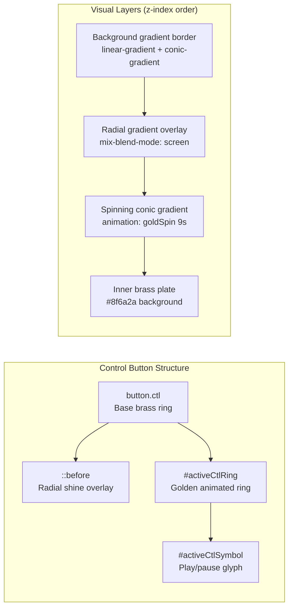

The gradient composition uses:
- **Padding box**: Solid brass background `#8f6a2a` [controller-now-playing.html:150]()
- **Border box**: Conic gradient sweep with gold/pink/blue accent bands [controller-now-playing.html:153]()
- **Inner highlights**: Radial gradient at top-left, screen blend mode [controller-now-playing.html:170-176]()
- **Active state**: Pulsing golden glow with `box-shadow` [controller-now-playing.html:242-254]()

**Sources**: [controller-now-playing.html:138-209](), [controller-now-playing.html:242-254]()

### Active Control Ring

The `#activeCtlRing` element is an absolutely positioned overlay that tracks the currently active button and displays a spinning golden border animation [controller-now-playing.html:256-304]().

Control Ring State Diagram
```mermaid
stateDiagram-v2
    [*] --> Positioned: setActive(btn)
    Positioned --> Playing: btn.classList.contains('on')
    Positioned --> Paused: !btn.classList.contains('on')
    
    Playing --> Spinning: symbol='❚❚', color=#22c55e
    Paused --> Static: symbol='▶', color=#e9eef6
    
    Spinning --> [*]: User clicks different control
    Static --> [*]: User clicks different control
    
    note right of Spinning
        .spin animation: running
        opacity: 1
    end note
    
    note right of Static
        .spin animation: paused
        opacity: 0
    end note
```

**Control Ring Functions**:

| Function | Purpose | Source Lines |
|----------|---------|--------------|
| `positionRing(btn)` | Calculate and apply transform to align ring with button | [controller-now-playing.html:861-873]() |
| `syncPlaySymbol()` | Update symbol glyph and color based on play state | [controller-now-playing.html:875-887]() |
| `setActive(btn)` | Move ring to new active button | [controller-now-playing.html:889-893]() |

The ring uses `transform: translate3d()` for GPU-accelerated positioning and `cubic-bezier(0.34, 1.2, 0.64, 1)` easing for a bouncy transition effect [controller-now-playing.html:260-265]().

**Sources**: [controller-now-playing.html:256-304](), [controller-now-playing.html:852-909]()

---

## Modal System

The page provides three modal overlays: album details, live queue, and artist personnel details.

Modal Navigation
```mermaid
graph TB
    subgraph "Modal Triggers"
        ALBUM_LINK["#album-link<br/>Album button"]
        NEXTUP["#next-up<br/>Next-up preview"]
        HOTSPOT["#art-info-hotspot<br/>Personnel (i) button"]
    end
    
    subgraph "Modal Containers"
        ALBUM_MODAL["#npAlbumModal<br/>.albumModal"]
        QUEUE_MODAL["#npQueueModal<br/>.queueModal"]
        ARTIST_MODAL["#artist-details-container<br/>Personnel panel"]
    end
    
    subgraph "Modal Content"
        ALBUM_CARD["Album tracks + actions<br/>Inline HTML"]
        QUEUE_FRAME["#npQueueFrame<br/>iframe → controller-queue.html"]
        ARTIST_DETAILS["#artist-details<br/>Shared from index.js"]
    end
    
    ALBUM_LINK -->|onAlbumTap()| ALBUM_MODAL
    NEXTUP -->|openQueue()| QUEUE_MODAL
    HOTSPOT -->|Shared event handler| ARTIST_MODAL
    
    ALBUM_MODAL --> ALBUM_CARD
    QUEUE_MODAL --> QUEUE_FRAME
    ARTIST_MODAL --> ARTIST_DETAILS
```

**Sources**: [controller-now-playing.html:375-395](), [controller-now-playing.html:911-936]()

### Album Modal Workflow

The album button tap behavior is context-sensitive based on stream type. It uses `syncAlbumTapState` to determine if the link should open a modal or an external URL [controller-now-playing.html:1035-1064]().

Album Tap Logic
```mermaid
flowchart TD
    TAP["User taps #album-link"]
    
    SYNC["syncAlbumTapState()<br/>Detect stream type"]
    
    CHECK_RADIO{"isRadioNow ||<br/>linkUrl present?"}
    CHECK_LOCAL{"hasStreamFlags &&<br/>isLocal?"}
    
    EXTERNAL["dataset.npTapMode = 'external'<br/>window.open(linkUrl)"]
    LOCAL["dataset.npTapMode = 'local'<br/>onAlbumTap()"]
    UNKNOWN["dataset.npTapMode = 'unknown'<br/>No action"]
    
    FETCH["fetchAlbumTracks()<br/>POST /config/queue-wizard/preview"]
    RENDER["render()<br/>Populate #npAlbumTracks"]
    OPEN["modal.classList.add('open')"]
    
    TAP --> SYNC
    SYNC --> CHECK_RADIO
    CHECK_RADIO -->|Yes| EXTERNAL
    CHECK_RADIO -->|No| CHECK_LOCAL
    CHECK_LOCAL -->|Yes| LOCAL
    CHECK_LOCAL -->|No| UNKNOWN
    
    LOCAL --> FETCH
    FETCH --> RENDER
    RENDER --> OPEN
```

**Album Actions**:

| Button ID | Action | API Call |
|-----------|--------|----------|
| `#npAlbumAppendBtn` | Add album to end of queue | `POST /config/diagnostics/playback` `{action:'addalbum', mode:'append'}` [controller-now-playing.html:1083]() |
| `#npAlbumCropBtn` | Add album after current track, remove others | `{mode:'crop'}` [controller-now-playing.html:1084]() |
| `#npAlbumReplaceBtn` | Clear queue and play album | `{mode:'replace'}` [controller-now-playing.html:1085]() |

**Sources**: [controller-now-playing.html:938-1087]()

### Queue Modal

The queue modal embeds `controller-queue.html` as an iframe with `?embedded=1` parameter [controller-now-playing.html:916](). The parent listens for `np-kiosk-hide-pane` messages via `postMessage` to close the modal [controller-now-playing.html:676-681]().

**Sources**: [controller-now-playing.html:911-936](), [controller-now-playing.html:676-681]()

---

## Animations and Transitions

### Entry/Exit Lifecycle

The page uses class-based animation states to coordinate entrance and exit transitions with the home card reveal effect [controller-now-playing.html:715-734](). It also supports a `nav=slide` URL parameter for specific slide-in behavior [controller-now-playing.html:27-33]().

Transition State Diagram
```mermaid
stateDiagram-v2
    [*] --> Booting: DOMContentLoaded
    Booting --> Hidden: body.classList.add('cnp-hidden')
    Hidden --> Ready: window.onload
    Ready --> Visible: body.classList.add('cnp-ready')
    
    Visible --> Exiting: User taps #cnpBack
    Exiting --> Dismissed: body.classList.add('cnp-exit')
    Dismissed --> [*]: setTimeout(170ms)
    
    note right of Ready
        animation: cnpSlideIn 220ms
        translateX(26px → 0)
        opacity: 0.78 → 1
    end note
    
    note right of Exiting
        animation: cnpSlideOut 200ms
        translateX(0 → 46px)
        opacity: 1 → 0.5
        
        #homeRevealCard fades in
        during exit
    end note
```

**Animation Keyframes**:

| Animation | Duration | Easing | Transform |
|-----------|----------|--------|-----------|
| `cnpSlideIn` | 220ms | ease-out | `translateX(26px) → 0` [controller-now-playing.html:407-410]() |
| `cnpSlideOut` | 200ms | ease-in | `translateX(0) → 46px` [controller-now-playing.html:411-414]() |
| `goldSpin` | 9s | linear (infinite) | `rotate(0deg) → 360deg` [controller-now-playing.html:199-202]() |

**Sources**: [controller-now-playing.html:407-418](), [controller-now-playing.html:715-734](), [controller-now-playing.html:27-33]()

### Home Reveal Card

The `#homeRevealCard` element displays a preview of the controller home now-playing card during exit animation [controller-now-playing.html:420-439]().

Exit Sequence
```mermaid
graph LR
    subgraph "Exit Animation Sequence"
        T0["t=0ms<br/>User taps back"]
        T10["t=10ms<br/>body.cnp-exit"]
        T50["t=50ms<br/>#homeRevealCard visible"]
        T170["t=170ms<br/>location.href change"]
    end
    
    subgraph "Visual State"
        BG["#album-art-bg<br/>opacity: 0"]
        CONTENT["#content<br/>translateX(46px)"]
        CARD["#homeRevealCard<br/>opacity: 1, translateX(0)"]
    end
    
    T0 --> T10
    T10 --> T50
    T50 --> T170
    
    T10 --> BG
    T10 --> CONTENT
    T50 --> CARD
```

**Sources**: [controller-now-playing.html:420-439](), [controller-now-playing.html:720-734]()

---

## Touch Interactions

### Pull-to-Refresh

The page implements a custom pull-to-refresh gesture using touch event tracking with a 80px threshold [controller-now-playing.html:743-776]().

**Sources**: [controller-now-playing.html:743-776]()

### Tap Pulse Feedback

All `.ctl` buttons receive visual feedback on tap via the `tapPulse` class, which temporarily increases the golden glow shadow [controller-now-playing.html:829-850]().

Feedback Sequence
```mermaid
sequenceDiagram
    participant User
    participant Host as #phone-controls
    participant Button as button.ctl
    participant Timer as setTimeout
    
    User->>Host: pointerdown event
    Host->>Button: Find closest button.ctl
    Button->>Button: classList.add('tapPulse')
    Button->>Timer: Schedule removal (240ms)
    Timer->>Button: classList.remove('tapPulse')
    
    Note over Button: Enhanced glow during pulse:<br/>box-shadow: 0 0 26px 7px rgba(255,193,44,.52)
```

**Sources**: [controller-now-playing.html:829-850]()

### Podcast Seek Controls

For podcast streams, inline seek buttons appear in the `#file-info` row [controller-now-playing.html:562-566]().

| Button ID | Label | Seek Amount | Display Condition |
|-----------|-------|-------------|-------------------|
| `#btn-seek-back-inline` | `↺15` | -15 seconds | `body.is-podcast` [controller-now-playing.html:134]() |
| `#btn-seek-fwd-inline` | `30↻` | +30 seconds | `body.is-podcast` [controller-now-playing.html:135]() |

**Sources**: [controller-now-playing.html:134-136](), [controller-now-playing.html:562-566]()

---

## API Integration

### Track Key Authentication

The page uses the runtime track key for authenticated API requests, retrieved via `/config/runtime` [controller-now-playing.html:948-953]().

### Playback Commands

Album modal actions send commands via the diagnostics playback endpoint [controller-now-playing.html:1083-1086]().

Playback API Flow
```mermaid
graph LR
    BTN_APPEND["#npAlbumAppendBtn"]
    BTN_CROP["#npAlbumCropBtn"]
    BTN_REPLACE["#npAlbumReplaceBtn"]
    
    SEND["sendPlayback(action, extra)"]
    
    API["/config/diagnostics/playback"]
    
    MPD["MPD Command Execution"]
    
    BTN_APPEND -->|"addalbum, mode:append"| SEND
    BTN_CROP -->|"addalbum, mode:crop"| SEND
    BTN_REPLACE -->|"addalbum, mode:replace"| SEND
    
    SEND -->|"POST {action,album,artist,mode}"| API
    API --> MPD
```

**Sources**: [controller-now-playing.html:948-954](), [controller-now-playing.html:1083-1086]()

---

## BFCache and Overlay Cleanup

To prevent stale modals when navigating back via browser history, all overlays are closed on `pageshow` and `visibilitychange` events [controller-now-playing.html:778-802]().

```javascript
function closeAll() {
  document.getElementById('npAlbumModal')?.classList.remove('open');
  document.getElementById('npQueueModal')?.classList.remove('open');
  document.getElementById('modalOverlay')?.classList.remove('open');
  document.getElementById('artist-details-container').style.display = 'none';
  document.body.classList.remove('modal-open');
}

window.addEventListener('pageshow', closeAll);
document.addEventListener('visibilitychange', () => {
  if (!document.hidden) closeAll();
});
```

**Sources**: [controller-now-playing.html:778-802]()
