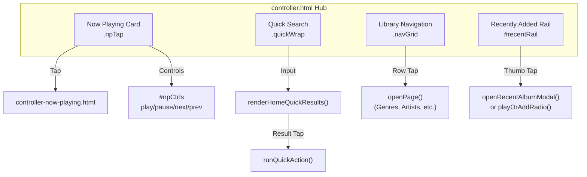
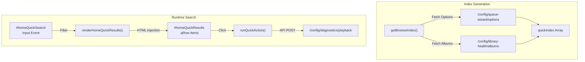

# Mobile Controller Dashboard

Relevant source files

The following files were used as context for generating this wiki page:

- [controller-ipad.html](controller-ipad.html)
- [controller-iphone.html](controller-iphone.html)
- [controller-mobile.html](controller-mobile.html)
- [controller-now-playing-grid.html](controller-now-playing-grid.html)
- [controller-now-playing-ipad.html](controller-now-playing-ipad.html)
- [controller-now-playing-tablet.html](controller-now-playing-tablet.html)
- [controller-now-playing.html](controller-now-playing.html)
- [controller.html](controller.html)
- [docs/16-mobile-builder.md](docs/16-mobile-builder.md)
- [docs/20-controller-recents-lastfm.md](docs/20-controller-recents-lastfm.md)
- [mobile.html](mobile.html)
- [src/routes/config.browse.routes.mjs](src/routes/config.browse.routes.mjs)
- [src/routes/config.controller-profile.routes.mjs](src/routes/config.controller-profile.routes.mjs)

## Overview

The Mobile Controller Dashboard (`controller.html`) is a touch-optimized interface serving as the primary hub for library browsing and playback control on mobile devices. It implements a "hub-and-spoke" navigation model, where the main dashboard connects to specialized sub-pages (spokes) for genres, artists, albums, and more.

The system features a device-specific variant architecture with optimized layouts for iPhone (`controller-mobile.html`) and iPad (`controller-tablet.html`). Configuration is managed via the Mobile Builder (`mobile.html`), which allows for real-time theme customization and profile persistence.

**Sources:** [controller.html:1-22](), [controller-mobile.html:1-21](), [mobile.html:1-55](), [docs/16-mobile-builder.md:5-18]()

---

## Page Structure & Navigation

The dashboard organizes content into four functional zones. Navigation between the hub and spokes utilizes CSS-driven slide transitions to mimic native mobile application behavior.

### Navigation Transitions
The system uses `navigateWithSlide()` [controller.html:1132]() for forward transitions, which appends `nav=slide` to the URL and triggers the `.nav-forwarding` animation [controller.html:27-35](). Destination pages like `controller-now-playing.html` detect this parameter to apply reciprocal entry animations [controller-now-playing.html:27-33]().

**Sources:** [controller.html:1132-1140](), [controller-now-playing.html:20-33](), [docs/16-mobile-builder.md:49-52]()

---

## Device Profile System

The controller adapts to hardware contexts through a centralized profile schema and dedicated redirection files.

### Device Variants
- **iPhone (`controller-iphone.html`):** Acts as a redirector that sets the `devicePreset=mobile` query parameter before forwarding to `controller-mobile.html` [controller-iphone.html:7-15]().
- **iPad (`controller-ipad.html`):** Redirects to `controller-tablet.html` with `devicePreset=tablet` [controller-ipad.html:7-15]().
- **PWA Manifests:** Distinct manifests (e.g., `manifest-controller-mobile.webmanifest`) define standalone display modes and icons [controller-mobile.html:9-15]().

### Profile Schema
Profiles are managed via `src/routes/config.controller-profile.routes.mjs` and persisted in `data/controller-profile.json` [src/routes/config.controller-profile.routes.mjs:65-82]().

| Property | Type | Description |
| :--- | :--- | :--- |
| `devicePreset` | String | `mobile` or `tablet` layout hint. |
| `recentRows` | Array | Ordered list of up to 4 sources (e.g., `albums`, `lastfm-toptracks`) [src/routes/config.controller-profile.routes.mjs:36-44](). |
| `recentCount` | Number | Quantity of items in the recent rail (6-30) [src/routes/config.controller-profile.routes.mjs:58](). |
| `customColors` | Object | Hex overrides for `primaryThemeColor`, `secondaryTextColor`, etc. [src/routes/config.controller-profile.routes.mjs:30-35](). |

**Sources:** [controller-iphone.html:1-20](), [controller-ipad.html:1-20](), [src/routes/config.controller-profile.routes.mjs:4-61](), [docs/20-controller-recents-lastfm.md:6-25]()

---

## Quick Search System

The search system uses a client-side index to provide near-instant results for artists, albums, and playlists without taxing the MPD server during every keystroke.

**Implementation Details:**
- **Index Warming:** The API server warms the browse index 1.5 seconds after startup [src/routes/config.browse.routes.mjs:140-143]().
- **Action Logic:** `runQuickAction()` supports multiple modes: playing an album, shuffling an artist's entire discography, or appending a playlist to the current queue [controller.html:1255-1280]().

**Sources:** [src/routes/config.browse.routes.mjs:139-143](), [controller.html:1223-1300](), [docs/16-mobile-builder.md:49-50]()

---

## Mobile Builder (`mobile.html`)

The Mobile Builder is a visual configuration tool used to design, preview, and deploy controller profiles.

### Configuration Flow
1. **Live Preview:** An `<iframe>` (`#controllerPreview`) loads the controller with `preview=1` to enable real-time style updates [mobile.html:93]().
2. **Preset Management:** Users can select from built-in palettes like "Deep Ocean" or "Rose Noir" [mobile.html:112-118]() or save custom JSON configurations to `localStorage` [mobile.html:110-111]().
3. **Deployment:** Tapping "Push" (`#applyBtn`) sends the profile to the backend via `POST /config/controller-profile` [mobile.html:210-230]().
4. **Onboarding:** The builder generates a "Pushed URL" [mobile.html:89]() which can be opened on mobile devices to apply the configuration instantly via URL seeding [docs/20-controller-recents-lastfm.md:38-47]().

**Sources:** [mobile.html:53-120](), [mobile.html:160-230](), [docs/20-controller-recents-lastfm.md:38-47]()

---

## Recently Added Rail & Rows

The dashboard features a dynamic horizontal content rail (`#recentRail`) that displays recently added or frequently played items.

### Data Sourcing & Caching
The backend (`src/routes/config.browse.routes.mjs`) maintains "fast caches" for various recent content types to ensure the mobile UI remains responsive:
- **Albums:** Sorted by `addedTs` [src/routes/config.browse.routes.mjs:35]().
- **Podcasts:** Sourced from the podcast subscription manager [src/routes/config.browse.routes.mjs:62-70]().
- **Last.fm Integration:** Tablet layouts can include rows for `lastfm-topartists` or `lastfm-recenttracks` [docs/20-controller-recents-lastfm.md:15-18]().

### Stability Guardrails
To prevent UI flickering and data loss during background refreshes:
- Rows are not auto-refreshed on a timer [docs/20-controller-recents-lastfm.md:53]().
- Empty fetch results never overwrite existing non-empty rendered rows [docs/20-controller-recents-lastfm.md:55]().
- Data replacement only occurs if the incoming dataset is fundamentally different [docs/20-controller-recents-lastfm.md:56]().

**Sources:** [src/routes/config.browse.routes.mjs:24-134](), [docs/20-controller-recents-lastfm.md:5-58]()

---

## Mobile Now Playing (`controller-now-playing.html`)

This page provides the full-screen transport and metadata interface, optimized for portrait viewports.

### Key Features
- **Phone UI Grid:** When the `phone-ui` class is active, the layout switches to a single-column grid with specific areas for `back`, `art`, `progress`, and `controls` [controller-now-playing.html:104-127]().
- **Brass Ring Controls:** The transport buttons use a "brass-ring" aesthetic with high-contrast active states and backdrop blurs [controller-now-playing.html:88-91]().
- **Iframe Optimization:** Detects if running as a preview inside `mobile.html` to adjust background layers and visibility for performance [controller-now-playing.html:35-57]().
- **BFCache Resilience:** Implements logic to ensure the transport state and progress bar remain synchronized when navigating back through browser history.

**Sources:** [controller-now-playing.html:19-140](), [controller-now-playing-grid.html:75-112](), [docs/16-mobile-builder.md:43-51]()
