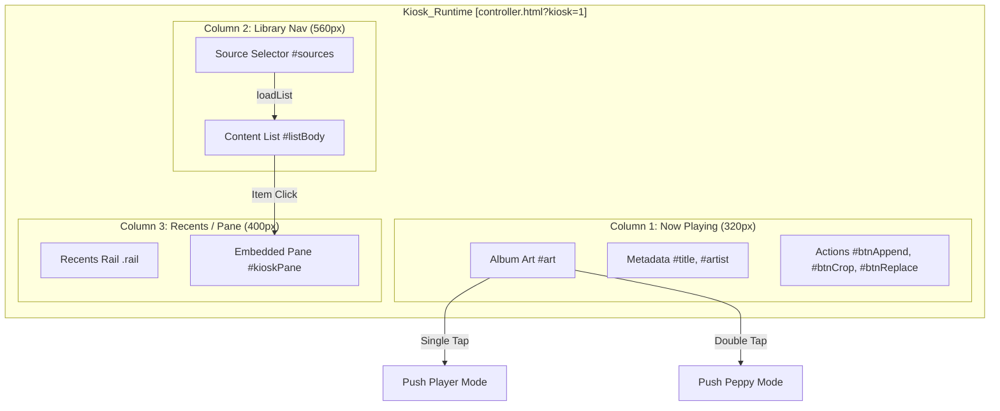
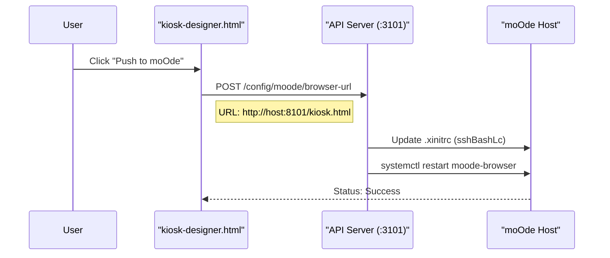

# Kiosk Mode

<details>
<summary>Relevant source files</summary>

The following files were used as context for generating this wiki page:

- [README.md](README.md)
- [controller-kiosk.html](controller-kiosk.html)
- [display.html](display.html)
- [displays.html](displays.html)
- [docs/14-display-enhancement.md](docs/14-display-enhancement.md)
- [docs/18-kiosk.md](docs/18-kiosk.md)
- [docs/19-visualizer.md](docs/19-visualizer.md)
- [docs/images/kioskred.jpg](docs/images/kioskred.jpg)
- [docs/images/readme-spectrum.jpg](docs/images/readme-spectrum.jpg)
- [kiosk-albums.html](kiosk-albums.html)
- [kiosk-artists.html](kiosk-artists.html)
- [kiosk-designer.html](kiosk-designer.html)
- [kiosk-queue.html](kiosk-queue.html)
- [kiosk.html](kiosk.html)
- [manifest-controller-ipad.webmanifest](manifest-controller-ipad.webmanifest)
- [manifest-controller-iphone.webmanifest](manifest-controller-iphone.webmanifest)
- [manifest-controller-mobile.webmanifest](manifest-controller-mobile.webmanifest)
- [manifest-controller.webmanifest](manifest-controller.webmanifest)
- [visualizer.html](visualizer.html)

</details>


**Kiosk Mode** is a specialized 1280×400 pixel landscape layout optimized for dedicated horizontal touchscreen displays, such as those used in custom moOde player enclosures. It provides a compact three-column interface that integrates now-playing status, library navigation, and a dynamic content rail into a single, always-on control surface.

---

## Layout Architecture

The kiosk interface is primarily implemented within `controller.html` using a CSS Grid system triggered by the `kiosk=1` URL parameter [docs/18-kiosk.md:35-37](). It also utilizes a "Designer" wrapper (`kiosk-designer.html`) for visual tuning and deployment [kiosk-designer.html:6-71]().

### Grid Structure



**Sources**: [controller-kiosk.html:10-24](), [docs/18-kiosk.md:40-54](), [kiosk.html:66-78]()

### Column Responsibilities

| Column | Content | Implementation |
| :--- | :--- | :--- |
| **Now Playing** | Large album art, track info, and transport actions. | `section.pane` with `#art`, `#title`, `#artist` [controller-kiosk.html:48-61]() |
| **Library Nav** | Source buttons (Library, Radio, Podcasts, Playlists, YouTube, Queue) and scrollable list. | `#sources` and `#listBody` [controller-kiosk.html:28-47]() |
| **Recents / Pane** | Default: 4x2 grid of recent items. Active: Embedded sub-page (`kiosk-*.html`). | `.rail` and `#kioskPane` [docs/18-kiosk.md:48-54]() |

---

## Designer and Profile Management

The `kiosk-designer.html` page provides a "Builder-First" environment where users can visually tune the kiosk's appearance, manage presets, and push those settings to the moOde hardware [kiosk-designer.html:44-69]().

### Kiosk Profile Schema
Settings are persisted in `localStorage` under the key `nowplaying.kiosk.profile.v1` [kiosk.html:14]().

```json
{
  "theme": "auto",
  "colorPreset": "ocean",
  "recentSource": "albums",
  "customColors": {
    "primaryThemeColor": "#0b111c",
    "secondaryThemeColor": "#1f2a3d",
    "primaryTextColor": "#f3f6ff",
    "secondaryTextColor": "#9eb3d6"
  },
  "ts": 1710240000000
}
```

**Sources**: [kiosk-designer.html:98-109](), [kiosk.html:40-51]()

### Theme Persistence Flow
When `kiosk.html` is loaded, it resolves the theme from URL parameters or the saved profile, then syncs it to the mobile profile (`nowplaying.mobile.profile.v1`) so all internal embedded pages inherit the same palette [kiosk.html:29-64](). This prevents color mismatch between the kiosk surface and embedded internal pages [docs/18-kiosk.md:125-134]().

---

## Embedded Sub-Pages

Kiosk mode uses a "Shell and Pane" architecture. Selecting a category in the middle column opens a corresponding `kiosk-*.html` page in the third column's pane.

### Internal Page Naming Convention
These pages are typically thin wrappers that redirect to the corresponding `controller-*.html` pages with specific kiosk-optimized parameters [docs/18-kiosk.md:56-70]().

| Kiosk Page | Target Page | Purpose |
| :--- | :--- | :--- |
| `kiosk-albums.html` | `controller-albums.html` | Browsing album library (excludes podcasts) [kiosk-albums.html:1](), [docs/18-kiosk.md:143]() |
| `kiosk-artists.html` | `controller-artists.html` | Browsing artist list [kiosk-artists.html:1]() |
| `kiosk-queue.html` | `controller-queue.html` | Live queue management [docs/18-kiosk.md:68]() |
| `kiosk-radio.html` | `controller-radio.html` | Radio station browser [docs/18-kiosk.md:66]() |

**Sources**: [docs/18-kiosk.md:58-70](), [kiosk-albums.html:1](), [kiosk-artists.html:1]()

---

## Gesture Controls and Mode Switching

The Now Playing artwork serves as a hidden navigation hub for switching between display modes without using a keyboard or mouse [docs/18-kiosk.md:74-81]().

### Artwork Interactions
| Action | Result | Implementation |
| :--- | :--- | :--- |
| **Single Tap** | Push **Player** display mode. | `push-player` action [docs/18-kiosk.md:78](), [displays.html:126-147]() |
| **Double Tap** | Push **Peppy** display mode. | `push-peppy` action [docs/18-kiosk.md:79](), [displays.html:149-165]() |
| **Tap (in Peppy/Player)** | Return to Kiosk Mode. | Routes back to `kiosk.html` [docs/18-kiosk.md:81]() |

**Sources**: [docs/18-kiosk.md:76-81](), [displays.html:126-165]()

---

## Push-to-moOde Flow

The "Push to moOde" button in `kiosk-designer.html` or `displays.html` automates the configuration of the moOde local display by updating the browser target URL via the API [displays.html:110-124]().

### Deployment Logic



**Sources**: [kiosk-designer.html:125-140](), [displays.html:110-124](), [docs/18-kiosk.md:7-25]()

### Target Verification
The `kiosk-designer.html` interface performs a runtime check against the API to verify if the moOde hardware is correctly pointing to the local kiosk target [kiosk-designer.html:142-160]().

---

## Display Routing

When moOde is configured with a generic enhancement URL, it typically points to `display.html?kiosk=1`. This router acts as a traffic controller, loading the correct renderer based on the `last-profile` state [display.html:15-32]().

### Router Logic (`display.html`)
1. Fetches the last pushed profile from `GET /peppy/last-profile` [display.html:26]().
2. If `mode === 'moode'`, it redirects to the native moOde Web UI [display.html:34-37]().
3. If `mode === 'player'`, it redirects to `player-render.html` with saved size parameters [display.html:38-45]().
4. If `mode === 'visualizer'`, it loads `visualizer.html` with saved energy/motion/glow parameters [display.html:46-68]().
5. If `mode === 'peppy'`, it loads `peppy.html` with the specified skin and theme [display.html:74-79]().

**Sources**: [display.html:15-80](), [docs/14-display-enhancement.md:107-113]()
