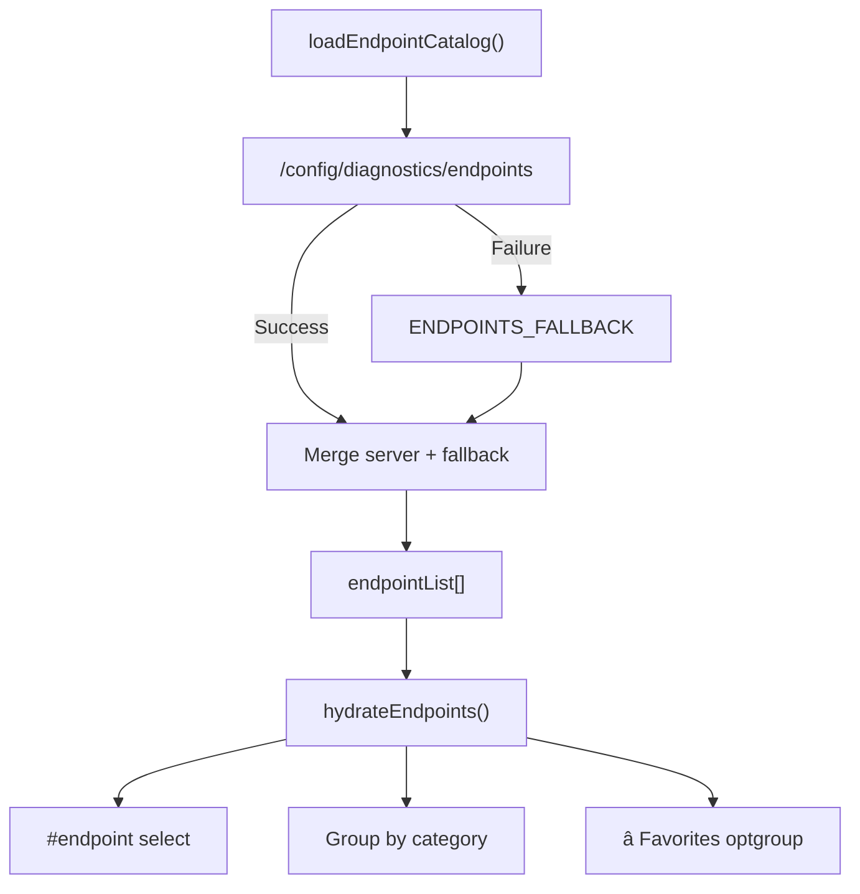
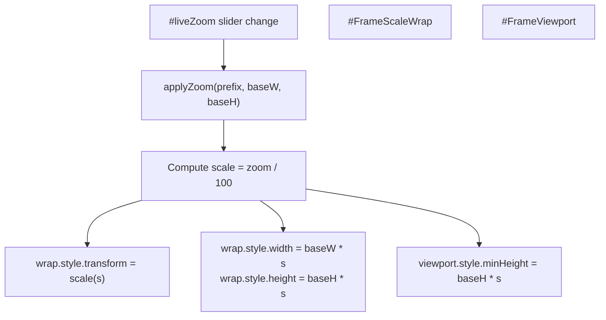
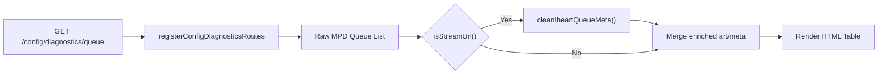
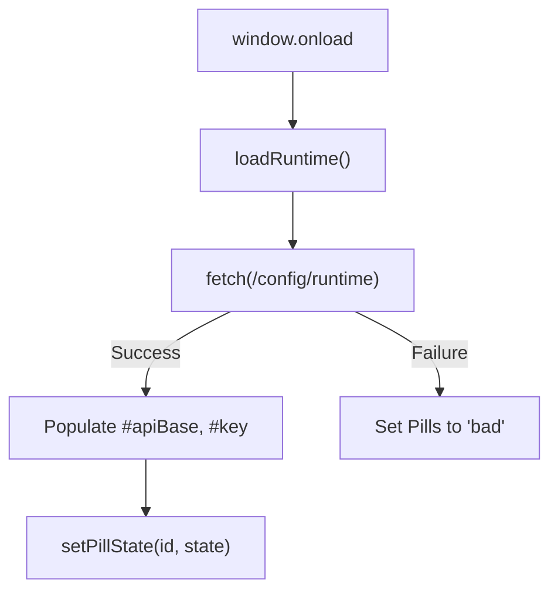

# Diagnostics Interface

Relevant source files

The following files were used as context for generating this wiki page:

- [diagnostics.html](diagnostics.html)
- [queue-wizard.html](queue-wizard.html)
- [scripts/diagnostics.js](scripts/diagnostics.js)
- [scripts/queue-wizard.js](scripts/queue-wizard.js)
- [src/routes/config.diagnostics.routes.mjs](src/routes/config.diagnostics.routes.mjs)
- [styles/podcasts.css](styles/podcasts.css)

The diagnostics interface (`diagnostics.html`) provides a comprehensive testing and debugging tool for the now-playing API. It combines endpoint testing, live UI previews with a specialized scaling engine, queue inspection, and runtime verification in a single administrative interface. This page is intended for developers and system administrators who need to test API routes, debug integration issues, or verify system configuration.

For queue building workflows, see [Queue Wizard Interface](4.1). For system configuration, see [Configuration Interface](10.1).

---

## Overview

The diagnostics interface serves four primary functions:

| Function | Purpose | Key Features |
|----------|---------|--------------|
| **Endpoint Testing** | Execute API requests with custom parameters | Catalog of 90+ endpoints, favorites, POST body editing, curl export |
| **Live UI Previews** | Preview all UI pages in embedded iframes | Desktop, player, Peppy, mobile, kiosk views with scaling engine |
| **Queue Inspection** | View and manipulate the current queue | Transport controls, rating, reordering, removal, stream enrichment |
| **Runtime Verification** | Verify system connectivity and configuration | Status pills for API, web server, Alexa, and moOde host |

The interface auto-detects configuration from `/config/runtime` and adjusts API base URLs, track keys, and port numbers accordingly. [scripts/diagnostics.js:301-344]()

**Sources:** [diagnostics.html:1-324](), [scripts/diagnostics.js:1-100]()

---

## Endpoint Testing System

### Endpoint Catalog

The diagnostics interface loads a comprehensive endpoint catalog from `/config/diagnostics/endpoints` at startup, falling back to a hardcoded list of 90+ endpoints if the API is unavailable. [scripts/diagnostics.js:8-96]()

Title: Endpoint Discovery and Hydration

Each endpoint entry contains:
- `name`: Display name (e.g., "/now-playing")
- `method`: HTTP method (GET/POST)
- `path`: API path with optional placeholders (e.g., `/config/queue-wizard/vibe-status/<jobId>`)
- `body`: Default POST body (optional JSON object)

**Sources:** [scripts/diagnostics.js:8-96](), [scripts/diagnostics.js:156-185]()

### Filtering and State Persistence

Users can filter endpoints by typing in the `#endpointFilter` input. This search is performed across group name, method, endpoint name, and path. [scripts/diagnostics.js:479-547]()

State is managed via `localStorage` to maintain context across reloads:

| Key | Code Entity | Purpose |
|-----|-------------|---------|
| `diagnostics:favorites:v1` | `FAV_KEY` | User-starred endpoints displayed in the top group |
| `diagnostics:endpointFilter:v1` | `FILTER_KEY` | Last used search string in the filter input |
| `diagnostics:lastEndpoint:v1` | `LAST_KEY` | The most recently selected endpoint from the list |
| `diagnostics:requestState:v1` | `STATE_KEY` | Custom overrides for path, method, and POST body |

**Sources:** [scripts/diagnostics.js:100-140](), [scripts/diagnostics.js:799-807](), [scripts/diagnostics.js:820-837]()

### Request Execution and cURL Export

The `run()` function executes the configured API request. [scripts/diagnostics.js:549-609]() If the response is an image (e.g., `/art/current.jpg`), it is rendered in `#imageOut`. [scripts/diagnostics.js:598-601]() Otherwise, the JSON response is pretty-printed in the `#out` pre-block. [scripts/diagnostics.js:603-605]()

The interface includes a `copyAsCurl()` function that generates a valid shell command, including the `x-track-key` header if enabled. [scripts/diagnostics.js:781-797]()

**Sources:** [scripts/diagnostics.js:549-609](), [scripts/diagnostics.js:781-797]()

---

## Live Preview Scaling Engine

The diagnostics interface embeds multiple UI pages in iframes. Because these pages are designed for specific hardware (e.g., 1280x400 kiosks or 430x932 mobile phones), the interface uses a CSS `transform: scale()` engine to fit them into the dashboard.

Title: Iframe Scaling Logic

### Preview Catalog

| Preview | Frame ID | Source File | Native Resolution |
|---------|----------|-------------|-------------------|
| Desktop | `#liveFrame` | `index.html` | 1920 x 1080 |
| Player | `#playerFrame` | `player.html` | 1280 x 400 |
| Peppy | `#peppyFrame` | `peppy.html` | 1280 x 400 |
| Mobile | `#mobileFrame` | `controller.html` | 430 x 932 |
| Kiosk | `#kioskFrame` | `kiosk.html` | 1280 x 400 |

**Sources:** [diagnostics.html:179-287](), [scripts/diagnostics.js:214-244]()

---

## Queue Inspection and Enrichment

The `loadQueue()` function fetches the current MPD queue via the backend route `registerConfigDiagnosticsRoutes` at `/config/diagnostics/queue`. [scripts/diagnostics.js:411-477](), [src/routes/config.diagnostics.routes.mjs:171-200]()

### Stream Enrichment Pipeline
When a radio stream is detected in the queue via `isStreamUrl()`, the diagnostics interface performs an extra enrichment step. It cleans metadata using `cleanIheartQueueMeta()` and resolves station logos via `stationLogoUrlFromAlbum()` to provide a richer preview than MPD's basic socket output. [src/routes/config.diagnostics.routes.mjs:9-40](), [scripts/diagnostics.js:417-424]()

Title: Queue Data Flow and Enrichment

### Interactive Controls
The queue list is interactive, supporting the following actions via the `sendPlayback()` helper which targets the `/config/diagnostics/playback` endpoint: [scripts/diagnostics.js:627-738](), [src/routes/config.diagnostics.routes.mjs:21-22]()
- **Reordering**: Move items up or down in the queue.
- **Removal**: Delete specific positions.
- **Rating**: 5-star rating widget that updates MPD stickers via `setRatingForFile`. [scripts/diagnostics.js:385-398](), [src/routes/config.diagnostics.routes.mjs:172-172]()
- **Radio Favorites**: Toggle heart icon for radio stations using the `moode-sqlite3.db` bridge. [scripts/diagnostics.js:714-729](), [src/routes/config.diagnostics.routes.mjs:132-132]()

**Sources:** [scripts/diagnostics.js:411-477](), [scripts/diagnostics.js:627-738](), [src/routes/config.diagnostics.routes.mjs:1-190]()

---

## Runtime Verification

The interface features a "Runtime Status" rail with color-coded status pills. [diagnostics.html:163-173]()

| Pill | Logic | Source |
|------|-------|--------|
| **API** | Green if `/config/runtime` returns 200 | `apiPill` |
| **Web** | Green if UI port (8101) is reachable | `webPill` |
| **Alexa** | Green if `config.alexa.enabled` is true | `alexaPill` |
| **moOde** | Green if `MOODE_SSH_HOST` is configured | `moodePill` |

Title: Runtime Verification Logic

**Sources:** [scripts/diagnostics.js:187-212](), [scripts/diagnostics.js:301-344](), [diagnostics.html:163-173](), [src/routes/config.diagnostics.routes.mjs:4-4]()
