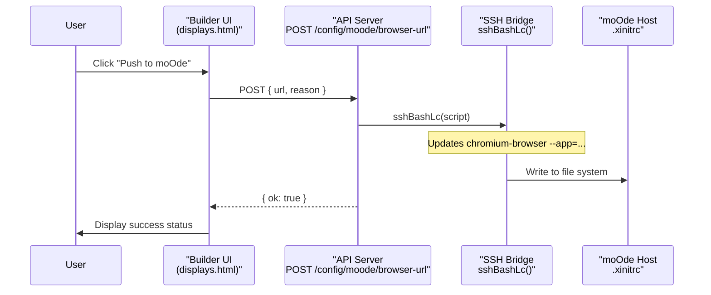
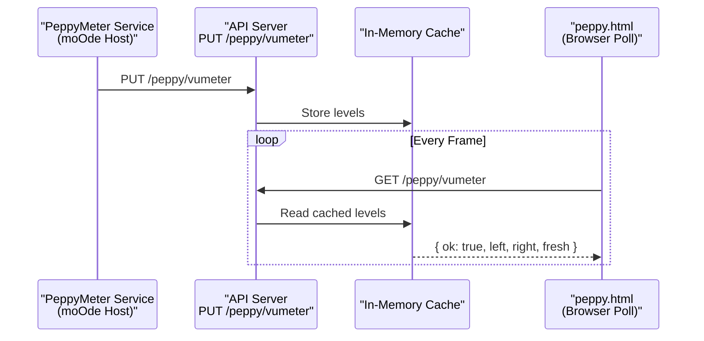

# Display Enhancement System

<details>
<summary>Relevant source files</summary>

The following files were used as context for generating this wiki page:

- [README.md](README.md)
- [app.html](app.html)
- [controller-kiosk.html](controller-kiosk.html)
- [display.html](display.html)
- [displays.html](displays.html)
- [docs/14-display-enhancement.md](docs/14-display-enhancement.md)
- [docs/18-kiosk.md](docs/18-kiosk.md)
- [docs/19-visualizer.md](docs/19-visualizer.md)
- [docs/images/kioskred.jpg](docs/images/kioskred.jpg)
- [docs/images/readme-spectrum.jpg](docs/images/readme-spectrum.jpg)
- [kiosk-designer.html](kiosk-designer.html)
- [peppy.html](peppy.html)
- [src/routes/config.runtime-admin.routes.mjs](src/routes/config.runtime-admin.routes.mjs)
- [styles/hero.css](styles/hero.css)
- [theme.html](theme.html)
- [visualizer.html](visualizer.html)

</details>


## Purpose and Scope

The Display Enhancement System provides a **builder-first** visual display framework for moOde audio players. Users design complete display compositions (meter geometry, typography, themes, metadata layouts) in web-based builder interfaces, then push those configurations to moOde's Chromium display via a stable router URL. The system supports three primary display modes: Peppy meters (VU/spectrum visualization), Player layouts (now-playing displays), and audio-reactive Visualizers.

This system operates independently of moOde's native PeppyMeter installation. For details on configuring moOde's SSH connection and path verification, see [Configuration & Administration](#10). For theming customization, see [Theme & Customization](#8).

**Sources:** [docs/14-display-enhancement.md:1-73](), [README.md:42-65]()

---

## Architecture Overview

The display enhancement system follows a three-phase architecture: **build**, **push**, and **render**. Unlike traditional meter skins that separate audio visualization from metadata display, this system treats the entire visual composition as a unified profile.

### Natural Language to Code Entity Mapping (Architecture)

```mermaid
graph TB
    subgraph "Phase 1: Build (Natural Language)"
        "Peppy Designer" --> PEPPY_BUILD["peppy.html<br/>(Builder Mode)"]
        "Player Designer" --> PLAYER_BUILD["player.html<br/>(Builder)"]
        "Visualizer Designer" --> VIZ_BUILD["visualizer.html<br/>(Config Preview)"]
    end
    
    subgraph "Phase 2: Push (Code Entities)"
        PUSH_ACTION["Push Action<br/>(pushUrl function)"]
        PROFILE_API["POST /peppy/last-profile"]
        PROFILE_JSON["data/peppy-last-push.json"]
        SSH_UPDATE["sshBashLc()<br/>(Update .xinitrc)"]
        XINITRC[".xinitrc<br/>(--app=URL)"]
    end
    
    subgraph "Phase 3: Render (Execution)"
        DISPLAY_ROUTER["display.html<br/>(Router Script)"]
        PROFILE_QUERY["GET /peppy/last-profile"]
        MODE_DETECT["displayMode Detection"]
        PEPPY_RENDER["peppy.html?kiosk=1"]
        PLAYER_RENDER["player-render.html"]
        VIZ_RENDER["visualizer.html"]
        MOODE_NATIVE["index.php"]
    end
    
    PEPPY_BUILD --> PUSH_ACTION
    PLAYER_BUILD --> PUSH_ACTION
    VIZ_BUILD --> PUSH_ACTION
    
    PUSH_ACTION --> PROFILE_API
    PROFILE_API --> PROFILE_JSON
    PROFILE_API --> SSH_UPDATE
    SSH_UPDATE --> XINITRC
    
    XINITRC --> DISPLAY_ROUTER
    DISPLAY_ROUTER --> PROFILE_QUERY
    PROFILE_QUERY --> PROFILE_JSON
    PROFILE_JSON --> MODE_DETECT
    
    MODE_DETECT -->|"displayMode='peppy'"| PEPPY_RENDER
    MODE_DETECT -->|"displayMode='player'"| PLAYER_RENDER
    MODE_DETECT -->|"displayMode='visualizer'"| VIZ_RENDER
    MODE_DETECT -->|"displayMode='moode'"| MOODE_NATIVE
```

**Key Principle:** Users set moOde's local display URL **once** to the stable router (`display.html?kiosk=1`). Mode switching then occurs via app push actions that update the profile JSON, not by repeatedly changing moOde's configuration.

**Sources:** [docs/14-display-enhancement.md:43-103](), [peppy.html:1-30](), [src/routes/config.runtime-admin.routes.mjs:10-82](), [display.html:14-80]()

---

## Display Modes

The system supports four display modes stored in the `displayMode` field of the profile JSON:

| Display Mode | Renderer | Purpose | Configuration Source |
|--------------|----------|---------|---------------------|
| `peppy` | `peppy.html?kiosk=1` | VU meters (circular/linear) or spectrum visualization with metadata overlay | `peppy.html` builder controls |
| `player` | `player-render.html` | Now-playing display with album art, transport controls, and customizable backgrounds | `player.html` builder |
| `visualizer` | `visualizer.html` | Audio-reactive visual effects with preset-based configuration | `visualizer.html` internal config |
| `moode` | `http://moode.local/index.php` | Native moOde web interface | N/A (fallback) |

**Sources:** [docs/14-display-enhancement.md:96-103](), [display.html:14-80]()

---

## Builder-First Design Pattern

### Peppy Builder Configuration

The Peppy builder (`peppy.html`) exposes comprehensive controls for meter composition. All settings are stored in the profile JSON and applied atomically when rendering.

### Code Entity Mapping (Peppy Parameters)

```mermaid
graph LR
    subgraph "UI Elements (Natural Language)"
        "Meter Style" --> METER_TYPE["meterType<br/>(circular | linear | spectrum)"]
        "Skin Art" --> SKIN["skin<br/>(blue-1280, gold-1280, etc)"]
        "Audio Reactivity" --> SENS["sensitivity<br/>(multiplier)"]
        "Visual Smoothing" --> SMOOTH["smoothing<br/>(low-pass filter)"]
        "Typography" --> FONT_STYLE["fontStyle<br/>(dot-matrix | ui-sans)"]
    end
    
    subgraph "Code Logic (peppy.html)"
        METER_TYPE -->|"updates"| CANVAS_DRAW["drawMeter()"]
        SKIN -->|"loads"| ASSET_LOAD["loadSkinAssets()"]
        SENS -->|"scales"| VU_VAL["VU_LEVEL * sensitivity"]
        SMOOTH -->|"averages"| VU_BUFFER["VU_BUFFER_ARRAY"]
    end
```

**Profile Storage Format:**
The profile JSON stored at `data/peppy-last-push.json` contains the current state of the pushed display. This allows `display.html` to restore the correct mode even after a browser restart on the moOde side.

**Sources:** [peppy.html:105-364](), [docs/14-display-enhancement.md:104-153](), [display.html:25-32]()

---

## Push Action Flow

When a user clicks "Push Peppy to moOde" or "Push Player to moOde", the system executes an SSH command to update the moOde `.xinitrc` file.



**SSH Command Execution:**
The push action updates moOde's display target via SSH using the `sshBashLc()` utility function. This function wraps SSH calls with `BatchMode=yes` and `ConnectTimeout=6` to ensure reliable execution.

**Sources:** [src/routes/config.runtime-admin.routes.mjs:132-151](), [docs/14-display-enhancement.md:165-172](), [displays.html:110-124]()

---

## Display Router (display.html)

The router performs mode detection on every page load by querying the last-pushed profile from the API. This eliminates the need to repeatedly update moOde's Chromium configuration when switching between display modes.

**Query Parameters Propagation:**
The router constructs URL query parameters from the profile JSON to pass configuration to renderers:
- `skin`, `theme` → `peppy.html` [display.html:74-79]()
- `size` → `player-render.html` [display.html:38-44]()
- `preset`, `energy`, `motion`, `glow` → `visualizer.html` [display.html:46-67]()

**Sources:** [display.html:14-80](), [docs/14-display-enhancement.md:96-103]()

---

## Audio Data Pipeline

The Peppy renderer does not read ALSA directly in the browser. Instead, moOde's PeppyMeter and PeppyALSA services post audio data to the API via HTTP, which the UI then polls.

### VU Meter Data Flow



**Important:** The native fullscreen PeppyMeter spectrum renderer and the HTTP spectrum bridge **cannot** simultaneously read from `/tmp/peppyspectrum`.

**Sources:** [docs/14-display-enhancement.md:15-42](), [README.md:76-95]()

---

## Screen Profiles and Responsive Layout

The Peppy builder supports multiple screen profiles with different dimensions and layout adaptations.

| Profile | Dimensions | Layout Strategy |
|---------|-----------|-----------------|
| 1280x400 | 1280×400px | Compact: art top-left, LED strip, single-row controls [peppy.html:79-85]() |
| 1024x600 | 1024×600px | Flexible layout for medium tablets |
| 800x480 | 800×480px | Standard dual-column layout |
| 480x320 | 480×320px | Minimal mobile-sized layout |

**Sources:** [peppy.html:13-30](), [docs/14-display-enhancement.md:237-260]()

---

## Child Pages

- [Overview & Push Model](#3.1) — Detailed look at `display.html` and the SSH push mechanism.
- [Peppy Builder & Renderer](#3.2) — Meter types, skins, and the canvas rendering pipeline.
- [Player Builder & Renderer](#3.3) — Hardware-specific now-playing layouts and CSS class system.
- [Display Router (display.html)](#3.4) — The routing logic that enables seamless mode switching.
- [Audio Data Pipeline](#3.5) — VU and spectrum data flow from ALSA to the browser.
- [Peppy Skin Assets & Export](#3.6) — Skin catalog structure and the export/deploy workflow.
