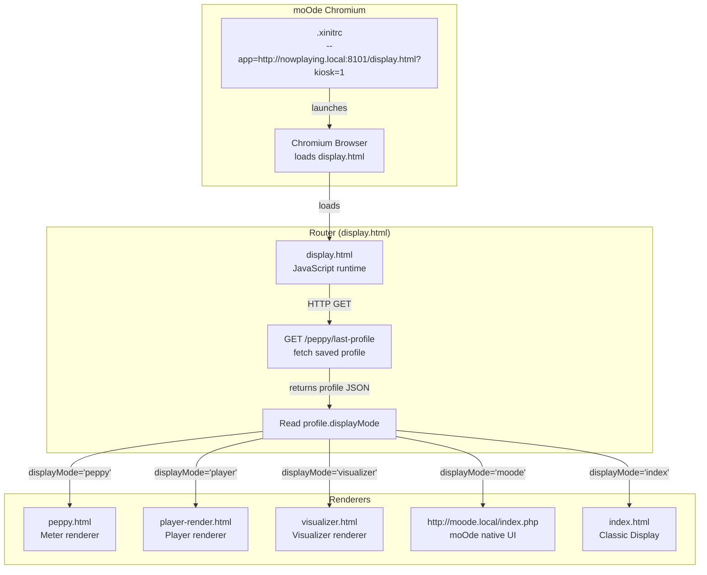
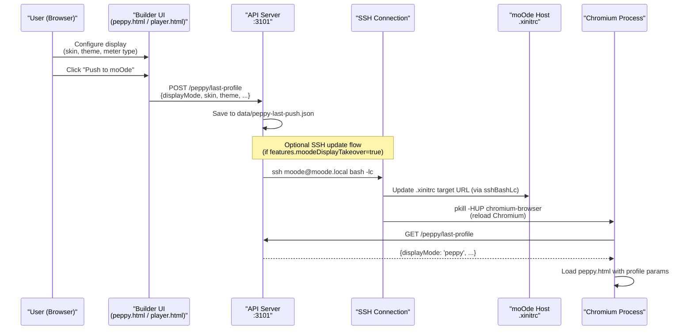
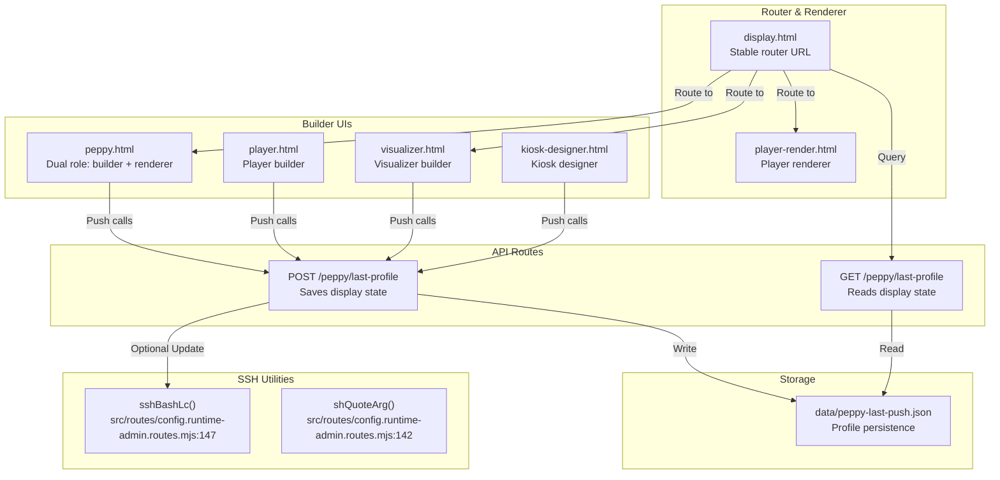

# Overview & Push Model

<details>
<summary>Relevant source files</summary>

The following files were used as context for generating this wiki page:

- [README.md](README.md)
- [app.html](app.html)
- [controller-kiosk.html](controller-kiosk.html)
- [display.html](display.html)
- [displays.html](displays.html)
- [docs/14-display-enhancement.md](docs/14-display-enhancement.md)
- [docs/18-kiosk.md](docs/18-kiosk.md)
- [docs/19-visualizer.md](docs/19-visualizer.md)
- [docs/images/kioskred.jpg](docs/images/kioskred.jpg)
- [docs/images/readme-spectrum.jpg](docs/images/readme-spectrum.jpg)
- [kiosk-designer.html](kiosk-designer.html)
- [peppy.html](peppy.html)
- [src/routes/config.runtime-admin.routes.mjs](src/routes/config.runtime-admin.routes.mjs)
- [styles/hero.css](styles/hero.css)
- [theme.html](theme.html)
- [visualizer.html](visualizer.html)

</details>


This page documents the **stable router pattern** and **push model** that enable seamless display mode switching for moOde's local Chromium display without repeatedly updating moOde's configuration.

**Scope:** This page covers the router architecture (`display.html`), profile storage mechanism (`/peppy/last-profile`), and SSH-based push flow. For details on individual display renderers, see [Peppy Builder & Renderer]() (3.2), [Player Builder & Renderer]() (3.3), and the [Display Router (display.html)]() (3.4). For audio data pipeline details, see [Audio Data Pipeline]() (3.5).

---

## Problem Statement

moOde's local display configuration requires setting a **Web UI target URL** in:
```
Configure → Peripherals → Local display → Web UI target URL
```

Traditional approach: change this URL each time you want to switch between Player, Peppy meter, Visualizer, or moOde's native UI. This requires:
- SSH access to moOde
- Manual editing of `/home/moode/.xinitrc`
- Chromium restart or system reboot

**Solution:** Set moOde's target URL **once** to a stable router endpoint, then switch display modes via API-driven profile updates that the router resolves dynamically.

---

## Stable Router URL Pattern

### Recommended moOde Configuration

Set moOde's Web UI target URL to:
```
http://<WEB_HOST>:8101/display.html?kiosk=1
```

Example (mDNS-friendly):
```
http://nowplaying.local:8101/display.html?kiosk=1
```

**Key insight:** `display.html` does **not** render content directly. It acts as a **mode resolver** that queries the last saved profile and redirects to the appropriate renderer.

**Sources:** [README.md:45-58](), [docs/14-display-enhancement.md:84-94](), [display.html:15-32]()

---

## Router Resolution Flow

The router acts as a traffic controller for the moOde local display, ensuring that a single entry point can serve multiple distinct UI experiences.

Title: Display Mode Resolution Flow


**Sources:** [docs/14-display-enhancement.md:107-113](), [display.html:34-79](), [src/routes/config.runtime-admin.routes.mjs:79-79]()

---

## Profile Storage Mechanism

### API Endpoint: `/peppy/last-profile`

**GET `/peppy/last-profile`**

Returns the most recently saved display profile. This is the primary state source for the `display.html` router.

**POST `/peppy/last-profile`**

Saves a new display profile. This endpoint is called by builders (`peppy.html`, `player.html`, `visualizer.html`, `kiosk-designer.html`) when the user clicks a "Push" action.

**Storage location:** `data/peppy-last-push.json`

**Profile fields:**

| Field | Description |
|-------|-------------|
| `displayMode` | `peppy`, `player`, `visualizer`, `moode`, or `index` |
| `skin` | Peppy meter skin identifier (e.g. `blue-1280`) |
| `theme` | Theme preset name for the display |
| `playerSize` | Hardware target size (e.g., `1280x400`) |
| `visualizer` | Object containing `preset`, `energy`, `motion`, and `glow` |

**Sources:** [docs/14-display-enhancement.md:107-113](), [display.html:25-32](), [displays.html:138-142](), [kiosk-designer.html:98-112]()

---

## Push Flow Architecture

Title: Push-to-moOde Sequence


**Sources:** [docs/14-display-enhancement.md:99-106](), [src/routes/config.runtime-admin.routes.mjs:147-152](), [displays.html:110-124]()

---

## SSH Bridge for moOde Updates

The system uses an SSH bridge to remotely manage the moOde display configuration and process state.

**Function: `sshBashLc`**
Defined in `src/routes/config.runtime-admin.routes.mjs:147-152`, this utility executes commands on the moOde host using a login shell (`bash -lc`) to ensure environment variables are correctly loaded.

**SSH Configuration:**
- `BatchMode=yes`: Prevents interactive password prompts [src/routes/config.runtime-admin.routes.mjs:135]().
- `ConnectTimeout=6`: Ensures the UI doesn't hang indefinitely on network issues [src/routes/config.runtime-admin.routes.mjs:136]().

**Sources:** [src/routes/config.runtime-admin.routes.mjs:133-152](), [README.md:63-67]()

---

## Code Entity Map: Key Files and Routes

Title: Display System Entity Map


**Sources:** [src/routes/config.runtime-admin.routes.mjs:133-152](), [docs/14-display-enhancement.md:9-14](), [display.html:15-81]()

---

## Config Flag: moodeDisplayTakeover

**Location:** `config.html` (Key: `features.moodeDisplayTakeover`)

When enabled, the application shell exposes "Push" buttons that trigger the SSH update flow. When disabled, the Peppy/Player display flows are hidden from the navigation rail, and the system assumes the user will manually manage the moOde display target.

**Sources:** [src/routes/config.runtime-admin.routes.mjs:79-79](), [docs/14-display-enhancement.md:7-14]()

---

## Verification Commands

### Check moOde Target URL
Verify that moOde is pointing to the stable router:
```bash
grep -E -- '--app=' /home/moode/.xinitrc
```

### Check Chromium Process
Confirm Chromium is running with the correct `--app` parameter:
```bash
pgrep -af "chromium-browser.*--app="
```

**Sources:** [README.md:69-74](), [docs/18-md:20-25]()
