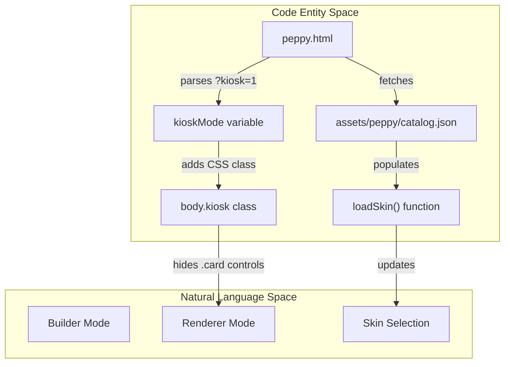
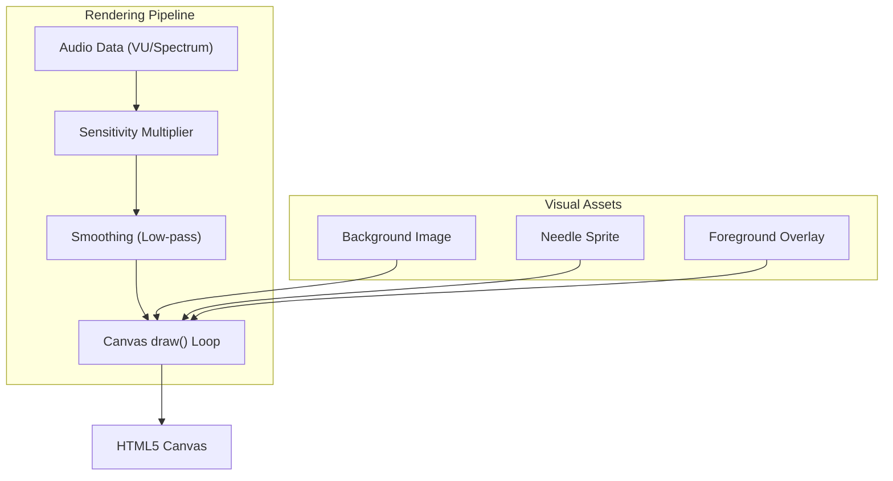

# Peppy Builder & Renderer

Relevant source files

The following files were used as context for generating this wiki page:

- [app.html](app.html)
- [assets/peppy/catalog.json](assets/peppy/catalog.json)
- [assets/peppy/gold-1280-bgr.png](assets/peppy/gold-1280-bgr.png)
- [assets/peppy/gold-1280-fgr.png](assets/peppy/gold-1280-fgr.png)
- [assets/peppy/gold-1280-needle.png](assets/peppy/gold-1280-needle.png)
- [assets/peppy/orange-1280-bgr.png](assets/peppy/orange-1280-bgr.png)
- [assets/peppy/orange-1280-fgr.png](assets/peppy/orange-1280-fgr.png)
- [assets/peppy/orange-1280-needle.png](assets/peppy/orange-1280-needle.png)
- [assets/peppy/red-1280-bgr.png](assets/peppy/red-1280-bgr.png)
- [assets/peppy/red-1280-fgr.png](assets/peppy/red-1280-fgr.png)
- [assets/peppy/red-1280-needle.png](assets/peppy/red-1280-needle.png)
- [assets/peppy/tube-1280-bgr.png](assets/peppy/tube-1280-bgr.png)
- [assets/peppy/tube-1280-fgr.png](assets/peppy/tube-1280-fgr.png)
- [assets/peppy/tube-1280-needle.png](assets/peppy/tube-1280-needle.png)
- [assets/peppy/white-red-1280-bgr.png](assets/peppy/white-red-1280-bgr.png)
- [assets/peppy/white-red-1280-needle.png](assets/peppy/white-red-1280-needle.png)
- [peppy.html](peppy.html)
- [src/routes/config.runtime-admin.routes.mjs](src/routes/config.runtime-admin.routes.mjs)
- [styles/hero.css](styles/hero.css)
- [theme.html](theme.html)

`peppy.html` is a dual-purpose technical interface within the now-playing ecosystem. It functions as both a visual configuration builder for designing meter compositions and a high-performance runtime renderer for VU meters and spectrum analyzers on moOde local displays.

---

## Overview and Dual-Purpose Architecture

`peppy.html` serves two distinct roles depending on how it is accessed and the environment variables provided:

| Mode | URL Pattern | Purpose |
|------|-------------|---------|
| **Builder** | `peppy.html` (standalone) or embedded in `app.html` | Interactive configuration UI for designing meter compositions with live preview and preset management. |
| **Renderer** | `peppy.html?kiosk=1` or `peppy.html?display=1` | Fullscreen display mode for moOde Chromium, rendering meters/spectrum without builder UI. |

The file contains the configuration controls, asset loading logic, and the canvas rendering engine, allowing users to preview their exact configuration in the builder before pushing to the moOde hardware display.

**Sources:** [peppy.html:1-7]()

---

## Mode Detection and UI Visibility

The page detects its operational mode using URL query parameters and DOM state. This determines whether to show the "Setup" cards or only the "Preview Stage."

### System Entity Mapping

Key mode variables:
- **`kioskMode`**: Set when `kiosk=1` or `display=1` query parameter is present. This triggers the removal of configuration sidebars and expands the meter canvas to fill the viewport.
- **`adminMode`**: Set when `admin=1` is present, enabling advanced diagnostic overlays.
- **`body.screen-1280x400`**: A CSS class applied to optimize the layout for the standard Waveshare 1280x400 kiosk display. [peppy.html:79-88]()

**Sources:** [peppy.html:1-33](), [peppy.html:79-88]()

---

## Meter Types and Skins Catalog

Peppy supports three distinct meter visualization types, each with its own rendering logic and asset requirements.

### Circular VU Meters
Circular meters use a canvas-based needle drawing system. It loads assets (background, foreground, needle) defined in the catalog.
- **Skins Catalog:** Assets are defined in `assets/peppy/catalog.json`. [assets/peppy/catalog.json:1-53]()
- **Rendering:** Uses trigonometric rotation to draw needles on a canvas overlay.
- **Example Skins:** `blue-1280`, `orange-1280`, `emerald-1280`, `tube-1280`. [assets/peppy/catalog.json:4-45]()

### Linear Meters
Linear meters provide a bar-graph aesthetic with three style variants:
- **Cassette:** Segmented bars mimicking vintage tape deck LEDs. [peppy.html:36-37]()
- **Continuous:** Smooth gradient fills.
- **Continuous-Theme:** Fills based on the active UI theme tokens defined in `app.html`. [app.html:24-49]()

### Spectrum Analyzers
The spectrum analyzer renders a 30-band frequency visualization.
- **Data Source:** Polls the backend API for frequency magnitudes.
- **Customization:** Supports color schemes like `vintage`, `vintage-smooth`, `theme`, and `mono`.
- **Peak Hold:** Configurable peak-hold behavior (off, short, medium, long, hold) to simulate hardware ballistics.

**Sources:** [peppy.html:36-40](), [assets/peppy/catalog.json:1-53](), [app.html:24-49]()

---

## Rendering Pipeline & Typography

Peppy utilizes several `<canvas>` elements for high-performance rendering to ensure smooth needle movement at 60fps.

### Dot Matrix Rendering
The system features a "Dot Matrix" mode for track metadata, providing a vintage vacuum fluorescent display (VFD) aesthetic.
- **Custom Fonts:** Uses `DotGothic16-Regular.ttf` for pixel-perfect glyphs. [peppy.html:8-12]()
- **Grid System:** CSS variables `--dot-bg` and `--dot-dim` define the "unlit" pixel state, while `--accent` defines the "lit" state. [peppy.html:24-25]()
- **Responsive Layout:** The `screen-1280x400` layout pins the art frame to the left and places a large "LED strip" for format information (Sample Rate, Bit Depth) below it. [peppy.html:81-88]()

**Sources:** [peppy.html:8-12](), [peppy.html:24-27](), [peppy.html:79-88]()

---

## Theme Integration & Customization

Peppy is deeply integrated into the system-wide theme engine. It listens for `np-theme-sync` messages to update its internal CSS variables.

- **Variable Mapping:** Peppy maps global tokens like `--theme-bg` to local variables like `--bg` to maintain a consistent look across the player. [peppy.html:13-29]()
- **Matrix Mode:** Supports a "Matrix" theme variant with a rain background effect, often paired with green spectrum analyzers. [app.html:85-87]()
- **Theme Editor:** Users can modify these colors in `theme.html`, which provides a live preview that propagates to the Peppy iframe. [theme.html:57-70]()

### Key CSS Tokens
| Token | Local Variable | Purpose |
|-------|----------------|---------|
| `--theme-bg` | `--bg` | Main background color. |
| `--theme-text` | `--fg` | Metadata text color. |
| `--theme-transport-active` | `--accent` | Lit LED and needle highlight color. |
| `--theme-progress-fill` | `--progress-seg` | Progress bar and meter segment color. |

**Sources:** [peppy.html:13-29](), [app.html:85-87](), [theme.html:57-70]()

---

## Configuration & Preset Management

The builder interface allows for fine-tuning the "ballistics" of the meters:
- **Sensitivity:** A multiplier for the incoming audio data to ensure meters reach "0dB" at appropriate volume levels.
- **Smoothing:** A low-pass filter applied to the data to prevent "jittery" needle movement on low-bitrate streams.
- **Catalog Integration:** The UI dynamically generates skin selectors by parsing `assets/peppy/catalog.json`. [assets/peppy/catalog.json:1-53]()

**Sources:** [peppy.html:36-40](), [assets/peppy/catalog.json:1-53]()
