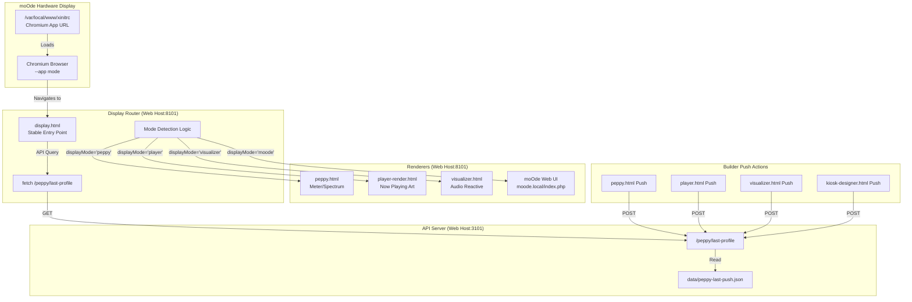
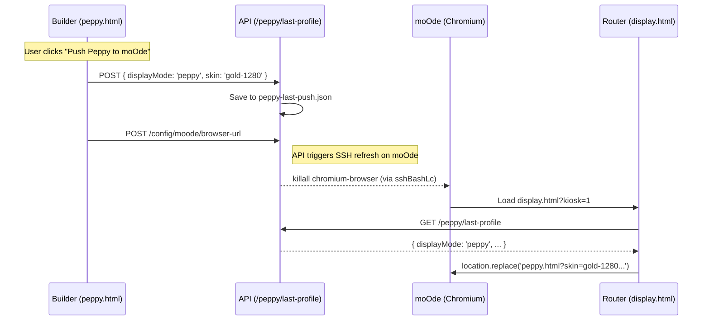

# Display Router (display.html)

<details>
<summary>Relevant source files</summary>

The following files were used as context for generating this wiki page:

- [app.html](app.html)
- [controller-kiosk.html](controller-kiosk.html)
- [display.html](display.html)
- [displays.html](displays.html)
- [docs/19-visualizer.md](docs/19-visualizer.md)
- [kiosk-designer.html](kiosk-designer.html)
- [peppy.html](peppy.html)
- [src/routes/config.runtime-admin.routes.mjs](src/routes/config.runtime-admin.routes.mjs)
- [styles/hero.css](styles/hero.css)
- [theme.html](theme.html)
- [visualizer.html](visualizer.html)

</details>


## Purpose and Scope

The display router (`display.html`) serves as the **stable entry point** for moOde's Chromium local display [display.html:6-9](). It queries the API for the last-pushed display configuration and dynamically routes to the appropriate renderer: Peppy, Player, Visualizer, or the native moOde Web UI [display.html:15-37](). This indirection allows users to switch display modes via "Push to moOde" actions in various builders (such as `peppy.html`, `player.html`, or `visualizer.html`) without manually changing moOde's system-level target URL configuration [displays.html:126-165]().

---

## Architecture Overview

The following diagram illustrates how `display.html` acts as a traffic controller between the moOde hardware display and the various rendering engines.

**Display Routing Data Flow**


**Sources:**
- [display.html:15-79]()
- [displays.html:138-142]()
- [docs/19-visualizer.md:38-46]()

---

## Profile Query and Mode Detection

When `display.html` loads, it executes an asynchronous fetch to the API's `last-profile` endpoint [display.html:25-32](). This profile contains the `displayMode` which dictates the final destination.

### API Endpoint: GET /peppy/last-profile
The router queries `${api}/peppy/last-profile` with `cache: 'no-store'` to ensure it receives the most recent push [display.html:26]().

**Sample Profile Structure:**
```json
{
  "profile": {
    "displayMode": "visualizer",
    "playerSize": "1280x400",
    "skin": "blue-1280",
    "theme": "midnight",
    "visualizer": {
      "preset": "aeon",
      "energy": 7,
      "motion": 5,
      "glow": 8
    }
  }
}
```

**Sources:**
- [display.html:26-31]()
- [displays.html:141-142]()

---

## Mode Routing Logic

The router implements specific logic for each `displayMode`. It also supports a `?mode=` URL override for debugging or static configuration [display.html:20-21]().

### Routing Table

| displayMode | Target File | Parameters Passed |
| :--- | :--- | :--- |
| `peppy` | `peppy.html` | `skin`, `theme`, `ts` [display.html:74-79]() |
| `player` | `player-render.html` | `size`, `ts` [display.html:38-45]() |
| `visualizer` | `visualizer.html` | `preset`, `energy`, `motion`, `glow`, `ts` [display.html:46-68]() |
| `moode` | `index.php` | Redirects to `http://moode.local/index.php` [display.html:34-37]() |
| `index` | `index.html` | Standard desktop display [display.html:69-72]() |

### Implementation Details

*   **Cache Busting**: Every redirect appends a `ts` (timestamp) parameter to prevent the Chromium browser from loading a cached version of the renderer [display.html:42, 65, 70, 78]().
*   **Kiosk Enforcement**: The router automatically appends `kiosk=1` to all internal renderer redirects to ensure UI controls are hidden on the hardware display [display.html:40, 52, 60, 70, 75]().
*   **Visualizer Specifics**: The router checks for a `pushedUrl` in the profile. If it detects `visualizer.html` in the URL, it uses that directly; otherwise, it constructs a URL from individual `energy`, `motion`, and `glow` parameters [display.html:48-66]().

**Sources:**
- [display.html:34-79]()
- [docs/19-visualizer.md:38-46]()

---

## Push Workflow Integration

The "Seamless Switching" experience is enabled by the builders updating the shared profile on the API server.

**Code Entity Mapping: Push to Route**


**Sources:**
- [displays.html:126-165]()
- [src/routes/config.runtime-admin.routes.mjs:147-152]()

---

## moOde Configuration

To utilize the router, the moOde **Local Display** must be configured to point to the router URL rather than a specific renderer.

**Target URL Configuration:**
`http://<WEB_HOST>:8101/display.html?kiosk=1`

### Remote Display Watchdog
The `display.html` logic is often paired with a watchdog mechanism. If the display is hosted on a separate machine from the moOde player, the system uses `sshBashLc` to execute commands on the moOde host to refresh the browser or modify the `xinitrc` [src/routes/config.runtime-admin.routes.mjs:147-152]().

**Sources:**
- [display.html:17-18]()
- [src/routes/config.runtime-admin.routes.mjs:133-152]()

---

## Troubleshooting

| Issue | Verification Step |
| :--- | :--- |
| **Wrong Mode Loading** | Check the API response: `curl http://<host>:3101/peppy/last-profile`. Verify `displayMode` matches expectation [display.html:26-29](). |
| **Blank Screen** | Verify the `host` variable in `display.html` resolves correctly. It defaults to `nowplaying.local` if not specified [display.html:17-18](). |
| **Stale Content** | Check if the `ts` parameter is being appended to the renderer URL in the browser's Network tab [display.html:78](). |
| **moOde UI Redirect Fails** | Ensure `moode.local` is resolvable from the moOde hardware browser's network perspective [display.html:35](). |

**Sources:**
- [display.html:17-37]()
- [display.html:78-79]()
