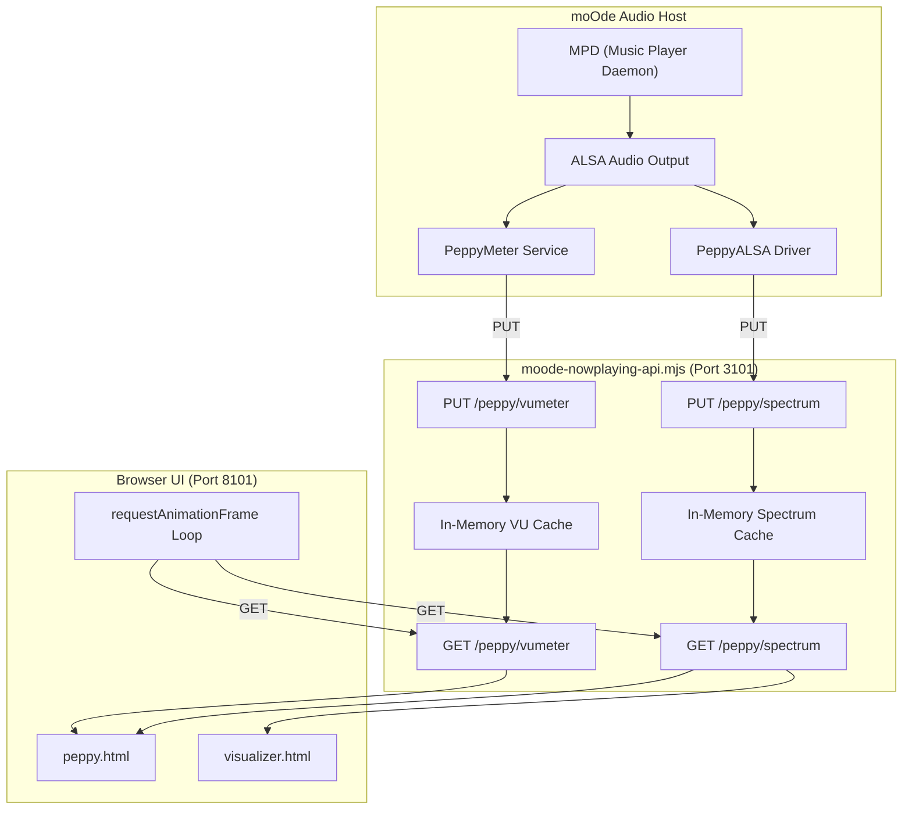
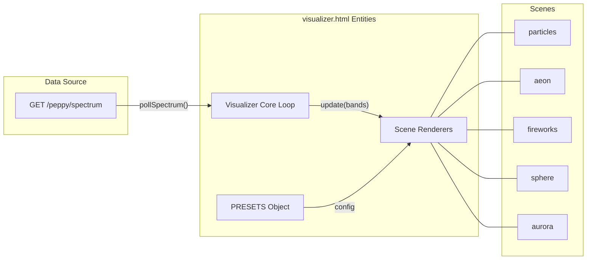

# Audio Data Pipeline

<details>
<summary>Relevant source files</summary>

The following files were used as context for generating this wiki page:

- [app.html](app.html)
- [controller-kiosk.html](controller-kiosk.html)
- [display.html](display.html)
- [displays.html](displays.html)
- [docs/19-visualizer.md](docs/19-visualizer.md)
- [kiosk-designer.html](kiosk-designer.html)
- [moode-nowplaying-api.mjs](moode-nowplaying-api.mjs)
- [peppy.html](peppy.html)
- [src/routes/config.moode-audio-info.routes.mjs](src/routes/config.moode-audio-info.routes.mjs)
- [src/routes/config.routes.index.mjs](src/routes/config.routes.index.mjs)
- [src/routes/config.runtime-admin.routes.mjs](src/routes/config.runtime-admin.routes.mjs)
- [styles/hero.css](styles/hero.css)
- [theme.html](theme.html)
- [visualizer.html](visualizer.html)

</details>


This page documents the audio visualization data pipeline that enables real-time VU meter and spectrum display in the Peppy renderer and the visualizer system. The pipeline bridges moOde's audio system to the browser using an HTTP-based data transfer model.

**Related pages:**
- For Peppy builder interface and renderer configuration, see [Peppy Builder & Renderer](3.2)
- For display mode routing and push mechanism, see [Display Router](3.4)
- For moOde integration details, see [moOde Integration](7.2)

---

## Overview

The audio data pipeline consists of two independent streams that flow from moOde's audio processing to the browser-based visualization:

| Stream | Source | Data Type | Update Frequency |
|--------|--------|-----------|------------------|
| **VU Meter** | PeppyMeter service | Left/right audio levels | Real-time (60fps target) |
| **Spectrum** | PeppyALSA FIFO reader | 30/32-band frequency data | Real-time (60fps target) |

Both streams use an **HTTP bridge pattern**: moOde services POST/PUT data to API endpoints, which cache it in memory, and the browser polls for updates via GET requests.

**Key characteristic:** The browser does not read ALSA devices directly. All audio data is mediated through the API server, enabling remote display scenarios and simplifying browser security requirements.

**Sources:** [peppy.html:1125-1150](), [visualizer.html:68-110](), [moode-nowplaying-api.mjs:5-12]()

---

## Architecture Overview

The following diagram maps the high-level audio flow to specific code entities and endpoints.

### Audio Flow to Code Entity Map

**Sources:** [peppy.html:1125-1150](), [visualizer.html:1134-1160](), [moode-nowplaying-api.mjs:5-12]()

---

## VU Meter Data Path

### Producer: PeppyMeter Service
The VU meter data originates from moOde's **PeppyMeter service**, which reads audio samples from ALSA and computes left/right channel levels. It must be configured to target the API server's ingest endpoint.

### API Ingest & Read Endpoints
**Routes:** `PUT /peppy/vumeter` and `GET /peppy/vumeter`

The API server receives VU data via HTTP PUT and stores it in an in-memory cache. The `peppy.html` renderer polls the GET endpoint to drive needle and rail animations.

**Payload Format:**
```json
{
  "left": 0.75,
  "right": 0.68,
  "ts": 1709876543210,
  "fresh": true
}
```

**Sources:** [peppy.html:1125-1140](), [moode-nowplaying-api.mjs:92]()

---

## Spectrum Data Path

### Producer: PeppyALSA FIFO Reader
Spectrum data originates from the **PeppyALSA driver**, which writes frequency band data to a FIFO pipe (`/tmp/peppyspectrum`). A bridge process reads this FIFO and POSTs data to the API server.

**Guardrails against competing readers:**
The system ensures that only one consumer reads from the FIFO at a time. When the Web UI visualizer is active, the native moOde spectrum renderer is typically disabled to prevent data starvation.

### API Ingest & Read Endpoints
**Routes:** `PUT /peppy/spectrum` and `GET /peppy/spectrum`

**Payload Format:**
```json
{
  "bands": [0.02, 0.15, 0.42, 0.76, ...],
  "ts": 1709876543215,
  "fresh": true
}
```
The `bands` array typically contains 30 or 32 normalized values (0.0-1.0).

**Sources:** [peppy.html:1142-1160](), [visualizer.html:1134-1160]()

---

## Visualizer Scene System

The `visualizer.html` renderer utilizes the spectrum data path to drive a variety of audio-reactive scenes.

### Visualizer Data Integration Map

**Sources:** [visualizer.html:87-95](), [visualizer.html:1134-1160]()

### Scene Configuration
The visualizer supports multiple presets, each with specific physics and reactive parameters defined in the `PRESETS` object [visualizer.html:87-95]():
- **Particles:** High-frequency jitter and movement. [visualizer.html:88-89]()
- **Aeon:** Fluid, flowing geometry. [visualizer.html:90]()
- **Fireworks:** Explosive radial patterns. [visualizer.html:91]()
- **Sphere:** 3D-style reactive globe. [visualizer.html:92]()
- **Aurora:** Slow, ambient color shifts. [visualizer.html:94]()

### Reactive Parameters
Scenes respond to audio data through several gain and filter stages controlled by the UI selectors [visualizer.html:42-55]():
- **Energy:** Multiplier for overall amplitude response. [visualizer.html:42-45]()
- **Motion:** Affects the speed of scene-specific physics. [visualizer.html:47-50]()
- **Glow:** Controls post-processing bloom/intensity. [visualizer.html:52-55]()

**Sources:** [visualizer.html:104-110](), [visualizer.html:1165-1200]()

---

## UI Polling and Rendering

### Polling Mechanism
Both `peppy.html` and `visualizer.html` use a `requestAnimationFrame` loop to poll the API.

| Function | File | Role |
|----------|------|------|
| `pollSpectrum()` | `visualizer.html` | Fetches spectrum bands and updates scene state. |
| `updateMeters()` | `peppy.html` | Fetches VU/Spectrum data and draws to canvas. |

**Sources:** [peppy.html:1125-1160](), [visualizer.html:1134-1160]()

### Rendering Mode Selection
The renderer chooses visualization based on the `displayMode` or `meterType` provided via URL parameters or the `last-profile` endpoint [display.html:15-32]():

| `meterType` / `mode` | Data Source | Renderer |
|-------------|-------------|----------|
| `circular` | VU meter | `drawNeedleMeter()` in `peppy.html` |
| `linear` | VU meter | `drawLinearMeter()` in `peppy.html` |
| `spectrum` | Spectrum | `drawSpectrum()` in `peppy.html` |
| `visualizer`| Spectrum | `render()` loop in `visualizer.html` |

**Sources:** [peppy.html:283-290](), [display.html:46-68]()

---

## Configuration and Verification

### moOde-Side Configuration
To enable the pipeline, the following targets must be set on the moOde host, typically via the `sshBashLc` utility in `src/routes/config.runtime-admin.routes.mjs` [src/routes/config.runtime-admin.routes.mjs:147-152]():

1. **VU Target:** `http://<api-host>:3101/peppy/vumeter`
2. **Spectrum Target:** `http://<api-host>:3101/peppy/spectrum`

### Verification Procedure
The `peppy.html` interface includes a diagnostic status check that verifies the flow of data.

| Status Indicator | Meaning |
|------------------|---------|
| **Ready** | Fresh data is arriving within the 2000ms window. |
| **Stale** | Data is older than 2000ms; meters will return to zero. |
| **Error** | No connection to API or endpoints returning 404. |

**Sources:** [peppy.html:242-248](), [peppy.html:414-443]()
