# Peppy Skin Assets & Export

<details>
<summary>Relevant source files</summary>

The following files were used as context for generating this wiki page:

- [assets/fonts/DotGothic16-Regular.ttf](assets/fonts/DotGothic16-Regular.ttf)
- [assets/peppy/black-white-1280-bgr.png](assets/peppy/black-white-1280-bgr.png)
- [assets/peppy/black-white-1280-needle.png](assets/peppy/black-white-1280-needle.png)
- [assets/peppy/blue-1280-bgr.png](assets/peppy/blue-1280-bgr.png)
- [assets/peppy/blue-1280-fgr.png](assets/peppy/blue-1280-fgr.png)
- [assets/peppy/blue-1280-meters.txt](assets/peppy/blue-1280-meters.txt)
- [assets/peppy/blue-1280-needle.png](assets/peppy/blue-1280-needle.png)
- [assets/peppy/blue-2-bgr.png](assets/peppy/blue-2-bgr.png)
- [assets/peppy/blue-2-fgr.png](assets/peppy/blue-2-fgr.png)
- [assets/peppy/blue-2-needle.png](assets/peppy/blue-2-needle.png)
- [assets/peppy/catalog.json](assets/peppy/catalog.json)
- [assets/peppy/white-red-1280-bgr.png](assets/peppy/white-red-1280-bgr.png)
- [assets/peppy/white-red-1280-needle.png](assets/peppy/white-red-1280-needle.png)
- [scripts/deploy-peppy-skins-to-moode.sh](scripts/deploy-peppy-skins-to-moode.sh)

</details>


This page documents the lifecycle of PeppyMeter skin assets, from the source-of-truth directory to the automated export and deployment workflow targeting the moOde audio player.

## Asset Architecture

The system maintains a source-of-truth directory for PeppyMeter skins within the `assets/peppy/` folder. This directory contains high-resolution image assets and a canonical configuration file that defines how these assets should be rendered.

### Source Directory (`assets/peppy/`)
The directory contains three primary asset types for each skin defined in the catalog [assets/peppy/catalog.json:1-53]():
1.  **Background (`*-bgr.png`)**: The static face of the meter (e.g., `blue-1280-bgr.png`).
2.  **Foreground (`*-fgr.png`)**: Optional overlay (e.g., glass reflections or branding) that sits above the needle (e.g., `blue-1280-fgr.png`).
3.  **Needle (`*-needle.png`)**: The moving indicator asset (e.g., `blue-1280-needle.png`).

### Canonical Parameters (`blue-1280-meters.txt`)
The `blue-1280-meters.txt` file (referenced via export logic) serves as the definition for 1280x400 skins. It uses a standard INI-style format compatible with the PeppyMeter python implementation.

| Parameter | Description |
| :--- | :--- |
| `meter.type` | Defines geometry (usually `circular`) |
| `distance` | Radius from the origin to the needle tip |
| `left.origin.x/y` | Coordinate pivot point for the Left channel needle |
| `right.origin.x/y` | Coordinate pivot point for the Right channel needle |
| `start.angle` | Needle angle at 0% signal |
| `stop.angle` | Needle angle at 100% signal |

**Sources:** `assets/peppy/` directory, [assets/peppy/catalog.json:1-53](), [scripts/deploy-peppy-skins-to-moode.sh:9]()

---

## Export Workflow (`export-peppymeter-skins.mjs`)

The export script transforms source assets into the specific structure required by the PeppyMeter plugin on moOde.

### Process Flow
The script performs the following operations:
1.  **Directory Initialization**: Clears and recreates the target export path `exports/peppymeter/1280x400/`.
2.  **Asset Renaming**: Maps source files (e.g., `blue-1280-bgr.png`) to the simplified naming convention required by the remote `meters.txt` configuration.
3.  **Config Generation**: Extracts sections from source meter definitions and writes a consolidated `meters.generated.txt`.

### Data Flow Diagram: Asset Export
The following diagram illustrates the transformation from the local asset library to the deployment-ready export.

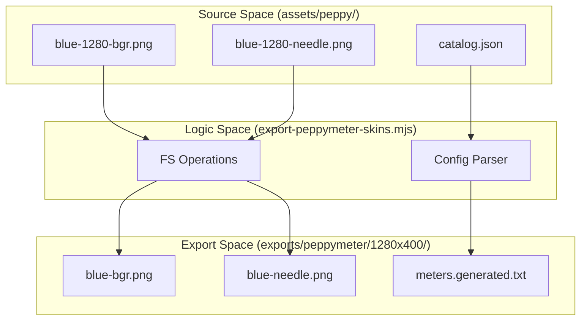

**Sources:** [scripts/export-peppymeter-skins.mjs](), [scripts/deploy-peppy-skins-to-moode.sh:11](), [assets/peppy/catalog.json:1-53]()

---

## Remote Deployment (`deploy-peppy-skins-to-moode.sh`)

This script automates the transfer and integration of exported skins into a live moOde environment using SSH and SCP.

### Implementation Details
1.  **Transport**: Uses `scp` to move all PNG files and the generated config from `exports/peppymeter/1280x400/*` to the remote `/tmp/` directory [scripts/deploy-peppy-skins-to-moode.sh:12]().
2.  **Installation**: Moves assets to the production path defined by `REMOTE_DIR` (`/opt/peppymeter/1280x400/`) using `sudo cp` [scripts/deploy-peppy-skins-to-moode.sh:16-17]().
3.  **Configuration Injection**:
    *   It reads the existing `/opt/peppymeter/1280x400/meters.txt` on the moOde host [scripts/deploy-peppy-skins-to-moode.sh:22]().
    *   A Python block [scripts/deploy-peppy-skins-to-moode.sh:20-39]() identifies and removes existing blocks for specific skins (e.g., `mack-blue-compact`, `cassette-linear`) to prevent duplicate entries.
    *   The contents of `/tmp/meters.generated.txt` are appended to the system `meters.txt` using `tee -a` [scripts/deploy-peppy-skins-to-moode.sh:41]().
4.  **Cleanup**: Removes temporary files from the remote `/tmp/` directory after deployment [scripts/deploy-peppy-skins-to-moode.sh:44]().

### Deployment Logic Diagram
This diagram maps the script variables and functions to the physical entities on the moOde player.

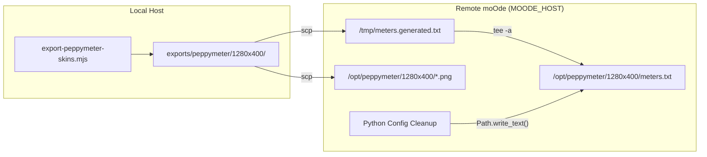

**Sources:** [scripts/deploy-peppy-skins-to-moode.sh:1-49]()

---

## Output Format (1280x400)

The final export format adheres to the requirements of the wide-aspect ratio (1280x400) PeppyMeter displays commonly used in kiosk hardware.

### File Manifest
The `exports/peppymeter/1280x400/` directory contains:
*   **Images**: Standardized PNG files derived from the `assets/peppy/` source (e.g., `blue-bgr.png`, `blue-fgr.png`, `blue-needle.png`).
*   **Config**: `meters.generated.txt` containing the block definitions used by the PeppyMeter Python process to map coordinates to the image files.

### Key Metrics for 1280x400 Skins
The source assets are optimized for specific hardware dimensions:
*   **Standard Wide**: 1280x400 pixels [scripts/deploy-peppy-skins-to-moode.sh:9]().
*   **Asset Names**: Simplified during export to match the internal PeppyMeter configuration keys [scripts/deploy-peppy-skins-to-moode.sh:17]().

**Sources:** [scripts/deploy-peppy-skins-to-moode.sh:9-17](), [assets/peppy/catalog.json:1-53]()
2a:T20f7,
# Queue Management

<details>
<summary>Relevant source files</summary>

The following files were used as context for generating this wiki page:

- [controller-albums.html](controller-albums.html)
- [controller-artists.html](controller-artists.html)
- [controller-genres.html](controller-genres.html)
- [controller-playlists.html](controller-playlists.html)
- [controller-queue.html](controller-queue.html)
- [queue-wizard.html](queue-wizard.html)
- [scripts/diagnostics.js](scripts/diagnostics.js)
- [scripts/queue-wizard.js](scripts/queue-wizard.js)
- [src/routes/config.diagnostics.routes.mjs](src/routes/config.diagnostics.routes.mjs)

</details>


Queue Management encompasses the systems for building, previewing, and manipulating the MPD playback queue. This includes the Queue Wizard interface for constructing queues from multiple sources (filters, playlists, vibe discovery, podcasts), preview/reorder functionality, and live queue editing with drag-drop support.

For library-level operations like metadata editing and album art management, see [Media Library](#5). For playback control and transport operations, see [Playback Features](#6).

---

## System Architecture

The queue management system provides a multi-source queue builder with a preview-apply workflow, culminating in MPD command execution.

### Queue Builder Pipeline

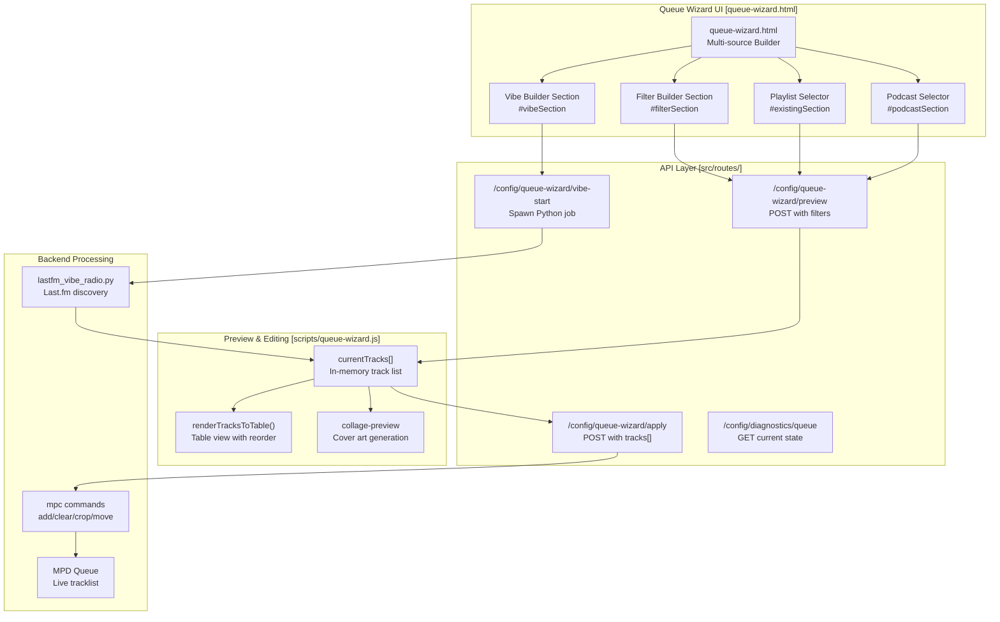

**Sources:** [queue-wizard.html:1-100](), [scripts/queue-wizard.js:8-60](), [src/routes/config.diagnostics.routes.mjs:21-22]()

---

## Queue Sources

The Queue Wizard supports five distinct sources for building queues. For details, see [Queue Wizard Interface](#4.1).

| Source | UI Section | Preview Endpoint | Description |
|--------|-----------|------------------|-------------|
| **Filters** | `#filterSection` | `/config/queue-wizard/preview` | Genre/Artist/Album selection with rating filters. See [Filter Builder](#4.2). |
| **Vibe** | `#vibeSection` | `/config/queue-wizard/vibe-start` | Last.fm similar track discovery from now-playing. See [Vibe Discovery](#4.3). |
| **Playlists** | `#existingSection` | Direct load | Load existing MPD playlists via carousel. See [Playlist & Podcast Queues](#4.4). |
| **Podcasts** | `#podcastSection` | `/config/queue-wizard/preview` | Filter podcast episodes by show/date. See [Playlist & Podcast Queues](#4.4). |
| **Radio** | `radio.html` | `/config/queue-wizard/radio-options` | Managed via separate radio browser. |

**Sources:** [scripts/queue-wizard.js:86-94](), [queue-wizard.html:85-90](), [scripts/diagnostics.js:44-63]()

---

## Queue Operations and Modes

### Application Modes

When sending a queue to MPD via `POST /config/queue-wizard/apply`, the `mode` and `keepNowPlaying` parameters control how the new tracks interact with the existing queue. For details, see [Filter Builder](#4.2).

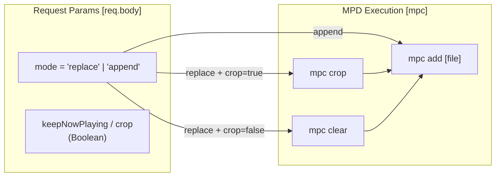

**Sources:** [scripts/diagnostics.js:44-46](), [src/routes/config.diagnostics.routes.mjs:21-22]()

### Track-Level Operations

The live queue interface allows for real-time manipulation of the active MPD queue. For details, see [Live Queue Editing](#4.5).

| Operation | UI Trigger | Backend Action | Optimistic Update |
|-----------|-----------|----------------|-------------------|
| **Remove** | Swipe-left or button | `sendPlayback('remove', {pos})` | Yes - DOM node removal |
| **Move** | Drag-drop gesture | `sendPlayback('move', {from, to})` | Yes - DOM reordering |
| **Play** | Tap queue row | `sendPlayback('playpos', {pos})` | Yes - highlight animation |
| **Fast Start** | `fastStart` flag | `mpc play` after first `add` | Immediate playback |

**Sources:** [controller-queue.html:26-51](), [scripts/diagnostics.js:21-22]()

---

## Vibe Discovery Pipeline

Vibe discovery uses Last.fm's similarity API to build a queue of tracks similar to the currently playing track. For details, see [Vibe Discovery](#4.3).

### Vibe Job Lifecycle

1.  **Start**: `POST /config/queue-wizard/vibe-start` triggers `lastfm_vibe_radio.py`.
2.  **Polling**: The UI calls `GET /config/queue-wizard/vibe-status/<jobId>` to update `vibeProgressBar`.
3.  **Completion**: Once the job reaches `ready`, the UI populates `currentTracks`.
4.  **Application**: User clicks `sendVibeToMoode` to apply the list.

**Sources:** [scripts/queue-wizard.js:115-190](), [scripts/diagnostics.js:57-62]()

---

## Live Queue Editing Interface

The live queue editor provides touch-optimized queue manipulation via `controller-queue.html`. For details, see [Live Queue Editing](#4.5).

### State Synchronization

The system uses a polling model to keep the UI in sync with MPD while allowing for optimistic local changes.

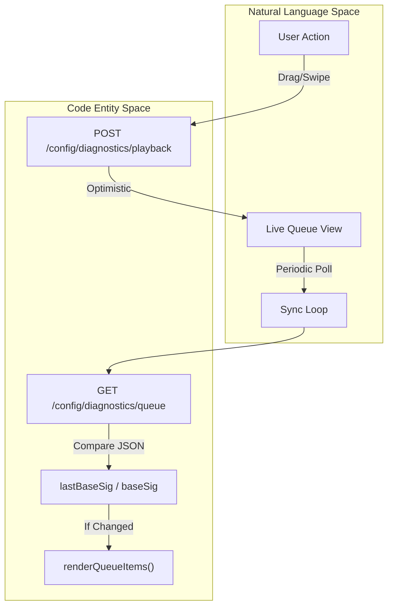

**Sources:** [controller-queue.html:1-50](), [scripts/diagnostics.js:21-22]()

---

## Key API Endpoints

### Queue Management Endpoints

| Endpoint | Method | Purpose |
|----------|--------|---------|
| `/config/queue-wizard/apply` | POST | Applies a track list to MPD with optional `shuffle` and `fastStart`. |
| `/config/queue-wizard/preview` | POST | Returns metadata for tracks matching filter criteria. |
| `/config/queue-wizard/radio-options` | GET | Fetches available radio genres and stations. |
| `/config/queue-wizard/vibe-start` | POST | Initiates an asynchronous vibe discovery job. |

**Sources:** [scripts/diagnostics.js:44-63](), [src/routes/config.diagnostics.routes.mjs:171-173]()

---

## Child Pages

- [Queue Wizard Interface](#4.1) — Multi-source queue builder, preview-apply lifecycle, and drag-drop reordering.
- [Filter Builder](#4.2) — Genre/Artist/Album filtering, rating-based exclusion, and application modes.
- [Vibe Discovery](#4.3) — Last.fm integration, Python vibe script, and async job polling.
- [Playlist & Podcast Queues](#4.4) — Playlist carousel, collage generation, and podcast date filtering.
- [Live Queue Editing](#4.5) — Optimistic updates, swipe-to-delete, and queue enrichment pipeline.
2b:T4b92,
# Queue Wizard Interface

<details>
<summary>Relevant source files</summary>

The following files were used as context for generating this wiki page:

- [queue-wizard.html](queue-wizard.html)
- [scripts/diagnostics.js](scripts/diagnostics.js)
- [scripts/queue-wizard.js](scripts/queue-wizard.js)
- [scripts/radio.js](scripts/radio.js)
- [src/lib/browse-index.mjs](src/lib/browse-index.mjs)
- [src/lib/lastfm-library-match.mjs](src/lib/lastfm-library-match.mjs)
- [src/routes/config.diagnostics.routes.mjs](src/routes/config.diagnostics.routes.mjs)
- [src/routes/config.queue-wizard-apply.routes.mjs](src/routes/config.queue-wizard-apply.routes.mjs)
- [src/routes/config.queue-wizard-basic.routes.mjs](src/routes/config.queue-wizard-basic.routes.mjs)
- [src/routes/config.queue-wizard-collage.routes.mjs](src/routes/config.queue-wizard-collage.routes.mjs)

</details>


The Queue Wizard Interface (`queue-wizard.html`) is a unified queue-building tool that provides five distinct sources for creating MPD playlists: existing playlists, filter-based selection, Last.fm vibe discovery, podcast episodes, and radio stations. Users preview track lists, reorder items via drag-and-drop, and send the final queue to moOde with optional playlist saving and collage cover generation.

For radio station management and browsing, see [Radio Station Browser](#5.6). For podcast subscription and episode management, see [Podcast Management](#5.5). For library-wide metadata operations, see [Library Health Dashboard](#5.1).

---

## UI Structure and Layout

The Queue Wizard uses a single-page layout with multiple builder sections stacked vertically. Each section represents a different queue source and can be independently activated based on feature availability.

### Page Components

```mermaid
graph TB
    QW["queue-wizard.html<br/>Main Document"]
    
    subgraph "Header (heroRail)"
        NAV["Navigation Tabs<br/>topTabs"]
        HERO_T["Hero Transport<br/>heroTransport div"]
        PILLS["Status Pills<br/>API/Web/Alexa/moOde"]
    end
    
    subgraph "Builder Sections (.card)"
        EXIST["Existing Playlists<br/>#existingSection"]
        FILTER["Filter Builder<br/>#filterSection"]
        VIBE["Vibe Builder<br/>#vibeSection"]
        PODCAST["Podcast Builder<br/>#podcastSection"]
    end
    
    subgraph "Preview Area"
        STATUS["#status<br/>Operation Status"]
        COUNT["#count<br/>Track Count"]
        COVER["#coverCard<br/>Cover Preview"]
        RESULTS["#results<br/>Track List Table"]
    end
    
    subgraph "Playlist Controls"
        NAME["#playlistName<br/>Input Field"]
        SAVE["#savePlaylistNowBtn<br/>Save Button"]
        HINT["#playlistHint<br/>Validation Hint"]
    end
    
    QW --> NAV
    QW --> HERO_T
    QW --> PILLS
    QW --> EXIST
    QW --> FILTER
    QW --> VIBE
    QW --> PODCAST
    QW --> STATUS
    QW --> COUNT
    QW --> COVER
    QW --> RESULTS
    QW --> NAME
    QW --> SAVE
```

**Sources:** [queue-wizard.html:265-298](), [queue-wizard.html:303-454]()

---

## State Management

The Queue Wizard maintains a single unified track list (`currentTracks`) and tracks which builder source last populated it. This design ensures consistent preview rendering and queue application regardless of the source.

### Core State Variables

| Variable | Type | Purpose |
|----------|------|---------|
| `currentListSource` | string | `'none'` \| `'filters'` \| `'vibe'` \| `'existing'` \| `'podcast'` \| `'radio'` \| `'queue'` |
| `currentTracks` | array | Full track metadata objects with `{artist, title, album, file, ...}` |
| `currentFiles` | array | Extracted file paths for queue application |
| `listOrderShuffled` | boolean | Tracks whether UI shuffle has reordered the list |
| `activeBuilder` | string | Currently active builder section identifier |

**Sources:** [scripts/queue-wizard.js:88-112]()

### List Source Transitions

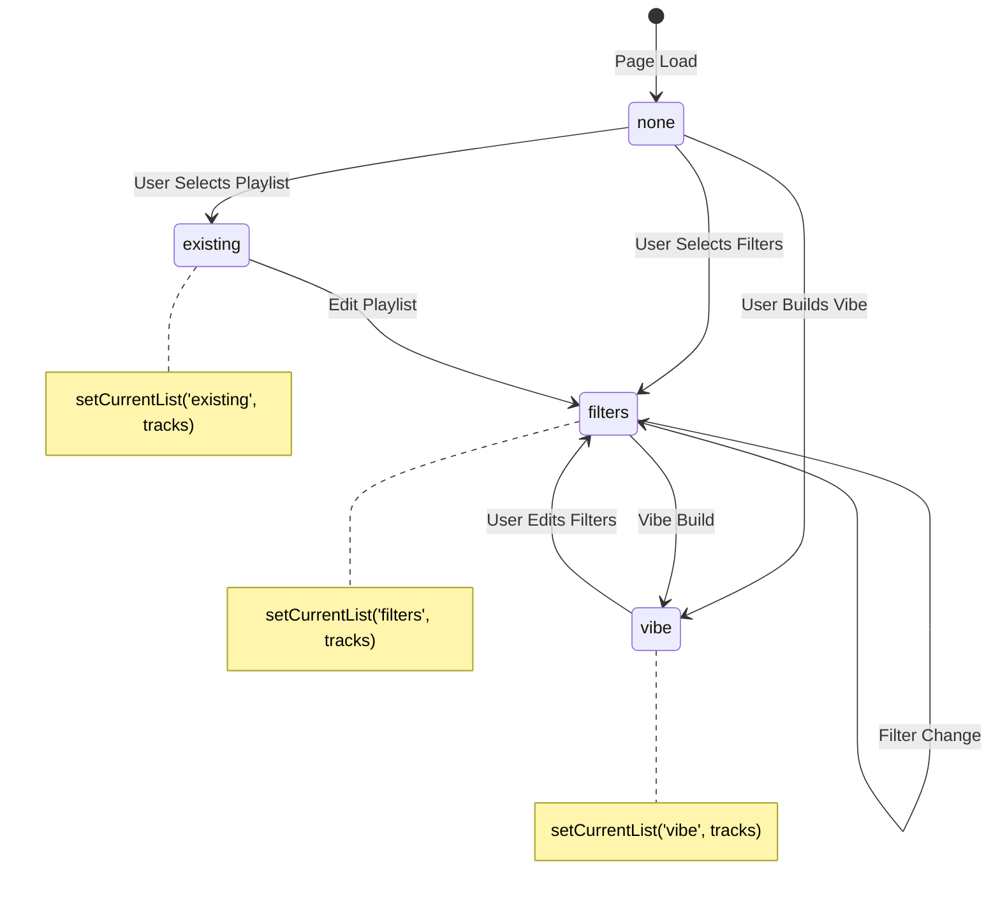

**Sources:** [scripts/queue-wizard.js:988-1003]()

---

## Queue Sources

### Existing Playlists

The Existing Playlists section displays a horizontal scrollable carousel of playlist covers, allowing multi-selection. Users can preview, edit, delete, or directly load playlists into the MPD queue.

#### Carousel Implementation

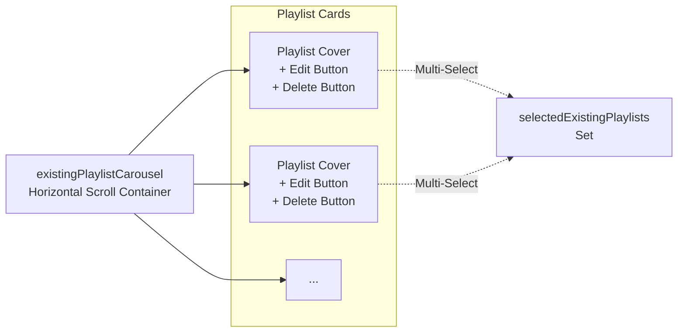

**Key Functions:**

- `loadExistingPlaylists()` - Fetches playlist names from `/config/queue-wizard/playlists` [scripts/queue-wizard.js:1383-1439]()
- `renderExistingPlaylistCarousel(names)` - Renders cover thumbnails with action buttons [scripts/queue-wizard.js:1464-1509]()
- `previewExistingPlaylistSelection()` - Loads tracks from selected playlists via `/config/queue-wizard/playlist-preview` [scripts/queue-wizard.js:1541-1597]()
- `editExistingPlaylist(name)` - Locks carousel, loads playlist into editable queue, prefills save name [scripts/queue-wizard.js:1599-1624]()
- `deleteExistingPlaylist(name)` - Sends delete request to `/config/queue-wizard/delete-playlist` [scripts/queue-wizard.js:1659-1697]()

**Sources:** [queue-wizard.html:303-327](), [scripts/queue-wizard.js:1383-1697]()

---

### Filter Builder

The Filter Builder allows multi-select filtering by genres, artists, albums, and excluded genres, with rating threshold and track limit controls.

#### Filter Controls

| Control | Element ID | Purpose |
|---------|------------|---------|
| `#genres` | multi-select | Include genres |
| `#artists` | multi-select | Include artists |
| `#albums` | multi-select | Include albums |
| `#excludeGenres` | multi-select | Exclude genres |
| `#minRating` | select | Minimum star rating (0-5) |
| `#maxTracks` | number input | Track limit (1-5000) |

#### Quick Search

The Filter Builder includes a unified quick search that indexes all filter options and existing playlists. Results provide four actions per item:

1. **Toggle Selection** - Add/remove from filter (multi-add)
2. **Play** - Replace queue and start playback immediately
3. **Enqueue** - Add to current queue without replacing
4. **Add Filter** - Add to filter selection and keep searching

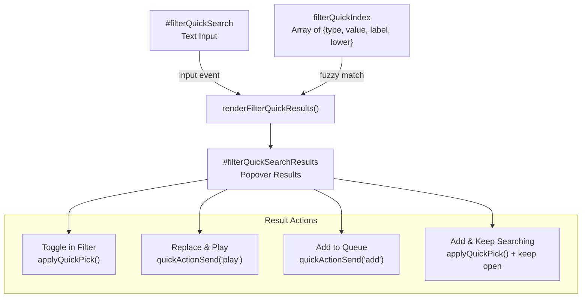

**Sources:** [queue-wizard.html:337-343](), [scripts/queue-wizard.js:1139-1154](), [scripts/queue-wizard.js:1158-1223](), [scripts/queue-wizard.js:1277-1338]()

#### Preview Generation

When filter selections change, the wizard auto-schedules a preview request with a 250ms debounce:

1. `schedulePreview(250)` - Debounced trigger [scripts/queue-wizard.js:1934-1941]()
2. `doPreview()` - POST to `/config/queue-wizard/preview` with filter body [scripts/queue-wizard.js:1943-1983]()
3. `setCurrentList('filters', tracks)` - Updates preview state [scripts/queue-wizard.js:988-1003]()
4. `maybeGenerateCollagePreview('filters-preview')` - Optional cover preview [scripts/queue-wizard.js:2110-2167]()

**Backend Processing:**
The `/config/queue-wizard/preview` route uses `getBrowseIndex` from `src/lib/browse-index.mjs` to filter the library efficiently [src/routes/config.queue-wizard-preview.routes.mjs:95-96](). It supports a `varietyMode` which uses `pickVarietyTracks` to ensure results aren't dominated by a single artist or album [src/routes/config.queue-wizard-preview.routes.mjs:17-52]().

**Sources:** [src/routes/config.queue-wizard-preview.routes.mjs:54-167](), [src/lib/browse-index.mjs:127-194](), [scripts/queue-wizard.js:1934-1983]()

---

### Vibe Builder

The Vibe Builder uses Last.fm's `track.getSimilar` API to discover tracks similar to the currently playing song, matching results against the local library index.

#### Vibe Build Flow

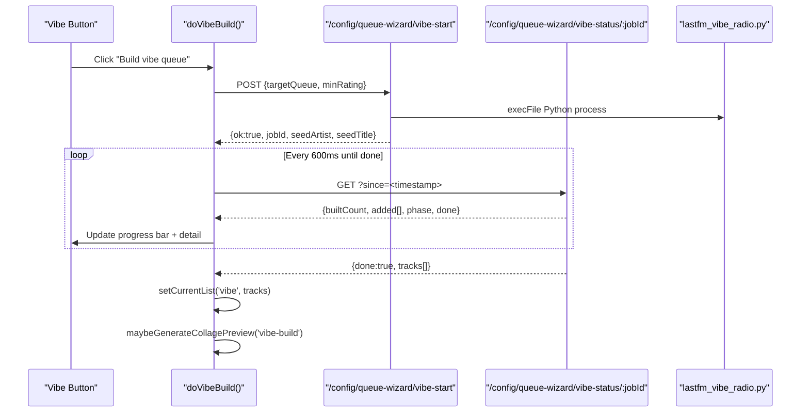

**Key State:**

- `vibeJobId` - Backend job identifier for status polling [scripts/queue-wizard.js:123]()
- `vibeSince` - Timestamp for incremental status updates [scripts/queue-wizard.js:124]()
- `vibeCancelled` - Cancellation flag [scripts/queue-wizard.js:121]()
- `vibeProgressBar` / `vibeProgressText` / `vibeProgressDetail` - UI elements [scripts/queue-wizard.js:115-118]()

**Progress UI:**

The vibe section includes a unified progress bar with three modes managed by `setCancelButtonMode(mode)` [scripts/queue-wizard.js:167-190]():
1. **Building** - Shows current/total tracks, latest picked track, with "Cancel" button.
2. **Complete** - Shows final count, with "Send vibe list to moOde" button.
3. **Hidden** - Progress area hidden when idle.

**Sources:** [queue-wizard.html:379-418](), [scripts/queue-wizard.js:113-190](), [scripts/queue-wizard.js:1986-2109]()

---

### Podcast Builder

The Podcast Builder filters episodes by show, date range, download status, and sort order. It auto-previews when any filter changes with a 350ms debounce.

**Filter Controls:**

- `#podcastShows` - Multi-select of subscribed shows (includes "All Shows") [queue-wizard.html:425]()
- `#podcastDateFrom` / `#podcastDateTo` - Date range with mini calendars [queue-wizard.html:432-435]()
- `#podcastMaxPerShow` - Per-show episode limit (1-100) [queue-wizard.html:437]()
- `#podcastDownloadedOnly` - Show only downloaded episodes [queue-wizard.html:439]()
- `#podcastNewestFirst` - Sort order toggle [queue-wizard.html:441]()

**Preset Buttons:**

- **24h** - Last day (`applyPodcastPresetDays(1)`) [scripts/queue-wizard.js:1771-1775]()
- **48h** - Last 2 days (`applyPodcastPresetDays(2)`) [scripts/queue-wizard.js:1776-1781]()
- **7d** - Last week (`applyPodcastPresetDays(7)`) [scripts/queue-wizard.js:1782-1788]()

**Sources:** [scripts/queue-wizard.js:1771-1931](), [queue-wizard.html:420-454]()

---

### Radio Builder

Radio station queue building is now handled in the dedicated `radio.html` interface. The Queue Wizard retains radio list preview/send capability but delegates station discovery and favorites management to the Radio Station Browser.

**Sources:** [queue-wizard.html:420]() (comment indicates removal), [scripts/queue-wizard.js:1737-1769]()

---

## Preview and List Management

### Track List Rendering

The preview area displays the current list in a compact row format with inline controls. The `renderTracksToTable(tracks)` function handles this [scripts/queue-wizard.js:798-954]().

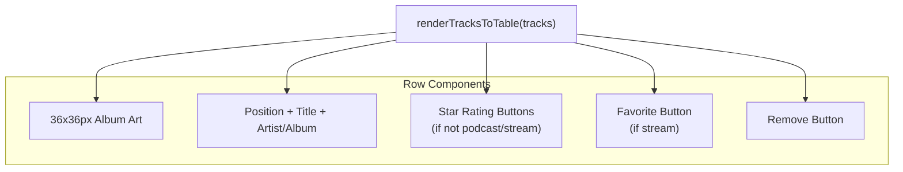

**Row Types:**

1. **Music Track** - Shows art, metadata, star rating (1-5), remove button.
2. **Podcast Episode** - Shows art, metadata (with date), no rating, remove button.
3. **Radio Station** - Shows art, station name/genre, favorite heart, remove button.

**Sources:** [scripts/queue-wizard.js:798-954]()

### Drag-and-Drop Reordering

Users can reorder tracks by dragging rows. The wizard uses native HTML5 drag-and-drop with visual drop indicators:

1. `dragstart` - Captures row index, adds `.dragging` class [scripts/queue-wizard.js:3310-3323]()
2. `dragover` - Determines drop position (before/after), adds `.drop-before` or `.drop-after` [scripts/queue-wizard.js:3325-3356]()
3. `drop` - Calls `moveTrack(fromIdx, toIdx)`, re-renders list [scripts/queue-wizard.js:3358-3379]()

**Sources:** [scripts/queue-wizard.js:3310-3379]()

### Track Removal

Clicking the "Remove" button on any row calls `removeTrackAt(idx)`, which splices the track from `currentTracks` and re-renders the table [scripts/queue-wizard.js:3180-3188]().

**Sources:** [scripts/queue-wizard.js:3180-3188]()

---

## Queue Application Modes

### Mode Selection

Each builder section provides three mode controls:

| Mode | Behavior |
|------|----------|
| **Replace** | Deletes queue content before adding new tracks |
| **Append** | Adds tracks to end of existing queue |
| **Crop** (Replace only) | Keeps currently playing track, deletes all others |

**Sources:** [queue-wizard.html:366-370](), [queue-wizard.html:387-390](), [scripts/queue-wizard.js:510-560]()

### Apply Request and Fast-Start Optimization

The `doSendToMoode(source)` function consolidates all queue application logic [scripts/queue-wizard.js:2531-2834](). When `mode === 'replace'` and `fastStart` is enabled, the backend adds and plays the first track immediately before processing the remainder of the list to minimize latency [src/routes/config.queue-wizard-apply.routes.mjs:89-106]().

```mermaid
graph TB
    SEND["doSendToMoode(source)"]
    
    CHECK{"currentFiles.length > 0?"}
    PREVIEW["doPreview()<br/>(if source=filters)"]
    
    BUILD_POD["doPodcastBuild()<br/>(if source=podcast)"]
    BUILD_RAD["buildRadioList()<br/>(if source=radio)"]
    
    CONFIRM{"mode=replace<br/>& !keepNowPlaying?"}
    MODAL["confirm() dialog"]
    
    APPLY["POST /config/queue-wizard/apply"]
    
    SEND --> CHECK
    CHECK -->|No| PREVIEW
    CHECK -->|Yes| CONFIRM
    PREVIEW --> CONFIRM
    
    SEND -.podcast.-> BUILD_POD --> CONFIRM
    SEND -.radio.-> BUILD_RAD --> CONFIRM
    
    CONFIRM -->|Yes| MODAL
    MODAL -->|User confirms| APPLY
    MODAL -->|User cancels| CANCEL["Return early"]
    CONFIRM -->|No (append or crop)| APPLY
```

**Sources:** [scripts/queue-wizard.js:2531-2834](), [src/routes/config.queue-wizard-apply.routes.mjs:89-106]()

---

## Playlist Saving and Collage Generation

### Playlist Workflow

The Queue Wizard separates playlist saving from queue application:

1. **Build List** - Use any builder source to create track list.
2. **Name Playlist** - Enter name in `#playlistName` input [queue-wizard.html:444]().
3. **Preview Cover** - Optional: click refresh to regenerate collage [queue-wizard.html:435]().
4. **Save Only** - Click "Save Playlist + Cover to moOde" → `doSavePlaylistOnly()` [scripts/queue-wizard.js:2476-2529]().

### Playlist Name Validation

`playlistNameProblems(name)` enforces restrictions on length and characters [scripts/queue-wizard.js:640-653]().

**Sources:** [scripts/queue-wizard.js:640-653](), [scripts/queue-wizard.js:2476-2529]()

### Collage Cover Generation

The wizard sends cover preview requests to `/config/queue-wizard/collage-preview` (POST) [scripts/queue-wizard.js:2110-2296](). The backend uses `sharp` to composite up to four unique album covers into a 600x600 JPEG [src/routes/config.queue-wizard-collage.routes.mjs:79-92]().

**Auto-Generation Triggers:**
- Filter preview completes [scripts/queue-wizard.js:1981]()
- Vibe build completes [scripts/queue-wizard.js:2104]()
- Manual refresh button clicked (`#refreshCollagePreviewBtn`) [scripts/queue-wizard.js:56]()

**Sources:** [scripts/queue-wizard.js:2110-2296](), [src/routes/config.queue-wizard-collage.routes.mjs:46-93](), [queue-wizard.html:433-437]()

---

## Initialization and State Recovery

### Startup Sequence

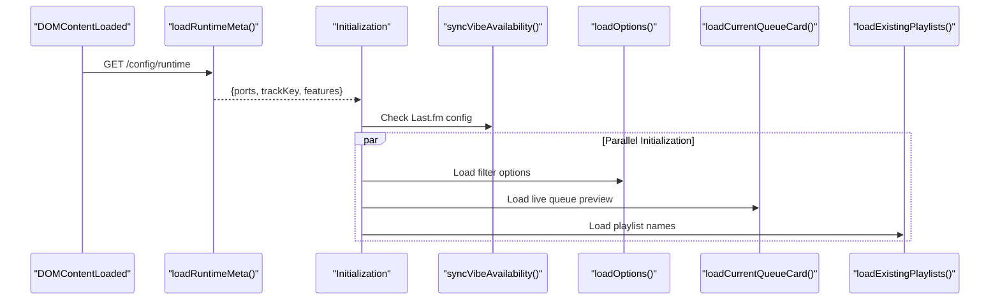

**Sources:** [scripts/queue-wizard.js:3483-3551](), [scripts/queue-wizard.js:408-476](), [scripts/queue-wizard.js:2845-2853]()

---

## Feature Gating

Builder sections are conditionally visible based on runtime configuration [scripts/queue-wizard.js:445-448]().

```javascript
// From /config/runtime response
ratingsEnabled = Boolean(cfg?.features?.ratings ?? true);
podcastsEnabled = Boolean(cfg?.features?.podcasts ?? true);
vibeEnabled = Boolean(cfg?.lastfm?.configured ?? false);

// UI visibility
applyBuilderVisibility() {
  filterSectionEl.classList.toggle('hidden', !true); // always visible
  vibeSectionEl.classList.toggle('hidden', !vibeEnabled);
  podcastSectionEl.classList.toggle('hidden', !podcastsEnabled);
}
```

**Sources:** [scripts/queue-wizard.js:219-231](), [scripts/queue-wizard.js:248-267](), [scripts/queue-wizard.js:445-448]()

---

## Theme and Responsive Behavior

### Theme Toggle

The Queue Wizard supports light/dark theme switching via `#themeToggle` button [queue-wizard.html:77](). It applies the `.theme-light` class and saves the preference to `localStorage` [scripts/queue-wizard.js:305-316]().

**Sources:** [queue-wizard.html:32-76](), [scripts/queue-wizard.js:305-316]()

### Embedded Shell Mode

When loaded in an iframe within `app.html`, the page strips navigation chrome via the `#shell-redirect` script [queue-wizard.html:6-22]().

**Sources:** [queue-wizard.html:6-22]()
2c:T249b,
# Filter Builder

<details>
<summary>Relevant source files</summary>

The following files were used as context for generating this wiki page:

- [queue-wizard.html](queue-wizard.html)
- [scripts/diagnostics.js](scripts/diagnostics.js)
- [scripts/queue-wizard.js](scripts/queue-wizard.js)
- [scripts/radio.js](scripts/radio.js)
- [src/lib/browse-index.mjs](src/lib/browse-index.mjs)
- [src/lib/lastfm-library-match.mjs](src/lib/lastfm-library-match.mjs)
- [src/routes/config.diagnostics.routes.mjs](src/routes/config.diagnostics.routes.mjs)
- [src/routes/config.queue-wizard-apply.routes.mjs](src/routes/config.queue-wizard-apply.routes.mjs)
- [src/routes/config.queue-wizard-basic.routes.mjs](src/routes/config.queue-wizard-basic.routes.mjs)

</details>


## Purpose and Scope

The Filter Builder is a metadata-based queue construction tool within the Queue Wizard system. It allows users to select tracks by genre, artist, album, and rating criteria, preview matching tracks from the MPD library, and send the resulting list to moOde's playback queue. The Filter Builder provides both traditional multi-select filter controls and a modern quick-search interface for rapid filter composition.

It supports advanced queue application modes including **Replace** (clear existing), **Append** (add to end), and **Crop** (keep current track, replace the rest).

**Sources:** [queue-wizard.html:328-374](), [scripts/queue-wizard.js:1932-1982](), [src/routes/config.queue-wizard-apply.routes.mjs:65-80]()

---

## Architecture Overview

The Filter Builder operates as a reactive interface. User selections trigger a debounced preview generation via the backend API, which queries a cached version of the MPD library metadata.

### System Data Flow

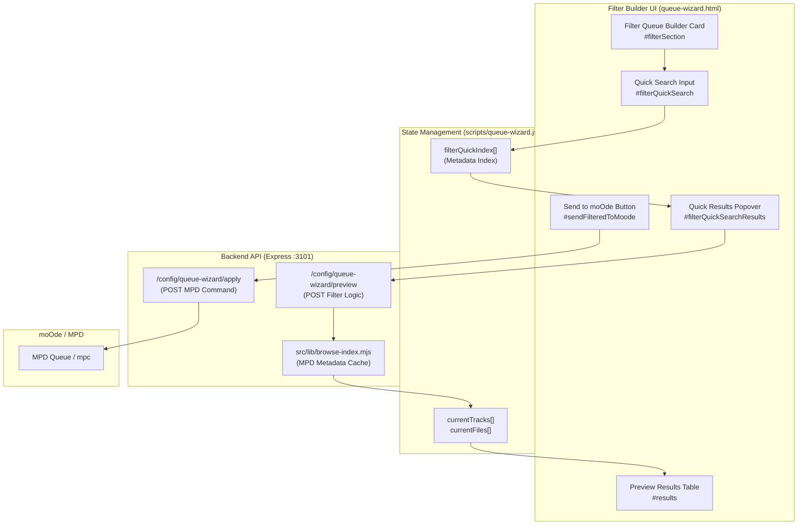

**Sources:** [scripts/queue-wizard.js:1138-1222](), [src/routes/config.queue-wizard-preview.routes.mjs:68-167](), [src/lib/browse-index.mjs:39-125]()

---

## User Interface Components

### Filter Selection Controls

The UI presents a responsive grid of multi-select boxes and scalar controls. The logic for populating these controls resides in `loadOptions()` which calls the `/config/queue-wizard/options` endpoint.

| Control | Element ID | Purpose | Source |
|---------|-----------|---------|--------|
| Genres | `#genres` | Include tracks from selected genres | [queue-wizard.html:356]() |
| Artists | `#artists` | Include tracks from selected artists | [queue-wizard.html:357]() |
| Albums | `#albums` | Include tracks from selected albums | [queue-wizard.html:358]() |
| Exclude Genres | `#excludeGenres` | Exclude tracks (e.g., "Christmas") | [queue-wizard.html:359]() |
| Min Rating | `#minRating` | Filter by star rating (0-5) | [queue-wizard.html:360]() |
| Max Tracks | `#maxTracks` | Limit result set size (1-5000) | [queue-wizard.html:361]() |

### Quick Search System

The Quick Search system (`#filterQuickSearch`) allows users to bypass multi-select boxes by typing keywords. It matches against a local `filterQuickIndex` populated from the library metadata.

- **Index Building:** `rebuildFilterQuickIndex()` aggregates genres, artists, and albums into a searchable array. [scripts/queue-wizard.js:1425-1464]()
- **Debounced Search:** Input events trigger `onFilterQuickSearchInput()` which renders grouped results (Genre, Artist, Album) in a popover. [scripts/queue-wizard.js:1138-1222]()
- **Direct Actions:** Each search result includes a "Play" (▶) button to replace the queue immediately and an "Add" (＋) button to append. [scripts/queue-wizard.js:1204-1215]()

**Sources:** [scripts/queue-wizard.js:1138-1222](), [scripts/queue-wizard.js:1425-1464]()

---

## Data Flow & Implementation

### Preview Generation Workflow

When filters change, `schedulePreview()` debounces the request by 250ms to prevent API flooding.

1.  **Request:** `doPreview()` gathers all selected values from the DOM and sends a POST to `/config/queue-wizard/preview`. [scripts/queue-wizard.js:1932-1982]()
2.  **Filtering Logic:** The backend uses `getBrowseIndex()` to retrieve the library metadata. It iterates through tracks, applying inclusion/exclusion logic for genres, artists, and albums, and checks the rating via `getRatingForFile`. [src/routes/config.queue-wizard-preview.routes.mjs:115-156]()
3.  **Variety Mode:** If `varietyMode` is enabled, the backend uses `pickVarietyTracks()` to ensure the result set isn't dominated by a single artist or album by bucketing tracks and round-robin selecting from them. [src/routes/config.queue-wizard-preview.routes.mjs:17-52]()
4.  **Display:** The UI receives the track list and calls `renderTracksToTable()`. [scripts/queue-wizard.js:753-819]()

**Sources:** [src/routes/config.queue-wizard-preview.routes.mjs:68-167](), [scripts/queue-wizard.js:1932-1982]()

### Queue Application Modes

When sending the list to moOde via `/config/queue-wizard/apply`, the system supports three primary modes managed by `registerConfigQueueWizardApplyRoute`.

| Mode | Logic | MPD Command |
|------|-------|-------------|
| **Replace** | Clears the entire queue before adding. | `mpc clear` [src/routes/config.queue-wizard-apply.routes.mjs:70-71]() |
| **Append** | Adds tracks to the end of the existing queue. | (No clear command) |
| **Crop** | Keeps the currently playing track and clears everything else. | `mpc crop` [src/routes/config.queue-wizard-apply.routes.mjs:67-68]() |

**Optimization Features:**
- **Fast Start:** If `fastStart` is enabled, the system adds the first track and immediately issues a `play` command before adding the rest of the tracks in a loop. [src/routes/config.queue-wizard-apply.routes.mjs:89-106]()
- **Shuffle Existing:** If the shuffle checkbox is active, the system issues `mpc random on` after the tracks are added. [src/routes/config.queue-wizard-apply.routes.mjs:149-154]()

**Sources:** [src/routes/config.queue-wizard-apply.routes.mjs:19-117]()

---

## Library Metadata Cache (`browse-index.mjs`)

To ensure high performance, the Filter Builder relies on a pre-built JSON index of the MPD library stored at `data/library-browse-index.json`.

### Metadata Entity Mapping

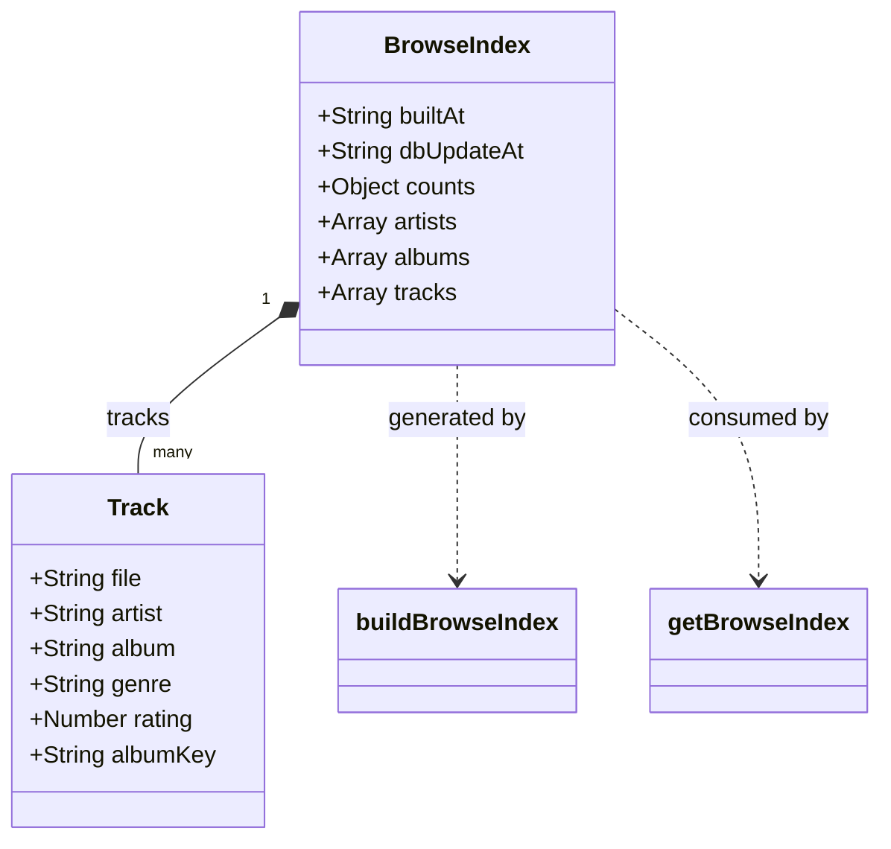

- **Staleness Check:** Before using the index, the system compares the `dbUpdateAt` timestamp in the JSON file with the current MPD database update time using `getMpdDbUpdateIso` (which parses `mpc stats`). [src/lib/browse-index.mjs:152-171]()
- **Rebuild:** If stale, `buildBrowseIndex()` executes `mpc -f ... listall` to generate a fresh index. This includes parsing track numbers, durations, and normalizing keys for artists and albums. [src/lib/browse-index.mjs:39-125]()

**Sources:** [src/lib/browse-index.mjs:1-194]()

---

## API Reference

### POST `/config/queue-wizard/preview`
Returns a list of tracks matching metadata filters.
- **Input:** `genres[]`, `artists[]`, `albums[]`, `excludeGenres[]`, `minRating`, `maxTracks`, `varietyMode`.
- **Logic:** Queries `browse-index.mjs` and filters results.
- **Source:** [src/routes/config.queue-wizard-preview.routes.mjs:68-167]()

### POST `/config/queue-wizard/apply`
Applies a track list to the MPD playback engine.
- **Input:** `tracks[]` (file paths), `mode` (replace/append), `crop` (boolean), `shuffle`, `fastStart`.
- **Logic:** Executes shell commands via `mpc`.
- **Source:** [src/routes/config.queue-wizard-apply.routes.mjs:19-182]()

### GET `/config/queue-wizard/options`
Retrieves unique genres, artists, and albums for populating multi-select filters.
- **Logic:** Uses `getBrowseIndex()` to extract unique metadata values and caches the result for `OPTIONS_CACHE_TTL_MS`.
- **Source:** [src/routes/config.queue-wizard-basic.routes.mjs:207-227]()
2d:T20da,
# Vibe Discovery

<details>
<summary>Relevant source files</summary>

The following files were used as context for generating this wiki page:

- [build_moode_index.py](build_moode_index.py)
- [ecosystem.config.cjs](ecosystem.config.cjs)
- [lastfm_vibe_radio.py](lastfm_vibe_radio.py)
- [now-playing.config.example.json](now-playing.config.example.json)
- [scripts/radio.js](scripts/radio.js)
- [src/lib/browse-index.mjs](src/lib/browse-index.mjs)
- [src/lib/lastfm-library-match.mjs](src/lib/lastfm-library-match.mjs)
- [src/routes/config.queue-wizard-apply.routes.mjs](src/routes/config.queue-wizard-apply.routes.mjs)
- [src/routes/config.queue-wizard-basic.routes.mjs](src/routes/config.queue-wizard-basic.routes.mjs)
- [src/routes/config.queue-wizard-vibe.routes.mjs](src/routes/config.queue-wizard-vibe.routes.mjs)

</details>


The Vibe Discovery system is an algorithmic queue generation engine that uses Last.fm's music recommendation API to find tracks in the local moOde library similar to a seed song. It implements an asynchronous job lifecycle with real-time progress tracking, library indexing, and fuzzy track matching.

**Scope**: This document covers the Last.fm integration, the Python discovery engine (`lastfm_vibe_radio.py`), the local library indexer (`build_moode_index.py`), and the async job orchestration via the Express API.

---

## System Architecture

The Vibe Discovery system bridges the gap between external recommendation data (Last.fm) and local file availability (moOde Library).

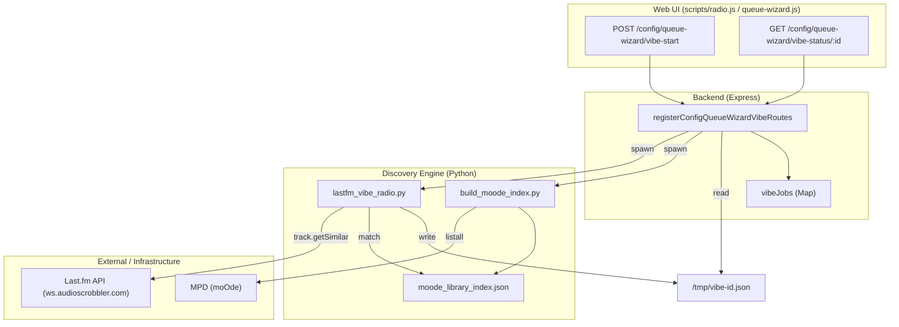

**Sources**: [src/routes/config.queue-wizard-vibe.routes.mjs:13-106](), [lastfm_vibe_radio.py:156-209](), [build_moode_index.py:35-94]()

---

## Library Indexing (`build_moode_index.py`)

To allow for near-instant matching of Last.fm recommendations against thousands of local files, the system maintains a pre-computed JSON index.

### Index Structure
The indexer (`build_moode_index.py`) connects to MPD and flattens the library into a "text map" where keys are normalized artist/title strings and values are arrays of file paths.

- **Normalization (`norm`)**: Strips common "junk" like "(Remastered)", "[Live]", "feat.", and non-alphanumeric characters to improve match rates [build_moode_index.py:17-27]().
- **Atomic Writes**: The index is written to a `.tmp` file and then renamed to `moode_library_index.json` to prevent corruption [build_moode_index.py:83-88]().

### Automatic Maintenance
The API route `ensureVibeIndexReady` checks the index age before starting a job. If the index is missing or older than 12 hours (`VIBE_INDEX_MAX_AGE_MS`), it triggers a rebuild by executing `build_moode_index.py` [src/routes/config.queue-wizard-vibe.routes.mjs:58-72]().

**Sources**: [build_moode_index.py:11-27](), [build_moode_index.py:44-68](), [src/routes/config.queue-wizard-vibe.routes.mjs:58-106]()

---

## Discovery Engine (`lastfm_vibe_radio.py`)

The Python discovery script is the core logic engine. It takes a seed artist/title and attempts to fill a target queue length by querying Last.fm and matching results against the local index.

### Discovery Strategies
1.  **Direct Similarity**: Queries `track.getSimilar` via the Last.fm API for the seed track [lastfm_vibe_radio.py:156-182]().
2.  **Fuzzy Matching**: Uses `fuzzy_within_artist` to match Last.fm titles against local library titles even if they differ slightly (e.g., "Song Name" vs "Song Name (Edit)") [lastfm_vibe_radio.py:219-238]().
3.  **Path Resolution**: Converts MPD-visible paths to absolute filesystem paths (e.g., `/mnt/SamsungMoode/`) to allow metadata reading via `Mutagen` [lastfm_vibe_radio.py:110-145]().

### Filtering Logic
- **Seasonal Filter**: Automatically excludes tracks containing Christmas-related keywords (e.g., "noel", "mistletoe", "silent night") via `is_seasonal_text` unless explicitly disabled [lastfm_vibe_radio.py:32-46]().
- **Path Scoring**: Prefers original files over duplicates by penalizing paths with `(1).flac` suffixes via `path_score` [lastfm_vibe_radio.py:94-97]().

**Sources**: [lastfm_vibe_radio.py:32-46](), [lastfm_vibe_radio.py:94-97](), [lastfm_vibe_radio.py:156-182](), [lastfm_vibe_radio.py:219-238]()

---

## Async Job Lifecycle

Vibe generation is handled as a background job managed by `registerConfigQueueWizardVibeRoutes` to prevent UI blocking during network-heavy Last.fm calls.

### 1. Job Start (`/config/queue-wizard/vibe-start`)
The API identifies the currently playing track via `mpc current` and spawns the Python process (`lastfm_vibe_radio.py`) with specific arguments based on user preferences such as `target-queue`, `min-rating`, and `exclude-christmas` [src/routes/config.queue-wizard-vibe.routes.mjs:109-171]().

### 2. Status Polling (`/config/queue-wizard/vibe-status/:id`)
The UI polls this endpoint to track progress. The backend reads the current state from the `vibeJobs` Map and the temporary JSON output file generated by the Python script [src/routes/config.queue-wizard-vibe.routes.mjs:203-248]().

### 3. Queue Application
Once the vibe list is generated, it is sent to the `/config/queue-wizard/apply` route. This route handles the MPD operations:
- **Mode Handling**: Supports `replace` (clearing queue) or `append` [src/routes/config.queue-wizard-apply.routes.mjs:23-27]().
- **Fast Start**: Adds the first track and immediately issues a `play` command before adding the remainder of the list to minimize perceived latency [src/routes/config.queue-wizard-apply.routes.mjs:89-106]().

**Sources**: [src/routes/config.queue-wizard-vibe.routes.mjs:109-248](), [src/routes/config.queue-wizard-apply.routes.mjs:19-106]()

---

## Technical Reference

### Key Components and Roles

| Component | File / Symbol | Role |
| :--- | :--- | :--- |
| **Vibe Builder** | `lastfm_vibe_radio.py` | Python engine for Last.fm API queries and track matching. |
| **Indexer** | `build_moode_index.py` | Creates the `text_map` of local files for the Vibe engine. |
| **API Controller** | `registerConfigQueueWizardVibeRoutes` | Orchestrates async jobs, process spawning, and status polling. |
| **Library Resolver** | `createLastfmIndexResolver` | JavaScript utility for matching Last.fm data against `browse-index.mjs`. |
| **Queue Applier** | `registerConfigQueueWizardApplyRoute` | Finalizes the discovery by pushing tracks to the MPD queue. |

### Data Flow: Seed to Queue
The following diagram maps the transition from a seed track to a populated moOde queue.

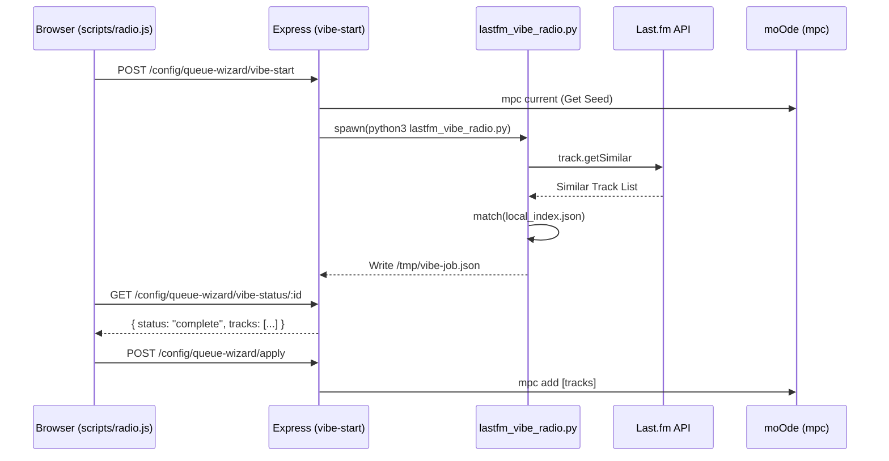

**Sources**: [src/routes/config.queue-wizard-vibe.routes.mjs:109-158](), [lastfm_vibe_radio.py:156-182](), [src/routes/config.queue-wizard-apply.routes.mjs:88-117](), [src/lib/lastfm-library-match.mjs:7-30]()
2e:T224b,
# Playlist & Podcast Queues

<details>
<summary>Relevant source files</summary>

The following files were used as context for generating this wiki page:

- [controller-podcasts.html](controller-podcasts.html)
- [controller-radio.html](controller-radio.html)
- [queue-wizard.html](queue-wizard.html)
- [scripts/diagnostics.js](scripts/diagnostics.js)
- [scripts/podcasts.js](scripts/podcasts.js)
- [scripts/queue-wizard.js](scripts/queue-wizard.js)
- [src/config.mjs](src/config.mjs)
- [src/routes/config.diagnostics.routes.mjs](src/routes/config.diagnostics.routes.mjs)
- [src/routes/podcasts-download.routes.mjs](src/routes/podcasts-download.routes.mjs)
- [src/routes/podcasts-refresh.routes.mjs](src/routes/podcasts-refresh.routes.mjs)
- [src/routes/podcasts-subscriptions.routes.mjs](src/routes/podcasts-subscriptions.routes.mjs)

</details>


This page documents the playlist and podcast queue building features in the Queue Wizard. These builders allow users to load existing saved playlists with visual carousel selection, generate collage cover art, and build queues from podcast episodes using date range and per-show filtering.

---

## Existing Playlist Queue Builder

The existing playlist builder provides a visual carousel interface for selecting one or more saved playlists and loading them into the playback queue.

### UI Component Architecture

The interface uses a horizontal carousel for visual selection, backed by a hidden standard select element for form compatibility.

Title: Playlist Selection Architecture
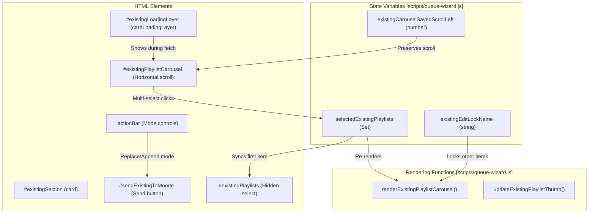

**Sources:** [queue-wizard.html:85-87](), [scripts/queue-wizard.js:45-54](), [scripts/queue-wizard.js:109-111](), [scripts/queue-wizard.js:1383-1417]()

### Multi-Selection & Preview System

The playlist builder supports selecting multiple playlists simultaneously. The selection state is managed through a `Set` and synchronized with the legacy `<select>` element for compatibility.

| Component | Type | Purpose |
|-----------|------|---------|
| `selectedExistingPlaylists` | `Set<string>` | Tracks all selected playlist names [scripts/queue-wizard.js:109]() |
| `existingEditLockName` | `string` | Locks carousel to single playlist during edit [scripts/queue-wizard.js:111]() |
| Carousel items | `[data-existing-carousel]` | Visual selection buttons with cover art [scripts/queue-wizard.js:3110]() |

#### Preview Flow
Preview fetches track metadata for display in the Queue Wizard without modifying the playback queue:

Title: Playlist Preview Sequence
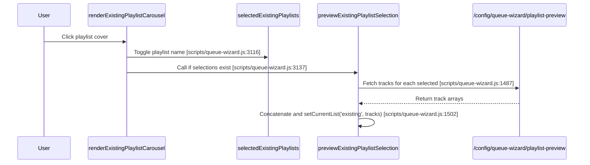

**Sources:** [scripts/queue-wizard.js:1464-1509](), [scripts/queue-wizard.js:3104-3141](), [scripts/diagnostics.js:54]()

### Collage Cover Art Generation

The system can generate 2x2 collage cover art for playlists by sampling unique artwork from the tracks within the playlist.

#### Backend Generation (Sharp)
The collage generation logic handles image processing via the Sharp library:
1. **Sampling**: Picks up to 24 tracks from the list to find unique art [scripts/queue-wizard.js:73]().
2. **Deduplication**: Uses SHA-1 hashes of image buffers to ensure the 4 collage slots are unique.
3. **Composite**: If 4 unique images are found, it creates a 600x600 canvas with 300x300 tiles.
4. **Single fallback**: If only one unique image exists, it returns a single 600x600 resized image.

#### moOde Shell Script Integration
The system provides mechanisms to push generated covers to the moOde filesystem:
- **Path**: Writes to `/var/local/www/imagesw/playlist-covers/`.
- **Naming**: Converts spaces to underscores to match moOde conventions.
- **Idempotency**: If a cover already exists, it avoids redundant overwrites.

**Sources:** [scripts/queue-wizard.js:73](), [scripts/queue-wizard.js:95-101](), [src/routes/podcasts-subscriptions.routes.mjs:129-153]()

---

## Podcast Queue Builder

The podcast builder filters episodes from subscribed shows by date range, download status, and per-show limits.

### Date Range Filtering
Date filtering uses ISO-8601 strings parsed to Unix timestamps for comparison. Preset buttons (`24h`, `48h`, `7d`) calculate these ranges automatically [scripts/queue-wizard.js:32-34]().

Title: Podcast Date Filtering Logic
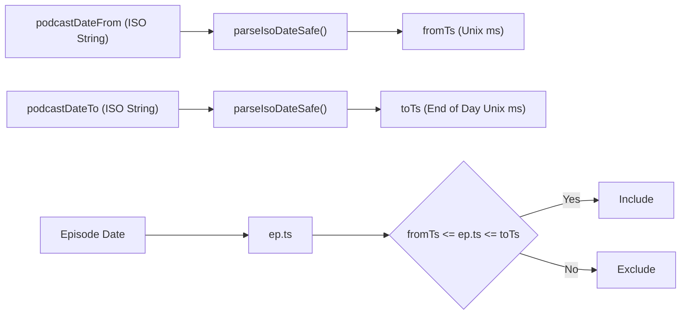

**Sources:** [scripts/queue-wizard.js:28-34](), [scripts/queue-wizard.js:105](), [controller-podcasts.html:95-99]()

### Build & Episode Selection Logic
The build process is managed by `podcastBuildBtn` and associated presets.

**Selection Sequence:**
1. **Fetch**: Requests candidates from the podcast API [src/routes/podcasts-refresh.routes.mjs:6-15]().
2. **Per-Show Filter**:
    - Applies `downloadedOnly` check if enabled [src/routes/podcasts-refresh.routes.mjs:60]().
    - Validates date range against specified bounds.
    - Sorts by date (newest/oldest first) based on user preference [src/routes/podcasts-download.routes.mjs:143]().
3. **Global Merge**: Concatenates results from all shows and performs a final chronological sort.

**Sources:** [scripts/queue-wizard.js:28-34](), [src/routes/podcasts-refresh.routes.mjs:6-15](), [src/routes/podcasts-download.routes.mjs:140-145]()

---

## Playlist Save & Pre-save Check Flow

The "Save Playlist" feature allows users to persist the current previewed queue (from any source) as a new or existing moOde playlist.

### Pre-save Check
Before saving, the system checks if a playlist with the same name already exists to prevent accidental overwrites.

Title: Playlist Save Lifecycle
```mermaid
sequenceDiagram
    participant User
    participant JS as scripts/queue-wizard.js
    participant API as /config/queue-wizard/save-playlist
    
    User->>JS: Click Save Playlist [scripts/queue-wizard.js:43]
    JS->>JS: Validate playlistNameEl [scripts/queue-wizard.js:44]
    JS->>API: POST {name, checkOnly: true}
    API-->>JS: {exists: true, trackCount: 20}
    JS->>User: confirm("Playlist exists. Overwrite?")
    User->>JS: Confirm
    JS->>API: POST {name, tracks, generateCollage: true}
```

**Sources:** [scripts/queue-wizard.js:43-44](), [scripts/queue-wizard.js:53-55](), [scripts/diagnostics.js:46]()

### Save Operations
The save operation performs the following backend tasks:
1. **File Write**: Writes the `.m3u` file to the MPD playlist directory `/var/lib/mpd/playlists` [src/config.mjs:18]().
2. **Collage Generation**: Triggers the image processing pipeline if requested.
3. **UI Refresh**: Clears the "dirty" state and refreshes the existing playlist carousel.

**Sources:** [src/config.mjs:18-19](), [scripts/queue-wizard.js:53-56](), [src/routes/podcasts-download.routes.mjs:169-170]()
2f:T2781,
# Live Queue Editing

<details>
<summary>Relevant source files</summary>

The following files were used as context for generating this wiki page:

- [controller-albums.html](controller-albums.html)
- [controller-artists.html](controller-artists.html)
- [controller-genres.html](controller-genres.html)
- [controller-playlists.html](controller-playlists.html)
- [controller-queue-wizard.html](controller-queue-wizard.html)
- [controller-queue.html](controller-queue.html)
- [controller-tablet-settings.html](controller-tablet-settings.html)
- [controller-tablet.html](controller-tablet.html)
- [queue-wizard.html](queue-wizard.html)
- [scripts/diagnostics.js](scripts/diagnostics.js)
- [scripts/queue-wizard.js](scripts/queue-wizard.js)
- [src/routes/config.diagnostics.routes.mjs](src/routes/config.diagnostics.routes.mjs)

</details>


The Live Queue Editing interface provides real-time manipulation of the MPD playback queue through touch-optimized gestures and controls. Users can reorder tracks via drag-and-drop, remove tracks with swipe gestures, and perform bulk queue operations—all with optimistic UI updates that minimize visual churn.

For building queues from multiple sources (filters, playlists, vibe discovery), see [Queue Wizard Interface](#4.1). For viewing the current track without queue editing, see [Mobile Display (controller-now-playing.html)](#2.2.2).

---

## System Architecture

The queue editing system consists of a single-page controller that polls the queue state, translates touch gestures into MPD commands, and applies optimistic DOM updates to maintain responsive feedback during network operations.

### Component Interaction Diagram

Title: Queue Editing Code Entity Map
```mermaid
graph TB
    subgraph "UI Layer [controller-queue.html]"
        LIST["#list element<br/>Queue rows"]
        DRAGSTATE["dragState object<br/>Active drag tracking"]
        DROPLINE["#dropLine element<br/>Visual drop indicator"]
        MODALS["Album/Artist Modals<br/>Track inspection"]
        TOPACTIONS["Queue Actions<br/>Shuffle/Crop/Clear"]
    end
    
    subgraph "Gesture Logic [controller-queue.html]"
        TOUCHSTART["handleTouchStart()<br/>Arm long-press timer"]
        TOUCHMOVE["handleTouchMove()<br/>Detect swipe vs drag"]
        TOUCHEND["handleTouchEnd()<br/>Commit or cancel gesture"]
        LONGPRESSTIMER["longPressTimer<br/>650ms delay"]
    end
    
    subgraph "Backend Routes [src/routes/config.diagnostics.routes.mjs]"
        QUEUEAPI["GET /config/diagnostics/queue<br/>Enriched queue data"]
        PLAYBACKAPI["POST /config/diagnostics/playback<br/>MPD command bridge"]
        MOVEACTION["action: 'move'<br/>fromPosition, toPosition"]
        REMOVEACTION["action: 'remove'<br/>position"]
        PLAYPOSACTION["action: 'playpos'<br/>position"]
    end
    
    subgraph "DOM Synchronization"
        REORDER["optimisticReorderDom()<br/>Manual node move"]
        REMOVE["optimisticRemoveDom()<br/>Element removal"]
        RENUMBER["renumberVisibleRows()<br/>Position sync"]
    end
    
    subgraph "State & Polling"
        POLLLOOP["loadQueue() loop<br/>15s poll interval"]
        LASTSIG["lastBaseSig<br/>Change detection"]
        AUTO_SCROLL["maybeScrollToHead()<br/>Scroll hysteresis"]
    end
    
    LIST -->|touchstart| TOUCHSTART
    TOUCHSTART -->|setTimeout| LONGPRESSTIMER
    LONGPRESSTIMER -->|650ms elapsed| DRAGSTATE
    DRAGSTATE -->|active| TOUCHMOVE
    TOUCHMOVE -->|calc distance| DROPLINE
    TOUCHEND -->|finishDrag()| MOVEACTION
    TOUCHEND -->|apply DOM| REORDER
    
    TOUCHMOVE -->|dx < -16| LIST
    LIST -->|reveal .deleteBtn| REMOVEACTION
    REMOVEACTION -->|apply DOM| REMOVE
    
    REORDER -->|update [data-pos]| RENUMBER
    REMOVE -->|update [data-pos]| RENUMBER
    
    PLAYBACKAPI -->|exec| MOVEACTION
    PLAYBACKAPI -->|exec| REMOVEACTION
    PLAYBACKAPI -->|exec| PLAYPOSACTION
    
    QUEUEAPI -->|fetch| POLLLOOP
    POLLLOOP -->|compare sig| LASTSIG
    LASTSIG -->|mismatch| LIST
    POLLLOOP -->|trigger| AUTO_SCROLL
    
    TOPACTIONS -->|sendPlayback()| PLAYBACKAPI
    LIST -->|click row| PLAYPOSACTION
    LIST -->|click .more| MODALS
```
**Sources:** [controller-queue.html:273-309](), [controller-queue.html:745-843](), [src/routes/config.diagnostics.routes.mjs:171-174]()

---

## Queue Enrichment Pipeline

The system uses a specialized diagnostics endpoint `/config/diagnostics/queue` to provide the UI with more than just raw MPD data. This pipeline merges MPD status with local metadata, radio station information, and track state.

### Enrichment Flow

Title: /config/diagnostics/queue Pipeline
```mermaid
graph LR
    MPD_S["MPD 'status'"] --> PARSE["parseMpdKeyVals()"]
    MPD_Q["MPD 'playlistinfo'"] --> PARSE_Q["parseMpdSongs()"]
    
    subgraph "Enrichment [src/routes/config.diagnostics.routes.mjs]"
        PARSE_Q --> LOOP["For each track..."]
        LOOP --> RATING["getRatingForFile()"]
        LOOP --> RADIO["loadRadioCatalogMap()"]
        LOOP --> ART["Generate /art/ URL"]
        LOOP --> IHEART["cleanIheartQueueMeta()"]
    end
    
    PARSE --> MERGE["Merge Items + headPos"]
    RATING --> MERGE
    ART --> MERGE
    RADIO --> MERGE
    
    MERGE --> JSON["Response JSON<br/>{ items, headPos, headSig }"]
```
**Sources:** [src/routes/config.diagnostics.routes.mjs:9-30](), [src/routes/config.diagnostics.routes.mjs:126-161](), [src/routes/config.diagnostics.routes.mjs:172-174]()

### State Polling and Signature Matching
The UI uses `lastBaseSig` (a stringified hash of track files/titles) to determine if a full re-render is necessary. If only the `headPos` (current track) changes, the UI performs a lightweight update by moving the `.head` class and potentially scrolling, without destroying existing DOM nodes.
**Sources:** [controller-queue.html:311-398]()

---

## Drag-and-Drop Reordering

Reordering is implemented using a custom touch state machine to distinguish between scrolling, swiping, and dragging.

### Touch State Machine

| Event | Logic | Source |
| :--- | :--- | :--- |
| `touchstart` | Records `startY`, starts `longPressTimer` (650ms). | [controller-queue.html:745-779]() |
| `touchmove` | If dragging, calculates `targetIdx` by comparing pointer Y against all `.rowWrap` offsets. | [controller-queue.html:781-843]() |
| `touchend` | Calls `finishDrag()`, triggers `optimisticReorderDom()`, and fires `sendPlayback('move')`. | [controller-queue.html:900-939]() |

### Target Detection Hysteresis
To prevent "jitter" when dragging, the system uses a vertical scroll cancel threshold. If the user moves more than a small distance before the long-press timer fires, the drag is aborted in favor of native scrolling.
**Sources:** [controller-queue.html:770-775]()

---

## Swipe-to-Delete

The "Swipe-to-Delete" feature provides a mobile-native way to prune the queue.

1. **Detection**: A leftward horizontal delta (`dx < -16`) triggers the `.swiped` class on the `.row` element. [controller-queue.html:846-853]()
2. **Visuals**: The `.swiped` class uses CSS transforms to shift the row left by 184px (or 92px if only delete is available), revealing hidden `.vibeBtn` and `.deleteBtn`. [controller-queue.html:34-38]()
3. **Optimistic Removal**: Clicking delete calls `optimisticRemoveDom(pos)`, which immediately detaches the DOM node and calls `renumberVisibleRows()` to update the `data-pos` attributes of subsequent tracks. [controller-queue.html:892-898]()

---

## Live Queue Interface (controller-queue.html)

The interface is designed to be embedded in the Kiosk or used as a standalone mobile controller.

### Key DOM Elements
| Selector | Role | Source |
| :--- | :--- | :--- |
| `#list` | The container for all queue rows. | [controller-queue.html:26]() |
| `#dropLine` | A green indicator showing the insertion point during a drag. | [controller-queue.html:27]() |
| `.rowWrap` | A wrapper for each track that handles the swipe/drag offset. | [controller-queue.html:29]() |
| `.more` | Opens a context menu for track-level actions. | [controller-queue.html:51]() |

### Optimistic UI Helpers
The system maintains UI snappiness by modifying the DOM before the server confirms the action:
- `optimisticReorderDom(from, to)`: Moves the DOM node to the new index. [controller-queue.html:874-890]()
- `renumberVisibleRows()`: Iterates through all visible rows and updates their displayed index and `data-pos` attributes. [controller-queue.html:856-872]()
- `markOptimisticPlay(row)`: Adds a highlight when a track is clicked to indicate playback is starting. [controller-queue.html:404-409]()

---

## Queue Enrichment API

The backend provides the logic for reordering and deletion via the diagnostics and playback endpoints.

### Key Endpoints
| Route | Method | Description | Source |
| :--- | :--- | :--- | :--- |
| `/config/diagnostics/queue` | GET | Returns enriched queue metadata including ratings and radio station names. | [src/routes/config.diagnostics.routes.mjs:22]() |
| `/config/diagnostics/playback` | POST | Generic bridge for `move`, `remove`, `clear`, `crop`, and `shufflequeue`. | [src/routes/config.diagnostics.routes.mjs:21]() |

### Rating Integration
The queue view integrates track ratings directly into the metadata. The `getRatingForFile` function (passed as a dependency to diagnostics routes) queries the MPD sticker database to retrieve 1-5 star ratings, which are then rendered as badges in the UI.
**Sources:** [src/routes/config.diagnostics.routes.mjs:172-174](), [controller-queue.html:47]()

---

## Scroll Management

To prevent the UI from jumping while a user is actively browsing the queue, the system implements **Scroll Hysteresis**.

1. **User Interaction Detection**: Any `wheel`, `touchmove`, or `scroll` event updates the timestamp of the last user interaction. [controller-queue.html:944-947]()
2. **Conditional Auto-Scroll**: The `maybeScrollToHead()` function only scrolls the `.head` row into view if a sufficient time has passed since the last user interaction. [controller-queue.html:281-287]()

**Sources:** [controller-queue.html:281-287](), [controller-queue.html:944-947]()
