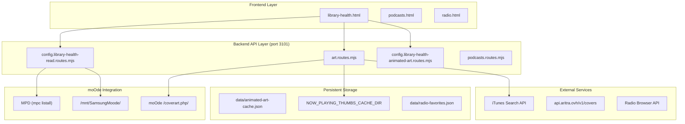
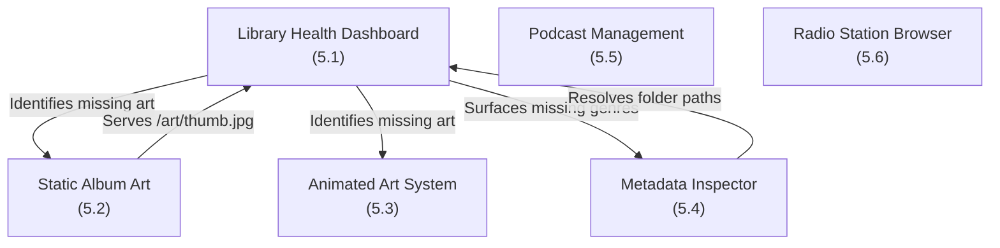

# Media Library

<details>
<summary>Relevant source files</summary>

The following files were used as context for generating this wiki page:

- [library-health.html](library-health.html)
- [scripts/library-health.js](scripts/library-health.js)
- [src/routes/art.routes.mjs](src/routes/art.routes.mjs)
- [src/routes/config.library-health-read.routes.mjs](src/routes/config.library-health-read.routes.mjs)
- [src/routes/config.routes.mjs](src/routes/config.routes.mjs)

</details>


The Media Library subsystem provides tools for auditing, enriching, and managing the MPD music library hosted on the moOde audio player. It encompasses six major functional areas accessible through dedicated UI pages and API routes.

**Child Pages**: [Library Health Dashboard](#5.1), [Static Album Art](#5.2), [Animated Art System](#5.3), [Metadata Inspector](#5.4), [Podcast Management](#5.5), [Radio Station Browser](#5.6)

---

## Overview and Architecture

The now-playing system does not host or store the music library—that remains on the moOde host managed by MPD. Instead, the Media Library subsystem provides administrative and enhancement tools through a three-tier architecture:

| Layer | Components | Purpose |
|-------|------------|---------|
| **Frontend UIs** | `library-health.html`, `podcasts.html`, `radio.html` | User-facing interfaces for library management [library-health.html:1-23](), [podcasts.html:1-25]() |
| **Backend API** | `/config/library-health/*`, `/podcasts/*`, `/radio/*` routes | RESTful endpoints requiring `x-track-key` authentication [src/routes/config.library-health-read.routes.mjs:1-10]() |
| **Integration** | `mpc` commands, SSH file operations, external APIs | Bridges to MPD, file system, and metadata services [src/routes/config.library-health-read.routes.mjs:82-84]() |

**Access Mechanisms**:
- **MPD protocol** via `mpc` commands over TCP port 6600 for metadata queries (`listall`, `find base`, `sticker`) [src/routes/config.library-health-read.routes.mjs:82-84]()
- **SSH commands** to moOde host for direct file system access and tag editing (`metaflac`, `ffmpeg`) [src/routes/config.library-health-read.routes.mjs:56-61]()
- **HTTP requests** to moOde's web interface for library update triggers and cover art retrieval [src/routes/art.routes.mjs:5-21]()

All library modification operations require the `x-track-key` header for authentication.

Sources: [library-health.html:1-118](), [src/routes/config.library-health-read.routes.mjs:5-11](), [src/routes/art.routes.mjs:1-21]()

---

## System Architecture

### Overall Data Flow



**Architecture Pattern**: The Media Library follows a **query-enrich-apply** pattern. The backend queries MPD for library structure using `mpc listall` [src/routes/config.library-health-read.routes.mjs:84-85](), enriches metadata via external APIs (iTunes, Aritra), and applies changes or serves content from local caches like the thumb cache directory [src/routes/config.library-health-read.routes.mjs:65-67]().

Sources: [src/routes/config.library-health-read.routes.mjs:63-99](), [src/routes/art.routes.mjs:99-110](), [library-health.html:93-117]()

---

## Subsystem Overview

The Media Library is organized into six functional subsystems, each with dedicated UI and API components:

### Subsystem Map



| Subsystem | UI Entry Point | Primary API Routes | Purpose |
|-----------|---------------|-------------------|---------|
| **Library Health** | `library-health.html` | `/config/library-health/*` | Scans MPD library, reports missing genres, unrated tracks [library-health.html:100-100](), [src/routes/config.library-health-read.routes.mjs:72-108]() |
| **Static Art** | `library-health.html` | `/art/*` | Serves track art, handles thumb resizing via Sharp [src/routes/art.routes.mjs:111-142]() |
| **Animated Art** | `library-health.html` | `/config/library-health/animated-art/*` | Discovers motion covers, transcodes to H264 |
| **Metadata Inspector** | `library-health.html` | `/config/library-health/album-meta*` | Edits album-level tags and performer credits [scripts/library-health.js:39-51]() |
| **Podcasts** | `podcasts.html` | `/podcasts/*` | Subscribes to RSS feeds, downloads episodes [podcasts.html:103-103]() |
| **Radio Stations** | `radio.html` | `/radio/*` | Searches Radio Browser API, saves favorites [library-health.html:102-102]() |

Sources: [library-health.html:93-117](), [src/routes/config.library-health-read.routes.mjs:72-108](), [src/routes/art.routes.mjs:99-110]()

---

## Backend Route Organization

Library routes are registered through focused modules. The legacy `config.routes.mjs` is maintained for compatibility but routes have been extracted [src/routes/config.routes.mjs:1-7]().

**Key Modules**:
- `src/routes/config.library-health-read.routes.mjs`: Handles library scanning and snapshot computation [src/routes/config.library-health-read.routes.mjs:72-108]().
- `src/routes/art.routes.mjs`: Manages image processing and caching for album covers [src/routes/art.routes.mjs:111-142]().

**Route Naming Conventions**: 
- `/art/track_640.jpg`: Serves 640x640 album art with optional healing [src/routes/art.routes.mjs:111-114]().
- `/art/thumb.jpg`: Redirects to album-specific thumbnails [src/routes/art.routes.mjs:99-105]().

Sources: [src/routes/config.routes.mjs:1-7](), [src/routes/config.library-health-read.routes.mjs:1-11](), [src/routes/art.routes.mjs:99-142]()

---

## File Path Resolution

The system must resolve MPD relative paths to absolute local paths for operations like checking for `cover.jpg` [src/routes/config.library-health-read.routes.mjs:172-178]().

**Key Resolution logic**:
The `resolveLocalMusicPath` function checks multiple candidate directories, including common moOde mount points like `/mnt/SamsungMoode/` and `/mnt/OSDISK/` [src/routes/config.library-health-read.routes.mjs:22-44]().

```javascript
// Candidate paths for resolution in src/routes/config.library-health-read.routes.mjs
const candidates = [
  raw.startsWith('/') ? raw : '',
  f.startsWith('/mnt/') ? f : '',
  '/var/lib/mpd/music/' + f,
  '/mnt/SamsungMoode/' + f,
  '/mnt/OSDISK/' + f,
];
```

Sources: [src/routes/config.library-health-read.routes.mjs:22-50](), [src/routes/config.library-health-read.routes.mjs:155-170]()

---

## Storage and Caching

| Cache Type | File Path / Variable | Purpose |
|------------|-----------|---------|
| Library Health Snapshot | `libraryHealthCache` | In-memory cache of the full library scan [src/routes/config.library-health-read.routes.mjs:68-68]() |
| Album Thumbnails | `LIBRARY_THUMBS_CACHE_DIR` | Local storage for resized album art [src/routes/config.library-health-read.routes.mjs:65-67]() |
| Genre List | `libraryGenresCache` | Cached list of all unique genres in library [src/routes/config.library-health-read.routes.mjs:70-70]() |

**Cache Expiration**:
- `LIB_HEALTH_CACHE_TTL_MS`: 15 minutes [src/routes/config.library-health-read.routes.mjs:63-63]().
- `LIBRARY_GENRES_CACHE_TTL_MS`: 15 minutes [src/routes/config.library-health-read.routes.mjs:64-64]().

Sources: [src/routes/config.library-health-read.routes.mjs:63-70]()

---

## Configuration and UI States

The Media Library UI dynamically adjusts based on configuration settings. For example, the Animated Art card visibility is synced with the `nowplaying.ui.motionArtEnabled` localStorage key [scripts/library-health.js:10-27]().

**UI Components**:
- **Library Scan**: Displays total tracks, albums, and missing metadata samples [src/routes/config.library-health-read.routes.mjs:101-108]().
- **Genre Bars**: Visualizes track distribution across genres with quick-retag links [scripts/library-health.js:66-93]().
- **Rating Bars**: Visualizes track distribution by rating (0-5) [scripts/library-health.js:98-123]().

Sources: [scripts/library-health.js:10-27](), [scripts/library-health.js:66-123](), [src/routes/config.library-health-read.routes.mjs:101-108]()
