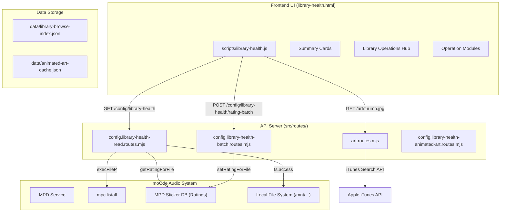
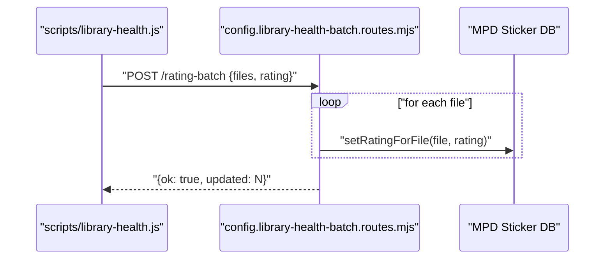

# Library Health Dashboard

<details>
<summary>Relevant source files</summary>

The following files were used as context for generating this wiki page:

- [docs/04-library-health.md](docs/04-library-health.md)
- [docs/11-deploy-pm2-rollback.md](docs/11-deploy-pm2-rollback.md)
- [docs/21-moode-airplay-metadata-hardening.md](docs/21-moode-airplay-metadata-hardening.md)
- [docs/README.md](docs/README.md)
- [library-health.html](library-health.html)
- [scripts/library-health.js](scripts/library-health.js)
- [src/routes/art.routes.mjs](src/routes/art.routes.mjs)
- [src/routes/config.library-health-read.routes.mjs](src/routes/config.library-health-read.routes.mjs)
- [src/routes/config.routes.mjs](src/routes/config.routes.mjs)

</details>


The Library Health Dashboard provides a comprehensive view of music library metadata quality and tools for batch maintenance operations. It scans the MPD library to identify metadata issues, displays statistics about track ratings and genre coverage, and offers batch correction tools for genre tagging, rating assignment, and album-level metadata fixes.

For album artwork management, see [Static Album Art](#5.2) and [Animated Art System](#5.3). For individual album metadata editing, see [Metadata Inspector](#5.4).

---

## Purpose and Scope

The Library Health Dashboard serves as the central interface for library-wide quality assessment and batch metadata operations. It answers questions like:
- How many tracks lack genre tags or ratings?
- Which albums have missing or incomplete metadata?
- What is the distribution of genres and ratings across the library?

The system performs an on-demand scan of the MPD library (via `mpc listall`), analyzes metadata quality, and presents actionable summaries with batch correction tools.

**Sources:** [scripts/library-health.js:1-50](), [scripts/library-health.js:435-478]()

---

## System Architecture

### Component Overview



**Sources:** [src/routes/config.library-health-read.routes.mjs:72-154](), [scripts/library-health.js:300-370](), [src/routes/art.routes.mjs:99-109]()

---

## Library Scan System

### Scan Lifecycle

The library health system operates on a cached scan model with background refresh:

1. **Initial Load**: UI requests `/config/library-health` via `computeLibraryHealthSnapshot` [src/routes/config.library-health-read.routes.mjs:72-154]().
2. **Background Scan**: The backend executes `mpc listall` with a specific format string: `%file%\t%artist%\t%title%\t%album%\t%genre%\t%MUSICBRAINZ_TRACKID%` [src/routes/config.library-health-read.routes.mjs:83-84]().
3. **Metadata Enrichment**: For each track, the system checks for ratings via `getRatingForFile` and MBIDs via `mpdStickerGetSong` [src/routes/config.library-health-read.routes.mjs:139-152]().
4. **Artwork Verification**: The system resolves local paths (e.g., `/mnt/SamsungMoode/`) and checks for `cover.jpg` [src/routes/config.library-health-read.routes.mjs:155-179]().

```mermaid
stateDiagram-v2
    [*] --> "computeLibraryHealthSnapshot"
    "computeLibraryHealthSnapshot" --> "mpc_listall": "Fetch all files"
    "mpc_listall" --> "MetadataLoop": "Parse TSV rows"
    
    state "MetadataLoop" {
        [*] --> "CheckGenre": "missingGenre++"
        "CheckGenre" --> "CheckRating": "getRatingForFile()"
        "CheckRating" --> "CheckMBID": "mpdStickerGetSong(mb_trackid)"
        "CheckMBID" --> "CheckArt": "resolveLocalFolder()"
    }
    
    "MetadataLoop" --> "GenerateSummary": "Aggregate counts"
    "GenerateSummary" --> [*]: "Return JSON"
```

**Sources:** [src/routes/config.library-health-read.routes.mjs:72-154](), [src/routes/config.library-health-read.routes.mjs:155-179]()

### Scan Data Collection

The backend scan extracts and analyzes:

| Field | Purpose | Source |
|-------|---------|--------|
| `%artist%` | Primary artist | MPD metadata [src/routes/config.library-health-read.routes.mjs:83]() |
| `%album%` | Album name | MPD metadata [src/routes/config.library-health-read.routes.mjs:83]() |
| `%genre%` | Genre tag | MPD metadata [src/routes/config.library-health-read.routes.mjs:83]() |
| `%file%` | File path | MPD [src/routes/config.library-health-read.routes.mjs:83]() |
| Rating | User rating (0-5) | MPD stickers database [src/routes/config.library-health-read.routes.mjs:140]() |
| MBID | MusicBrainz ID | MPD metadata or Sticker `mb_trackid` [src/routes/config.library-health-read.routes.mjs:150]() |

**Sources:** [src/routes/config.library-health-read.routes.mjs:83-154]()

---

## Summary Cards

The dashboard displays five key metrics as prominent cards. These cards are rendered from the `summary` object returned by the API [src/routes/config.library-health-read.routes.mjs:101-103]():

- **Total Audio Tracks Scanned**: Count of files passing the `isAudio` regex [src/routes/config.library-health-read.routes.mjs:74]().
- **Total Albums**: Unique folders identified in the library [src/routes/config.library-health-read.routes.mjs:172]().
- **Unrated**: Tracks where `rating <= 0` [src/routes/config.library-health-read.routes.mjs:144]().
- **Missing MBID**: Tracks without a `MUSICBRAINZ_TRACKID` tag or sticker [src/routes/config.library-health-read.routes.mjs:152]().
- **Missing Genre**: Tracks with empty genre fields [src/routes/config.library-health-read.routes.mjs:134]().

**Sources:** [src/routes/config.library-health-read.routes.mjs:101-154]()

---

## Library Operations Hub

The dashboard organizes maintenance tools into a tabbed interface. This structure is managed by the `libraryOpsHub` and associated panels [scripts/library-health.js:486-546]().

### Operations Hub Structure

```mermaid
graph TD
    "HUB[libraryOpsHub]"
    "TABS[libraryOpsTabs]"
    "PANELS[libraryOpsPanels]"
    
    "HUB" --> "TABS"
    "HUB" --> "PANELS"
    
    "TABS" --> "T1[Albums]"
    "TABS" --> "T2[Artwork]"
    "TABS" --> "T3[Genres]"
    "TABS" --> "T4[Ratings]"
    
    "PANELS" --> "P1[allAlbumsModule]"
    "PANELS" --> "P2[mawModule]"
    "PANELS" --> "P3[gfModule]"
    "PANELS" --> "P4[urModule]"
```

**Sources:** [scripts/library-health.js:486-546]()

---

## Missing Genre Detection and Batch Correction

### Genre Analysis

The system provides three views of genre data:
1. **Genre Counts**: Bar chart rendered by `renderGenreBars` [scripts/library-health.js:66-96]().
2. **Missing Genre Samples**: Organizes tracks by folder using `renderFolderSelection` [scripts/library-health.js:171-222]().
3. **Retag Folders**: Bulk genre reassignment via `gfModule` [scripts/library-health.js:935-1019]().

### Batch Genre Assignment

The genre assignment flow uses the `/config/library-health/genre-batch` endpoint. The UI collects selected files using `collectSelectedFiles` [scripts/library-health.js:244-261]() and sends a POST request.

**Sources:** [scripts/library-health.js:878-933]()

---

## Unrated Track Finder and Batch Rating

### Rating Analysis

Rating distribution is visualized via `renderRatingBars` [scripts/library-health.js:98-123](). Tracks are categorized into buckets (0-5) based on their MPD sticker values [src/routes/config.library-health-read.routes.mjs:141-142]().

### Batch Rating Assignment

The `urModule` (Unrated) and `lowRatedModule` allow users to select multiple tracks and apply a rating via the `/config/library-health/rating-batch` endpoint.



**Sources:** [scripts/library-health.js:834-877](), [src/routes/config.library-health-read.routes.mjs:141-142]()

---

## Album Inventory

The Album Inventory module (`allAlbumsModule`) provides a searchable, sortable view of the library [scripts/library-health.js:549-605]().

### Sorting Modes
The sort mode is persisted in `localStorage` under `nowplaying.libraryHealth.albumSortMode` [scripts/library-health.js:11](). Supported modes include:
- `alpha`: Alphabetical by album name.
- `artistAlbum`: Alphabetical by artist, then album.
- `oldest`/`newest`: Based on library addition timestamp.

### Album List Rendering
The list is rendered via `renderAllAlbumsList` [scripts/library-health.js:614-664](). Each row includes:
- **Thumbnail**: Fetched via `/art/thumb.jpg?folder=...` which redirects to the health thumb endpoint [src/routes/art.routes.mjs:99-109]().
- **Inspect**: Triggers the album workbench flow [docs/04-library-health.md:8-15]().

**Sources:** [scripts/library-health.js:614-664](), [src/routes/art.routes.mjs:99-109](), [docs/04-library-health.md:8-15]()

---

## Performance Optimizations

### Art Caching
Album art is processed using the `sharp` library to generate 640x640 thumbnails and blurred backgrounds [src/routes/art.routes.mjs:23-38](). The `serveCachedOrResizedSquare` function ensures that resized images are served from cache when available [src/routes/art.routes.mjs:40-57]().

**Sources:** [src/routes/art.routes.mjs:23-57]()
