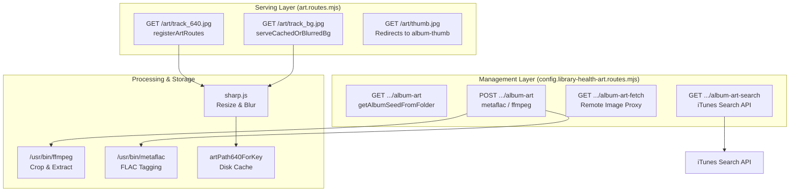
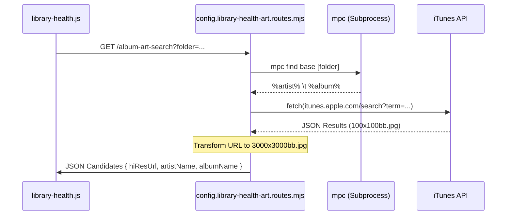

# Static Album Art

<details>
<summary>Relevant source files</summary>

The following files were used as context for generating this wiki page:

- [notes/refactor-plan-pi-first.md](notes/refactor-plan-pi-first.md)
- [src/routes/art.routes.mjs](src/routes/art.routes.mjs)
- [src/routes/config.library-health-animated-art.routes.mjs](src/routes/config.library-health-animated-art.routes.mjs)
- [src/routes/config.library-health-art.routes.mjs](src/routes/config.library-health-art.routes.mjs)
- [src/routes/config.library-health-batch.routes.mjs](src/routes/config.library-health-batch.routes.mjs)
- [src/routes/config.library-health-genre.routes.mjs](src/routes/config.library-health-genre.routes.mjs)
- [src/routes/config.library-health-read.routes.mjs](src/routes/config.library-health-read.routes.mjs)
- [src/routes/config.queue-wizard-preview.routes.mjs](src/routes/config.queue-wizard-preview.routes.mjs)

</details>


## Purpose and Scope

This page documents the static album artwork management system, which handles searching, retrieving, and applying traditional album cover images. Static art is served via dedicated `/art/*` routes and managed through the Library Health interface. The system integrates with the iTunes Search API for candidate discovery and uses `sharp`, `ffmpeg`, and `metaflac` for processing and embedding.

**Sources:** [src/routes/config.library-health-art.routes.mjs:1-320](), [src/routes/art.routes.mjs:1-240]()

---

## System Overview

The static album art system provides three storage and delivery mechanisms for album artwork, each serving different use cases in the MPD/moOde ecosystem:

| Storage Mode | Location | Format | Use Case |
|--------------|----------|--------|----------|
| **Standalone File** | `cover.jpg` in album folder | JPEG/PNG | Displayed by moOde UI, cached by MPD |
| **Embedded Metadata** | PICTURE block in FLAC files | JPEG | Portable with audio files, survives folder moves |
| **Server Cache** | `.cache/art-640/` | JPEG | Optimized 640x640 versions for UI performance |

The system can operate in three modes when applying artwork via the Library Health API: `cover` (file only), `embed` (metadata only), or `both`.

**Sources:** [src/routes/config.library-health-art.routes.mjs:173-186](), [src/routes/art.routes.mjs:132-140]()

---

## Architecture: API Routes and Data Flow

The system is split between management routes (under `/config/library-health/*`) and serving routes (under `/art/*`).

### Static Art Component Mapping
The following diagram maps the natural language requirements to the specific code entities responsible for execution.



**Sources:** [src/routes/art.routes.mjs:87-238](), [src/routes/config.library-health-art.routes.mjs:9-319]()

---

## Art Serving and Caching Strategy

The `/art/*` routes provide optimized imagery for the Now Playing displays. They utilize a multi-stage resolution and caching strategy.

### Resolution Pipeline (`/art/track_640.jpg`)

When a request for `track_640.jpg` is made:
1. **Cache Check**: The system checks if a 640x640 version already exists in the local cache using a key derived from `normalizeArtKey(best)` [src/routes/art.routes.mjs:43-53]().
2. **Moode Proxy**: If not cached, it fetches the raw cover from moOde's `coverart.php` or a remote URL via `fetchMoodeCoverBytes` [src/routes/art.routes.mjs:5-21]().
3. **Processing**: It uses `sharp` to rotate (respecting EXIF), resize to 640x640 (fit: inside), and convert to optimized JPEG (quality 82, mozjpeg: true) [src/routes/art.routes.mjs:23-38]().
4. **Self-Heal Fallback**: If a specific file's art fails to resolve, it attempts `resolveBestArtForCurrentSong` to avoid blank UI elements [src/routes/art.routes.mjs:159-167]().

### Blurred Backgrounds (`/art/track_bg.jpg`)

For background "hero" images, the system applies a heavy blur:
- **Filter**: `.blur(18)` using `sharp` [src/routes/art.routes.mjs:78]().
- **Format**: Lower quality JPEG (quality 70) to reduce payload size for large background images [src/routes/art.routes.mjs:79]().

**Sources:** [src/routes/art.routes.mjs:59-85](), [src/routes/art.routes.mjs:111-172]()

---

## Album Art Search via iTunes API

The `album-art-search` endpoint queries the iTunes Search API to find high-quality candidates.

### Candidate Discovery Logic
The following diagram illustrates the data flow from folder input to iTunes candidate results.



1. **Metadata Extraction**: Uses `mpc find base <folder>` to get `%artist%` and `%album%` from the target directory [src/routes/config.library-health-art.routes.mjs:12-25]().
2. **iTunes Query**: Searches `https://itunes.apple.com/search?entity=album&term=...` [src/routes/config.library-health-art.routes.mjs:39]().
3. **Hi-Res Transformation**: iTunes returns thumbnails (e.g., `100x100bb.jpg`). The system programmatically transforms these to `3000x3000bb.jpg` to retrieve the highest resolution original [src/routes/config.library-health-art.routes.mjs:51-54]().
4. **Validation**: Filters results to ensure a substring match between the library metadata and the iTunes result [src/routes/config.library-health-art.routes.mjs:58-62]().

**Sources:** [src/routes/config.library-health-art.routes.mjs:28-68]()

---

## Art Retrieval and Fallbacks

The `GET /config/library-health/album-art` endpoint retrieves existing artwork, supporting both standalone files and embedded metadata.

### File Search Priority
The system searches for files in the following order: `cover.jpg`, `folder.jpg`, `front.jpg` (including `.jpeg` and `.png` extensions) [src/routes/config.library-health-art.routes.mjs:109]().

### Path Resolution Strategy
Because MPD uses virtual paths, the system maps them to physical `/mnt/` locations via `resolveLocalMusicPath` (or inline candidate logic):
```javascript
const localCandidates = [
  folder.startsWith('USB/SamsungMoode/') ? '/mnt/SamsungMoode/' + folder.slice('USB/SamsungMoode/'.length) : '',
  folder.startsWith('OSDISK/') ? '/mnt/OSDISK/' + folder.slice('OSDISK/'.length) : '',
  '/mnt/SamsungMoode/' + folder,
  '/mnt/OSDISK/' + folder,
]
```
**Sources:** [src/routes/config.library-health-art.routes.mjs:98-105](), [src/routes/config.library-health-read.routes.mjs:22-50]()

### Fallback: Embedded Extraction
If no file is found, the system uses `ffmpeg` to extract the first video frame from the audio file itself:
`ffmpeg -y -i <track> -an -vframes 1 /tmp/embedded.jpg` [src/routes/config.library-health-art.routes.mjs:146]().

---

## Art Application: Writing and Embedding

The `POST /config/library-health/album-art` endpoint applies artwork.

### Image Preprocessing Pipeline
Before saving, the system performs a square crop to ensure UI consistency:
1. **Crop**: `ffmpeg -vf "crop='min(iw,ih)':'min(iw,ih)'"` [src/routes/config.library-health-art.routes.mjs:201]().
2. **Quality**: Set to `-q:v 2` (High Quality JPEG) [src/routes/config.library-health-art.routes.mjs:201]().

### Application Modes
- **File Mode**: Writes the processed image to the resolved album directory as `cover.jpg` [src/routes/config.library-health-art.routes.mjs:283-297]().
- **Embed Mode**: Iterates through all FLAC files in the folder and uses `metaflac` to remove existing PICTURE blocks and import the new one [src/routes/config.library-health-art.routes.mjs:252-268]().
- **MPD Sync**: Triggers `mpc -w update` to ensure the changes are reflected in the player database [src/routes/config.library-health-art.routes.mjs:302]().

**Sources:** [src/routes/config.library-health-art.routes.mjs:192-319]()

---

## API Reference Summary

| Endpoint | Method | Purpose |
|----------|--------|---------|
| `/art/track_640.jpg` | GET | Serves 640x640 square art (cached) |
| `/art/track_bg.jpg` | GET | Serves blurred background art (cached) |
| `/config/library-health/album-art-search` | GET | Searches iTunes API for HQ candidates |
| `/config/library-health/album-art` | GET | Retrieves current art (file or embedded) |
| `/config/library-health/album-art` | POST | Applies new art to files/folders |

**Sources:** [src/routes/art.routes.mjs:87-238](), [src/routes/config.library-health-art.routes.mjs:9-319]()
