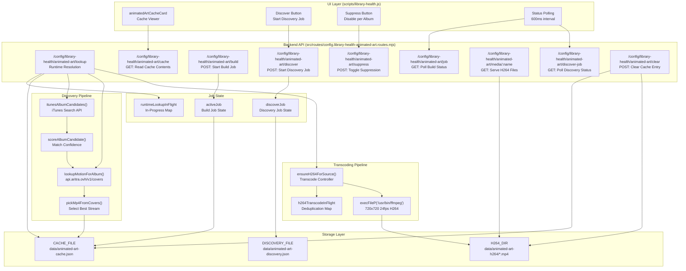
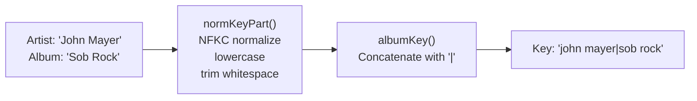
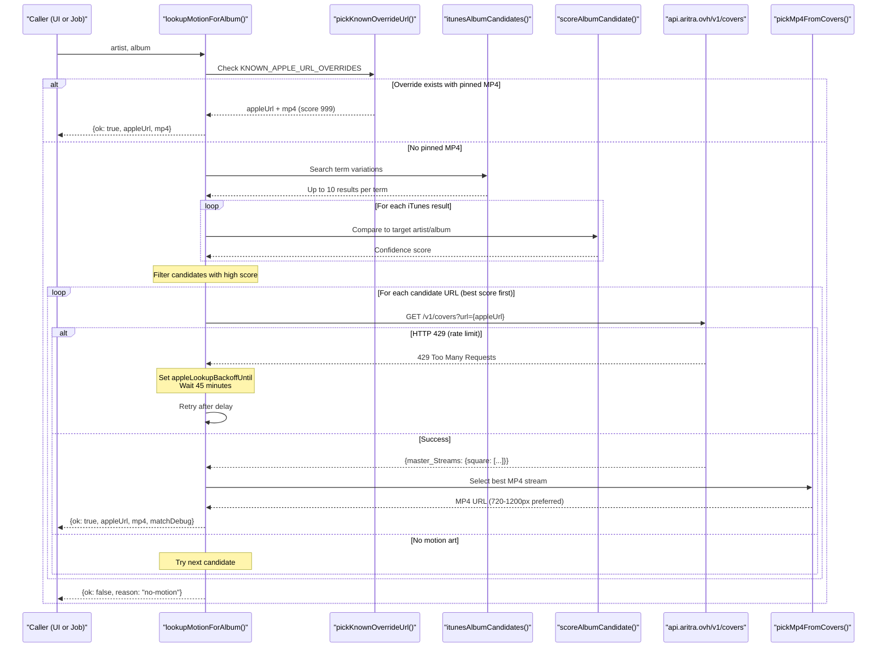
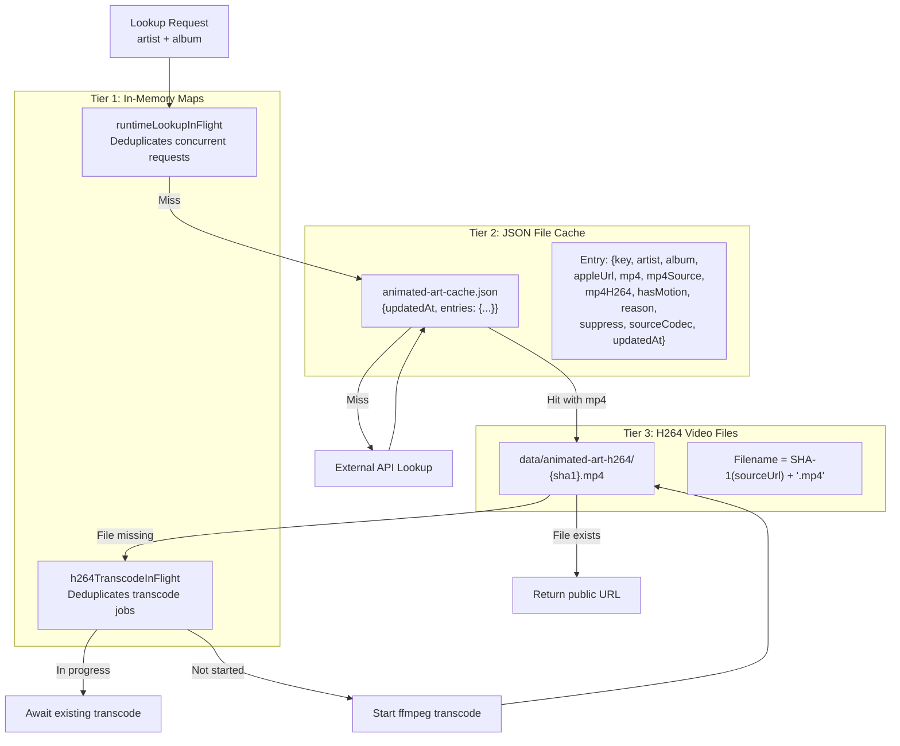
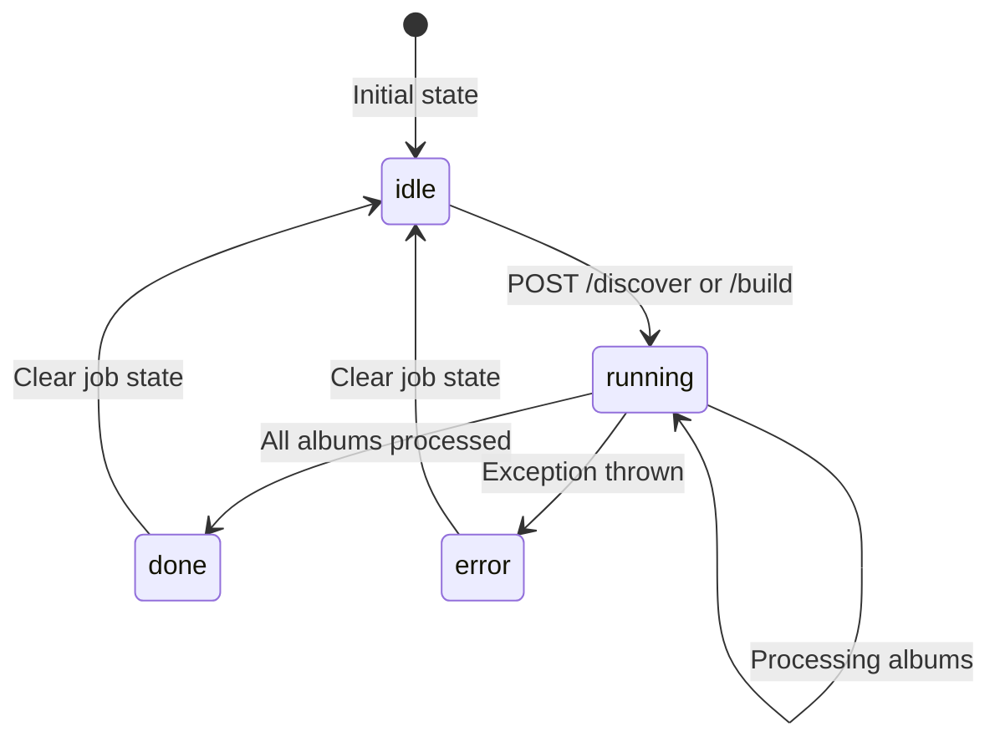

# Animated Art System

Relevant source files

The following files were used as context for generating this wiki page:

- [library-health.html](library-health.html)
- [notes/refactor-plan-pi-first.md](notes/refactor-plan-pi-first.md)
- [scripts/library-health.js](scripts/library-health.js)
- [src/routes/config.library-health-animated-art.routes.mjs](src/routes/config.library-health-animated-art.routes.mjs)
- [src/routes/config.library-health-art.routes.mjs](src/routes/config.library-health-art.routes.mjs)
- [src/routes/config.library-health-batch.routes.mjs](src/routes/config.library-health-batch.routes.mjs)
- [src/routes/config.library-health-genre.routes.mjs](src/routes/config.library-health-genre.routes.mjs)
- [src/routes/config.queue-wizard-preview.routes.mjs](src/routes/config.queue-wizard-preview.routes.mjs)
- [src/routes/config.routes.mjs](src/routes/config.routes.mjs)

## Purpose

The Animated Art System discovers and serves motion album artwork for the now-playing display. When Apple Music has released an album with animated cover art, this system locates the motion video, transcodes it to browser-compatible H264, and caches it locally for instant playback. The system operates in two modes: **runtime lookup** (on-demand resolution for the currently playing album) and **discovery jobs** (batch processing of the entire music library).

For static album art management (cover.jpg, embedded FLAC images, iTunes search), see [Static Album Art](5.2). For the library health dashboard that hosts the animated art UI, see [Library Health Dashboard](5.1).

---

## Architecture Overview

The system consists of three major components: a discovery pipeline that queries external APIs, an H264 transcoding pipeline that converts videos to browser-compatible format, and a multi-tier cache that prevents redundant API calls.

### System Entity Map

The following diagram maps high-level system components to their corresponding code entities and file locations.

Sources: [src/routes/config.library-health-animated-art.routes.mjs:10-179](), [scripts/library-health.js:10-27]()

---

## Discovery Pipeline

### Album Key Generation

The system normalizes artist and album names into a canonical key format to ensure consistent cache lookups across metadata variations:

The `normKeyPart()` function handles Unicode normalization, quote standardization, and whitespace collapsing to ensure metadata variations produce the same key.

Sources: [src/routes/config.library-health-animated-art.routes.mjs:139-151]()

### iTunes Candidate Scoring

The system queries iTunes with multiple search strategies, then scores each candidate album based on artist/album name similarity:

| Match Type | Score Weight | Description |
|------------|--------------|-------------|
| Exact album match | +8 | Normalized album names are identical |
| Exact artist match | +5 | Normalized artist names are identical |
| Album substring match | +4 | One album name contains the other |
| Related album words | +3 | 2+ significant words overlap |
| Artist substring match | +2 | One artist name contains the other |

The scoring logic accumlates these weights, and only candidates with a high enough confidence proceed to motion art lookup. This threshold prevents false positives while allowing fuzzy matching for albums with deluxe editions or remaster suffixes.

Sources: [src/routes/config.library-health-animated-art.routes.mjs:181-210](), [src/routes/config.library-health-animated-art.routes.mjs:234-256]()

### Motion Art Resolution Sequence

Sources: [src/routes/config.library-health-animated-art.routes.mjs:14-41](), [src/routes/config.library-health-animated-art.routes.mjs:131-137]()

### Known Overrides

The system maintains hardcoded overrides in `KNOWN_APPLE_URL_OVERRIDES` and `KNOWN_MP4_OVERRIDES` for albums where automated search produces incorrect results or no results. These overrides bypass the iTunes search and candidate scoring entirely.

Sources: [src/routes/config.library-health-animated-art.routes.mjs:14-41]()

---

## Cache System

The animated art system implements a three-tier caching strategy to minimize external API calls and transcoding operations:

### Data Flow and Caching Strategy

Sources: [src/routes/config.library-health-animated-art.routes.mjs:10-12](), [src/routes/config.library-health-animated-art.routes.mjs:43-48](), [src/routes/config.library-health-animated-art.routes.mjs:163-170]()

### Cache Entry Structure

Each entry in `animated-art-cache.json` contains metadata about the found art, including the original source URL (`mp4Source`) and the local transcoded URL (`mp4H264`). If no art is found, the `reason` field explains why (e.g., "no-motion").

Sources: [src/routes/config.library-health-animated-art.routes.mjs:163-170]()

### Request Deduplication

The `runtimeLookupInFlight` Map prevents concurrent API calls for the same album. This pattern ensures that if multiple concurrent requests arrive for the same album, only one iTunes + Aritra API call executes.

Sources: [src/routes/config.library-health-animated-art.routes.mjs:47]()

---

## H264 Transcoding Pipeline

Motion art videos from Apple Music use codecs optimized for Apple devices but not always compatible with all browsers. The system transcodes them to H264 baseline profile with faststart flag for universal compatibility using `/usr/bin/ffmpeg`.

### Transcoding Parameters

The `ensureH264ForSource()` function executes `ffmpeg` with the following parameters:

*   `-an`: Removes audio streams.
*   `-vf scale=720:720:flags=lanczos`: Resizes to 720x720.
*   `-r 24`: Forces 24 frames per second.
*   `-c:v libx264`: Uses H264 video codec.
*   `-preset veryfast`: Balances speed and compression.
*   `-crf 30`: Constant Rate Factor for quality.
*   `-pix_fmt yuv420p`: Ensures pixel format compatibility.
*   `-movflags +faststart`: Enables progressive streaming.

Sources: [src/routes/config.library-health-animated-art.routes.mjs:87-129](), [src/routes/config.library-health-animated-art.routes.mjs:104-118]()

### File Naming and URL Mapping

The `h264FilenameForSource()` function generates deterministic filenames by SHA-1 hashing the source URL. This ensures same source URL always maps to the same local file, enabling cache reuse.

Sources: [src/routes/config.library-health-animated-art.routes.mjs:62-73]()

---

## API Endpoints

### Runtime Lookup: `/config/library-health/animated-art/lookup`

Performs on-demand resolution. If the local H264 file is missing, the system will trigger a JIT transcode via `ensureH264ForSource()`.

Sources: [src/routes/config.library-health-animated-art.routes.mjs:87-129]()

### Discovery Job: `/config/library-health/animated-art/discover`

Starts a background discovery job managed by `discoverJob`. This scans the music library and probes for motion art availability, writing results to `animated-art-discovery.json`.

Sources: [src/routes/config.library-health-animated-art.routes.mjs:11](), [src/routes/config.library-health-animated-art.routes.mjs:44]()

### Build Job: `/config/library-health/animated-art/build`

Starts a background build job managed by `activeJob`. This populates the main `animated-art-cache.json` used by the now-playing display.

Sources: [src/routes/config.library-health-animated-art.routes.mjs:10](), [src/routes/config.library-health-animated-art.routes.mjs:43]()

### Media Serving: `/config/library-health/animated-art/media/:name`

Serves transcoded H264 video files from `H264_DIR`.

Sources: [src/routes/config.library-health-animated-art.routes.mjs:12](), [src/routes/config.library-health-animated-art.routes.mjs:70-73]()

---

## Job System

Both discovery and build jobs run asynchronously in the background. The system maintains global job state objects (`discoverJob` and `activeJob`) that track progress.

### Job Lifecycle and Polling

The UI in `library-health.js` polls job status to provide live progress updates to the user.

Sources: [src/routes/config.library-health-animated-art.routes.mjs:43-44](), [scripts/library-health.js:9]()

### Rate Limiting and Backoff

The system implements rate limiting for external APIs:
1.  **iTunes Search API**: Enforced via `waitForAppleItunesSlot()`, maintaining a ~3.4s delay between requests.
2.  **Aritra Covers API**: If an HTTP 429 is received, `appleLookupBackoffUntil` is set to suppress further external lookups for a cooldown period.

Sources: [src/routes/config.library-health-animated-art.routes.mjs:131-137](), [src/routes/config.library-health-animated-art.routes.mjs:45]()
