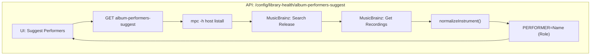
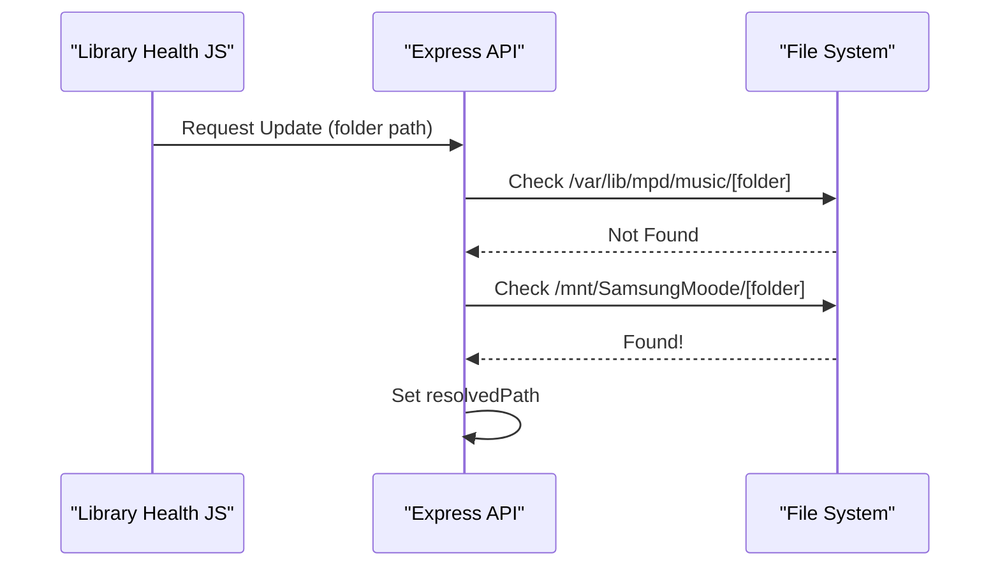
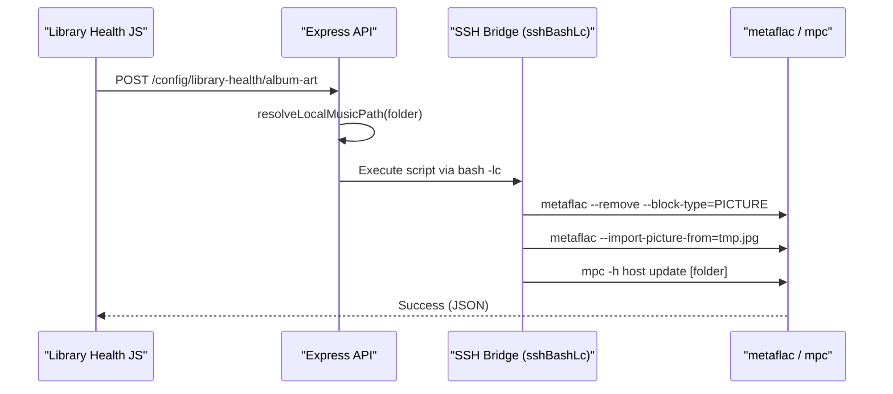

# Metadata Inspector

<details>
<summary>Relevant source files</summary>

The following files were used as context for generating this wiki page:

- [library-health.html](library-health.html)
- [scripts/alexa.js](scripts/alexa.js)
- [scripts/library-health.js](scripts/library-health.js)
- [src/routes/config.library-health-performers.routes.mjs](src/routes/config.library-health-performers.routes.mjs)
- [src/routes/config.routes.mjs](src/routes/config.routes.mjs)

</details>


The Metadata Inspector provides album-level metadata editing capabilities within the Library Health Dashboard. It enables users to update album artwork, perform performer tagging via MusicBrainz, apply genre corrections, and perform "feat-cleanup" normalization for entire albums at once. This system bridges high-quality external metadata (iTunes, MusicBrainz) with local file tagging using `metaflac` and MPD sticker database updates.

---

## Album Selection & Context

The metadata inspector operates on a single album at a time, tracked through the album context system. Users select an album from the full library inventory to begin inspection.

### Album Inventory & Sorting
The album inventory displays all albums in the library with sorting persisted to `localStorage` under key `nowplaying.libraryHealth.albumSortMode`.

| Mode | Description | Implementation |
|------|-------------|----------------|
| `alpha` | Album title A→Z | Sorts by normalized album name, then artist |
| `artistAlbum` | Artist→Album | Sorts by artist name first, then album name |
| `oldest` | Oldest added first | Sorts by `addedTs` ascending |
| `newest` | Newest added first | Sorts by `addedTs` descending |

**Sources:** [scripts/library-health.js:11](), [scripts/library-health.js:549-612]()

### Context Management
When a user clicks "Inspect", the `setAlbumContext(folder)` function updates the UI state and prepares the inspector modules.

**Code Entity Space Mapping**
The following diagram maps UI interactions to the internal state functions and DOM elements.

```mermaid
graph LR
    subgraph "Natural Language Space"
    "Select Album" --> "Update UI Context"
    "Update UI Context" --> "Show Inspector"
    end

    subgraph "Code Entity Space"
    setAlbumContext["setAlbumContext(folder)"]
    badge["ID: albumContextBadge"]
    text["ID: albumContextText"]
    inspector["ID: albumMetaInspector"]
    
    setAlbumContext -->|"updates textContent"| text
    setAlbumContext -->|"toggles display"| badge
    badge -->|"indicates active"| inspector
    end
```

**Sources:** [scripts/library-health.js:39-51](), [scripts/library-health.js:892-908](), [library-health.html:32]()

---

## Performer Tagging (metaflac)

The Performer Inspector allows for deep tagging of contributors (musicians, producers) using MusicBrainz data. It automates the `metaflac` command-line workflow to write `PERFORMER` and `PRODUCER` tags to FLAC files.

### Performer Suggestion Pipeline
The system queries MusicBrainz to find matching releases and recordings, then extracts relationship data.



**Sources:** [src/routes/config.library-health-performers.routes.mjs:31-74](), [src/routes/config.library-health-performers.routes.mjs:102-162]()

### Normalization Logic
Instruments are normalized to standard categories to ensure consistent tagging across the library. For example, "drum set" or "drums set" is mapped to "drums", and "electric bass" is mapped to "bass".

**Sources:** [src/routes/config.library-health-performers.routes.mjs:78-86]()

---

## Album Art Inspector

The album art inspector (`aaModule`) provides a workflow for searching, previewing, and applying high-quality artwork.

### Art Update Workflow
The system supports three application modes:
1. **cover**: Writes `cover.jpg` to the album folder.
2. **embed**: Uses `metaflac --import-picture-from` to embed art into FLAC files.
3. **both**: Performs both operations simultaneously.

### Backend Processing (FFmpeg)
Before application, the image is processed via FFmpeg to ensure it is a square JPEG:
- **Cropping**: `ffmpeg -vf "crop='min(iw,ih)':'min(iw,ih)'"`
- **Scaling**: Downscaled if necessary for embedding efficiency.

**Sources:** [src/routes/config.library-health-art.routes.mjs:174-220](), [src/routes/config.library-health-art.routes.mjs:248-268]()

---

## Genre Correction & Feat-Cleanup

The system identifies "Library Health" issues including missing genres and inconsistent artist naming (e.g., "Artist feat. Guest" vs "Artist").

### Genre Correction
The `agModule` allows batch updating the `GENRE` tag for all tracks in a folder. It populates a dropdown with existing genres from the library to encourage consistency.

**Sources:** [scripts/library-health.js:714-747](), [scripts/library-health.js:1031-1053]()

### Feat-Cleanup Normalization
The "Feat-Cleanup" tool identifies tracks where the artist name contains "feat.", "ft.", or "&". It allows users to move these guest artists into the `PERFORMER` tag while keeping the main `ARTIST` tag clean.

**Sources:** [scripts/library-health.js:1055-1080]()

---

## MBID Tracking

The library scan (`computeLibraryHealthSnapshot`) checks for the `MUSICBRAINZ_TRACKID` tag. If missing from the file tags, it attempts to resolve it from the MPD sticker database (`mb_trackid`).

**Sources:** [src/routes/config.library-health-read.routes.mjs:147-152]()

---

## Folder Selection Hierarchy

The inspector uses robust path resolution logic to map MPD virtual paths to local filesystem paths. This is critical for `metaflac` operations which require direct file access on the moOde server.

### Path Resolution Logic
The `resolveLocalMusicPath` function checks candidates in order to handle different mounting configurations.



**Sources:** [src/routes/config.library-health-read.routes.mjs:22-50](), [src/routes/config.library-health-art.routes.mjs:225-242]()

---

## Data Flow: Metadata Update

This diagram illustrates the flow of a metadata update from the UI through the SSH bridge to the final system tools.



**Sources:** [src/routes/config.library-health-art.routes.mjs:174-319](), [src/routes/config.library-health-read.routes.mjs:56-61](), [src/routes/config.library-health-performers.routes.mjs:21-26]()
