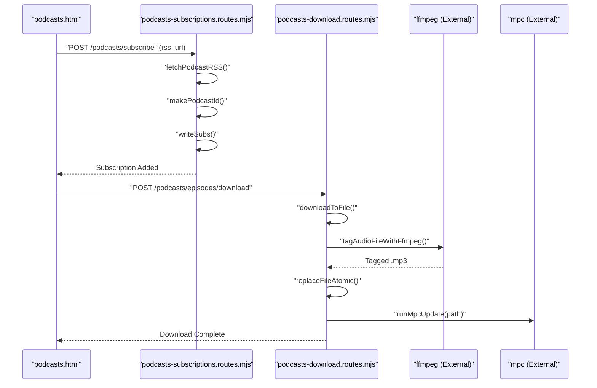
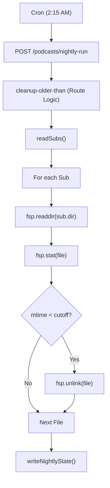

# Podcast Management

Relevant source files

The following files were used as context for generating this wiki page:

- [config.html](config.html)
- [docs/01-config.md](docs/01-config.md)
- [docs/02-diagnostics.md](docs/02-diagnostics.md)
- [docs/05-queue-wizard.md](docs/05-queue-wizard.md)
- [docs/06-radio.md](docs/06-radio.md)
- [docs/07-podcasts.md](docs/07-podcasts.md)
- [podcasts.html](podcasts.html)
- [scripts/podcasts.js](scripts/podcasts.js)
- [src/config.mjs](src/config.mjs)
- [src/routes/podcasts-download.routes.mjs](src/routes/podcasts-download.routes.mjs)
- [src/routes/podcasts-refresh.routes.mjs](src/routes/podcasts-refresh.routes.mjs)
- [src/routes/podcasts-subscriptions.routes.mjs](src/routes/podcasts-subscriptions.routes.mjs)

The Podcast Management subsystem provides RSS feed subscriptions, episode downloads with `ffmpeg` metadata embedding, atomic file writes, and retention cleanup. It integrates with moOde's MPD playback by generating local M3U playlists and enriching now-playing metadata using a sidecar JSON format.

---

## Overview

The podcast system enables:

- **RSS Subscription Management**: Add and manage feeds via `podcasts.html` [podcasts.html:1-104]().
- **Episode Downloads**: Fetch audio files and embed show/episode metadata using `ffmpeg` [src/routes/podcasts-download.routes.mjs:28-36]().
- **Atomic File Operations**: Ensures data integrity during index rebuilds and downloads [src/routes/podcasts-download.routes.mjs:30-30]().
- **Retention Policies**: Automatic cleanup of episodes older than a configured number of days [src/routes/podcasts-download.routes.mjs:89-138]().
- **Nightly Automation**: A dedicated cron endpoint for background maintenance [scripts/podcasts.js:36-39]().

**Sources:**
- [podcasts.html:1-104]()
- [src/routes/podcasts-download.routes.mjs:1-138]()
- [scripts/podcasts.js:1-40]()

---

## Architecture & Data Flow

The system bridges the "Natural Language Space" of user subscriptions to the "Code Entity Space" of filesystem paths and API routes.

### System Entity Map
| Logic Entity | Code Identifier / Path | Description |
| :--- | :--- | :--- |
| **Subscription List** | `readSubs()` / `subscriptions.json` | Master list of RSS feeds and local directories [src/routes/podcasts-subscriptions.routes.mjs:8-9](). |
| **Episode Index** | `mapJson` / `pod-*.json` | Sidecar JSON mapping episode URLs to local filenames [src/routes/podcasts-subscriptions.routes.mjs:35-42](). |
| **Download Engine** | `registerPodcastDownloadRoutes` | Express routes for downloading and tagging [src/routes/podcasts-download.routes.mjs:8-8](). |
| **Cleanup Logic** | `/podcasts/cleanup-older-than` | Logic for removing expired media files [src/routes/podcasts-download.routes.mjs:89-89](). |
| **Nightly State** | `NIGHTLY_STATE_PATH` | Persists status of the last automated run [src/routes/podcasts-download.routes.mjs:9-18](). |

### Process Flow: Subscription to Playback
The following diagram illustrates how a subscription is processed into a playable moOde entity.

**Diagram: Podcast Ingestion Pipeline**

**Sources:**
- [src/routes/podcasts-subscriptions.routes.mjs:54-153]()
- [src/routes/podcasts-download.routes.mjs:43-60]()
- [src/routes/podcasts-download.routes.mjs:27-30]()

---

## Subscription & Indexing

### Subscription Format
Subscriptions are managed via `readSubs()` and `writeSubs()` [src/routes/podcasts-subscriptions.routes.mjs:8-9](). Each entry includes the RSS URL, local directory (`dir`), and a `mapJson` path which acts as the sidecar metadata store [src/routes/podcasts-subscriptions.routes.mjs:91-94]().

### Sidecar JSON (mapJson)
The `mapJson` file is critical for mapping MPD's "Unknown Artist" files back to rich podcast metadata. It stores:
- **itemsByUrl**: A map of enclosure URLs to local metadata [src/routes/podcasts-subscriptions.routes.mjs:38-40]().
- **filename**: The 12-character SHA1 hash used as the local filename [src/routes/podcasts-download.routes.mjs:26-26]().
- **title/date**: Metadata extracted from the RSS feed [src/routes/podcasts-subscriptions.routes.mjs:31-44]().

**Sources:**
- [src/routes/podcasts-subscriptions.routes.mjs:1-100]()
- [src/routes/podcasts-download.routes.mjs:20-41]()

---

## Episode Download & Metadata

Downloads are handled by `downloadToFile` and enriched using `ffmpeg` [src/routes/podcasts-download.routes.mjs:27-28]().

### Metadata Embedding
The system uses `tagAudioFileWithFfmpeg` to inject standard ID3 tags into downloaded files [src/routes/podcasts-download.routes.mjs:36-36]().
- **FFMPEG Path**: Defaults to `/usr/bin/ffmpeg` [src/config.mjs:15-15]().
- **Atomic Writes**: `replaceFileAtomic` is used to prevent MPD from reading partially downloaded or tagged files [src/routes/podcasts-download.routes.mjs:30-30]().

### Local ID Generation
Episode filenames are generated using `makePodcastId` for show folders and `safeFileName` for episode files to ensure compatibility with moOde's filesystem [src/routes/podcasts-download.routes.mjs:23-26]().

**Sources:**
- [src/routes/podcasts-download.routes.mjs:20-41]()
- [src/config.mjs:15-15]()

---

## Retention & Automation

### Nightly Run Endpoint
The `/podcasts/nightly-run` endpoint (triggered via Cron) performs maintenance tasks [scripts/podcasts.js:36-39]().
- **Retention Cleanup**: Deletes files older than `retentionDays` (default 30) [src/routes/podcasts-download.routes.mjs:81-93]().
- **State Tracking**: Writes results to `NIGHTLY_STATE_PATH` (`/tmp/now-playing-podcasts-nightly.json`) [src/routes/podcasts-download.routes.mjs:9-18]().

**Diagram: Maintenance & Cleanup Logic**

**Sources:**
- [src/routes/podcasts-download.routes.mjs:89-138]()
- [scripts/podcasts.js:36-39]()

---

## UI Integration

The interface in `podcasts.html` provides a dashboard for monitoring subscription health and automation status.

- **Status Pills**: Visual indicators for API, Web, Alexa, and moOde connectivity [scripts/podcasts.js:49-62]().
- **Episode Modal**: Triggered by `openModal()`, it allows users to browse feed items, trigger manual downloads, or delete local files [scripts/podcasts.js:128-161]().
- **Retention Controls**: UI elements for toggling `retentionEnabled` and setting `retentionDays` [scripts/podcasts.js:14-17]().

**Sources:**
- [podcasts.html:85-117]()
- [scripts/podcasts.js:41-104]()
- [scripts/podcasts.js:128-161]()
