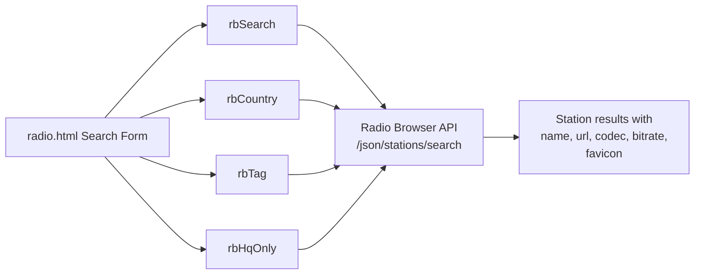
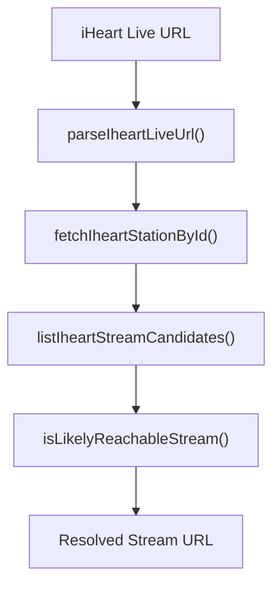
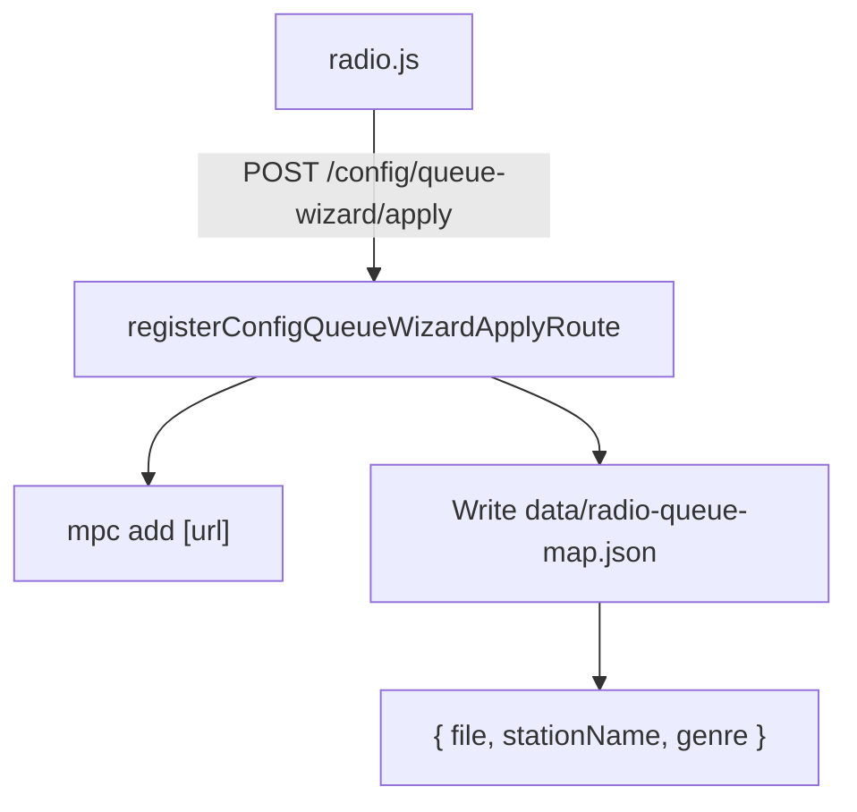
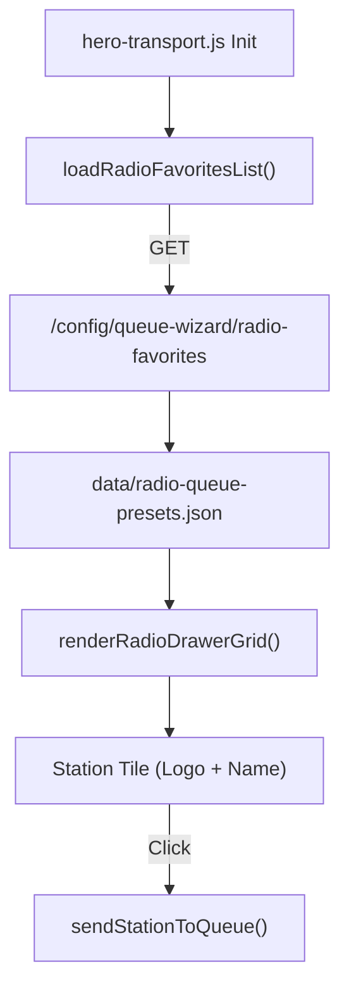

# Radio Station Browser

Relevant source files

The following files were used as context for generating this wiki page:

- [alexa.html](alexa.html)
- [config/radio-logo-aliases.json](config/radio-logo-aliases.json)
- [controller-podcasts.html](controller-podcasts.html)
- [controller-radio.html](controller-radio.html)
- [radio.html](radio.html)
- [scripts/hero-transport.js](scripts/hero-transport.js)
- [scripts/radio.js](scripts/radio.js)
- [src/lib/browse-index.mjs](src/lib/browse-index.mjs)
- [src/lib/lastfm-library-match.mjs](src/lib/lastfm-library-match.mjs)
- [src/routes/config.queue-wizard-apply.routes.mjs](src/routes/config.queue-wizard-apply.routes.mjs)
- [src/routes/config.queue-wizard-basic.routes.mjs](src/routes/config.queue-wizard-basic.routes.mjs)

## Purpose and Scope

This document covers the radio station management system in the now-playing codebase, including:

- The **radio.html** interface for browsing and adding stations [radio.html:1-202]().
- Integration with the **Radio Browser** global directory and **iHeart Radio** stream resolution [src/routes/config.queue-wizard-basic.routes.mjs:79-162]().
- **Favorites management** via the backend and the **Hero Favorites Drawer** in `hero-transport.js` [scripts/hero-transport.js:619-685]().
- **Manual stream entry** and logo aliasing via `radio-logo-aliases.json` [config/radio-logo-aliases.json:1-24]().
- The **metadata holdback system** for stabilizing rapidly-changing stream metadata [scripts/hero-transport.js:11-31]().

---

## Radio Stations Interface Overview

The radio stations system provides two primary interfaces for station management:

1.  **Radio.html**: A full-featured station browser and manager [radio.html:1-202]().
2.  **Hero Favorites Drawer**: A quick-access side panel for favorite stations integrated into the transport layer [scripts/hero-transport.js:619-685]().

The `radio.html` page supports three main workflows:

| Workflow | Description | Primary Use Case |
| :--- | :--- | :--- |
| **Global Directory Search** | Browse Radio Browser API with filters | Discovering new stations worldwide |
| **Manual Stream Addition** | Add custom stream URLs with optional metadata | Adding unlisted or private streams |
| **Catalog Management** | Filter and organize moOde's existing stations | Managing your station library |

Sources: [radio.html:1-202](), [scripts/radio.js:1-150]()

---

## Radio Browser & iHeart Integration

The system integrates with the Radio Browser API (`api.radio-browser.info`) and provides specialized resolution for iHeart Radio URLs.

### Search and Filter Parameters

Sources: [radio.html:140-147](), [scripts/radio.js:107-114]()

### iHeart Stream Resolution
The backend includes a specialized resolver for iHeart Radio "Live" URLs, which fetches station IDs and lists stream candidates (Shoutcast, HLS, PLS) from the iHeart API via `fetchIheartStationById` [src/routes/config.queue-wizard-basic.routes.mjs:114-124]().

Sources: [src/routes/config.queue-wizard-basic.routes.mjs:79-176]()

---

## Manual Stream Entry and Aliasing

The interface supports adding arbitrary stream URLs. To improve visual consistency, the system uses a logo alias map to associate stream hostnames with known station logos.

### Radio Logo Aliases
The file `config/radio-logo-aliases.json` maps hostnames or station names to canonical names used for logo lookups [config/radio-logo-aliases.json:1-24]().

| Host/Name Key | Canonical Station Name |
| :--- | :--- |
| `live-radio01.mediahubaustralia.com` | Jazz FM 91 |
| `knkx-live-a.edge.audiocdn.com` | Jazz24 |
| `stream.wfmt.com` | WFMT Chicago 98.7 - Classical |

Sources: [config/radio-logo-aliases.json:1-24]()

---

## Queue Integration and Station Metadata

Stations are sent to the moOde queue via the `/config/queue-wizard/apply` endpoint [src/routes/config.queue-wizard-apply.routes.mjs:19-21]().

### Queue Application
When a station is added, the system can operate in `replace`, `append`, or `crop` modes [src/routes/config.queue-wizard-apply.routes.mjs:23-40](). It specifically persists a `radio-queue-map.json` to store station names and genres for the newly added streams, ensuring the UI can display correct metadata even if the stream headers are delayed [src/routes/config.queue-wizard-apply.routes.mjs:120-137]().

Sources: [src/routes/config.queue-wizard-apply.routes.mjs:19-138](), [scripts/radio.js:183-186]()

---

## Hero Transport Favorites Drawer

A persistent favorites drawer in `hero-transport.js` provides quick access to favorite stations from any page displaying the transport bar [scripts/hero-transport.js:619-685]().

### Drawer Architecture
The drawer is a slide-out panel containing a grid of favorite station tiles. It utilizes `localStorage` to persist the open/closed state.

| Entity | Role |
| :--- | :--- |
| `heroRadioDrawer` | The `aside` element containing the favorites grid [scripts/hero-transport.js:630](). |
| `heroFavTab` | The clickable tab that toggles the drawer [scripts/hero-transport.js:621](). |
| `renderRadioDrawerGrid()` | Populates the drawer with tiles from the favorites list [scripts/hero-transport.js:712](). |
| `sendStationToQueue()` | Handles the logic of clearing the queue and playing the selected station [scripts/hero-transport.js:758](). |

### Favorites Data Flow

Sources: [scripts/hero-transport.js:619-758](), [src/routes/config.queue-wizard-basic.routes.mjs:10-15]()

---

## Metadata Holdback System

Radio streams often broadcast rapidly-changing metadata (especially classical stations). The holdback system prevents UI thrashing by stabilizing updates.

### Abbreviation Expansion
The `expandInstrumentAbbrevs` function in `hero-transport.js` normalizes classical music shorthand (e.g., "vln" to "violin", "p" to "piano") to improve readability in the UI [scripts/hero-transport.js:11-31]().

Sources: [scripts/hero-transport.js:11-31]()
