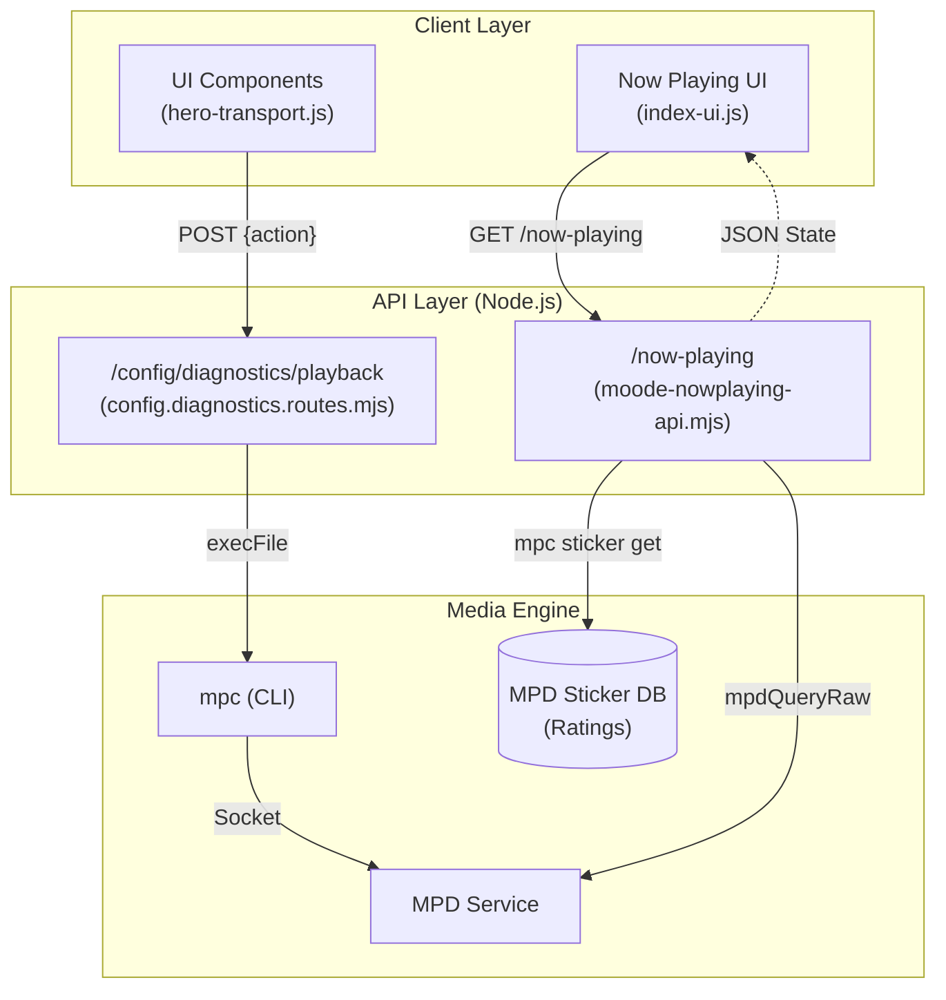
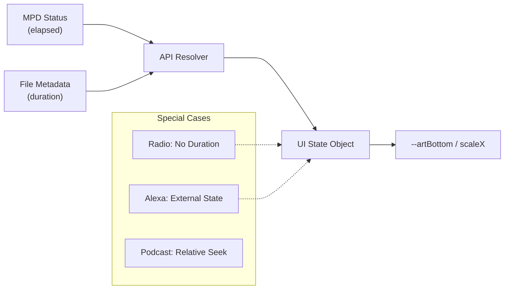

# Playback Features

Relevant source files

The following files were used as context for generating this wiki page:

- [alexa.html](alexa.html)
- [index.html](index.html)
- [moode-nowplaying-api.mjs](moode-nowplaying-api.mjs)
- [player-render.html](player-render.html)
- [player.html](player.html)
- [radio.html](radio.html)
- [scripts/hero-transport.js](scripts/hero-transport.js)
- [scripts/index-ui.js](scripts/index-ui.js)
- [src/routes/config.moode-audio-info.routes.mjs](src/routes/config.moode-audio-info.routes.mjs)
- [src/routes/config.routes.index.mjs](src/routes/config.routes.index.mjs)
- [styles/index1080.css](styles/index1080.css)

This page provides a technical overview of the playback control system, including transport mechanisms, progress tracking, and user preference state. It describes the interaction between the UI, the Node.js API, and the underlying Music Player Daemon (MPD) used by moOde audio.

---

## Overview

The playback system is built on a **poll-and-diff** model. The backend API translates RESTful requests into MPD protocol commands via `mpc`, while the frontend maintains a high-frequency refresh loop to ensure the UI reflects the current player state. The system supports optimistic UI updates to provide an instantaneous feel for transport actions like play, pause, and skip.

---

## Playback Control Data Flow

The following diagram illustrates how a user action in the UI travels through the API to control the hardware player and how state is synchronized back.

### System Control Flow

Sources: [moode-nowplaying-api.mjs:1-19](), [src/routes/config.diagnostics.routes.mjs:487-510](), [scripts/hero-transport.js:105-114]()

---

## Transport Controls

The system exposes standard transport operations through the `/config/diagnostics/playback` endpoint. These actions are mapped to specific `mpc` commands.

| Action | MPD Command | Description |
| :--- | :--- | :--- |
| `play` | `mpc play` | Resumes playback or starts the current track. |
| `pause` | `mpc pause` | Pauses playback. |
| `next` | `mpc next` | Skips to the next item in the queue. |
| `prev` | `mpc prev` | Returns to the previous track. |
| `shuffle` | `mpc random` | Toggles the MPD random mode. |
| `repeat` | `mpc repeat` | Toggles the MPD repeat mode. |
| `seekback15` | `mpc seek -15` | Rewinds 15 seconds (primarily for podcasts). |
| `seekfwd30` | `mpc seek +30` | Fast-forwards 30 seconds (primarily for podcasts). |

For details on implementation and optimistic UI logic, see [Transport Controls](#6.2).

Sources: [src/routes/config.diagnostics.routes.mjs:487-620](), [scripts/hero-transport.js:150-179]()

---

## Ratings & Favorites

The system uses the MPD **Sticker Database** to store 1-5 star ratings for local library files. This ensures that ratings persist across library rescans and are accessible to other MPD clients.

*   **Ratings**: Handled via `mpc sticker get/set`. The API caches these values to reduce disk I/O on the Raspberry Pi.
*   **Favorites**: A simplified binary toggle (heart icon) that often maps to a 5-star rating or a specific "Favorites" playlist entry.
*   **Optimistic UI**: When a user clicks a star, the UI updates immediately, but the system maintains a "pending" window to prevent rapid-fire clicks from corrupting the sticker database.

For details on the sticker integration and backup strategies, see [Ratings & Favorites](#6.3).

Sources: [moode-nowplaying-api.mjs:212](), [src/routes/config.diagnostics.routes.mjs:44-47](), [scripts/index-ui.js:133-152]()

---

## Progress & State Tracking

Tracking the progress of a track involves reconciling the `elapsed` time reported by MPD with the `duration` found in the file metadata.

### Progress Logic

Sources: [scripts/hero-transport.js:280-296](), [scripts/index-ui.js:154-161]()

*   **Linear Tracks**: Progress is rendered as a percentage: `(elapsed / duration) * 100`.
*   **Radio/Streams**: Duration is typically null; the UI switches to a "Live" indicator and disables the progress bar.
*   **Alexa Continuity**: The system tracks the "was-playing" state to allow users to resume local playback after an Alexa voice session ends.

For details on seek operations and state persistence, see [Progress & State Tracking](#6.4).

Sources: [src/routes/config.diagnostics.routes.mjs:508-536](), [scripts/hero-transport.js:417-421]()

---

## Now Playing System

The "Now Playing" engine is a multi-stage enrichment pipeline. It starts with a raw MPD snapshot and performs the following:
1.  **Type Detection**: Determines if the source is local, Radio, AirPlay, UPnP, or a Podcast.
2.  **Metadata Resolution**: Fetches high-resolution art and performer details.
3.  **Radio Holdback**: For classical radio stations, the system implements a "holdback" policy to prevent flickering metadata during short station announcements.

For details on the enrichment pipeline and signature generation, see [Now Playing System](#6.1).

Sources: [moode-nowplaying-api.mjs:59-158](), [moode-nowplaying-api.mjs:195-200]()

---

## Child Pages

- [Now Playing System](#6.1) — The refresh loop, enrichment pipeline, and radio metadata stabilization.
- [Transport Controls](#6.2) — API endpoints for playback control and the hero-grid tuner layout.
- [Ratings & Favorites](#6.3) — MPD sticker database integration and 1-5 star rating logic.
- [Progress & State Tracking](#6.4) — Progress bar rendering, seek logic, and Alexa state persistence.
