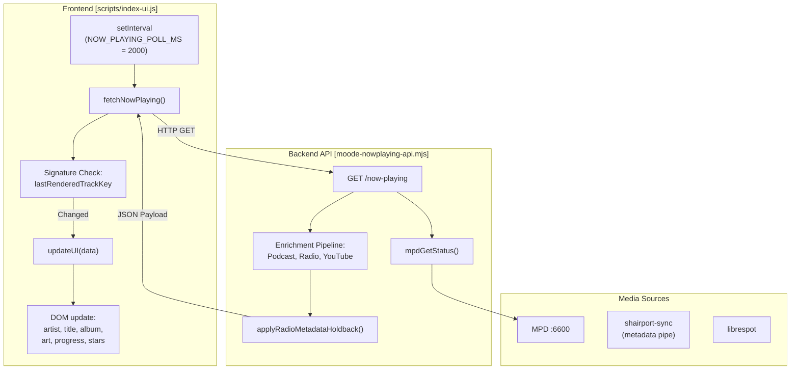
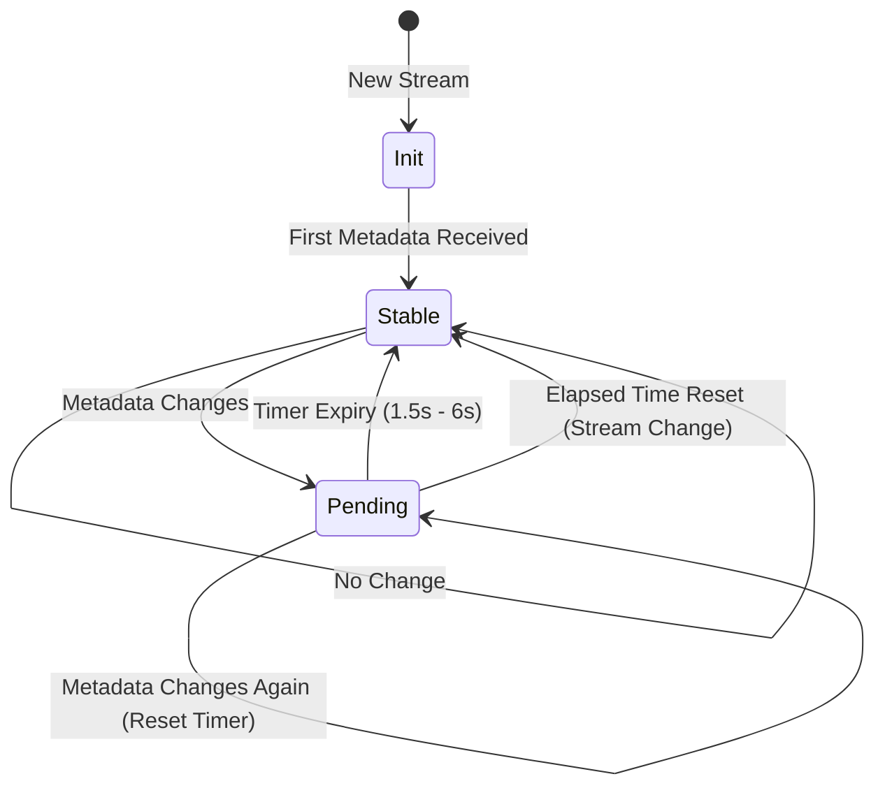
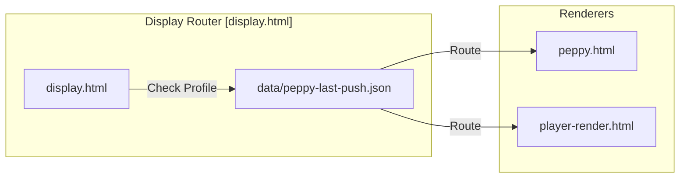
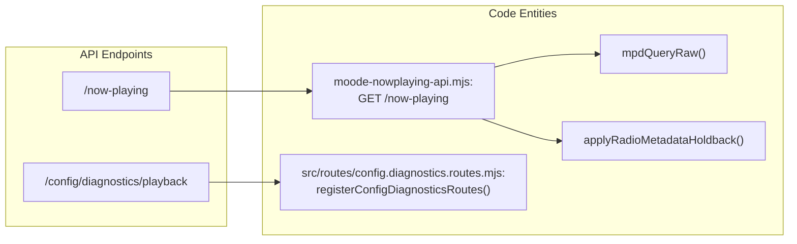

# Now Playing System

Relevant source files

The following files were used as context for generating this wiki page:

- [index.html](index.html)
- [moode-nowplaying-api.mjs](moode-nowplaying-api.mjs)
- [player-render.html](player-render.html)
- [player.html](player.html)
- [scripts/index-ui.js](scripts/index-ui.js)
- [src/routes/config.moode-audio-info.routes.mjs](src/routes/config.moode-audio-info.routes.mjs)
- [src/routes/config.routes.index.mjs](src/routes/config.routes.index.mjs)
- [styles/index1080.css](styles/index1080.css)

The Now Playing system is the core real-time engine of the application, responsible for synchronizing the visual interface with the underlying media player (moOde/MPD). It manages a high-frequency poll-and-diff loop, detects playback contexts (AirPlay, Bluetooth, local, radio), and executes a multi-stage metadata enrichment pipeline to provide deep tagging and motion art.

---

## Core Architecture: Poll-and-Diff Loop

The system operates on a polling interval (typically 2000ms) initiated by the frontend. To ensure a smooth UI experience, it uses a "diff" strategy where DOM updates are only triggered if the track signature or playback state has changed.

### High-Level Data Flow

**Sources:** [scripts/index-ui.js:195-200](), [moode-nowplaying-api.mjs:1-19]()

---

## Multi-Stage Enrichment Pipeline

When the backend receives a raw status from MPD, it passes the data through a series of resolvers to detect the content type and fetch additional metadata.

### 1. Type Detection & Signature Generation
The system determines the `streamKind` by inspecting the file path or URL. This dictates which enrichment logic follows.
- **Local Files:** Detected by standard filesystem paths.
- **AirPlay:** Detected via `isAirplay` flag or `shairport-sync` signatures.
- **Radio:** Detected by `http://` protocols and lack of specific service markers.
- **Podcasts:** Detected by the `Podcasts/` directory marker or specific genre tags. [scripts/index-ui.js:30-39]()

### 2. Metadata Resolution
- **Radio Holdback:** Prevents UI flickering during rapid metadata updates (common in classical stations like WFMT or BBC Radio 3). It implements a stability timer (default 1500ms-6000ms) before promoting "pending" metadata to "stable". [moode-nowplaying-api.mjs:71-158]()
- **Metadata Normalization:** The system decodes HTML entities and strips tags from stream metadata to ensure clean display on hardware screens. [src/routes/config.moode-audio-info.routes.mjs:7-22]()

### 3. Deep Tagging & Motion Art
Once the basic metadata is resolved, the frontend initiates a motion art lookup. This queries the `animated-art` cache and external APIs for H.264 video versions of the album art. [scripts/index-ui.js:29-39]()

---

## Optimistic Rendering & Signature Logic

To prevent "UI jumping" during manual track changes or rating updates, the system uses **Optimistic Rendering**.

- **Signature Generation:** The UI calculates a `trackKey` based on the artist and title. If the user triggers a transport action (e.g., Next), the UI immediately updates the text while setting a `busy` state, ignoring the next poll result if it still contains the "old" track data. [scripts/index-ui.js:24-28]()
- **Rating Hold Window:** When a user rates a track, the UI enters a "hold window" where it ignores the server's rating value to allow the MPD sticker database time to persist the change. [src/routes/config.diagnostics.routes.mjs:44-51]()

---

## Specialized Handling: AirPlay, UPnP, and Radio

The system adapts its layout and logic based on the source's capabilities.

| Source | Detection Logic | UI Behavior |
| :--- | :--- | :--- |
| **AirPlay** | `streamKind === 'airplay'` | Shows AirPlay logo, hides rating stars, disables metadata editing. [scripts/index-ui.js:50-51]() |
| **Radio** | `isRadio === true` | Activates `applyRadioMetadataHoldback`, displays station logo. [moode-nowplaying-api.mjs:59-69]() |
| **UPnP** | `isUpnp === true` | Shows DLNA/UPnP badge, disables seek bar if unsupported. [scripts/index-ui.js:10-11]() |

### Radio Metadata Holdback State Machine

**Sources:** [moode-nowplaying-api.mjs:71-158](), [moode-nowplaying-api.mjs:45-48]()

---

## Hardware Display Rendering

For hardware displays (e.g., Raspberry Pi DSI screens), the system uses `player-render.html`. This renderer uses a CSS class system (`player-size-800x480`, `player-size-1024x600`, etc.) to adapt the layout to specific physical resolutions.

### Display Routing & Push Model
The system uses a stable router URL (`display.html?kiosk=1`) which queries the last-known profile to route to the correct renderer (Peppy, Player, or Visualizer).

**Sources:** [player.html:21-34](), [player-render.html:52-100]()

---

## Technical Implementation Details

### Implementation Diagram: API to Code Entity

This diagram maps the logical "Now Playing" components to their specific code implementations.

**Sources:** [moode-nowplaying-api.mjs:1-12](), [src/routes/config.routes.index.mjs:44-51]()

### Data Structure: Now Playing Payload

The JSON response from `/now-playing` is a composite object:

| Field | Source | Description |
| :--- | :--- | :--- |
| `artist` / `title` | MPD / Enrichment | The primary metadata for display. |
| `isRadio` | Logic | Boolean flag for radio mode. |
| `holdback` | `applyRadioMetadataHoldback` | Object containing `active` status and `pendingTitle`. [moode-nowplaying-api.mjs:146-157]() |
| `elapsed` / `duration` | MPD | Raw timing data used for the progress bar. |
| `trackKey` | Logic | Unique ID for the current track/file. |

**Sources:** [moode-nowplaying-api.mjs:71-83](), [scripts/index-ui.js:24-28]()
