# Transport Controls

<details>
<summary>Relevant source files</summary>

The following files were used as context for generating this wiki page:

- [alexa.html](alexa.html)
- [alexa/handlers/misc.js](alexa/handlers/misc.js)
- [queue-wizard.html](queue-wizard.html)
- [radio.html](radio.html)
- [scripts/diagnostics.js](scripts/diagnostics.js)
- [scripts/hero-transport.js](scripts/hero-transport.js)
- [scripts/queue-wizard.js](scripts/queue-wizard.js)
- [src/routes/config.diagnostics.routes.mjs](src/routes/config.diagnostics.routes.mjs)
- [src/routes/queue.routes.mjs](src/routes/queue.routes.mjs)
- [src/routes/rating.routes.mjs](src/routes/rating.routes.mjs)

</details>


## Purpose and Scope

This page documents the transport control systems that allow users to control music playback across different interfaces. Transport controls include standard playback buttons (play/pause, next, previous, shuffle, repeat) as well as specialized controls for podcasts and radio stations. These controls appear in multiple UI contexts: the hero transport section in `app.html`, phone controls in `index.html` (and `controller-now-playing.html`), and compact controls on landscape strip displays.

The system utilizes an optimistic UI approach where possible, backed by a 2-second polling loop that synchronizes the interface with the moOde player's actual state.

---

## System Architecture

The transport system bridges the high-level UI interaction with low-level MPD commands via a specialized diagnostics API.

### Natural Language to Code Entity Mapping: Playback Flow

The following diagram maps user intent to the specific code entities responsible for execution.

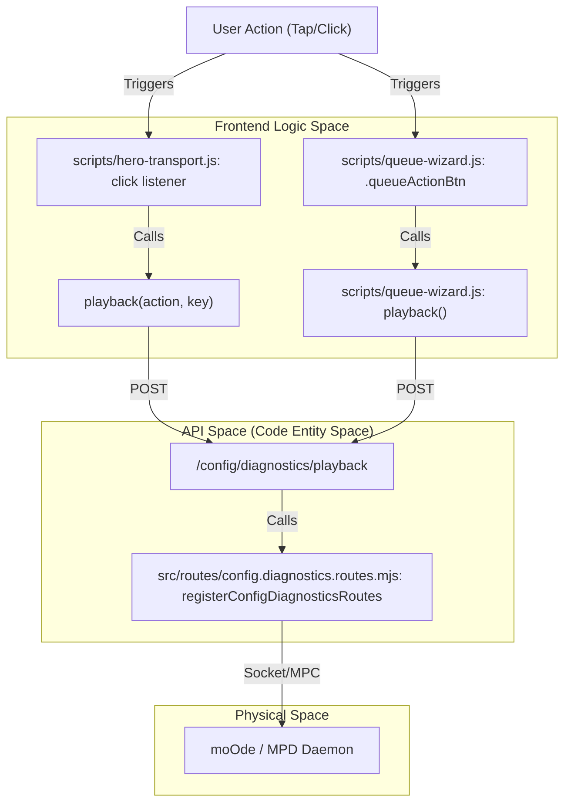
```mermaid
graph TD
    User["User Action (Tap/Click)"] -- "Triggers" --> HT["scripts/hero-transport.js: click listener"]
    User -- "Triggers" --> QW["scripts/queue-wizard.js: .queueActionBtn"]
    
    subgraph "Frontend Logic Space"
        HT -- "Calls" --> PB["playback(action, key)"]
        QW -- "Calls" --> QPB["scripts/queue-wizard.js: playback()"]
    end

    subgraph "API Space (Code Entity Space)"
        PB -- "POST" --> RPA["/config/diagnostics/playback"]
        QPB -- "POST" --> RPA
        RPA -- "Calls" --> MPD["src/routes/config.diagnostics.routes.mjs: registerConfigDiagnosticsRoutes"]
    end

    subgraph "Physical Space"
        MPD -- "Socket/MPC" --> MOODE["moOde / MPD Daemon"]
    end
```
**Sources:** [scripts/hero-transport.js:105-114](), [scripts/queue-wizard.js:1010-1018](), [src/routes/config.diagnostics.routes.mjs:171-172]()

---

## Control Button Types

### Standard Playback Controls
The system uses a "brass-ring" aesthetic for buttons, particularly in mobile and hero contexts, featuring high-contrast borders and subtle glow effects when active.

| Button | Action | Implementation Detail | State Indicator |
| :--- | :--- | :--- | :--- |
| **Play/Pause** | `play` / `pause` | Toggles based on `playbackState` | `.on` class + SVG path swap |
| **Previous** | `previous` | Triggers `mpc prev` | N/A |
| **Next** | `next` | Triggers `mpc next` | N/A |
| **Shuffle** | `shuffle` | Toggles `random` in MPD | `.on` class when `randomOn` is true |
| **Repeat** | `repeat` | Toggles `repeat` in MPD | `.on` class when `repeatOn` is true |

**Sources:** [scripts/hero-transport.js:33-41](), [scripts/hero-transport.js:260-279](), [scripts/queue-wizard.js:1010-1018]()

### Podcast-Specific Controls
When the system detects a podcast (via metadata enrichment), the transport row dynamically shifts to include time-skip operations. These are rendered in the `hero-transport.js` logic when `isPodcast` is detected in the now-playing snapshot.

| Button | Action | Behavior |
| :--- | :--- | :--- |
| **↺15** | `seek-relative` | Seeks -15 seconds relative to current |
| **30↻** | `seek-relative` | Seeks +30 seconds relative to current |

**Sources:** [scripts/hero-transport.js:444-450](), [scripts/hero-transport.js:105-114]()

---

## UI Implementations

### Hero Transport Section (app.html)
The Hero Transport is a central component of the Application Shell. It uses a "Grid Tuner" layout engine to remain responsive across desktop and kiosk sizes. It features an integrated progress bar that supports seeking via percentage calculation.

**Data Flow & State Refresh:**
The Hero Transport performs a "poll-and-diff" to prevent unnecessary DOM thrashing, updating only changed elements like the play/pause icon or progress bar scale.

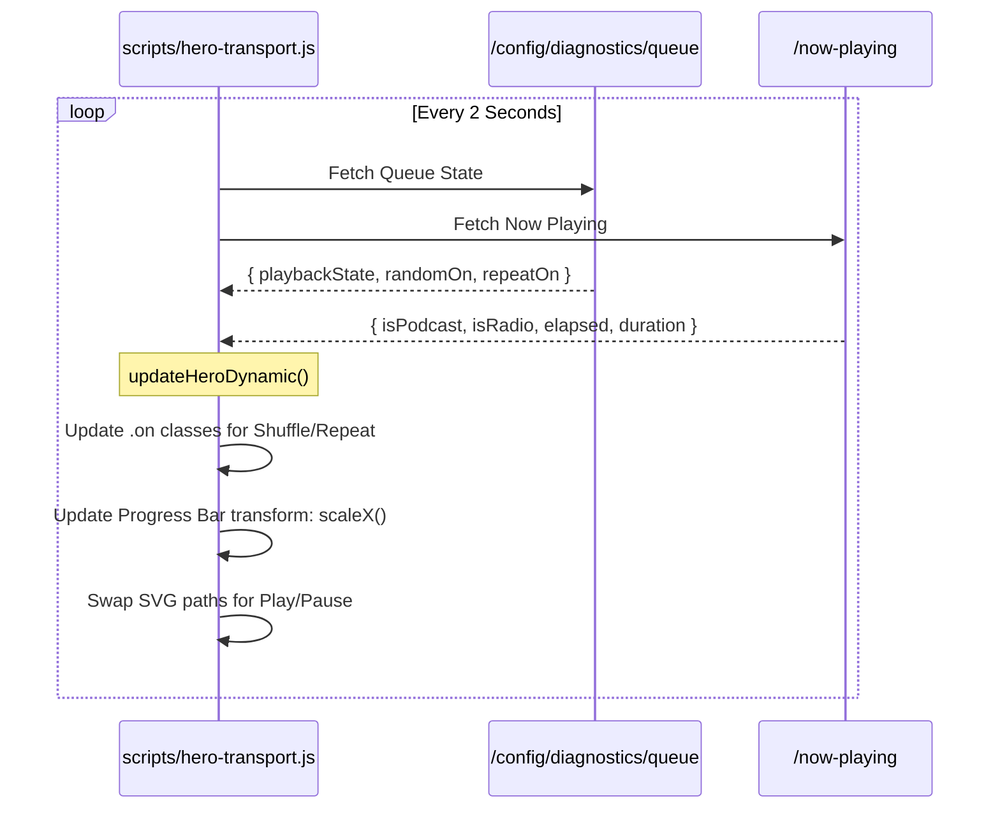
```mermaid
sequenceDiagram
    participant UI as scripts/hero-transport.js
    participant QAPI as /config/diagnostics/queue
    participant NP as /now-playing
    
    loop Every 2 Seconds
        UI->>QAPI: Fetch Queue State
        UI->>NP: Fetch Now Playing
        QAPI-->>UI: { playbackState, randomOn, repeatOn }
        NP-->>UI: { isPodcast, isRadio, elapsed, duration }
        
        Note over UI: updateHeroDynamic()
        UI->>UI: Update .on classes for Shuffle/Repeat
        UI->>UI: Update Progress Bar transform: scaleX()
        UI->>UI: Swap SVG paths for Play/Pause
    end
```
**Sources:** [scripts/hero-transport.js:116-121](), [scripts/hero-transport.js:260-296](), [scripts/hero-transport.js:439-450]()

### Queue Wizard Transport (queue-wizard.html)
The Queue Wizard includes a dedicated `queuePlaybackArea` for managing the live queue. It allows for "Fast Start" operations where a queue is built and playback starts immediately.

- **Optimistic Updates:** The `playback()` function in `queue-wizard.js` updates the local `queuePlayPauseMode` state immediately upon user interaction. [scripts/queue-wizard.js:1010-1018]()
- **Layout Integration:** The transport controls are housed within a `.actionBar` context that respects the overall theme (light/dark). [queue-wizard.html:102-108]()

---

## Radio Favorites & Controls

Radio playback introduces specific UI constraints, such as the absence of seek capabilities and the use of station logos.

- **Station Logos:** Resolved via `/art/radio-logo.jpg?name=` which checks `radio-logo-aliases.json` and a local cache in `var/radio-logo-cache/`. [src/routes/config.diagnostics.routes.mjs:36-40](), [src/routes/config.diagnostics.routes.mjs:109-118]()
- **Favorites Drawer:** The Hero Transport includes a slide-out drawer for radio station favorites, persisted via `localStorage` as `nowplaying.heroFavDrawerOpen.v1`. [scripts/hero-transport.js:619-625]()
- **Grid Layout:** Station clusters are rendered using a responsive grid (`.stationGrid`) in the radio management interface. [radio.html:85-90]()

**Sources:** [src/routes/config.diagnostics.routes.mjs:126-161](), [radio.html:70-85]()

---

## API Integration & Logic

### Playback Endpoint: `/config/diagnostics/playback`
This is the primary command bus for all transport operations, handled by the Express backend which translates these into MPD or Moode commands.

**Implementation Example:**
```javascript
// scripts/hero-transport.js
async function playback(action, key, payload = {}) {
  const r = await fetch(`${apiBase}/config/diagnostics/playback`, {
    method: 'POST',
    headers: { 'Content-Type': 'application/json', ...(key ? { 'x-track-key': key } : {}) },
    body: JSON.stringify({ action, ...(payload || {}) }),
  });
  return await r.json();
}
```
**Sources:** [scripts/hero-transport.js:105-114](), [src/routes/config.diagnostics.routes.mjs:21-22]()

### Seek Operations
Seek operations are handled via `seek-relative` or `seek-percent` actions. The UI translates progress bar clicks into percentage values based on the element's width.

- **Percentage Calculation:** `(clickX / progressBarWidth) * 100`. [scripts/hero-transport.js:280-295]()
- **Relative Seeking:** Used primarily for podcasts (±15/30s). [scripts/hero-transport.js:444-450]()

---

## Mode-Specific Behaviors

| Mode | Transport Logic Changes |
| :--- | :--- |
| **Alexa Mode** | Hides Next/Prev/Repeat; only Shuffle is permitted as Alexa manages the remote queue. [scripts/hero-transport.js:439-442]() |
| **Radio Mode** | Hides Shuffle/Repeat; Hides progress bar as duration is infinite. [scripts/hero-transport.js:328-362]() |
| **Podcast Mode** | Replaces Shuffle/Repeat with ± Seek buttons in the hero rail. [scripts/hero-transport.js:444-450]() |
| **UPnP/AirPlay** | Disables rating and often Shuffle/Repeat as these are managed by the source device. [src/routes/rating.routes.mjs:18-20](), [scripts/hero-transport.js:328-335]() |

**Sources:** [scripts/hero-transport.js:328-450](), [src/routes/rating.routes.mjs:34-36]()
3a:T1f22,
# Ratings & Favorites

<details>
<summary>Relevant source files</summary>

The following files were used as context for generating this wiki page:

- [alexa/handlers/misc.js](alexa/handlers/misc.js)
- [index.html](index.html)
- [player-render.html](player-render.html)
- [player.html](player.html)
- [scripts/index-ui.js](scripts/index-ui.js)
- [src/routes/config.ratings-sticker.routes.mjs](src/routes/config.ratings-sticker.routes.mjs)
- [src/routes/queue.routes.mjs](src/routes/queue.routes.mjs)
- [src/routes/rating.routes.mjs](src/routes/rating.routes.mjs)
- [styles/index1080.css](styles/index1080.css)

</details>


## Purpose

This page documents the ratings and favorites systems that allow users to rate tracks on a 1-5 star scale and mark tracks as favorites. Both features utilize **MPD's sticker database** for persistent storage on the moOde player and implement **optimistic UI updates** with a pending hold window to ensure a responsive user experience without visual flickering during server synchronization.

---

## System Architecture

The ratings and favorites systems are built upon client-side optimistic updates backed by MPD sticker storage. The API layer acts as a bridge, managing a local cache and communicating with the MPD daemon via socket queries.

### Code Entity Map: Ratings Flow

The following diagram maps the flow from the user interaction in the browser to the final storage in the MPD Sticker database.

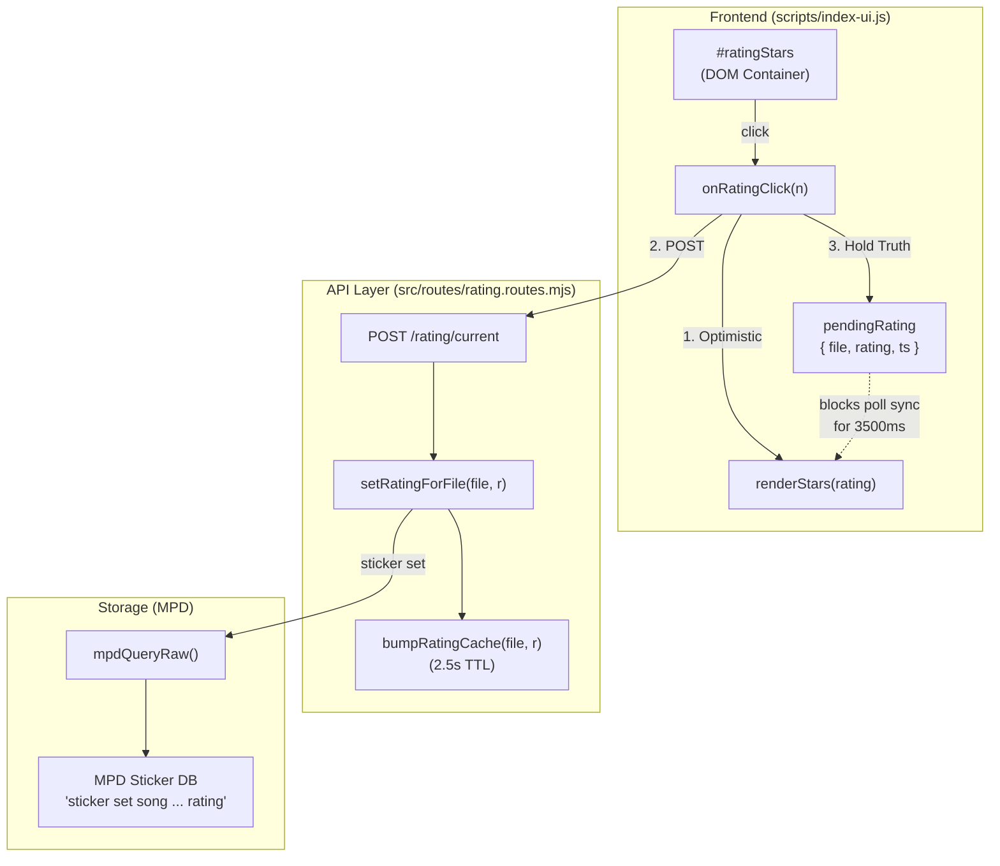
```mermaid
graph TB
    subgraph "Frontend (scripts/index-ui.js)"
        StarRow["#ratingStars<br/>(DOM Container)"]
        SetRating["onRatingClick(n)"]
        RenderStars["renderStars(rating)"]
        PendingRating["pendingRating<br/>{ file, rating, ts }"]
    end
    
    subgraph "API Layer (src/routes/rating.routes.mjs)"
        RatingRoute["POST /rating/current"]
        SetRatingFunc["setRatingForFile(file, r)"]
        RatingCache["bumpRatingCache(file, r)<br/>(2.5s TTL)"]
    end
    
    subgraph "Storage (MPD)"
        MPDQuery["mpdQueryRaw()"]
        StickerDB["MPD Sticker DB<br/>'sticker set song ... rating'"]
    end
    
    StarRow -->|"click"| SetRating
    SetRating -->|"1. Optimistic"| RenderStars
    SetRating -->|"2. POST"| RatingRoute
    SetRating -->|"3. Hold Truth"| PendingRating
    
    RatingRoute --> SetRatingFunc
    SetRatingFunc -->|"sticker set"| MPDQuery
    SetRatingFunc --> RatingCache
    MPDQuery --> StickerDB
    
    PendingRating -.->|"blocks poll sync<br/>for 3500ms"| RenderStars
```

**Sources:** [scripts/index-ui.js:1091-1158](), [src/routes/rating.routes.mjs:64-97]()

---

## MPD Sticker Integration

Ratings and favorites are persisted using MPD's `sticker` command set. This allows metadata to be attached to file paths without modifying the underlying music files (FLAC/MP3 tags).

### Implementation Details

The system interacts with the sticker database through `mpdQueryRaw`.

- **Reading Ratings**: The API executes `sticker get song "path/to/file" rating` via `getRatingForFile` [src/routes/queue.routes.mjs:78-87]().
- **Writing Ratings**: The API executes `sticker set song "path/to/file" rating N` where N is 0-5 [src/routes/rating.routes.mjs:90]().
- **Validation**: Ratings are clamped to the 0-5 range using `clampRating` before being sent to MPD [src/routes/rating.routes.mjs:67-70]().

### Rating Cache
To prevent excessive socket overhead during the 2-second polling loop, the API maintains a short-lived cache.
- **TTL**: 2500ms (configured in dependency injection).
- **Invalidation**: The cache is updated immediately upon a successful `POST /rating/current` via `bumpRatingCache(file, newRating)` [src/routes/rating.routes.mjs:91]().

**Sources:** [src/routes/queue.routes.mjs:78-87](), [src/routes/rating.routes.mjs:64-97]()

---

## Optimistic UI & Pending Hold Window

To eliminate perceived latency, the UI employs an optimistic update strategy combined with a "pending hold" window.

### The 3500ms Hold Pattern
When a user changes a rating or toggles a favorite, the frontend records the event in a state object (`pendingRating` or `pendingFavorite`) including a timestamp [scripts/index-ui.js:1142-1146]().

During the regular `pollNowPlaying` loop:
1. The UI receives the "truth" from the server (which might be old if MPD hasn't finished writing).
2. The UI checks if `Date.now() - pendingRating.ts < 3500` [scripts/index-ui.js:621-623]().
3. If within the window, the server's rating value is **discarded**, and the user's optimistic value is preserved.
4. After 3.5 seconds, the hold expires, and the UI synchronizes with the server's reported state.

**Sources:** [scripts/index-ui.js:621-623](), [scripts/index-ui.js:1142-1146]()

---

## Favorite Toggling

Favorites are managed via the `/favorites/toggle` endpoint. This operation is more complex than ratings as it often involves both a sticker update and an optional M3U playlist modification.

### UI Interaction
The favorite "heart" button (`#fav-heart`) uses capture-phase event handling in `bindFavoriteUIOnce` to ensure it works correctly even when overlaid on other clickable elements like the album art [scripts/index-ui.js:133-152]().

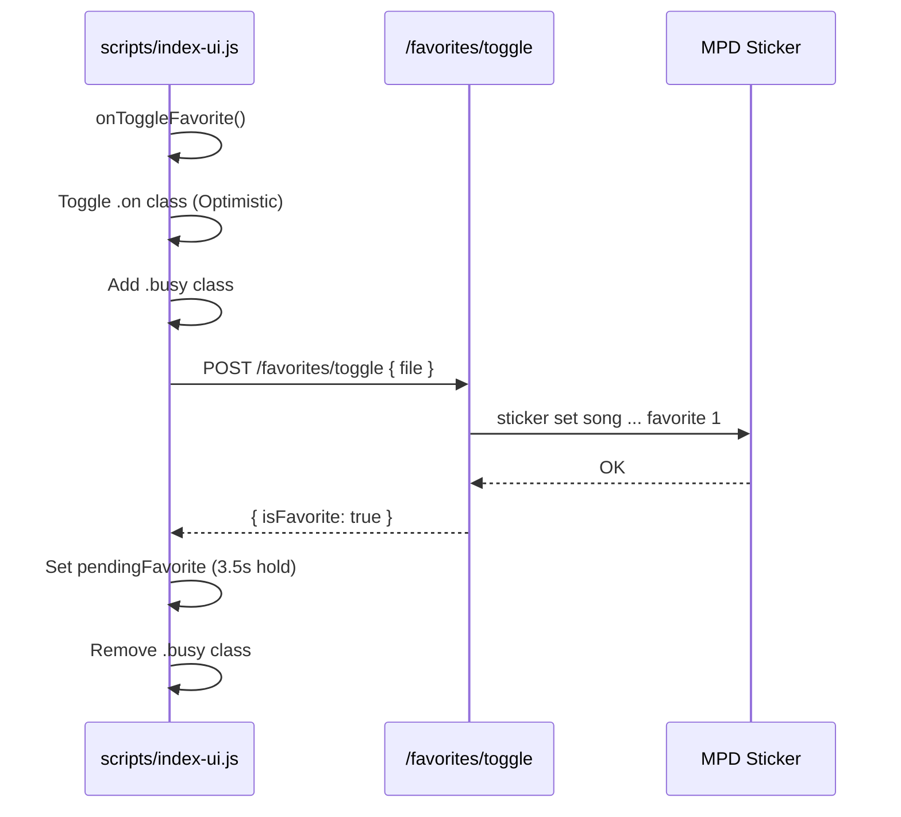
```mermaid
sequenceDiagram
    participant UI as scripts/index-ui.js
    participant API as /favorites/toggle
    participant MPD as MPD Sticker
    
    UI->>UI: onToggleFavorite()
    UI->>UI: Toggle .on class (Optimistic)
    UI->>UI: Add .busy class
    UI->>API: POST /favorites/toggle { file }
    API->>MPD: sticker set song ... favorite 1
    MPD-->>API: OK
    API-->>UI: { isFavorite: true }
    UI->>UI: Set pendingFavorite (3.5s hold)
    UI->>UI: Remove .busy class
```

**Sources:** [scripts/index-ui.js:133-152](), [index.html:86-101](), [scripts/index-ui.js:1174-1215]()

---

## Sticker DB Backup & Restore

Because MPD stickers are stored in a single SQLite database (`sticker.sql`), the system provides administrative routes to back up and restore this file, ensuring user ratings are not lost during moOde updates or SD card failures.

### Management Endpoints

| Endpoint | Method | Action |
| :--- | :--- | :--- |
| `/config/ratings/sticker-status` | `GET` | Checks for existence and size of `/var/lib/mpd/sticker.sql` on the moOde host [src/routes/config.ratings-sticker.routes.mjs:33-59](). |
| `/config/ratings/sticker-backup` | `POST` | Uses `scp` to pull the sticker DB from moOde to the local `MPD_STICKER_BACKUP_DIR` [src/routes/config.ratings-sticker.routes.mjs:61-94](). |
| `/config/ratings/sticker-backups` | `GET` | Lists available SQL backup files in the backup directory [src/routes/config.ratings-sticker.routes.mjs:96-112](). |
| `/config/ratings/sticker-restore` | `POST` | Pushes a selected backup file back to the moOde host and restores permissions (`chown mpd:audio`) [src/routes/config.ratings-sticker.routes.mjs:114-151](). |

### Implementation Details
The backup/restore logic utilizes `sshBashLc` to execute commands on the moOde player with elevated privileges (`sudo`) where necessary to access the MPD system directories [src/routes/config.ratings-sticker.routes.mjs:23-28]().

**Sources:** [src/routes/config.ratings-sticker.routes.mjs:33-151]()

---

## Visibility & Gating Rules

Ratings and favorites are automatically hidden when they are not applicable to the current playback context.

### Logic for `ratingsAllowedNow()`
The UI suppresses rating controls if any of the following are true:
- The player is in `pause` mode (unless specifically configured otherwise) [scripts/index-ui.js:611]().
- The current track is an AirPlay or UPnP stream [scripts/index-ui.js:613]().
- The track is a Podcast episode [scripts/index-ui.js:614]().
- The track is a Radio stream (unless the system is in "Alexa mode") [scripts/index-ui.js:615]().

The favorite heart (`#fav-heart`) is specifically hidden via CSS for these modes [styles/index1080.css:261-268]().

**Sources:** [scripts/index-ui.js:611-616](), [src/routes/rating.routes.mjs:18-20](), [styles/index1080.css:261-268]()
3b:T1f60,
# Progress & State Tracking

<details>
<summary>Relevant source files</summary>

The following files were used as context for generating this wiki page:

- [docs/08-hero-shell.md](docs/08-hero-shell.md)
- [docs/09-index-vs-app.md](docs/09-index-vs-app.md)
- [docs/10-random-vs-shuffle.md](docs/10-random-vs-shuffle.md)
- [index.html](index.html)
- [moode-nowplaying-api.mjs](moode-nowplaying-api.mjs)
- [player-render.html](player-render.html)
- [player.html](player.html)
- [scripts/index-ui.js](scripts/index-ui.js)
- [src/routes/config.moode-audio-info.routes.mjs](src/routes/config.moode-audio-info.routes.mjs)
- [src/routes/config.routes.index.mjs](src/routes/config.routes.index.mjs)
- [styles/index1080.css](styles/index1080.css)

</details>


This document describes how the system tracks playback progress, maintains state across mode transitions, and implements resume functionality. It covers the rendering of progress indicators, the Alexa "was-playing" persistence mechanism, and the logic governing seek operations and resume behavior.

---

## Progress Bar Rendering

The progress bar displays elapsed time relative to total duration for file-based tracks. Radio streams and Alexa mode suppress the progress bar, displaying live status badges instead.

### Progress Data Flow

The frontend consumes playback state from the `/now-playing` and `/next-up` endpoints, calculating visual progress percentages for the UI.

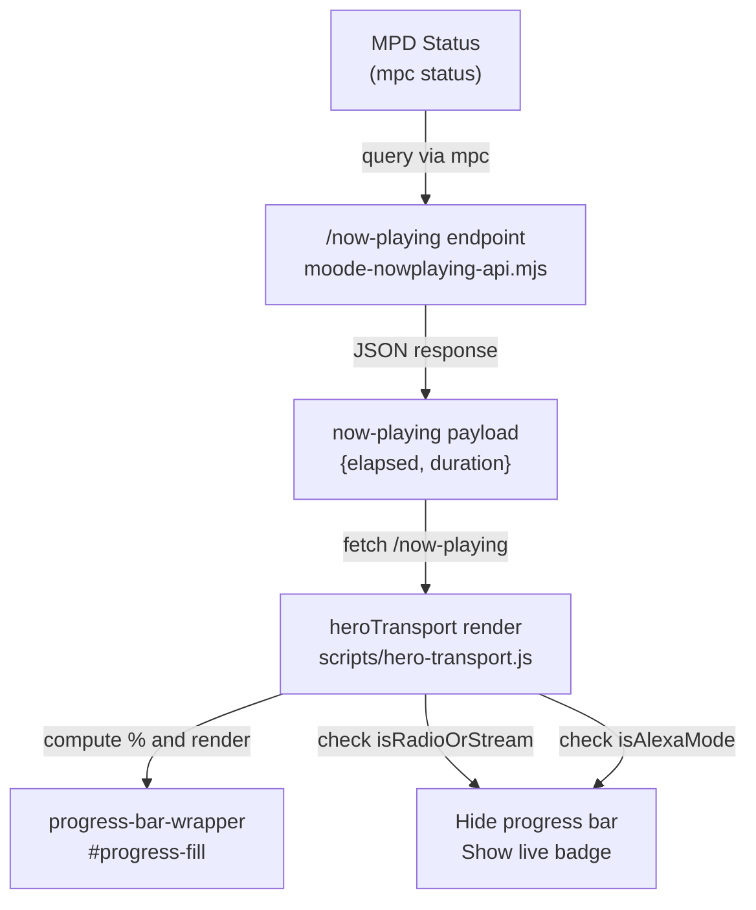
```mermaid
graph TB
    MPD["MPD Status<br/>(mpc status)"]
    API["/now-playing endpoint<br/>moode-nowplaying-api.mjs"]
    NP["now-playing payload<br/>{elapsed, duration}"]
    HERO["heroTransport render<br/>scripts/hero-transport.js"]
    BAR["progress-bar-wrapper<br/>#progress-fill"]
    
    MPD -->|"query via mpc"| API
    API -->|"JSON response"| NP
    NP -->|"fetch /now-playing"| HERO
    HERO -->|"compute % and render"| BAR
    
    HERO -->|"check isRadioOrStream"| SUPPRESS["Hide progress bar<br/>Show live badge"]
    HERO -->|"check isAlexaMode"| SUPPRESS
```

**Progress Calculation Logic**

The progress percentage is computed from `elapsed` and `duration` fields. The system extracts these from multiple possible field names for compatibility across different enrichment stages.

| Field Source | Priority | Fallback Chain |
|--------------|----------|----------------|
| `np.elapsed` | 1st | `q.elapsed`, `q.elapsedSec`, `head.elapsed` |
| `np.duration` | 1st | `q.duration`, `q.durationSec`, `head.duration` |
| `isRadioOrStream`| Boolean | `np.isRadio`, `np.isStream`, `head.isStream`, `isAlexaMode` |

Sources: [scripts/hero-transport.js:280-295](), [scripts/hero-transport.js:417-420]()

### Dynamic Progress Updates

The `updateHeroDynamic` function refreshes progress state without a full re-render, updating only the fill transform and handle position to minimize DOM churn.

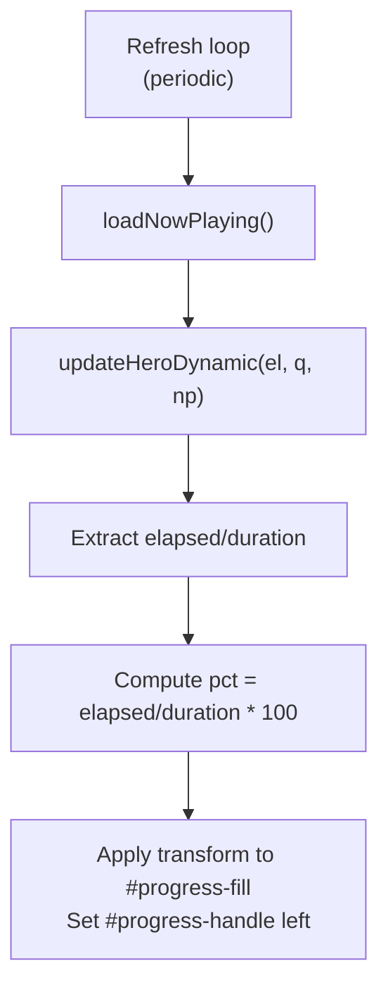
```mermaid
graph TB
    POLL["Refresh loop<br/>(periodic)"]
    LOAD["loadNowPlaying()"]
    UPDATE["updateHeroDynamic(el, q, np)"]
    EXTRACT["Extract elapsed/duration"]
    COMPUTE["Compute pct = elapsed/duration * 100"]
    APPLY["Apply transform to #progress-fill<br/>Set #progress-handle left"]
    
    POLL --> LOAD
    LOAD --> UPDATE
    UPDATE --> EXTRACT
    EXTRACT --> COMPUTE
    COMPUTE --> APPLY
```

Sources: [scripts/hero-transport.js:260-296]()

---

## Alexa Was-Playing State

The "was-playing" state captures playback position and queue context immediately before Alexa takes over. This enables the system to resume local playback when the Alexa session ends or when the user toggles random mode off.

### Was-Playing Lifecycle

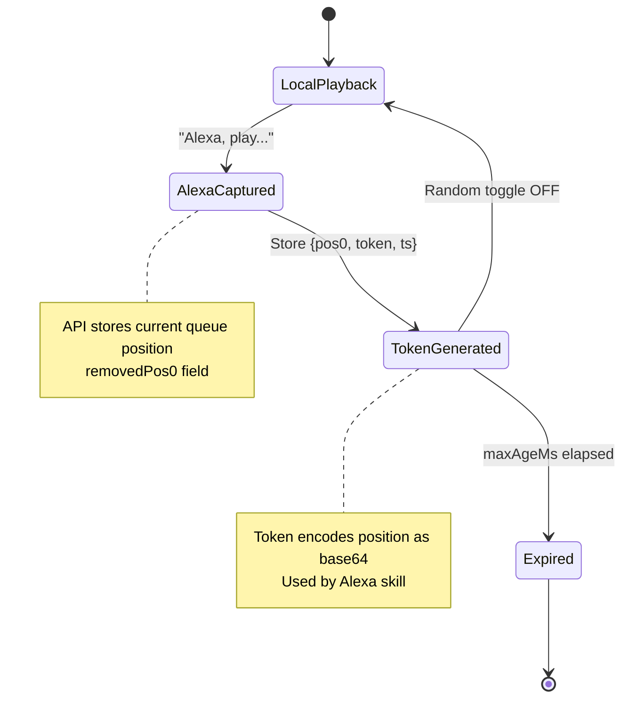
```mermaid
stateDiagram-v2
    [*] --> LocalPlayback
    LocalPlayback --> AlexaCaptured: "Alexa, play..."
    AlexaCaptured --> TokenGenerated: Store {pos0, token, ts}
    TokenGenerated --> LocalPlayback: Random toggle OFF
    TokenGenerated --> Expired: maxAgeMs elapsed
    Expired --> [*]
    
    note right of AlexaCaptured
        API stores current queue position
        removedPos0 field
    end note
    
    note right of TokenGenerated
        Token encodes position as base64
        Used by Alexa skill
    end note
```

### Position Recovery from Token

When Alexa mode ends, the system attempts to recover the playback position by decoding the Alexa token. The token is a base64-encoded JSON object containing `pos0` (0-indexed position).

**Token Decoding Algorithm**

The decoding logic in `pos0FromAlexaToken` performs the following steps:
1. Verifies the `moode-track:` prefix.
2. Strips the prefix and adds base64 padding if necessary.
3. Replaces URL-safe characters (`-` to `+`, `_` to `/`).
4. Decodes the buffer and parses the JSON to extract `pos0`.

Sources: [src/routes/config.diagnostics.routes.mjs:175-188]()

---

## Resume & Continuity Logic

The resume system restores playback position when transitioning from Alexa mode back to local control. This is primarily triggered by toggling random mode from ON to OFF while an Alexa was-playing state is active.

### Random Toggle Position Anchoring

When the user toggles random OFF, the system "primes" MPD's current position to the remembered position if Alexa mode was active. This sets up the queue for immediate resume.

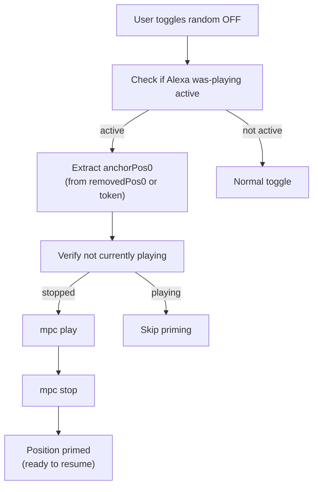
```mermaid
graph TB
    TOGGLE["User toggles random OFF"]
    CHECK["Check if Alexa was-playing active"]
    EXTRACT["Extract anchorPos0<br/>(from removedPos0 or token)"]
    VERIFY["Verify not currently playing"]
    PLAY["mpc play <pos1>"]
    STOP["mpc stop"]
    PRIMED["Position primed<br/>(ready to resume)"]
    
    TOGGLE --> CHECK
    CHECK -->|"active"| EXTRACT
    CHECK -->|"not active"| SKIP["Normal toggle"]
    EXTRACT --> VERIFY
    VERIFY -->|"stopped"| PLAY
    VERIFY -->|"playing"| SKIP2["Skip priming"]
    PLAY --> STOP
    STOP --> PRIMED
```

**Position Conversion**: The API uses 0-indexed positions; `mpc` commands require 1-indexed positions. The system adds 1 before calling `mpc play`.

Sources: [src/routes/config.diagnostics.routes.mjs:504-537]()

### Alexa Was-Playing API Endpoint

The `/alexa/now-playing` (or diagnostic equivalent) endpoint returns the stored state if it's within the `maxAgeMs` threshold (defaulting to 6 hours).

**Request**: `GET /alexa/now-playing?maxAgeMs=21600000`

Sources: [scripts/index-ui.js:196-196](), [src/routes/config.diagnostics.routes.mjs:48-48]()

---

## Random vs Shuffle Semantics

The system maintains a strict distinction between "Random" and "Shuffle" operations to ensure predictable queue behavior.

| Operation | Command | Effect | Continuity Policy |
|-----------|---------|--------|-------------------|
| **Random** | `mpd random on/off` | Changes selection behavior; does not reorder queue. | Preserve continuity; no forced jump on toggle. |
| **Shuffle** | `mpd shuffle` | Physically reorders existing queue entries. | May jump to new position if current track moves. |

**Project Policy**:
- The UI button typically triggers the **Random** toggle (`mpd random on/off`).
- Alexa-mode random-off transitions use the remembered queue anchor position to resume the original sequence.

Sources: [docs/10-random-vs-shuffle.md:1-12]()

---

## Radio Metadata & Holdback

For radio streams, progress is indeterminate, but state tracking is used to stabilize metadata updates. The `applyRadioMetadataHoldback` function prevents "flashing" metadata by requiring a new track title to persist for a specific duration before updating the UI.

**Holdback Policies**:
- **Strict**: (e.g., Classical stations like WFMT, KUSC) 6000ms holdback.
- **Normal**: 1500ms holdback.

Sources: [moode-nowplaying-api.mjs:45-69](), [moode-nowplaying-api.mjs:71-158]()

### Radio Metadata Data Flow

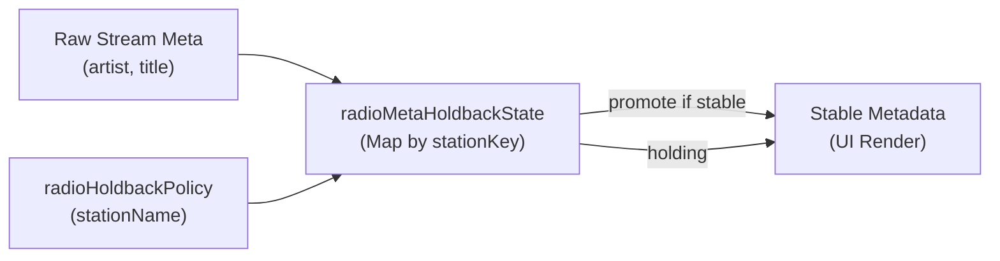
```mermaid
graph LR
    RAW["Raw Stream Meta<br/>(artist, title)"]
    POLICY["radioHoldbackPolicy<br/>(stationName)"]
    STATE["radioMetaHoldbackState<br/>(Map by stationKey)"]
    UI["Stable Metadata<br/>(UI Render)"]
    
    RAW --> STATE
    POLICY --> STATE
    STATE -->|"promote if stable"| UI
    STATE -->|"holding"| UI
```

Sources: [moode-nowplaying-api.mjs:71-158]()
3c:T22a6,
# External Integrations

<details>
<summary>Relevant source files</summary>

The following files were used as context for generating this wiki page:

- [alexa/handlers/audio.js](alexa/handlers/audio.js)
- [alexa/handlers/intents.js](alexa/handlers/intents.js)
- [alexa/interaction-model.v2.json](alexa/interaction-model.v2.json)
- [alexa/lib/api.js](alexa/lib/api.js)
- [alexa/skill.js](alexa/skill.js)
- [integrations/moode/README.md](integrations/moode/README.md)
- [integrations/moode/aplmeta-reader.sh](integrations/moode/aplmeta-reader.sh)
- [integrations/moode/aplmeta.py](integrations/moode/aplmeta.py)
- [integrations/moode/install.sh](integrations/moode/install.sh)
- [integrations/moode/revert.sh](integrations/moode/revert.sh)
- [integrations/moode/shairport-sync.conf.template](integrations/moode/shairport-sync.conf.template)
- [ops/moode-overrides/README.md](ops/moode-overrides/README.md)
- [ops/moode-overrides/etc/systemd/system/airplay-json-watchdog.service](ops/moode-overrides/etc/systemd/system/airplay-json-watchdog.service)
- [ops/moode-overrides/etc/systemd/system/airplay-json-watchdog.timer](ops/moode-overrides/etc/systemd/system/airplay-json-watchdog.timer)
- [ops/moode-overrides/etc/systemd/system/airplay-json.service](ops/moode-overrides/etc/systemd/system/airplay-json.service)
- [ops/moode-overrides/usr/local/bin/airplay-json-watchdog.sh](ops/moode-overrides/usr/local/bin/airplay-json-watchdog.sh)
- [ops/moode-overrides/var/www/daemon/aplmeta-reader.sh](ops/moode-overrides/var/www/daemon/aplmeta-reader.sh)

</details>


This page documents the external service integrations and bridges that extend the now-playing system's functionality. The system integrates with voice control platforms, music discovery services, metadata providers, and remote audio systems to provide enhanced playback control, music discovery, and metadata enrichment.

For internal service architecture and API routes, see [Backend API](#9). For library management and metadata handling, see [Media Library](#5).

---

## Integration Architecture Overview

The system connects to external services through multiple integration layers, each with specific authentication, transport, and data flow patterns.

### System Integration Map
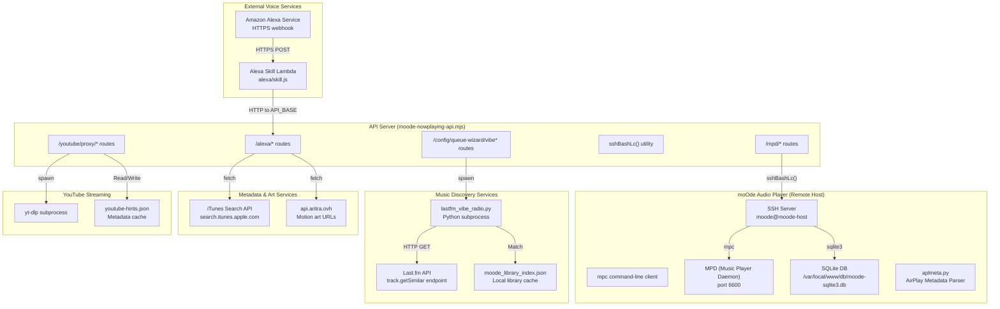
```mermaid
graph TB
    subgraph "API Server (moode-nowplaying-api.mjs)"
        ALEXA_ROUTES["/alexa/* routes"]
        VIBE_ROUTES["/config/queue-wizard/vibe* routes"]
        MPD_ROUTES["/mpd/* routes"]
        SSH_BRIDGE["sshBashLc() utility"]
        YT_PROXY["/youtube/proxy/* routes"]
    end
    
    subgraph "External Voice Services"
        ALEXA_SERVICE["Amazon Alexa Service<br/>HTTPS webhook"]
        SKILL["Alexa Skill Lambda<br/>alexa/skill.js"]
    end
    
    subgraph "moOde Audio Player (Remote Host)"
        SSH["SSH Server<br/>moode@moode-host"]
        MPC["mpc command-line client"]
        MPD_DAEMON["MPD (Music Player Daemon)<br/>port 6600"]
        MOODE_DB["SQLite DB<br/>/var/local/www/db/moode-sqlite3.db"]
        APL_META["aplmeta.py<br/>AirPlay Metadata Parser"]
    end
    
    subgraph "Music Discovery Services"
        LASTFM["Last.fm API<br/>track.getSimilar endpoint"]
        VIBE_PY["lastfm_vibe_radio.py<br/>Python subprocess"]
        LIB_INDEX["moode_library_index.json<br/>Local library cache"]
    end
    
    subgraph "Metadata & Art Services"
        ITUNES["iTunes Search API<br/>search.itunes.apple.com"]
        ARITRA["api.aritra.ovh<br/>Motion art URLs"]
    end
    
    subgraph "YouTube Streaming"
        YTDLP["yt-dlp subprocess"]
        YT_HINTS["youtube-hints.json<br/>Metadata cache"]
    end
    
    ALEXA_SERVICE -->|"HTTPS POST"| SKILL
    SKILL -->|"HTTP to API_BASE"| ALEXA_ROUTES
    
    MPD_ROUTES -->|"sshBashLc()"| SSH
    SSH -->|"mpc"| MPD_DAEMON
    SSH -->|"sqlite3"| MOODE_DB
    
    VIBE_ROUTES -->|"spawn"| VIBE_PY
    VIBE_PY -->|"HTTP GET"| LASTFM
    VIBE_PY -->|"Match"| LIB_INDEX
    
    ALEXA_ROUTES -->|"fetch"| ITUNES
    ALEXA_ROUTES -->|"fetch"| ARITRA
    
    YT_PROXY -->|"spawn"| YTDLP
    YT_PROXY -->|"Read/Write"| YT_HINTS
```
**Sources:** [alexa/skill.js:7-50](), [integrations/moode/README.md:32-37](), [alexa/handlers/intents.js:5-40]()

---

## 7.1 Alexa Voice Control

The Alexa integration enables voice-based playback control through a custom skill. The skill operates as a serverless AWS Lambda function that communicates with the API server via HTTPS, translating voice commands into queue operations and playback directives.

### Alexa Interaction Flow
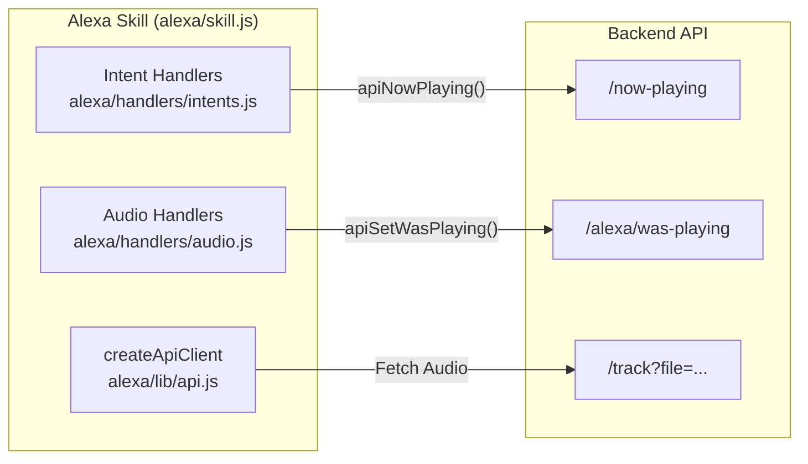
```mermaid
graph LR
    subgraph "Alexa Skill (alexa/skill.js)"
        INTENT_H["Intent Handlers<br/>alexa/handlers/intents.js"]
        AUDIO_H["Audio Handlers<br/>alexa/handlers/audio.js"]
        API_C["createApiClient<br/>alexa/lib/api.js"]
    end

    subgraph "Backend API"
        NP_EP["/now-playing"]
        WAS_EP["/alexa/was-playing"]
        TRACK_EP["/track?file=..."]
    end

    INTENT_H -->|"apiNowPlaying()"| NP_EP
    AUDIO_H -->|"apiSetWasPlaying()"| WAS_EP
    API_C -->|"Fetch Audio"| TRACK_EP
```

Key features include:
- **State Persistence**: Uses `apiSetWasPlaying` to track if the skill was the last active player [alexa/skill.js:45-45]().
- **Intent Handling**: Supports `NowPlayingIntent`, `PlayAlbumIntent`, and `PlayArtistIntent` among others defined in the interaction model [alexa/interaction-model.v2.json:39-210]().
- **Token System**: Uses Base64 tokens to carry track identity and lightweight metadata between Alexa and the backend [alexa/skill.js:97-104]().
- **Audio Directives**: Generates `AudioPlayer.Play` directives with `REPLACE_ALL` or `ENQUEUE` behaviors [alexa/skill.js:110-200]().

For details, see [Alexa Voice Control](#7.1).

**Sources:** [alexa/skill.js:1-257](), [alexa/handlers/intents.js:1-173](), [alexa/interaction-model.v2.json:1-250]()

---

## 7.2 moOde Integration

The system integrates deeply with the moOde audio player, utilizing SSH for remote command execution and custom metadata parsers for AirPlay stability.

- **AirPlay Metadata Overrides**: Provides an optional `aplmeta.py` parser and `aplmeta-reader.sh` supervisor to normalize Shairport Sync metadata [integrations/moode/README.md:32-35]().
- **Stability Watchdog**: Includes a `airplay-json-watchdog.sh` script that monitors `shairport-sync-metadata-reader` CPU usage and restarts the service if it exceeds 40% [ops/moode-overrides/usr/local/bin/airplay-json-watchdog.sh:1-31]().
- **Systemd Integration**: Manages the metadata pipeline via `airplay-json.service` [ops/moode-overrides/etc/systemd/system/airplay-json.service:1-14]().
- **FIFO Bridge**: Uses a named pipe at `/tmp/shairport-sync-metadata` to bridge Shairport Sync to the Python parser [ops/moode-overrides/var/www/daemon/aplmeta-reader.sh:6-31]().

For details, see [moOde Integration](#7.2).

**Sources:** [integrations/moode/README.md:1-100](), [ops/moode-overrides/README.md:1-45](), [ops/moode-overrides/usr/local/bin/airplay-json-watchdog.sh:1-31]()

---

## 7.3 Last.fm Vibe Discovery

Vibe Discovery uses the Last.fm API to build dynamic "radio" queues based on track similarity.

- **Vibe Logic**: Queries Last.fm for similar tracks and matches them against the local library index.
- **Async Job Lifecycle**: Managed via the queue-wizard-vibe routes which handle starting the vibe process and polling for status.
- **Vibe Mode Support**: Alexa integration supports `VibeThisSongIntent` which triggers a vibe-building process based on the currently playing track [alexa/interaction-model.v2.json:176-185]().

For details, see [Last.fm Vibe Discovery](#7.3).

**Sources:** [alexa/handlers/intents.js:33-36](), [alexa/interaction-model.v2.json:176-185]()

---

## 7.4 YouTube Proxy

The YouTube integration allows playing audio from YouTube URLs directly through the moOde queue.

- **Proxy Mechanism**: Resolves YouTube IDs to streamable URLs using `yt-dlp`.
- **Metadata Caching**: Caches "hints" for now-playing metadata to ensure the UI remains responsive even when streaming from external sources.
- **Queue Integration**: Supports appending or replacing the current queue with YouTube content.

For details, see [YouTube Proxy](#7.4).

**Sources:** [alexa/lib/api.js:220-225]()

---

## 7.5 iTunes & Motion Art APIs

The system enriches local metadata by querying public Apple and Aritra APIs.

- **Metadata Enrichment**: The Alexa client utilizes `decodeHtmlEntities` and metadata formatting to provide clear voice responses for track, artist, and album information [alexa/handlers/intents.js:159-167]().
- **Art Sources**: Generates multiple art source resolutions (640px, 320px) for Alexa devices [alexa/skill.js:55-65]().
- **Motion Art**: Interfaces with external APIs to provide animated covers where available.

For details, see [iTunes & Motion Art APIs](#7.5).

**Sources:** [alexa/skill.js:55-77](), [alexa/handlers/intents.js:159-167]()
3d:T2191,
# Alexa Voice Control

<details>
<summary>Relevant source files</summary>

The following files were used as context for generating this wiki page:

- [alexa/README.md](alexa/README.md)
- [alexa/handlers/audio.js](alexa/handlers/audio.js)
- [alexa/handlers/intents.js](alexa/handlers/intents.js)
- [alexa/interaction-model.v2.json](alexa/interaction-model.v2.json)
- [alexa/lib/api.js](alexa/lib/api.js)
- [alexa/skill.js](alexa/skill.js)
- [docs/03-alexa.md](docs/03-alexa.md)
- [lambda.alexa.js](lambda.alexa.js)

</details>


This page documents the Alexa voice integration system, which allows users to control moOde playback and queue management through Amazon Alexa voice commands. The system consists of an Alexa skill (deployed as an AWS Lambda function), a set of intent handlers, and a specialized API pipeline for resolving voice commands into MPD actions.

For general playback control concepts, see [Now Playing System](). For queue management, see [Queue Wizard Interface]().

---

## System Purpose

The Alexa integration enables:

- **Voice-controlled playback**: Start albums, artists, playlists, or tracks by voice.
- **Queue manipulation**: Build and modify the MPD queue via the `apiQueueWizardApply` and `apiQueueMix` interfaces [[alexa/skill.js:42-46]]().
- **Metadata queries**: Ask "what's playing" to hear current track info resolved via the `getStableNowPlayingSnapshot` helper [[alexa/skill.js:206-216]]().
- **AI-powered vibe generation**: Trigger Last.fm vibe builds using `apiVibeStart` or `apiVibeSeedStart` [[alexa/handlers/intents.js:33-36]]().
- **Correction mapping**: Fix voice recognition errors using the alias system (artist, album, and playlist aliases) [[alexa/handlers/intents.js:21-30]]().
- **Continuity preservation**: Maintain state between Alexa sessions using the `was-playing` persistence layer [[alexa/handlers/audio.js:33-51]]().

**Sources:**
- [alexa/skill.js:42-49]()
- [alexa/handlers/intents.js:20-37]()
- [alexa/handlers/audio.js:33-51]()

---

## Architecture Overview

The system bridges the Alexa Voice Service (AVS) to the local moOde API via a public HTTPS endpoint. Alexa playback is file-based; the skill resolves track metadata and provides Alexa with a temporary URL to stream the file directly from the Node.js API [[alexa/skill.js:208-212]]().

### Voice-to-Code Entity Mapping

This diagram maps Natural Language concepts to the specific code entities that handle them.

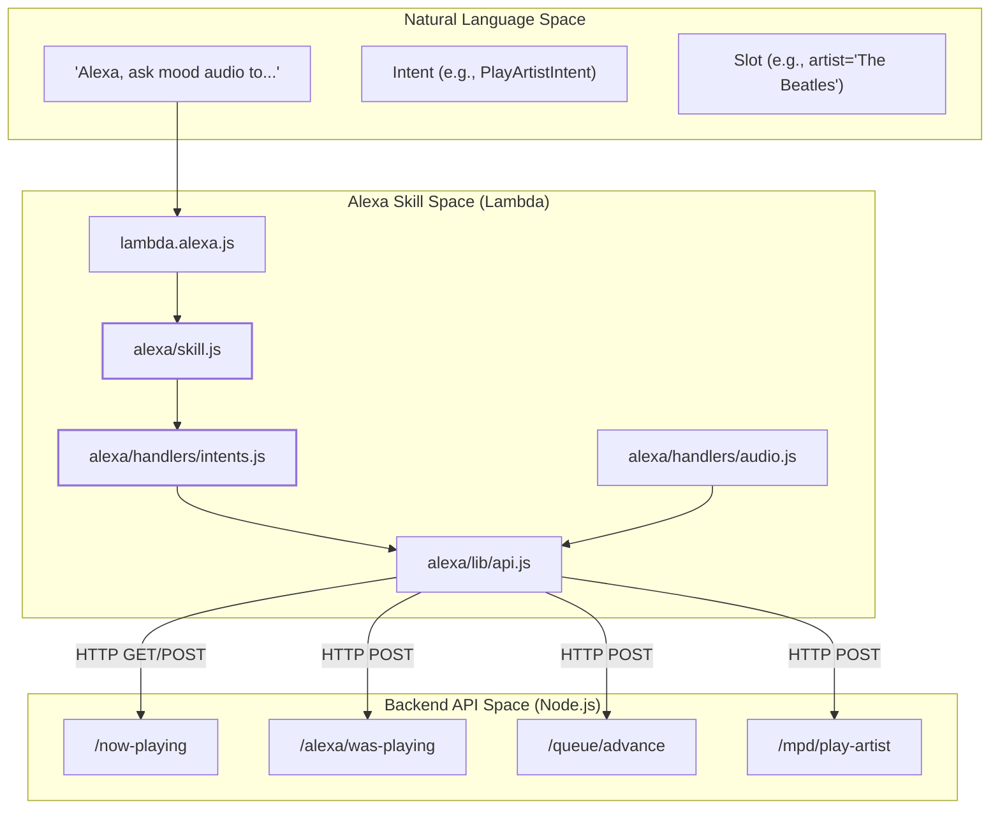
```mermaid
graph TB
    subgraph "Natural Language Space"
        UserVoice["'Alexa, ask mood audio to...'"]
        IntentName["Intent (e.g., PlayArtistIntent)"]
        SlotValue["Slot (e.g., artist='The Beatles')"]
    end

    subgraph "Alexa Skill Space (Lambda)"
        SkillEntry["lambda.alexa.js"]
        SkillJS["alexa/skill.js"]
        IntentHandlers["alexa/handlers/intents.js"]
        AudioHandlers["alexa/handlers/audio.js"]
        ApiClient["alexa/lib/api.js"]
    end

    subgraph "Backend API Space (Node.js)"
        NowPlayingAPI["/now-playing"]
        WasPlayingAPI["/alexa/was-playing"]
        QueueAdvance["/queue/advance"]
        MpdPlay["/mpd/play-artist"]
    end

    UserVoice --> SkillEntry
    SkillEntry --> SkillJS
    SkillJS --> IntentHandlers
    IntentHandlers --> ApiClient
    AudioHandlers --> ApiClient
    
    ApiClient -- "HTTP GET/POST" --> NowPlayingAPI
    ApiClient -- "HTTP POST" --> WasPlayingAPI
    ApiClient -- "HTTP POST" --> QueueAdvance
    ApiClient -- "HTTP POST" --> MpdPlay

    style SkillJS stroke-width:2px
    style IntentHandlers stroke-width:2px
```

**Sources:**
- [alexa/skill.js:7-12]()
- [alexa/lib/api.js:76-129]()
- [lambda.alexa.js:1-4]()

---

## Data Flow: The Playback Pipeline

Alexa playback differs from local playback; it is file-based rather than stream-based. The Alexa runtime fetches individual files from the API's `/track` endpoint [[alexa/skill.js:79-85]]().

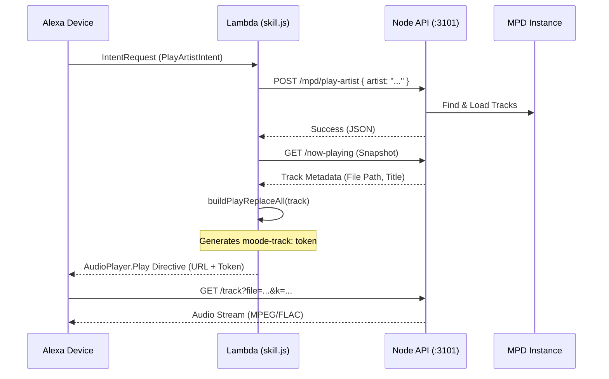
```mermaid
sequenceDiagram
    participant Alexa as Alexa Device
    participant Skill as Lambda (skill.js)
    participant API as Node API (:3101)
    participant MPD as MPD Instance

    Alexa->>Skill: IntentRequest (PlayArtistIntent)
    Skill->>API: POST /mpd/play-artist { artist: "..." }
    API->>MPD: Find & Load Tracks
    API-->>Skill: Success (JSON)
    Skill->>API: GET /now-playing (Snapshot)
    API-->>Skill: Track Metadata (File Path, Title)
    Skill->>Skill: buildPlayReplaceAll(track)
    Note over Skill: Generates moode-track: token
    Skill-->>Alexa: AudioPlayer.Play Directive (URL + Token)
    Alexa->>API: GET /track?file=...&k=...
    API-->>Alexa: Audio Stream (MPEG/FLAC)
```

**Sources:**
- [alexa/skill.js:87-126]()
- [alexa/skill.js:206-216]()
- [alexa/lib/api.js:121-129]()

---

## Key Components

### 1. Intent Handlers (`alexa/handlers/intents.js`)
Contains the logic for mapping Alexa Intents (defined in `interaction-model.v2.json`) to API calls.
- **LaunchRequestHandler**: Handles "Open Mood Audio". If music is already playing on Alexa (identified by the `moode-track:` token prefix), it announces the current track using metadata from the token or the `/now-playing` API [[alexa/handlers/intents.js:76-145]]().
- **PlayArtistIntentHandler**: Calls `apiPlayArtist` and logs the heard string for correction via `apiLogHeardArtist` [[alexa/handlers/intents.js:20-22]]().
- **VibeIntentHandlers**: Supports "Vibe this song", triggering the Python-based Last.fm discovery engine [[alexa/handlers/intents.js:33-36]]().

### 2. Audio Handlers (`alexa/handlers/audio.js`)
Manages the `AudioPlayer` lifecycle and queue advancement.
- **PlaybackStopped**: Updates the `was-playing` state on the backend to track progress and persists the stop offset [[alexa/handlers/audio.js:192-203]]().
- **PlaybackNearlyFinished**: Triggers the `ensureHeadReady` logic to pre-fetch and enqueue the next track from the MPD queue to Alexa [[alexa/handlers/audio.js:205-215]]().
- **ensureHeadReady**: The core "Capture and Correct" pipeline. It checks if the next track is already enqueued and calls `/queue/advance` to keep MPD in sync with Alexa's progress [[alexa/handlers/audio.js:53-147]]().

### 3. API Client (`alexa/lib/api.js`)
A wrapper for `http`/`https` requests from the Lambda environment to the local API. It handles the `TRACK_KEY` authentication header [[alexa/lib/api.js:83-85]]() and JSON parsing of responses [[alexa/lib/api.js:54-60]]().

### 4. Alias & Correction System
When Alexa mishears a name, the system provides endpoints to log these failures and suggest corrections.
- `apiSuggestArtistAlias`: Proposes a correction based on fuzzy matching in the library [[alexa/lib/api.js:131-139]]().
- `apiLogHeardArtist`: Records exactly what Alexa heard to the `alexa-heard-*` logs for manual review in the Library Health dashboard [[alexa/lib/api.js:141-149]]().

**Sources:**
- [alexa/handlers/intents.js:5-40]()
- [alexa/handlers/audio.js:53-147]()
- [alexa/lib/api.js:7-74]()

---

## Deployment & Lambda Bundle

The Alexa skill is deployed as a zip package to the Alexa Developer Console or AWS Lambda.

### Bundle Structure
The deployment zip must contain the `lambda/` directory as the root [[alexa/README.md:202]]().
- `lambda/index.js`: The entry point (copied from `lambda_upload/lambda/index.js`) [[alexa/README.md:190]]().
- `lambda/alexa/`: The core logic files (`skill.js`, `handlers/`, `lib/`).
- `lambda/alexa/config.js`: Runtime configuration resolved from environment variables [[alexa/README.md:58-60]]().

### Required Environment Variables
These must be set in the Alexa Developer Console (Code -> Environment Variables) [[alexa/README.md:58-60]]():
- `API_BASE`: The public HTTPS URL of your API (e.g., `https://moode.yourdomain.com`).
- `TRACK_KEY`: The security key shared with the Node.js backend.

**Sources:**
- [alexa/README.md:182-203]()
- [lambda.alexa.js:1-4]()

---

## Network Requirements (Caddy)

Alexa requires a valid public HTTPS endpoint. A Caddy reverse proxy is recommended to route traffic to the Node.js API (port 3101) and the web UI (port 8101) [[alexa/README.md:63-81]]().

| Path | Upstream Target | Purpose |
| :--- | :--- | :--- |
| `/now-playing`, `/alexa/*`, `/mpd/*` | `127.0.0.1:3101` | Alexa Skill API calls [[alexa/README.md:129]]() |
| `/track`, `/art/*` | `127.0.0.1:3101` | Audio file and artwork delivery [[alexa/README.md:129]]() |
| `/coverart.php`, `/images/*` | `moode.local:80` | moOde legacy artwork [[alexa/README.md:118-125]]() |
| `/stream*` | `moode.local:8000` | Audio stream passthrough [[alexa/README.md:141-145]]() |

**Sources:**
- [alexa/README.md:106-153]()
- [docs/03-alexa.md:64-114]()
3e:T253f,
# moOde Integration

<details>
<summary>Relevant source files</summary>

The following files were used as context for generating this wiki page:

- [THIRD_PARTY_LICENSES.md](THIRD_PARTY_LICENSES.md)
- [app.html](app.html)
- [docs/15-moode-remote-display-blanking-fix.md](docs/15-moode-remote-display-blanking-fix.md)
- [docs/references/moode/README.md](docs/references/moode/README.md)
- [docs/references/moode/watchdog-remote-display.patch](docs/references/moode/watchdog-remote-display.patch)
- [docs/references/moode/watchdog.sh.patched.example](docs/references/moode/watchdog.sh.patched.example)
- [docs/references/moode/watchdog.sh.upstream-20260302.example](docs/references/moode/watchdog.sh.upstream-20260302.example)
- [integrations/moode/README.md](integrations/moode/README.md)
- [integrations/moode/aplmeta-reader.sh](integrations/moode/aplmeta-reader.sh)
- [integrations/moode/aplmeta.py](integrations/moode/aplmeta.py)
- [integrations/moode/install.sh](integrations/moode/install.sh)
- [integrations/moode/revert.sh](integrations/moode/revert.sh)
- [integrations/moode/shairport-sync.conf.template](integrations/moode/shairport-sync.conf.template)
- [ops/moode-overrides/README.md](ops/moode-overrides/README.md)
- [ops/moode-overrides/etc/systemd/system/airplay-json-watchdog.service](ops/moode-overrides/etc/systemd/system/airplay-json-watchdog.service)
- [ops/moode-overrides/etc/systemd/system/airplay-json-watchdog.timer](ops/moode-overrides/etc/systemd/system/airplay-json-watchdog.timer)
- [ops/moode-overrides/etc/systemd/system/airplay-json.service](ops/moode-overrides/etc/systemd/system/airplay-json.service)
- [ops/moode-overrides/usr/local/bin/airplay-json-watchdog.sh](ops/moode-overrides/usr/local/bin/airplay-json-watchdog.sh)
- [ops/moode-overrides/var/www/daemon/aplmeta-reader.sh](ops/moode-overrides/var/www/daemon/aplmeta-reader.sh)
- [peppy.html](peppy.html)
- [src/routes/config.runtime-admin.routes.mjs](src/routes/config.runtime-admin.routes.mjs)
- [styles/hero.css](styles/hero.css)
- [theme.html](theme.html)

</details>


## Purpose and Scope

This page documents the deep integration between the `now-playing` system and the moOde audio player environment. It covers the technical implementation of remote command execution via SSH, direct MPD (Music Player Daemon) operations, moOde database queries (SQLite), the watchdog remote-display patch for wake-on-play management, and the optional AirPlay metadata enhancement suite.

---

## Architecture & Data Flow

The integration operates across three primary layers: the **API Bridge** (running on the now-playing host), the **moOde Services** (MPD, SQLite, Systemd), and the **Metadata Pipeline** (AirPlay/Radio).

### System Integration Topology
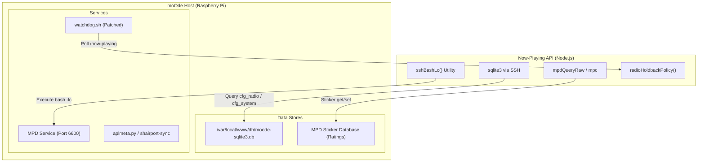
```mermaid
graph TB
    subgraph "Now-Playing API (Node.js)"
        SSH["sshBashLc() Utility"]
        MPDClient["mpdQueryRaw / mpc"]
        SQLClient["sqlite3 via SSH"]
        RadioEval["radioHoldbackPolicy()"]
    end

    subgraph "moOde Host (Raspberry Pi)"
        subgraph "Data Stores"
            MoodeDB["/var/local/www/db/moode-sqlite3.db"]
            StickerDB["MPD Sticker Database (Ratings)"]
        end
        
        subgraph "Services"
            MPD["MPD Service (Port 6600)"]
            Watchdog["watchdog.sh (Patched)"]
            AirPlay["aplmeta.py / shairport-sync"]
        end
    end

    SSH -->|"Execute bash -lc"| MPD
    SQLClient -->|"Query cfg_radio / cfg_system"| MoodeDB
    MPDClient -->|"Sticker get/set"| StickerDB
    Watchdog -->|"Poll /now-playing"| RadioEval
```

**Sources:** [src/routes/config.runtime-admin.routes.mjs:146-151](), [src/routes/config.runtime-admin.routes.mjs:58-66](), [docs/15-moode-remote-display-blanking-fix.md:21-29]()

---

## SSH Command Execution (`sshBashLc`)

The system relies on a hardened SSH bridge to execute commands on the moOde host. This is implemented in the `sshBashLc` utility, which uses `BatchMode` and strict timeouts to prevent the API from hanging on network issues.

### Implementation Details
- **Command Wrapper:** Uses `bash -lc` to ensure the moOde user's full profile and paths are loaded [src/routes/config.runtime-admin.routes.mjs:148-151]().
- **Security:** Arguments are escaped using `shQuoteArg` to prevent shell injection [src/routes/config.runtime-admin.routes.mjs:142-145]().
- **Configuration:** Host and user are defined in `MOODE_SSH_HOST` and `MOODE_SSH_USER` [src/routes/config.runtime-admin.routes.mjs:6-6]().

### Common Execution Patterns
| Operation | Command / Script Pattern |
| :--- | :--- |
| **Service Status** | `systemctl is-active "$svc"` [src/routes/config.runtime-admin.routes.mjs:168-168]() |
| **Service Enablement** | `systemctl is-enabled "$svc"` [src/routes/config.runtime-admin.routes.mjs:169-169]() |
| **System Info** | `cat /etc/moode-release` (Example) [src/routes/config.runtime-admin.routes.mjs:175-175]() |

**Sources:** [src/routes/config.runtime-admin.routes.mjs:133-152](), [src/routes/config.runtime-admin.routes.mjs:164-176]()

---

## moOde Database Integration (SQLite)

The system queries moOde's internal SQLite database (`/var/local/www/db/moode-sqlite3.db`) to synchronize state that MPD does not provide directly.

### System Configuration Queries
The system checks moOde parameters to coordinate kiosk behavior and display targets.
- **Target URL:** `select value from cfg_system where param='local_display_url';` [docs/15-moode-remote-display-blanking-fix.md:85-85]().
- **Display Wake:** Used by the watchdog to determine if the screen should be powered on based on the `wake_display` parameter [docs/15-moode-remote-display-blanking-fix.md:6-7]().

**Sources:** [docs/15-moode-remote-display-blanking-fix.md:84-86]()

---

## AirPlay Metadata Integration (`integrations/moode/`)

Standard moOde AirPlay handling can occasionally result in stale metadata or artwork carryover. The `now-playing` system provides an optional integration suite to stabilize this.

### Metadata Pipeline Entity Map
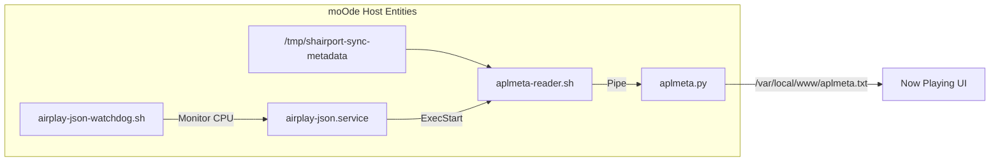
```mermaid
graph LR
    subgraph "moOde Host Entities"
        FIFO["/tmp/shairport-sync-metadata"]
        Reader["aplmeta-reader.sh"]
        Parser["aplmeta.py"]
        Service["airplay-json.service"]
        Watchdog["airplay-json-watchdog.sh"]
    end

    FIFO --> Reader
    Reader -->|"Pipe"| Parser
    Parser -->|"/var/local/www/aplmeta.txt"| UI["Now Playing UI"]
    Service -->|"ExecStart"| Reader
    Watchdog -->|"Monitor CPU"| Service
```

### Components
1.  **`aplmeta.py`**: An enhanced Python-based parser that normalizes metadata from `shairport-sync` [integrations/moode/README.md:32-33]().
2.  **`aplmeta-reader.sh`**: A supervisor daemon that monitors the metadata FIFO (`/tmp/shairport-sync-metadata`) and ensures the metadata pipeline is updated [ops/moode-overrides/var/www/daemon/aplmeta-reader.sh:6-31]().
3.  **Watchdog (`airplay-json-watchdog.sh`)**: A specialized monitor that restarts the `airplay-json.service` if `shairport-sync-metadata-reader` exceeds 40% CPU usage [ops/moode-overrides/README.md:21-23]().
4.  **Artwork Fallback**: This integration intentionally falls back to neutral art if a new track provides no artwork, preventing "stale art" from previous sessions [integrations/moode/README.md:24-27]().

**Sources:** [integrations/moode/README.md:1-51](), [ops/moode-overrides/README.md:1-24](), [ops/moode-overrides/var/www/daemon/aplmeta-reader.sh:1-37]()

---

## Watchdog Remote-Display Patch (Wake-on-Play)

When moOde is configured to use a remote URL for its local display (e.g., `display.html?kiosk=1` on the now-playing host), the standard `watchdog.sh` fails because it attempts to query `/command/?cmd=get_output_format` on the remote UI port (8101), which results in a 404 [docs/15-moode-remote-display-blanking-fix.md:9-18]().

### The Patch Implementation
The system provides a patch for `/var/www/daemon/watchdog.sh` that redirects the playback probe to the `now-playing` API (port 3101) [docs/15-moode-remote-display-blanking-fix.md:20-24]().

- **Probe Target:** `http://<host>:3101/now-playing` [docs/15-moode-remote-display-blanking-fix.md:51-51]().
- **Wake Logic:** The display is only woken if the JSON response contains `state == "play"` [docs/15-moode-remote-display-blanking-fix.md:25-29]().
- **Reference Script:**
  ```bash
  state=$(curl -fsS "http://$host:3101/now-playing" | python3 -c 'import sys,json; print((json.load(sys.stdin).get("state") or "").strip())' 2>/dev/null || true)
  if [ "$state" = "play" ]; then
    # wake display path
  fi
  ```
  [docs/15-moode-remote-display-blanking-fix.md:69-75]().

**Sources:** [docs/15-moode-remote-display-blanking-fix.md:1-90]()

---

## Service Management

The system manages several moOde-side services to ensure visualizers and metadata are consistent.

| Service | Description | Role |
| :--- | :--- | :--- |
| `airplay-json.service` | AirPlay Metadata JSON Export | Runs the `aplmeta-reader.sh` script [ops/moode-overrides/etc/systemd/system/airplay-json.service:1-10](). |
| `airplay-json-watchdog.timer` | Watchdog Timer | Triggers the CPU monitor every 30 seconds [ops/moode-overrides/etc/systemd/system/airplay-json-watchdog.timer:1-12](). |
| `mpdscribble.service` | Last.fm Scrobbling | Controlled via the API to enable/disable scrobbling [src/routes/config.runtime-admin.routes.mjs:78-78](). |

**Sources:** [ops/moode-overrides/etc/systemd/system/airplay-json.service:1-10](), [ops/moode-overrides/etc/systemd/system/airplay-json-watchdog.timer:1-12](), [src/routes/config.runtime-admin.routes.mjs:164-180]()
3f:T268d,
# Last.fm Vibe Discovery

<details>
<summary>Relevant source files</summary>

The following files were used as context for generating this wiki page:

- [build_moode_index.py](build_moode_index.py)
- [ecosystem.config.cjs](ecosystem.config.cjs)
- [lastfm_vibe_radio.py](lastfm_vibe_radio.py)
- [now-playing.config.example.json](now-playing.config.example.json)
- [scripts/radio.js](scripts/radio.js)
- [src/lib/browse-index.mjs](src/lib/browse-index.mjs)
- [src/lib/lastfm-library-match.mjs](src/lib/lastfm-library-match.mjs)
- [src/routes/config.queue-wizard-apply.routes.mjs](src/routes/config.queue-wizard-apply.routes.mjs)
- [src/routes/config.queue-wizard-basic.routes.mjs](src/routes/config.queue-wizard-basic.routes.mjs)
- [src/routes/config.queue-wizard-vibe.routes.mjs](src/routes/config.queue-wizard-vibe.routes.mjs)

</details>


The Last.fm Vibe Discovery system generates personalized music queues by querying Last.fm's track similarity API and matching results against the local music library. The system accepts a seed track (either from current playback or explicit artist/title), retrieves similar tracks from Last.fm, and filters them to include only tracks present in the local collection.

For general queue building using filters and playlists, see [Queue Wizard Interface](#4.1). For rating-based filtering that integrates with vibe discovery, see [Ratings & Favorites](#6.3).

---

## System Architecture

The vibe discovery architecture is a bridge between the Node.js Express API, a Python worker process for similarity logic, and the local MPD library index.

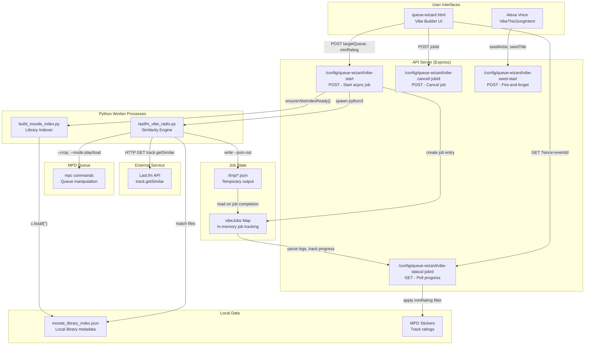
```mermaid
graph TB
    subgraph "User Interfaces"
        QW["queue-wizard.html<br/>Vibe Builder UI"]
        ALEXA["Alexa Voice<br/>VibeThisSongIntent"]
    end
    
    subgraph "API Server (Express)"
        VIBE_START["/config/queue-wizard/vibe-start<br/>POST - Start async job"]
        VIBE_STATUS["/config/queue-wizard/vibe-status/:jobId<br/>GET - Poll progress"]
        VIBE_CANCEL["/config/queue-wizard/vibe-cancel/:jobId<br/>POST - Cancel job"]
        VIBE_SEED_START["/config/queue-wizard/vibe-seed-start<br/>POST - Fire-and-forget"]
    end
    
    subgraph "Python Worker Processes"
        PY_VIBE["lastfm_vibe_radio.py<br/>Similarity Engine"]
        PY_INDEX["build_moode_index.py<br/>Library Indexer"]
    end
    
    subgraph "External Service"
        LASTFM["Last.fm API<br/>track.getSimilar"]
    end
    
    subgraph "Local Data"
        INDEX_JSON["moode_library_index.json<br/>Local library metadata"]
        RATINGS["MPD Stickers<br/>Track ratings"]
    end
    
    subgraph "MPD Queue"
        MPC["mpc commands<br/>Queue manipulation"]
    end
    
    subgraph "Job State"
        JOBS["vibeJobs Map<br/>In-memory job tracking"]
        TMP["/tmp/*.json<br/>Temporary output"]
    end
    
    QW -->|"POST targetQueue, minRating"| VIBE_START
    ALEXA -->|"seedArtist, seedTitle"| VIBE_SEED_START
    
    VIBE_START -->|"spawn python3"| PY_VIBE
    VIBE_START -->|"ensureVibeIndexReady()"| PY_INDEX
    VIBE_START -->|"create job entry"| JOBS
    
    PY_INDEX -->|"c.listall('')"| INDEX_JSON
    PY_VIBE -->|"HTTP GET track.getSimilar"| LASTFM
    PY_VIBE -->|"match files"| INDEX_JSON
    PY_VIBE -->|"write --json-out"| TMP
    PY_VIBE -->|"--crop, --mode play/load"| MPC
    
    JOBS -->|"parse logs, track progress"| VIBE_STATUS
    TMP -->|"read on job completion"| JOBS
    
    VIBE_STATUS -->|"apply minRating filter"| RATINGS
    
    QW -->|"GET ?since=eventId"| VIBE_STATUS
    QW -->|"POST jobId"| VIBE_CANCEL
```

**Sources:**
- [src/routes/config.queue-wizard-vibe.routes.mjs:13-106]()
- [lastfm_vibe_radio.py:1-156]()
- [build_moode_index.py:35-96]()

---

## Configuration & Library Indexing

### Last.fm API Key
The system requires a Last.fm API key, resolved in the following priority order:
1. Environment variable `LASTFM_API_KEY` [src/routes/config.queue-wizard-vibe.routes.mjs:19-20]()
2. Configuration file field `lastfm.apiKey` at `config/now-playing.config.json` [src/routes/config.queue-wizard-vibe.routes.mjs:21-23]()
3. Fallback to hardcoded key in `ecosystem.config.cjs` [ecosystem.config.cjs:7-7]()

### Library Indexing (`build_moode_index.py`)
Before the vibe script can match Last.fm results to local files, it needs a searchable index. The `build_moode_index.py` script performs an atomic write of the library metadata to `moode_library_index.json`.

- **MPD Extraction:** Uses `c.listall("")` to pull all known files from MPD [build_moode_index.py:42-42]().
- **Normalization:** Every artist and title is normalized via `norm()` to strip "junk" (e.g., "Remaster", "Live") and special characters [build_moode_index.py:17-27]().
- **Atomic Write:** Writes to a `.tmp` file and uses `os.replace` to prevent 0-byte index corruption [build_moode_index.py:84-88]().

### Automatic Index Maintenance
The Express route `ensureVibeIndexReady` checks the index age. If it is missing or older than 12 hours (`VIBE_INDEX_MAX_AGE_MS`), it automatically spawns the indexer before starting the vibe job [src/routes/config.queue-wizard-vibe.routes.mjs:58-68]().

**Sources:**
- [src/routes/config.queue-wizard-vibe.routes.mjs:58-106]()
- [build_moode_index.py:11-32]()

---

## The Vibe Discovery Process (`lastfm_vibe_radio.py`)

The Python worker manages the similarity "hops" and library matching logic.

### 1. Similarity Retrieval
The script calls the Last.fm `track.getSimilar` method [lastfm_vibe_radio.py:158-165](). It includes a retry mechanism (6 attempts) for transient error 8 or network timeouts [lastfm_vibe_radio.py:168-208]().

### 2. Seasonal Filtering
The system includes a hardcoded `XMAS_WORDS` list to filter out seasonal tracks unless explicitly requested [lastfm_vibe_radio.py:34-46]().

### 3. Library Matching Logic
Matching is performed in several stages to maximize hits:
- **Direct Match:** Checks the `text_map` for an exact normalized `artist|title` key [lastfm_vibe_radio.py:226-227]().
- **Fuzzy Artist Match:** If no direct match, it searches for titles within the same artist that share a significant prefix [lastfm_vibe_radio.py:219-245]().
- **Path Scoring:** If multiple files match a track (e.g., duplicates), `path_score` prioritizes paths that don't look like parenthetical copies [lastfm_vibe_radio.py:94-97]().

### 4. Path Translation
Because the worker may run on a different host or mount point than MPD, it translates absolute paths to MPD-relative paths using `ensure_mpd_path` [lastfm_vibe_radio.py:99-107]().

**Sources:**
- [lastfm_vibe_radio.py:34-46]()
- [lastfm_vibe_radio.py:71-75]()
- [lastfm_vibe_radio.py:156-209]()
- [lastfm_vibe_radio.py:219-245]()

---

## API & Async Job Lifecycle

The system uses an asynchronous job pattern managed in `src/routes/config.queue-wizard-vibe.routes.mjs`.

### Job Lifecycle Flow

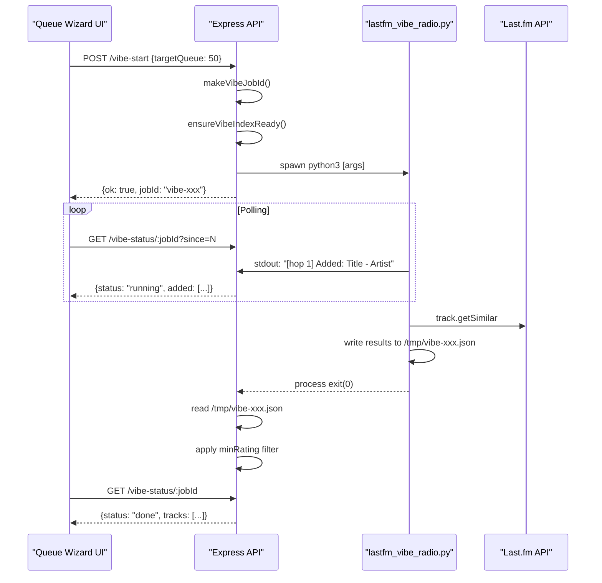
```mermaid
sequenceDiagram
    participant UI as "Queue Wizard UI"
    participant API as "Express API"
    participant PY as "lastfm_vibe_radio.py"
    participant LFM as "Last.fm API"
    
    UI->>API: POST /vibe-start {targetQueue: 50}
    API->>API: makeVibeJobId()
    API->>API: ensureVibeIndexReady()
    API->>PY: spawn python3 [args]
    API-->>UI: {ok: true, jobId: "vibe-xxx"}
    
    loop Polling
        UI->>API: GET /vibe-status/:jobId?since=N
        PY->>API: stdout: "[hop 1] Added: Title - Artist"
        API-->>UI: {status: "running", added: [...]}
    end
    
    PY->>LFM: track.getSimilar
    PY->>PY: write results to /tmp/vibe-xxx.json
    PY-->>API: process exit(0)
    
    API->>API: read /tmp/vibe-xxx.json
    API->>API: apply minRating filter
    UI->>API: GET /vibe-status/:jobId
    API-->>UI: {status: "done", tracks: [...]}
```

### Job State Management
The `vibeJobs` Map stores the state of all active and recently completed jobs [src/routes/config.queue-wizard-vibe.routes.mjs:15](). Each job tracks:
- **Phase:** Current activity (e.g., "querying last.fm", "matching local library") [src/routes/config.queue-wizard-vibe.routes.mjs:179-180]().
- **Incremental Progress:** Tracks are added to the `added` array as they appear in the Python stdout [src/routes/config.queue-wizard-vibe.routes.mjs:189-190]().
- **Rating Filtering:** After the Python script completes, the API filters the resulting track list based on the user's `minRating` requirement using `getRatingForFile` [src/routes/config.queue-wizard-vibe.routes.mjs:115-115]().

### Python Argument Construction
The API dynamically configures the worker based on the queue size. If the `targetQueue` is small (≤ 15), it uses more aggressive limits (`--similar-limit 80`) to speed up the response [src/routes/config.queue-wizard-vibe.routes.mjs:140-153]().

**Sources:**
- [src/routes/config.queue-wizard-vibe.routes.mjs:9-11]()
- [src/routes/config.queue-wizard-vibe.routes.mjs:109-175]()
- [src/routes/config.queue-wizard-vibe.routes.mjs:176-216]()
- [src/routes/config.queue-wizard-vibe.routes.mjs:218-248]()

---

## Summary of Key Functions

| Entity | Location | Role |
|:---|:---|:---|
| `registerConfigQueueWizardVibeRoutes` | `src/routes/config.queue-wizard-vibe.routes.mjs` | Main route registration and job manager. |
| `ensureVibeIndexReady` | `src/routes/config.queue-wizard-vibe.routes.mjs` | Checks age of `moode_library_index.json` and rebuilds if stale. |
| `lastfm_get_similar` | `lastfm_vibe_radio.py` | Handles HTTP communication with Last.fm with retries. |
| `fuzzy_within_artist` | `lastfm_vibe_radio.py` | Matches similar tracks to local files when titles don't match exactly. |
| `norm` | `build_moode_index.py` | Canonicalizes artist/track strings for consistent indexing and matching. |

**Sources:**
- [src/routes/config.queue-wizard-vibe.routes.mjs:13-13]()
- [src/routes/config.queue-wizard-vibe.routes.mjs:58-58]()
- [lastfm_vibe_radio.py:156-156]()
- [lastfm_vibe_radio.py:219-219]()
- [build_moode_index.py:17-17]()
