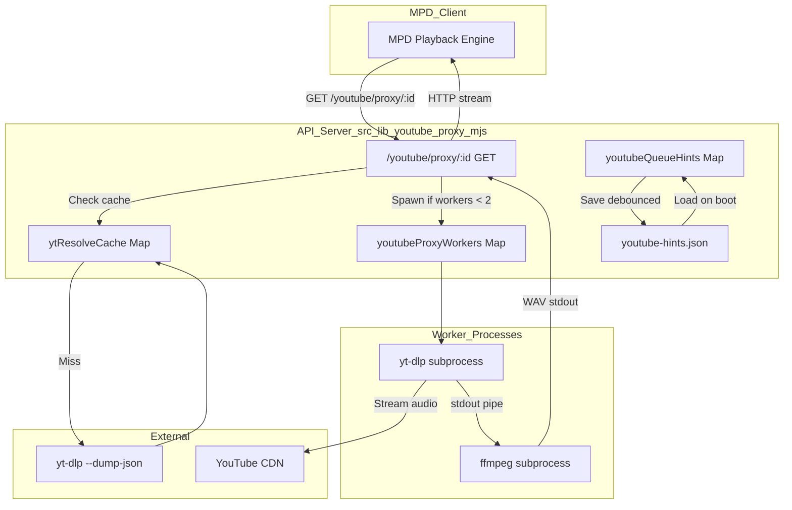
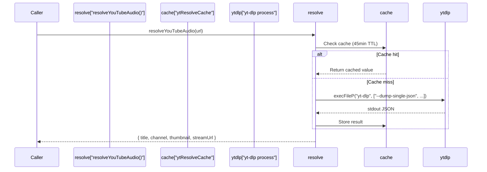
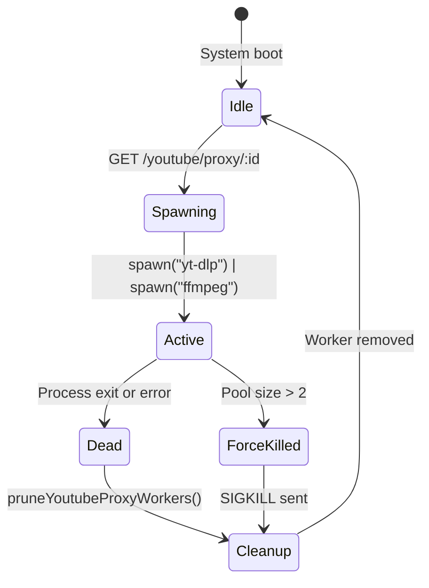

# YouTube Proxy

Relevant source files

The following files were used as context for generating this wiki page:

- [docs/17-youtube.md](docs/17-youtube.md)
- [youtube.html](youtube.html)

The YouTube Proxy subsystem provides `yt-dlp`-based stream resolution and proxying to enable YouTube audio playback through MPD. The system maintains an in-memory hint cache for metadata persistence and a worker pool to manage concurrent stream transcoding processes. This allows moOde to play YouTube content as if it were a local stream, bypassing the need for AirPlay or Bluetooth.

**Core Responsibilities:**
- Stream URL resolution via `yt-dlp` [src/lib/youtube-proxy.mjs:210-250]()
- HTTP proxy endpoint for MPD consumption (`/youtube/proxy/:id`) [src/lib/youtube-proxy.mjs:591-599]()
- Worker pool management (max 2 concurrent streams) [src/lib/youtube-proxy.mjs:566]()
- Metadata hint caching with disk persistence [src/lib/youtube-proxy.mjs:613-650]()
- Playlist expansion and durable URL rewriting [src/routes/config.diagnostics.routes.mjs:361-415]()

---

## Architecture Overview

The YouTube Proxy system consists of three subsystems: stream resolution via `yt-dlp`, an HTTP proxy worker pool, and a metadata hint cache.

**Diagram: YouTube Proxy Architecture**

**Key Data Structures:**

| Structure | Type | Max Size | Eviction | Persistence | File Source |
|-----------|------|----------|----------|-------------|-------------|
| `ytResolveCache` | Map | 1000 | LRU | None | [src/lib/youtube-proxy.mjs:2105]() |
| `youtubeQueueHints` | Map | 300 | LRU | Async save | [src/lib/youtube-proxy.mjs:561]() |
| `youtubeProxyWorkers` | Map | 2 | Oldest worker | None | [src/lib/youtube-proxy.mjs:564]() |

**Sources:** [src/lib/youtube-proxy.mjs:561-652](), [src/lib/youtube-proxy.mjs:2105-2149]()

---

## Stream Resolution via yt-dlp

### Resolution Process

The `resolveYouTubeAudio()` function uses `yt-dlp` to extract playable stream URLs. This is required because YouTube URLs expire and MPD cannot handle them directly.

**Resolution Flow:**

**Extracted Metadata:**
The system extracts `title`, `uploader`/`channel`, `thumbnail`, `duration`, and the direct `url` (stream link) from the `yt-dlp` JSON output [src/lib/youtube-proxy.mjs:2130-2137]().

**Sources:** [src/lib/youtube-proxy.mjs:2108-2149]()

---

## Search and Playlist Expansion

### Search Implementation

The `searchYouTube()` function provides query-based search and playlist filtering [src/lib/youtube-proxy.mjs:2185-2216](). It uses the `ytsearch{N}:{query}` syntax for standard searches or specific playlist result filters.

**Entry Normalization:**
The `normalizeYtEntry()` function standardizes raw `yt-dlp` output into a common format used by the UI [src/lib/youtube-proxy.mjs:2151-2183]().

### Playlist Expansion

The `listYouTubePlaylist()` function expands playlist URLs into individual video entries using `--flat-playlist` to quickly gather metadata for all items in a list [src/lib/youtube-proxy.mjs:2218-2240]().

**Sources:** [src/lib/youtube-proxy.mjs:2151-2240]()

---

## Proxy Worker Pool

The worker pool manages concurrent `yt-dlp` and `ffmpeg` subprocesses that transcode YouTube streams into MPD-compatible WAV output.

### Worker Lifecycle

**Diagram: Worker Pool Management**

**Worker Pool Maintenance:**
The `pruneYoutubeProxyWorkers()` function runs every 15 seconds to clean up stale workers and ensure the pool does not exceed `YT_PROXY_MAX_WORKERS` (default 2) [src/lib/youtube-proxy.mjs:601-611]().

**Stream Transcoding Pipeline:**
When MPD requests a proxy URL, the API spawns `yt-dlp` with `-f bestaudio` and pipes its `stdout` into `ffmpeg`'s `stdin`. `ffmpeg` then outputs a WAV stream to the HTTP response [src/lib/youtube-proxy.mjs:591-599]().

**Sources:** [src/lib/youtube-proxy.mjs:564-611](), [src/lib/youtube-proxy.mjs:591-599](), [src/lib/youtube-proxy.mjs:651]()

---

## Hint Cache System

The hint cache stores YouTube metadata to enable rich now-playing display and queue inspection without repeated `yt-dlp` calls.

### Cache Architecture

| Layer | Type | Capacity | Persistence |
|-------|------|----------|-------------|
| `youtubeQueueHints` | Map | 300 | Async to disk [src/lib/youtube-proxy.mjs:575-584]() |
| `youtube-hints.json` | File | 500 | Durable [src/lib/youtube-proxy.mjs:635-648]() |

**Stream Key Normalization:**
The `youtubeStreamKey()` function extracts a stable ID from proxy URLs (e.g., `/youtube/proxy/abc123...`) or standard YouTube URLs to ensure consistent cache lookups [src/lib/youtube-proxy.mjs:567-574]().

**Now-Playing Enrichment:**
When `/now-playing` detects a YouTube URL, it calls `getYoutubeQueueHint()` to populate the `artist`, `title`, and `albumArtUrl` fields in the response payload [src/lib/youtube-proxy.mjs:575-589]().

**Sources:** [src/lib/youtube-proxy.mjs:561-589](), [src/lib/youtube-proxy.mjs:613-650]()

---

## Playlist Durability & Queue Modes

### M3U Rewriting System

Standard MPD playlists store the ephemeral proxy URL. The `/config/diagnostics/queue/save-playlist` endpoint rewrites these `.m3u` files to use the original YouTube `webpageUrl`. This ensures that playlists remain playable even after the proxy ID expires [src/routes/config.diagnostics.routes.mjs:361-415]().

### Queue Modes (youtube.html)

The `youtube.html` interface provides three queueing modes [youtube.html:42-46]():
1. **Append**: Add to the end of the current queue [docs/17-youtube.md:25]().
2. **Crop**: Keep the currently playing item, remove all following items, and add the new items [docs/17-youtube.md:26]().
3. **Replace**: Clear the entire queue and start playback from the new items [docs/17-youtube.md:27]().

**Sources:** [youtube.html:42-46](), [src/routes/config.diagnostics.routes.mjs:361-415](), [docs/17-youtube.md:23-27]()

---

## UI Interface (youtube.html)

The YouTube Bridge UI (`youtube.html`) allows users to search, resolve, and expand playlists directly from the browser.

**Key UI Functions:**
- `doSearch()`: Executes YouTube search via `POST /youtube/search` and renders results [youtube.html:89-113]().
- `loadPlaylist()`: Expands a playlist URL into individual selectable rows via `POST /youtube/playlist` [youtube.html:115-140]().
- `sendToMoode()`: Sends selected URLs to the API via `POST /youtube/send` with the chosen queue mode [youtube.html:157-190]().

**Sources:** [youtube.html:89-190](), [docs/17-youtube.md:16-21]()
