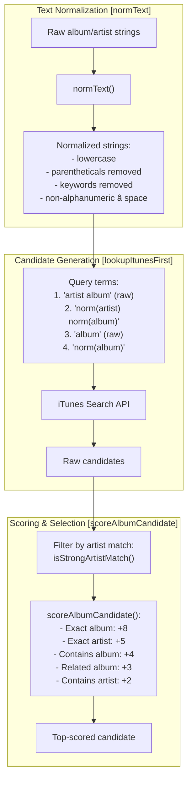
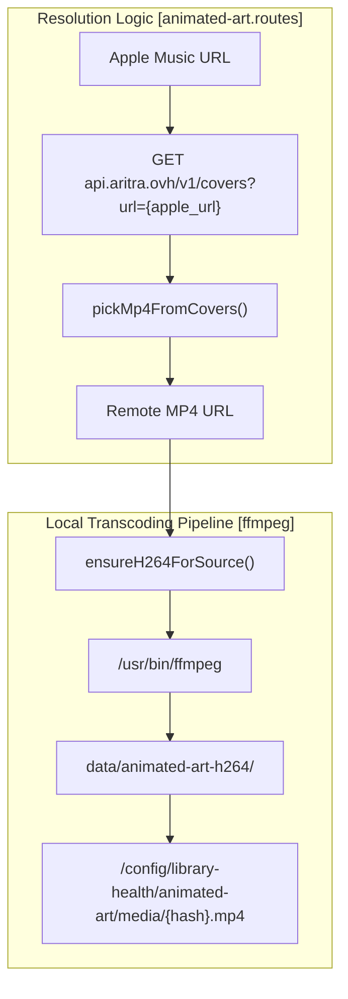

# iTunes & Motion Art APIs

<details>
<summary>Relevant source files</summary>

The following files were used as context for generating this wiki page:

- [alexa.html](alexa.html)
- [moode-nowplaying-api.mjs](moode-nowplaying-api.mjs)
- [notes/refactor-plan-pi-first.md](notes/refactor-plan-pi-first.md)
- [radio.html](radio.html)
- [scripts/hero-transport.js](scripts/hero-transport.js)
- [src/routes/config.library-health-animated-art.routes.mjs](src/routes/config.library-health-animated-art.routes.mjs)
- [src/routes/config.library-health-art.routes.mjs](src/routes/config.library-health-art.routes.mjs)
- [src/routes/config.library-health-batch.routes.mjs](src/routes/config.library-health-batch.routes.mjs)
- [src/routes/config.library-health-genre.routes.mjs](src/routes/config.library-health-genre.routes.mjs)
- [src/routes/config.moode-audio-info.routes.mjs](src/routes/config.moode-audio-info.routes.mjs)
- [src/routes/config.queue-wizard-preview.routes.mjs](src/routes/config.queue-wizard-preview.routes.mjs)
- [src/routes/config.routes.index.mjs](src/routes/config.routes.index.mjs)

</details>


## Overview

This page documents the external API integrations used for album metadata enrichment and motion art resolution. The system uses two primary external services:

- **iTunes Search API** (`itunes.apple.com/search`) for album metadata and high-resolution artwork discovery.
- **api.aritra.ovh** for resolving Apple Music URLs to motion art MP4 streams.

Additionally, this page covers the **Radio Metadata Holdback** mechanism, which stabilizes fluctuating metadata from internet radio streams.

---

## iTunes Search API Integration

The iTunes Search API provides album metadata and artwork URLs. The system uses it for two distinct purposes: matching local albums to Apple Music catalog entries and discovering high-resolution static artwork.

### API Endpoint and Request Format

All iTunes API requests use the same base endpoint:

```
https://itunes.apple.com/search?entity=album&limit={N}&term={query}
```

The `entity=album` parameter restricts results to album-level matches, and the system typically requests between 6-20 results depending on context.

**Sources:** [src/routes/config.library-health-animated-art.routes.mjs:234-256](), [src/routes/config.library-health-art.routes.mjs:39-44]()

### Rate Limiting and Throttling

The iTunes API enforces a rate limit of approximately 20 requests per minute. The system implements a strict throttling strategy to avoid 429 errors.

| Strategy | Implementation | Location |
|----------|---------------|----------|
| Request throttling | 3.4 second delay between requests | `waitForAppleItunesSlot()` |
| Backoff on 429 | 45-minute cooldown period | `appleLookupBackoffUntil` |
| Batch safety | 3.4s margin for automated jobs | `waitForAppleItunesSlot()` |

The `waitForAppleItunesSlot` function calculates the wait time based on `appleItunesNextAllowedTs`.

**Sources:** [src/routes/config.library-health-animated-art.routes.mjs:45-46](), [src/routes/config.library-health-animated-art.routes.mjs:131-137]()

### Album Matching Logic

The system uses fuzzy matching to find the best iTunes catalog entry for a local album. The matching process involves text normalization and scoring:

"Matching Pipeline"


**Sources:** [src/routes/config.library-health-animated-art.routes.mjs:181-232](), [src/routes/config.library-health-animated-art.routes.mjs:258-295]()

---

## Motion Art Resolution (api.aritra.ovh)

Motion art is animated album artwork extracted from Apple Music. The system resolves Apple Music URLs to playable MP4 streams using the Aritra API.

### Resolution Pipeline

"Motion Art Data Flow"


**Sources:** [src/routes/config.library-health-animated-art.routes.mjs:87-129](), [src/routes/config.library-health-animated-art.routes.mjs:302-391]()

### Stream Variant Selection

The Aritra API returns multiple HLS stream variants. The system selects an optimal variant in `pickMp4FromCovers()`:

1. Filters for `.m3u8` URIs.
2. Sorts by width and bandwidth.
3. Prefers square variants with width between 700px and 1200px.
4. Rewrites the `.m3u8` extension to `-.mp4` for direct file access.

**Sources:** [src/routes/config.library-health-animated-art.routes.mjs:302-312]()

### H264 Local Transcoding

Remote MP4 URLs are transcoded to local H264 files using `ffmpeg`. This ensures smooth playback on Raspberry Pi hardware.

| Parameter | Value | Rationale |
|-----------|-------|-----------|
| Scale | 720:720 | Optimal for 1:1 square displays |
| Framerate | 24 | Standard motion art rate |
| Codec | libx264 | Hardware acceleration compatible |
| Preset | veryfast | Fast encoding on Pi |
| CRF | 30 | High compression to save space |
| Flags | +faststart | Enable streaming/immediate playback |

**Sources:** [src/routes/config.library-health-animated-art.routes.mjs:104-118]()

---

## Radio Metadata Holdback

Internet radio streams often cycle through "station IDs" or "advertisements" in their metadata fields. The `applyRadioMetadataHoldback` function prevents the UI from flickering between these transient states.

### Holdback Logic

The system maintains a `radioMetaHoldbackState` Map. Metadata changes are only promoted to the UI if they remain stable for a configured duration or if a stream reset is detected.

| Policy Mode | Holdback Duration | Target Stations |
|-------------|-------------------|-----------------|
| **Strict**  | 6000ms (`RADIO_META_HOLDBACK_MS`) | Classical, WFMT, King FM, KUSC, BBC Radio 3 |
| **Normal**  | 1500ms (`RADIO_META_HOLDBACK_MS_NORMAL`) | All other stations |

### Promotion Triggers
1. **Stability Timeout:** The `pending` metadata signature matches for the duration of `holdbackMs`.
2. **Elapsed Reset:** If `elapsedSec` jumps backward by more than 3 seconds (indicating a new stream or track start), the metadata is promoted immediately.

**Sources:** [moode-nowplaying-api.mjs:45-48](), [moode-nowplaying-api.mjs:59-69](), [moode-nowplaying-api.mjs:71-158]()

---

## Static Album Art Search

High-resolution static artwork is discovered via iTunes API and used for albums without motion art or when motion art is disabled.

### URL Rewriting

The system rewrites iTunes thumbnail URLs (e.g., `100x100bb.jpg`) to access high-resolution variants (e.g., `3000x3000bb.jpg`) by string replacement.

**Sources:** [src/routes/config.library-health-art.routes.mjs:52-54]()

### Image Processing

Fetched images are processed using `ffmpeg` (extracting frame 1) or `sharp` before being written to the filesystem as `cover.jpg` in the album directory.

**Sources:** [src/routes/config.library-health-art.routes.mjs:146-150](), [src/routes/config.library-health-art.routes.mjs:240-260]()

---

## Backend API Routes

### Motion Art Routes

| Route | Method | Purpose |
|-------|--------|---------|
| `/config/library-health/animated-art/media/:name` | GET | Serve local H264 transcoded files. |
| `/config/library-health/animated-art/lookup` | GET | Lookup motion art for artist/album. |
| `/config/library-health/animated-art/job/start` | POST | Start discovery/build job. |
| `/config/library-health/animated-art/job/status` | GET | Poll job progress. |

**Sources:** [src/routes/config.library-health-animated-art.routes.mjs:540-699]()

### Static Art Routes

| Route | Method | Purpose |
|-------|--------|---------|
| `/config/library-health/album-art-search` | GET | Search iTunes for album art candidates. |
| `/config/library-health/album-art-fetch` | GET | Fetch remote image as base64. |
| `/config/library-health/album-art` | POST | Apply artwork (cover.jpg + embed). |

**Sources:** [src/routes/config.library-health-art.routes.mjs:9-319]()

---

## Configuration and Manual Overrides

The system maintains manual mappings for albums where automatic matching fails or specific Apple Music URLs are required.

- `KNOWN_APPLE_URL_OVERRIDES`: Maps `artist|album` keys to specific Apple Music URLs.
- `KNOWN_MP4_OVERRIDES`: Maps `artist|album` keys to direct MP4 stream URLs.

**Sources:** [src/routes/config.library-health-animated-art.routes.mjs:14-22](), [src/routes/config.library-health-animated-art.routes.mjs:24-41]()
