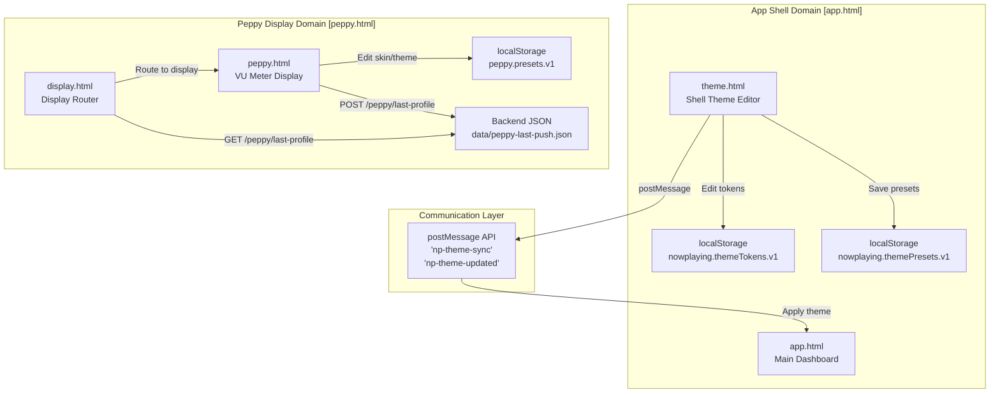
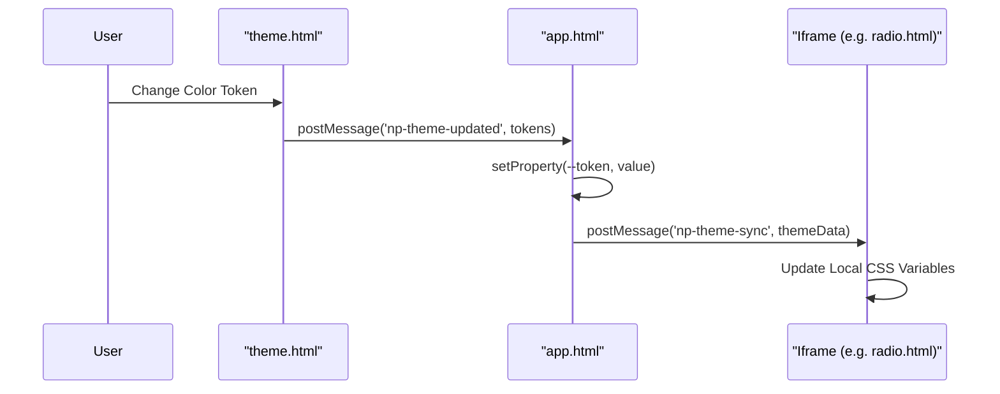
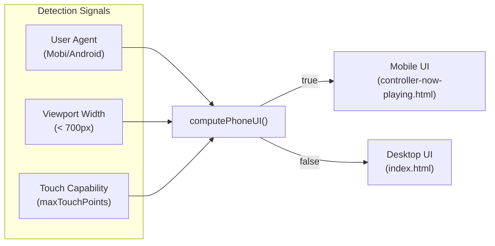

# Theme & Customization

Relevant source files

The following files were used as context for generating this wiki page:

- [app.html](app.html)
- [docs/13-theme.md](docs/13-theme.md)
- [docs/style-naming-map.md](docs/style-naming-map.md)
- [peppy.html](peppy.html)
- [scripts/theme-toggle.js](scripts/theme-toggle.js)
- [src/routes/config.runtime-admin.routes.mjs](src/routes/config.runtime-admin.routes.mjs)
- [styles/hero.css](styles/hero.css)
- [styles/podcasts2.css](styles/podcasts2.css)
- [theme.html](theme.html)

## Purpose and Scope

This page provides an overview of the theming and visual customization systems in the now-playing application. The system supports two distinct customization domains: the **app shell theme** (controlled via `theme.html`) and the **Peppy display theme** (controlled via `peppy.html`). Both use token-based architectures with live preview capabilities and responsive adaptation.

For detailed information on specific subsystems:
- **Theme Token System**: See [Theme Token System](#8.1) for CSS custom properties and propagation.
- **Theme Editor**: See [Theme Editor](#8.2) for the UI, presets, and the Matrix rain effect.
- **Responsive Layouts**: See [Responsive Layouts](#8.3) for phone-ui detection and viewport sizing.
- **Peppy Skins & Customization**: See [Peppy Skins & Customization](#8.4) for meter assets and rendering filters.

---

## Architecture Overview

The now-playing system implements a dual-theming architecture where the app shell and Peppy display have independent but coordinated customization systems.

### System Architecture Diagram

**Sources:** [theme.html:1-80](), [peppy.html:1-87](), [app.html:24-49](), [src/routes/config.runtime-admin.routes.mjs:73-81]()

---

## Token-Based Theme System

The app shell uses a CSS variable token system defined in `:root`. These tokens control the visual identity of the navigation rail, content cards, and transport controls. The system follows a canonical vocabulary to ensure consistency across different UI surfaces.

### Core Theme Tokens

| Token | Purpose | Code Identifier |
|-------|---------|-----------------|
| `--theme-bg` | App background plane (backmost canvas) | [app.html:26-26]() |
| `--theme-text` | Primary text color | [app.html:27-27]() |
| `--theme-rail-bg` | Sidebar/Rail background tint | [app.html:29-29]() |
| `--theme-rail-border` | Shell/Frame border color | [app.html:31-31]() |
| `--theme-tab-active-bg` | Active navigation element background | [app.html:45-45]() |
| `--theme-hero-card-bg` | Main content card fill | [app.html:38-38]() |
| `--theme-progress-fill` | Transport progress bar color | [app.html:42-42]() |

**Sources:** [app.html:24-49](), [theme.html:57-70](), [docs/style-naming-map.md:27-37]()

### Theme Propagation Flow

The system uses a "Shell and Frame" model where the parent `app.html` synchronizes its state to embedded iframes using the `np-theme-sync` protocol. This ensures that sub-pages like `radio.html` or `config.html` match the user's selected preset.

**Sources:** [app.html:54-54](), [theme.html:13-14](), [scripts/theme-toggle.js:1-13]()

---

## Peppy Visual Customization

The Peppy display (`peppy.html`) implements a high-performance rendering pipeline for VU meters and spectrum visualizers. It adapts to hardware resolutions via `screenProfile` settings and provides specific CSS overrides for different aspect ratios.

### Screen Profiles & Layouts

Peppy adapts its layout based on body classes which adjust the CSS grid and asset scaling. For example, the `1280x400` profile adopts a compact-style left panel where the art is pinned to the top.

| Profile | Target Hardware | CSS Class |
|---------|-----------------|-----------|
| `1280x400` | Waveshare 10.1" | `.screen-1280x400` |
| `800x480` | Official 7" Touch | `.screen-800x480` |
| `Compact` | Mobile/Small | `.screen-compact` |

**Sources:** [peppy.html:26-29](), [peppy.html:79-87](), [peppy.html:56-61]()

### Visual Effects

Beyond standard colors, the system supports advanced visual effects:
- **Matrix Rain**: A background effect available in the "Matrix" theme preset [app.html:85-87]().
- **Dot Matrix Fonts**: Integration of `DotGothic16Local` for a retro aesthetic [peppy.html:8-12]().
- **Low-Pass Filtering**: Meter needles use smoothing filters to ensure fluid movement over network sockets [peppy.html:76-77]().

---

## Responsive Design Strategy

The UI employs a "Multi-Signal" detection strategy to distinguish between desktop, tablet, and phone environments, adjusting layout density accordingly.

### Layout Mode Detection

The system triggers shifts in the `hero-transport` layout and navigation rail visibility based on viewport constraints. For example, on screens narrower than `980px`, the transport controls shift to a grid layout with centered elements.

**Sources:** [styles/hero.css:17-40](), [styles/podcasts2.css:166-175](), [docs/style-naming-map.md:5-25]()

---

## Configuration & Persistence

Theme data is persisted in `localStorage` for the browser session and can be exported as JSON payloads.

- **Client-side**: `nowplaying.themeTokens.v1` stores current shell colors [theme.html:12-14]().
- **Presets**: A set of starter presets (e.g., Slate Medium, Abyss Graphite, Matrix) are seeded on load [docs/13-theme.md:27-40]().
- **Theme I/O**: The `theme.html` interface provides an export modal for sharing JSON theme definitions [theme.html:31-38]().

**Sources:** [docs/13-theme.md:1-50](), [theme.html:89-108]()
