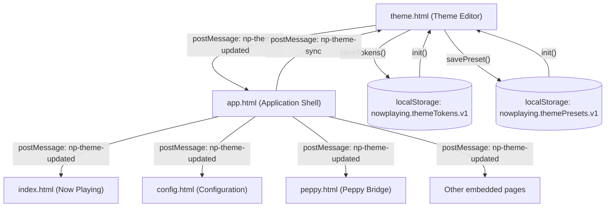
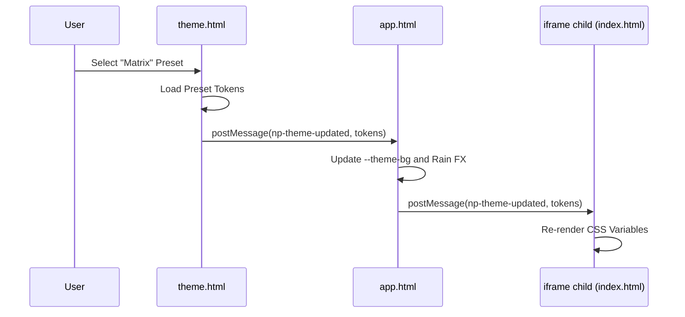
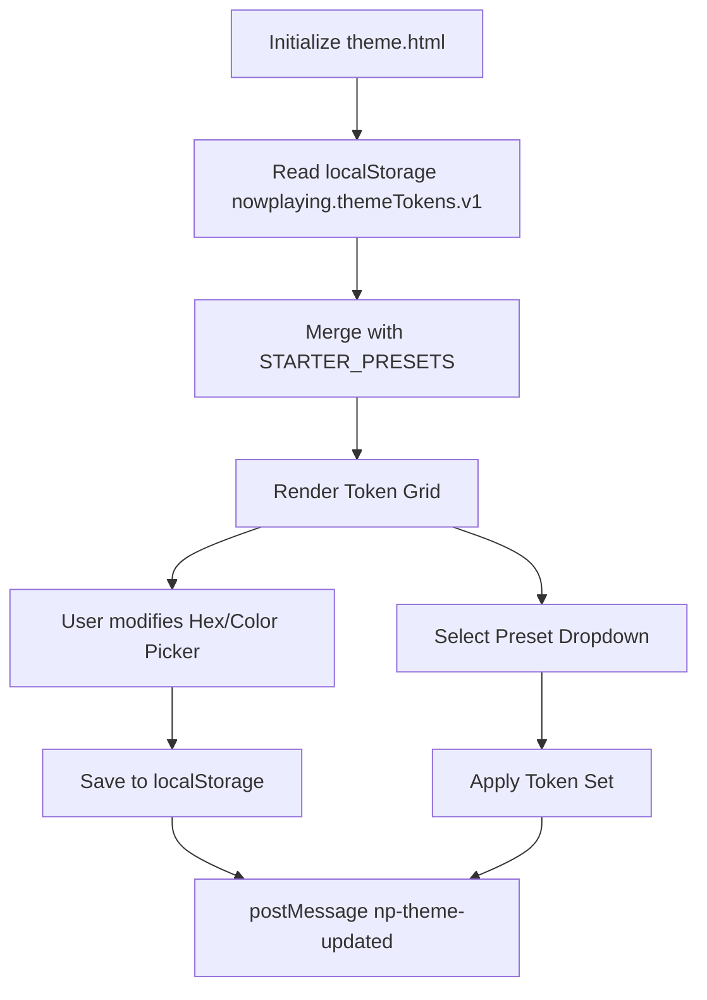

# Theme Token System

Relevant source files

The following files were used as context for generating this wiki page:

- [app.html](app.html)
- [docs/13-theme.md](docs/13-theme.md)
- [peppy.html](peppy.html)
- [src/routes/config.runtime-admin.routes.mjs](src/routes/config.runtime-admin.routes.mjs)
- [styles/hero.css](styles/hero.css)
- [theme.html](theme.html)

The theme token system provides centralized color management through CSS custom properties (CSS variables), enabling real-time theme editing, preset management, and consistent visual styling across all user interfaces. The system uses a `postMessage`-based propagation model to apply theme changes live to the app shell and all embedded iframes without page reloads.

---

## Architecture Overview

The theme token system operates on a hub-and-spoke model where `theme.html` acts as the central editor, the app shell (`app.html`) acts as the distribution hub, and all embedded pages receive theme updates via `postMessage`.

**Title: Theme Token Distribution Flow**

**Token Propagation Flow:**
1. User edits a token in `theme.html` via color picker or hex input.
2. The editor updates its local state and applies tokens to its own `:root` [theme.html:57-70]().
3. The editor sends an `np-theme-updated` message to the parent app shell.
4. The app shell (`app.html`) defines the baseline theme tokens in its `:root` block [app.html:24-49]().
5. The app shell forwards theme updates to all iframe children, ensuring the `var(--theme-*)` references remain synchronized across the entire UI surface.

**Sources:** [theme.html:57-70](), [app.html:24-49](), [docs/13-theme.md:1-10]()

---

## Token Registry

The system defines core theme tokens organized into semantic categories. All tokens are CSS custom properties prefixed with `--theme-`.

### Complete Token Mapping

| Token Name | Purpose | Default Value | UI Usage |
|------------|---------|---------------|----------|
| `--theme-bg` | Main app background | `#0c1526` | Body background, shell surrounds [app.html:26]() |
| `--theme-text` | Primary foreground | `#e7eefc` | Standard text and labels [app.html:27]() |
| `--theme-text-secondary` | Muted foreground | `#9fb1d9` | Metadata and secondary info [app.html:28]() |
| `--theme-rail-bg` | Top navigation bar | `#0b1426` | Hero rail background [app.html:29]() |
| `--theme-frame-fill` | Iframe container | `var(--theme-bg)` | Background for embedded content [app.html:30]() |
| `--theme-rail-border` | Global borders | `#2a3a58` | Shell and card boundaries [app.html:31]() |
| `--theme-pill-border` | Star ratings | `rgba(148,163,184,.45)` | Star rating icons and borders [app.html:34]() |
| `--theme-tab-bg` | Button/Tab base | `#0f1a31` | Navigation tab backgrounds [app.html:43]() |
| `--theme-tab-active-bg` | Primary Action | `#3357d6` | Active tab and primary buttons [app.html:45]() |
| `--theme-progress-fill` | Transport state | `#2a3a58` | Playback progress bar background [app.html:42]() |

### Semantic Aliases
The editor uses a mapping layer to link internal `npb` (Now Playing Builder) tokens to the public `--theme` tokens. For example, `.topTabs a` links to `--np-tab-bg`, which is derived from `--npb-tab-bg` [theme.html:57-79]().

**Sources:** [app.html:24-49](), [theme.html:57-80](), [docs/13-theme.md:49-56]()

---

## postMessage Protocol

### Message Types

**`np-theme-updated`** (Editor → Shell → Iframes)
Sent whenever theme tokens change. This triggers a recursive update through the DOM tree of all open frames.

**`np-theme-sync`** (Shell → Editor)
A bi-directional sync mechanism that ensures the editor's pickers match the shell's active state, particularly during initial load or when switching between external displays.

**`np-theme-load-preset`** (External → Editor)
Allows the shell's quick-switcher to command the theme editor to load a specific configuration [app.html:88-95]().

**Title: Sequence of Theme Update**

**Sources:** [app.html:88-95](), [theme.html:89-108](), [docs/13-theme.md:7-10]()

---

## Preset System

### Starter Presets
The system includes several built-in configurations to serve as baselines [docs/13-theme.md:27-40]():
* **Slate Medium**: The default balanced dark theme.
* **Matrix**: A specialized theme that triggers the Matrix rain background effect in the app shell [app.html:85-87]().
* **Warm Parchment**: High-contrast light theme for legacy aesthetics.
* **Blue/Red Neon**: High-saturation themes for kiosk displays.

### Preset Lifecycle

**Title: Theme State Management**

**Sources:** [theme.html:214-223](), [app.html:85-87](), [docs/13-theme.md:11-18]()

---

## Matrix Effect Integration
The Matrix theme is unique because it combines CSS tokens with a functional component. When the Matrix preset is active, the app shell enables a `.matrixRain` canvas element with `mix-blend-mode: screen` and `opacity: .26` [app.html:85-87](). This creates a layered visual effect where the green characters fall behind the UI controls but over the background.

**Sources:** [app.html:85-87](), [docs/13-theme.md:37]()

---

## Responsive & Layout Constraints

The theme system interacts with the responsive engine to ensure readability across devices:
* **Mobile (700px or less)**: Transport controls use `--theme-tab-bg` for button surfaces and `--theme-progress-fill` for compact progress bars [styles/hero.css:42-61]().
* **Kiosk Mode**: Uses specific CSS overrides to ensure that high-contrast tokens are applied to the three-column grid.
* **App Shell Max-Width**: The shell limits the theme-colored background area to a maximum width of `2200px` to prevent color bleeding on ultra-wide monitors [app.html:25]().

**Sources:** [styles/hero.css:42-61](), [app.html:25-53](), [docs/13-theme.md:41-48]()
