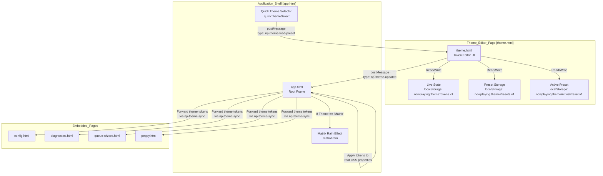
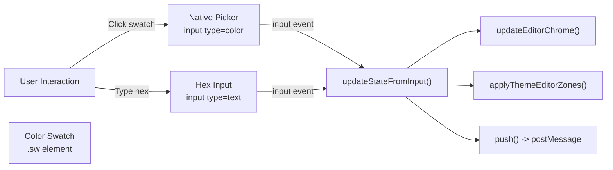
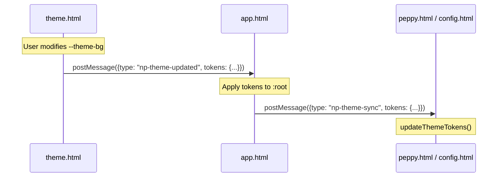

# Theme Editor

<details>
<summary>Relevant source files</summary>

The following files were used as context for generating this wiki page:

- [app.html](app.html)
- [docs/style-naming-map.md](docs/style-naming-map.md)
- [peppy.html](peppy.html)
- [scripts/theme-toggle.js](scripts/theme-toggle.js)
- [src/routes/config.runtime-admin.routes.mjs](src/routes/config.runtime-admin.routes.mjs)
- [styles/hero.css](styles/hero.css)
- [styles/podcasts2.css](styles/podcasts2.css)
- [theme.html](theme.html)

</details>


The Theme Editor provides a centralized interface for customizing the visual appearance of the Now Playing application shell through a token-based theming system. Users can edit color values, save custom presets, and export/import themes as JSON. All changes apply live across the entire application via `postMessage` propagation.

For configuring Peppy meter visual styles (skins, fonts, meter types), see [Peppy Skins & Customization](#8.4).

---

## System Overview

The Theme Editor operates as a standalone page ([theme.html:1-631]()) embedded within the application shell ([app.html:54]()). It manages a set of CSS custom properties (tokens) that control the visual appearance of all UI components across the application.

### Matrix Theme & Effects
The system includes a specialized "Matrix" theme that triggers a canvas-based rain background effect in the application shell. When the active theme is named "Matrix", the shell adds the `matrixFx` class and initializes a `matrixRain` element ([app.html:85-87]()).

Title: Theme Editor Architecture and Data Flow


**Sources:** [theme.html:1-631](), [app.html:85-87](), [app.html:54]()

---

## Token System Architecture

The theme system defines CSS custom properties organized into functional categories. Each token controls specific UI elements across the application.

### Token Categories

| Category | Tokens | Purpose |
|----------|--------|---------|
| **Shell & Background** | `--theme-bg`<br/>`--theme-rail-bg`<br/>`--theme-frame-fill` | Main background colors and surface tints [app.html:26-30]() |
| **Typography** | `--theme-text`<br/>`--theme-text-secondary` | Primary and secondary text colors [app.html:27-28]() |
| **Borders & Dividers** | `--theme-rail-border`<br/>`--theme-frame-border` | Structural borders (linked tokens) [app.html:31-33]() |
| **Tabs** | `--theme-tab-bg`<br/>`--theme-tab-text`<br/>`--theme-tab-border`<br/>`--theme-tab-hover-bg`<br/>`--theme-tab-active-bg`<br/>`--theme-tab-active-text` | Navigation tab states [app.html:43-49]() |
| **Cards** | `--theme-hero-card-bg`<br/>`--theme-hero-card-border`<br/>`--theme-picker-card-bg`<br/>`--theme-card-secondary-fill`<br/>`--theme-progress-fill` | Card containers and progress indicators [app.html:38-42]() |
| **Interactive Elements** | `--theme-pill-border`<br/>`--theme-pill-glow`<br/>`--theme-transport-active`<br/>`--theme-transport-ring` | Star ratings, pills, transport controls [app.html:34-37]() |

### Token Defaults
The `defaults` object in `theme.html` establishes the "Slate Medium" baseline for the application [theme.html:130-154]().

**Sources:** [theme.html:130-154](), [app.html:24-49](), [docs/style-naming-map.md:29-37]()

---

## User Interface Components

The Theme Editor UI ([theme.html:82-111]()) consists of four main sections: token grid, preset selector, action panel, and status display.

### Token Grid
Each token is represented as a card with a human-readable label, a color swatch with a native color picker overlay, and a hex input field [theme.html:14-19]().

Title: Token Interaction Logic


**Sources:** [theme.html:14-19](), [theme.html:311-344]()

### Preset Selector & Management
The `presetSelect` dropdown displays built-in starter presets and user-created presets [theme.html:92]().

| Preset Name | Characteristic |
|-------------|----------------|
| **Slate Medium** | Default blue-gray aesthetic [theme.html:130]() |
| **Matrix** | Deep black with green accents; triggers rain effect [app.html:85]() |
| **Blue/Red Neon** | High contrast dark mode with vibrant accents |
| **Warm Parchment** | Light mode alternative with sepia tones |

**Sources:** [theme.html:92](), [theme.html:214-223](), [theme.html:396-422]()

---

## Theme Propagation System

Theme changes flow from the editor through the shell to all embedded pages using a `postMessage`-based protocol.

### Message Types

1.  **`np-theme-updated`**: Sent by the theme editor to `app.html` when any token is modified [theme.html:369-376]().
2.  **`np-theme-load-preset`**: Sent by the shell's quick selector to the editor to switch the entire token set [theme.html:591-597]().
3.  **`np-theme-sync`**: Sent by the shell to all child iframes (e.g., `peppy.html`, `config.html`) to apply the active token set [theme.html:564-573]().

Title: Cross-Frame Synchronization


**Sources:** [theme.html:369-376](), [theme.html:564-597](), [app.html:283-310]()

---

## Import/Export System

Themes are exported as JSON payloads containing versioning, metadata, and the token dictionary [theme.html:195-203]().

### Export Format
The `buildThemePayload()` function generates a standardized object for portability [theme.html:507-516]().

```json
{
  "version": 2,
  "name": "My Custom Theme",
  "exportedAt": "2024-03-10T14:32:00.000Z",
  "tokens": {
    "--theme-bg": "#0c1526",
    "--theme-text": "#e7eefc"
  }
}
```

### Clipboard Handling
The editor implements a copy-to-clipboard flow using the `navigator.clipboard` API with a fallback to `document.execCommand('copy')` for compatibility [theme.html:478-505]().

**Sources:** [theme.html:180-193](), [theme.html:454-505](), [theme.html:507-516]()

---

## Technical Implementation Details

### State Persistence
The active theme state is persisted in `localStorage` under the key `nowplaying.themeTokens.v1` [theme.html:121](). This ensures visual preferences survive page refreshes.

### Linked Tokens
To maintain structural integrity, certain tokens are "linked." For example, modifying `--theme-rail-border` automatically updates `--theme-frame-border` via the `withLinkedTokens()` helper function [theme.html:362-367]().

### Readable Text Algorithm
The editor dynamically calculates text color (light vs dark) for its own UI based on the relative luminance of the background token using the `pickReadableText()` function [theme.html:292-307]().

**Sources:** [theme.html:121](), [theme.html:292-307](), [theme.html:362-367]()
