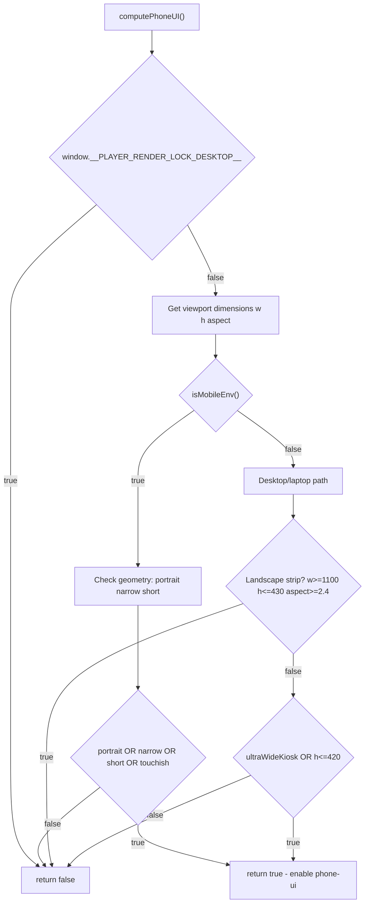
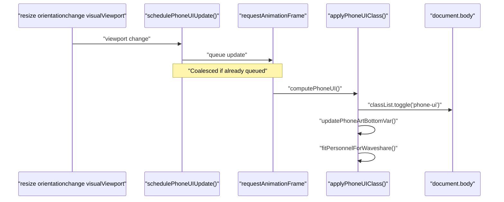
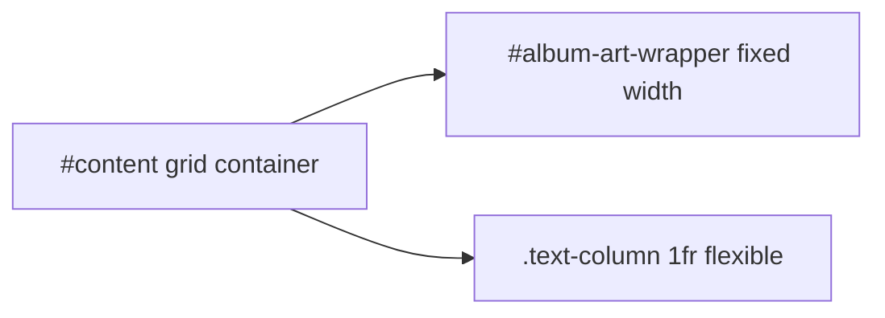
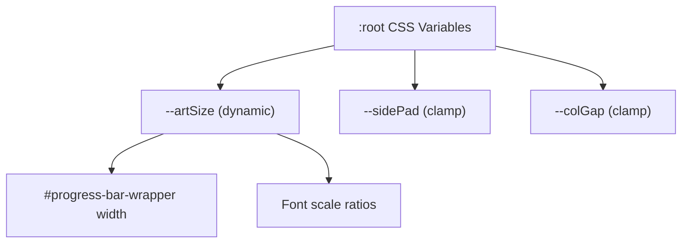

# Responsive Layouts

<details>
<summary>Relevant source files</summary>

The following files were used as context for generating this wiki page:

- [docs/style-naming-map.md](docs/style-naming-map.md)
- [index.html](index.html)
- [player-render.html](player-render.html)
- [player.html](player.html)
- [scripts/index-ui.js](scripts/index-ui.js)
- [scripts/theme-toggle.js](scripts/theme-toggle.js)
- [styles/controller-modals.css](styles/controller-modals.css)
- [styles/index1080.css](styles/index1080.css)
- [styles/podcasts2.css](styles/podcasts2.css)

</details>


## Purpose and Scope

This page documents the responsive layout system used across now-playing UIs to adapt to different screen sizes, orientations, and device types. The system employs multiple strategies: JavaScript-based `phone-ui` mode detection, CSS size profiles for embedded displays, Waveshare landscape strip optimizations, and grid-based mobile layouts.

The responsive system is distinct from theming (colors/fonts) and focuses on structural layout adaptation. For color and theme customization, see page 8.1 (Theme Token System). For Peppy-specific display features, see page 8.4 (Peppy Skins & Customization).

---

## Phone-UI Mode Detection

The system uses JavaScript to dynamically detect when a mobile/portrait layout is appropriate, applying a `phone-ui` class to `<body>` that triggers responsive CSS rules.

### Detection Algorithm

**computePhoneUI() Decision Flow**


Sources: [scripts/index-ui.js:697-738]()

### Mobile Environment Detection

The `isMobileEnv()` function checks for mobile devices using modern browser APIs:

| Detection Method | Priority | API |
|-----------------|----------|-----|
| User Agent Data | High | `navigator.userAgentData?.mobile` |
| UA String Sniff | Fallback | `/Android|iPhone|iPad|iPod|Mobile/i.test(ua)` |

Sources: [scripts/index-ui.js:687-695]()

### Geometry Buckets

The detection logic categorizes viewports into geometry buckets:

| Bucket | Condition | Purpose |
|--------|-----------|---------|
| `short` | `h <= 560` | Phones, small tablets, short viewports |
| `portrait` | `aspect <= 0.85` | Portrait orientation |
| `narrow` | `w <= 900` | Narrow screens |
| `landscapeStrip` | `w >= 1100 && h <= 430 && aspect >= 2.4` | Waveshare 1280x400 displays |
| `ultraWideKiosk` | `aspect >= 3.0 && h <= 650` | Legacy kiosk displays |

Sources: [scripts/index-ui.js:712-720]()

### Scheduling and Application

Detection runs on viewport changes and is coalesced via `requestAnimationFrame`:

**schedulePhoneUIUpdate() Sequence**


Sources: [scripts/index-ui.js:753-762](), [scripts/index-ui.js:740-749]()

---

## Size Profiles (player-render)

For embedded preview contexts (e.g., in `player.html` builder or `app.html` iframes), the system supports fixed-size profiles. This enables deterministic layouts for specific hardware display resolutions.

### Supported Profiles

| Profile | CSS Class | Use Case | Grid Layout |
|---------|-----------|----------|-------------|
| 800x480 | `player-size-800x480` | Small kiosk displays | 360px art column |
| 1024x600 | `player-size-1024x600` | Medium kiosk displays | 470px art column |
| 480x320 | `player-size-480x320` | Tiny embedded previews | 220px art column |
| 320x240 | `player-size-320x240` | Minimal embedded previews | 146px art column |

Sources: [player-render.html:53-100]()

### Layout Strategy

Size profiles use CSS Grid with two columns (fixed art + flexible text):

**Size Profile Grid Structure**


Sources: [player-render.html:53-100]()

Example for 800x480 profile:
- Grid: `grid-template-columns: 360px 1fr` [player-render.html:59]()
- Album art: `344px × 344px` [player-render.html:101]()
- Gap: `14px` [player-render.html:60]()

---

## Viewport Centering and CSS Variables

The system uses CSS custom properties to maintain responsive positioning as viewport dimensions change.

### Critical Variables

**CSS Variable Dependencies (index1080.css)**


Sources: [styles/index1080.css:22-50]()

### Dynamic --artBottom Calculation

JavaScript computes the album art wrapper's bottom edge in viewport coordinates and stores it in a CSS variable for fixed-positioning elements like the progress bar:

```javascript
function updatePhoneArtBottomVar() {
  const art = document.getElementById('album-art-wrapper');
  if (!art) return;
  const rect = art.getBoundingClientRect();
  document.documentElement.style.setProperty('--artBottom', `${Math.round(rect.bottom)}px`);
}
```
Sources: [scripts/index-ui.js:154-162]()

---

## Style Naming Map

To unify naming semantics across the shell and individual pages, a canonical vocabulary is defined in `docs/style-naming-map.md`.

| Canonical Name | Existing Aliases | Role |
|----------------|------------------|------|
| `rail` | `.heroRail`, `.heroRailTop` | Top shell container + tabs band |
| `shell-wrap` | `.heroWrap`, `.viewWrap` | Bounded width containers inside rail |
| `page-wrap` | `.wrap`, `.cfgWrap`, `.subsWrap` | Inner page horizontal bounds |
| `surface-card` | `.card`, `.panel`, `.cfgCard` | Visible content containers |

Sources: [docs/style-naming-map.md:5-25]()

### Canonical Theme Tokens

| Token | Purpose |
|-------|---------|
| `--theme-bg` | App background plane (backmost canvas) |
| `--theme-rail-bg` | Hero wrapper/shell surface tint |
| `--theme-text` | Primary text |
| `--theme-text-secondary` | Secondary/meta text |

Sources: [docs/style-naming-map.md:27-38]()
