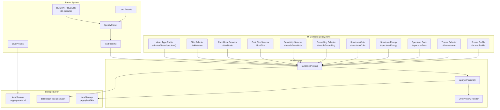
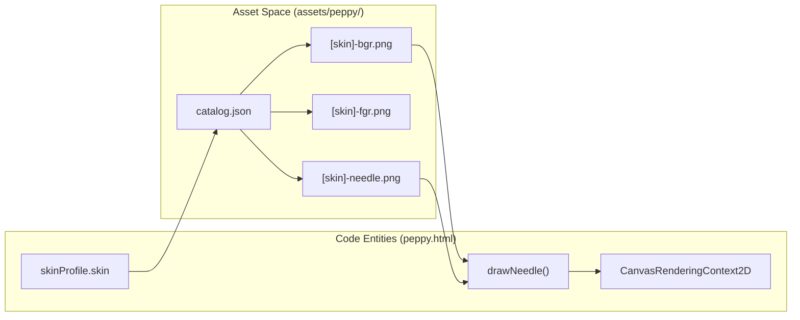
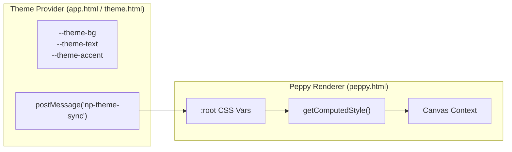
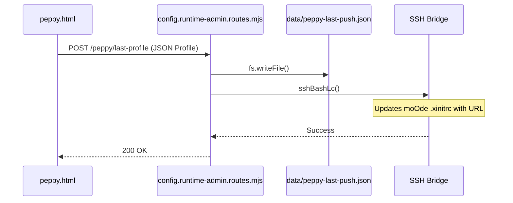

# Peppy Skins & Customization

Relevant source files

The following files were used as context for generating this wiki page:

- [app.html](app.html)
- [assets/peppy/catalog.json](assets/peppy/catalog.json)
- [assets/peppy/white-red-1280-bgr.png](assets/peppy/white-red-1280-bgr.png)
- [assets/peppy/white-red-1280-needle.png](assets/peppy/white-red-1280-needle.png)
- [docs/images/peppy-presets/01-modern-blue-circular.jpg](docs/images/peppy-presets/01-modern-blue-circular.jpg)
- [docs/images/peppy-presets/02-matrix-classic-needle.jpg](docs/images/peppy-presets/02-matrix-classic-needle.jpg)
- [docs/images/peppy-presets/03-red-neon-studio.jpg](docs/images/peppy-presets/03-red-neon-studio.jpg)
- [docs/images/peppy-presets/04-cassette-linear-classic.jpg](docs/images/peppy-presets/04-cassette-linear-classic.jpg)
- [docs/images/peppy-presets/05-obsidian-ember-matrix.jpg](docs/images/peppy-presets/05-obsidian-ember-matrix.jpg)
- [docs/images/peppy-presets/06-gray-ghost.jpg](docs/images/peppy-presets/06-gray-ghost.jpg)
- [docs/images/peppy-presets/07-modern-condensed-linear-theme-s.jpg](docs/images/peppy-presets/07-modern-condensed-linear-theme-s.jpg)
- [docs/images/peppy-presets/08-inter-tight-studio-linear-l.jpg](docs/images/peppy-presets/08-inter-tight-studio-linear-l.jpg)
- [docs/images/peppy-presets/09-montserrat-circular-clean.jpg](docs/images/peppy-presets/09-montserrat-circular-clean.jpg)
- [peppy.html](peppy.html)
- [src/routes/config.runtime-admin.routes.mjs](src/routes/config.runtime-admin.routes.mjs)
- [styles/hero.css](styles/hero.css)
- [theme.html](theme.html)

This page documents the Peppy meter skin customization system, which allows users to configure visual appearance, behavior, and audio responsiveness of VU meter and spectrum analyzer displays. The customization system supports three meter types (circular, linear, spectrum), multiple skins per type, font styling, sensitivity tuning, and comprehensive preset management.

For information about the Peppy Builder & Renderer architecture, see [3.2](). For theme token customization that affects Peppy displays, see [8.1](). For the audio data pipeline that feeds these meters, see [3.5]().

---

## Customization Architecture

The Peppy customization system operates through a unified configuration model where all visual and behavioral parameters are stored in a profile object that can be saved, exported, imported, and pushed to moOde displays.

### Configuration Data Flow
The `peppy.html` interface serves as both the designer and the renderer. It maintains state in a `skinProfile` object that aggregates values from various UI inputs.

Title: Peppy Customization Data Flow

**Sources**: [peppy.html:282-363](), [peppy.html:1273-1413]()

---

## Meter Types

Three distinct meter visualization types are available, each with unique configuration parameters and rendering behavior.

| Meter Type | Description | Key Parameters | Skins Available |
|------------|-------------|----------------|-----------------|
| **Circular** | Classic analog VU meter with rotating needle | `sensitivity`, `smoothing` | `blue-1280`, `orange-1280`, `emerald-1280`, `red-1280` |
| **Linear** | Horizontal bar meter with segmented or continuous fill | `linearStyle`, `linearSize` | `cassette`, `continuous`, `continuous-theme` |
| **Spectrum** | Real-time frequency spectrum analyzer with vertical bars | `spectrumColor`, `spectrumEnergy`, `spectrumPeak` | `mono-1280`, `cyan-peaks`, `vintage-analyzer` |

**Sources**: [peppy.html:282-290](), [assets/peppy/catalog.json:1-53]()

### Meter Type Selection
Meter type is controlled via radio buttons that trigger skin list repopulation and parameter visibility toggling. The `populateSkinsForMeterType()` function updates the `#skinName` dropdown based on the `catalog.json` definitions.

**Sources**: [peppy.html:1415-1452](), [assets/peppy/catalog.json:2-52]()

---

## Skin System

Each meter type has a collection of skins that define visual characteristics. Circular skins specifically utilize image sets (background, foreground, and needle).

### Circular Skin Assets
Circular skins are defined in `assets/peppy/catalog.json` and consist of three primary image components:
1. **BGR**: Background image containing the scale and housing. [assets/peppy/catalog.json:5]()
2. **FGR**: Foreground overlay (optional) for glass reflections or bezel depth. [assets/peppy/catalog.json:6]()
3. **Needle**: The rotating needle asset. [assets/peppy/catalog.json:7]()

Title: Circular Meter Asset Mapping

**Sources**: [assets/peppy/catalog.json:3-51](), [peppy.html:3143-3198]()

### Linear Skins
Linear skins define bar fill behavior, segment count, and color gradients.
- `cassette`: Retro segmented bars (24 segments).
- `continuous`: Smooth gradient (green→yellow→red).
- `continuous-theme`: Smooth fill using theme accent color.

**Sources**: [peppy.html:305-314]()

### Spectrum Skins
Spectrum skins control frequency band visualization with configurable colors and peak indicators.
- **Peak Hold Modes**: `off`, `short` (300ms), `medium` (800ms), `long` (1500ms), and `hold` (infinite).
- **Energy Scaling**: Multipliers (0.7x to 1.4x) to adjust vertical bar responsiveness.

**Sources**: [peppy.html:327-349]()

---

## Font Customization

Font styling affects metadata text rendering, supporting standard web fonts and a specialized dot-matrix mode.

### Font Modes
| Font Mode | Description | CSS Font Family |
|-----------|-------------|-----------------|
| `ui-sans` | System default sans-serif | `Inter, system-ui` |
| `dot-matrix` | Pixel-perfect bitmap font | `DotGothic16Local` |

**Sources**: [peppy.html:292-298](), [peppy.html:8-12]()

### Dot-Matrix Rendering
When `fontMode='dot-matrix'` is selected, the layout shifts to a retro aesthetic. The art frame aspect ratio is forced to 1:1, and metadata is rendered using fixed row heights.

**Sources**: [peppy.html:56-64](), [peppy.html:2615-3142]()

---

## Sensitivity and Smoothing

Circular and linear meters support real-time tuning of audio responsiveness.

### Sensitivity Levels
Sensitivity controls the needle deflection range relative to incoming VU level data.
- `low`: 0.6x multiplier.
- `medium`: 1.0x multiplier.
- `high`: 1.5x multiplier.
- `ultra`: 2.2x multiplier.

**Sources**: [peppy.html:315-320]()

### Smoothing (Low-Pass Filter)
Smoothing applies exponential moving average filtering to needle position updates to reduce jitter.
- **Formula**: `newPos = (alpha * rawPos) + ((1 - alpha) * prevPos)`
- `alpha` values range from `1.0` (off) to `0.10` (high).

**Sources**: [peppy.html:321-326]()

---

## Theme Integration

Peppy skins support theme-aware rendering where color tokens from the theme system are referenced dynamically via CSS custom properties.

Title: Theme Token Propagation

**Sources**: [app.html:24-49](), [theme.html:57-70](), [peppy.html:13-29]()

---

## Preset System

The preset system bundles all customization parameters into named configurations.

### Built-in Presets
Peppy ships with factory presets like "Modern Blue Circular" and "Cassette Linear Classic". These are defined in the `BUILTIN_PRESETS` constant.

**Sources**: [peppy.html:255-273]()

### User Presets
Users can save custom configurations to `localStorage` under the key `peppy.presets.v1`. The `savePreset()` and `loadPreset()` functions manage this persistence.

**Sources**: [peppy.html:3892-4124]()

---

## Profile Push and Persistence

When a skin profile is finalized, it is pushed to the moOde device via the backend API.

### Push Mechanism
The push operation sends the current configuration to the server, which persists it and updates the moOde environment.

Title: Profile Persistence Logic

**Sources**: [src/routes/config.runtime-admin.routes.mjs:147-152](), [src/routes/config.runtime-admin.routes.mjs:19-81]()

### Screen Profiles
Screen profiles define canvas dimensions and layout adjustments for different hardware (e.g., `1280x400`, `800x480`). These are applied via CSS classes like `body.screen-1280x400`.

**Sources**: [peppy.html:468-516](), [peppy.html:79-134]()
