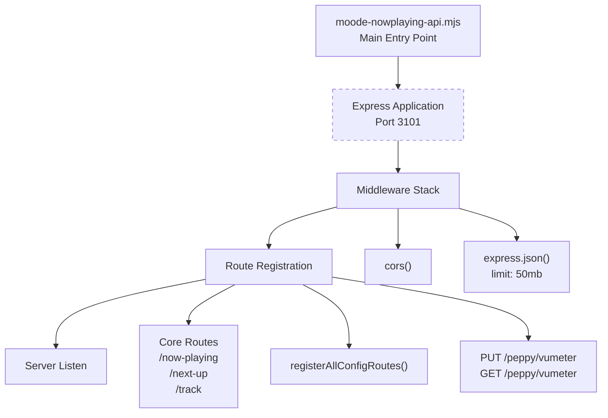
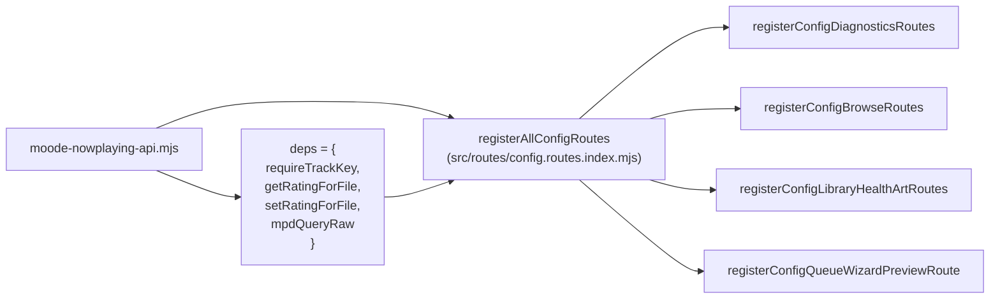
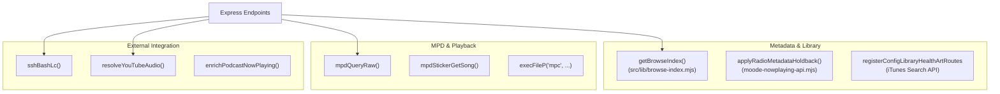
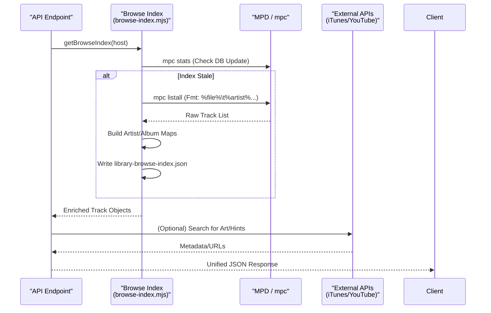

# Backend API

Relevant source files

The following files were used as context for generating this wiki page:

- [moode-nowplaying-api.mjs](moode-nowplaying-api.mjs)
- [scripts/radio.js](scripts/radio.js)
- [src/lib/browse-index.mjs](src/lib/browse-index.mjs)
- [src/lib/lastfm-library-match.mjs](src/lib/lastfm-library-match.mjs)
- [src/routes/config.moode-audio-info.routes.mjs](src/routes/config.moode-audio-info.routes.mjs)
- [src/routes/config.queue-wizard-apply.routes.mjs](src/routes/config.queue-wizard-apply.routes.mjs)
- [src/routes/config.queue-wizard-basic.routes.mjs](src/routes/config.queue-wizard-basic.routes.mjs)
- [src/routes/config.routes.index.mjs](src/routes/config.routes.index.mjs)

The backend API is the core server-side component of the now-playing system, providing RESTful endpoints for all UI clients and external integrations. It runs as an Express.js application on port 3101, handling real-time playback state, MPD communication, art processing, podcast management, and YouTube proxying.

**Scope**: This page covers the overall backend architecture, design patterns, and request flow. For detailed documentation on specific subsystems, see:
- [API Architecture](#9.1) — Route registration, middleware, and dependency injection.
- [Core Endpoints](#9.2) — Documentation for `/now-playing`, `/next-up`, and metadata enrichment.
- [MPD Integration](#9.3) — Socket communication and sticker database operations.
- [SSH Bridge](#9.4) — Remote command execution on the moOde player.
- [Cache Systems](#9.5) — Multi-tier caching for ratings, art, and YouTube metadata.

---

## Express Server Foundation

The backend initializes as a standard Express.js application with CORS support and JSON body parsing configured for large payloads (50MB limit) to handle playlist operations and base64-encoded data transfers.

**Server Initialization**

**Sources**: [moode-nowplaying-api.mjs:417-420]()

The application uses a modular route registration pattern. Specialized route modules in `src/routes/` are wired together via `registerAllConfigRoutes`, which uses dependency injection to provide shared services like `requireTrackKey` and `getRatingForFile`.

**Route Registration Pattern**

**Sources**: [src/routes/config.routes.index.mjs:21-116](), [moode-nowplaying-api.mjs:212-220]()

---

## Authentication & Request Validation

All API endpoints except public art serving routes require authentication via the `TRACK_KEY` mechanism. This key can be provided either as a query parameter `?k=<key>` or as a custom header `X-Track-Key`.

| Authentication Method | Implementation | Usage |
|----------------------|----------------|-------|
| **Query Parameter** | `?k=<TRACK_KEY>` | Browser-based clients, art URLs |
| **Custom Header** | `X-Track-Key: <TRACK_KEY>` | AJAX requests, programmatic access |
| **Validation** | `requireTrackKey(req, res)` | Returns `true` if valid, sends 403 if invalid |

The `requireTrackKey` function provides a consistent authentication check across all protected routes. If `TRACK_KEY` is not configured, authentication is bypassed.

**Sources**: [moode-nowplaying-api.mjs:2046-2054]()

---

## Core Service Architecture

The backend orchestrates primary service modules handling distinct domains. These services follow a functional pattern, utilizing shared helpers for MPD and filesystem operations.

**Service Entity Mapping**

**Sources**: [src/lib/browse-index.mjs:130-197](), [moode-nowplaying-api.mjs:71-158](), [src/routes/config.library-health-art.routes.mjs:28-68]()

### Service Communication Patterns

| Service | External System | Communication Method | Key Entity |
|---------|----------------|---------------------|------------|
| **Library Index** | MPD Database | `mpc listall` via child process | `buildBrowseIndex` [src/lib/browse-index.mjs:39-128]() |
| **Radio Metadata** | Stream Metadata | Holdback logic & cache | `radioHoldbackPolicy` [moode-nowplaying-api.mjs:59-69]() |
| **Art Search** | iTunes API | HTTP Fetch | `album-art-search` [src/routes/config.library-health-art.routes.mjs:39-44]() |
| **Remote Control** | moOde OS | SSH BatchMode | `sshBashLc` utility |

---

## Multi-Tier Caching Strategy

The backend employs a sophisticated caching architecture to minimize expensive operations like MPD sticker queries and external API calls.

**In-Memory Caches**:
- **Browse Index**: Stored in `mem.index`, refreshed based on MPD DB update timestamp [src/lib/browse-index.mjs:130-197]().
- **Radio Holdback**: `radioMetaHoldbackState` Map for stabilizing stream titles [moode-nowplaying-api.mjs:49-158]().
- **Queue Options**: `optionsCache` in basic queue wizard routes with 5-minute TTL [src/routes/config.queue-wizard-basic.routes.mjs:13-15]().

**Persistent Caches**:
- **Library Index**: `data/library-browse-index.json` [src/lib/browse-index.mjs:7-8]().
- **Playlists Index**: `data/playlists-index.json` [src/routes/config.queue-wizard-basic.routes.mjs:11]().
- **Radio Queue Map**: `data/radio-queue-map.json` [src/routes/config.queue-wizard-apply.routes.mjs:133-135]().

---

## Request/Response Flow: Metadata Enrichment

A typical request to `/now-playing` or library browsing involves an enrichment pipeline that merges raw MPD data with local metadata and external hints.

**Metadata Enrichment Sequence**

**Sources**: [src/lib/browse-index.mjs:39-128](), [src/routes/config.browse.routes.mjs:109-141]()

### Error Handling & Reliability
- **Atomic Writes**: `writeFileAtomic()` is used for critical configuration and cache files [moode-nowplaying-api.mjs:1596-1629]().
- **Try-Catch Wrappers**: Standardized in all route modules to return `{ ok: false, error: ... }` [src/routes/config.moode-audio-info.routes.mjs:79-139]().
- **Radio Metadata Holdback**: Prevents UI "flicker" on radio stations that cycle metadata rapidly [moode-nowplaying-api.mjs:71-158]().
