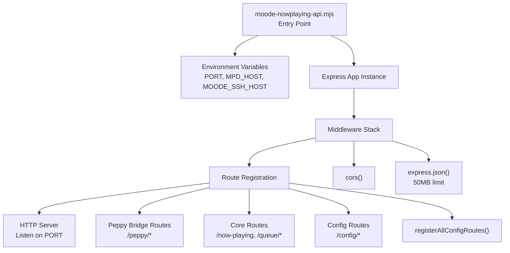
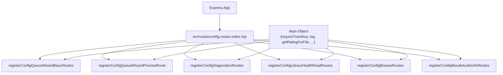
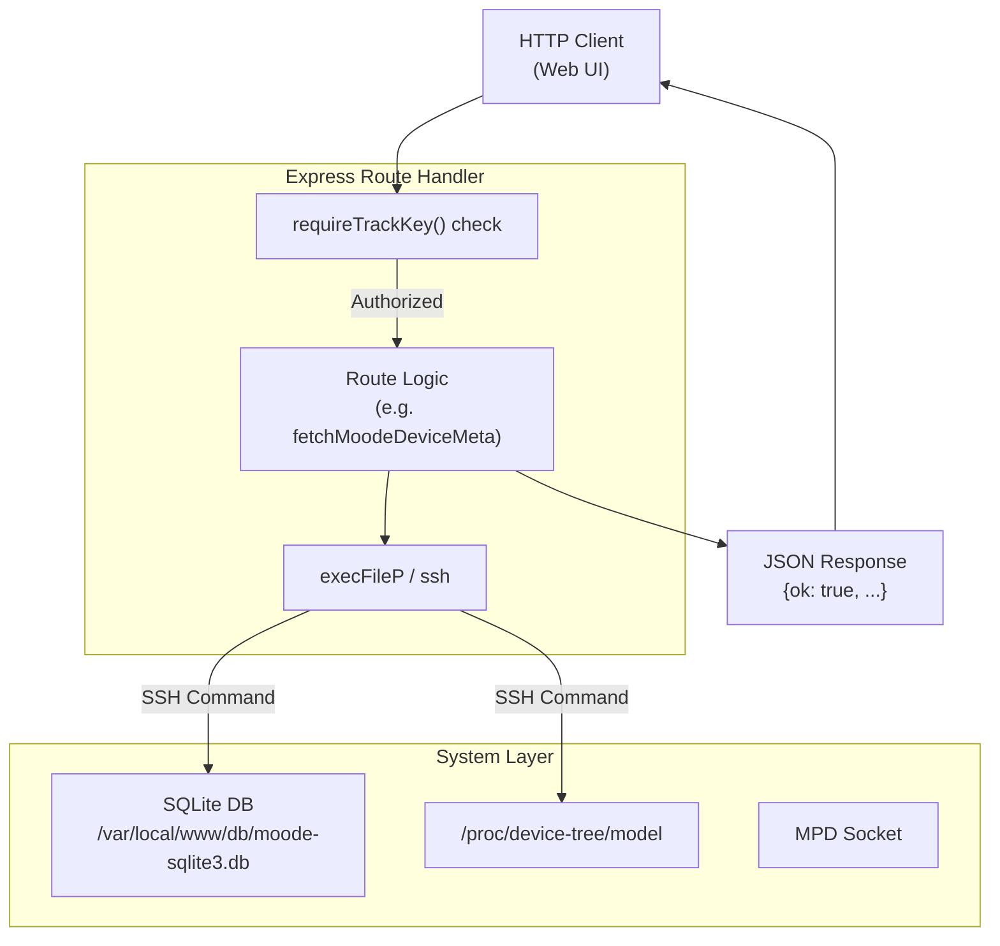

# API Architecture

<details>
<summary>Relevant source files</summary>

The following files were used as context for generating this wiki page:

- [moode-nowplaying-api.mjs](moode-nowplaying-api.mjs)
- [package-lock.json](package-lock.json)
- [package.json](package.json)
- [src/lib/exec.mjs](src/lib/exec.mjs)
- [src/lib/log.mjs](src/lib/log.mjs)
- [src/routes/config.moode-audio-info.routes.mjs](src/routes/config.moode-audio-info.routes.mjs)
- [src/routes/config.routes.index.mjs](src/routes/config.routes.index.mjs)
- [src/services/mpd.service.mjs](src/services/mpd.service.mjs)

</details>


This document describes the Express-based API server architecture, including initialization, middleware configuration, route registration patterns, dependency injection, and request lifecycle. It specifically covers the modular route registration via `registerAllConfigRoutes`, the `requireTrackKey` security pattern, and the high-performance library indexing system.

---

## Server Initialization

The API server is a Node.js Express application that runs on port 3101 (configurable via environment). It acts as a bridge between web UIs and the moOde audio player, translating HTTP requests into MPD commands, SSH operations, and external API calls.

The entry point `moode-nowplaying-api.mjs` initializes the Express application and sets up the core HTTP server using standard Node.js modules.



**Sources:** [moode-nowplaying-api.mjs:1-19]() [moode-nowplaying-api.mjs:181-196]()

---

## Middleware Stack

The Express middleware pipeline is minimal and explicit, prioritizing flexibility for different request types. Key dependencies like `cors` and `express` are defined in the project's manifest.

| Middleware | Purpose | Configuration |
|------------|---------|---------------|
| `cors()` | Enable cross-origin requests from web UI | Default settings, all origins |
| `express.json()` | Parse JSON request bodies | 50MB size limit for large payloads |

No authentication middleware is applied globally. Instead, individual routes enforce the `requireTrackKey` guard as needed to ensure requests originate from a trusted local or configured context.

**Sources:** [moode-nowplaying-api.mjs:181-183]() [package.json:9-16]()

---

## Route Organization and Registration

Routes are organized into feature modules under `src/routes/`. A central index module, `src/routes/config.routes.index.mjs`, provides the `registerAllConfigRoutes` function which orchestrates the registration of all subsystem routes. This includes specialized routes for library health, Alexa integration, and moOde system information.



**Sources:** [src/routes/config.routes.index.mjs:21-116]() [src/routes/config.moode-audio-info.routes.mjs:76-141]()

---

## Dependency Injection Pattern

Shared utilities and services are assembled into a `deps` object and passed to each route registration function. This enables route modules to access common functionality like the MPD socket or logging without direct imports, improving testability and reducing coupling.

| Dependency | Purpose | Source |
|------------|---------|--------|
| `requireTrackKey` | Middleware to validate the `X-Track-Key` header | [src/routes/config.routes.index.mjs:23]() |
| `getRatingForFile` | Retrieves MPD sticker ratings for a specific file | [src/routes/config.routes.index.mjs:28]() |
| `mpdQueryRaw` | Low-level socket communication with MPD | [src/routes/config.routes.index.mjs:86]() |
| `log` | Standardized logging utility | [src/lib/log.mjs:6-11]() |

**Sources:** [src/routes/config.routes.index.mjs:21-116]() [src/lib/log.mjs:1-11]() [src/services/mpd.service.mjs:94-135]()

---

## Library Indexing (browse-index.mjs)

To ensure high-performance browsing of large music libraries, the system utilizes a JSON-based index (`data/library-browse-index.json`). This index is managed by `src/lib/browse-index.mjs`.

### Index Lifecycle
1. **Build**: The `buildBrowseIndex` function executes `mpc listall` with a custom format string to extract metadata.
2. **Persistence**: The results are parsed into `artists`, `albums`, and `tracks` maps and saved to disk.
3. **Staleness Check**: The `getBrowseIndex` function performs a lightweight check against the MPD database update time (`mpc stats`) every 30 seconds.
4. **Caching**: The index is held in memory for rapid access.

**Sources:** [src/routes/config.routes.index.mjs:99-101]()

---

## Authentication and Error Handling

### requireTrackKey Middleware
Routes that modify state or access sensitive operations require authentication via the `X-Track-Key` HTTP header. This is enforced by calling `requireTrackKey(req, res)` at the start of the route handler. For example, in the moOde audio info route:

```javascript
app.get('/config/moode/audio-info', async (req, res) => {
  try {
    if (!requireTrackKey(req, res)) return; // Auth Guard
    // ... logic to fetch moOde info
  } catch (e) {
    return res.status(500).json({ ok: false, error: e.message });
  }
});
```

### Standardized Error Responses
The API uses a consistent response shape for errors, typically returning a `500` status code (or `502` for upstream fetch failures) with an object containing `ok: false` and the error message.

**Sources:** [src/routes/config.moode-audio-info.routes.mjs:79-81]() [src/routes/config.moode-audio-info.routes.mjs:136-138]()

---

## Request Lifecycle

The following diagram illustrates the complete request flow from client to response, highlighting the interaction with system services and the `requireTrackKey` guard:



**Sources:** [src/routes/config.moode-audio-info.routes.mjs:34-49]() [src/routes/config.moode-audio-info.routes.mjs:76-141]() [src/lib/exec.mjs:3-19]()
