# Core Endpoints

<details>
<summary>Relevant source files</summary>

The following files were used as context for generating this wiki page:

- [alexa/handlers/misc.js](alexa/handlers/misc.js)
- [moode-nowplaying-api.mjs](moode-nowplaying-api.mjs)
- [src/routes/art.routes.mjs](src/routes/art.routes.mjs)
- [src/routes/config.library-health-read.routes.mjs](src/routes/config.library-health-read.routes.mjs)
- [src/routes/config.moode-audio-info.routes.mjs](src/routes/config.moode-audio-info.routes.mjs)
- [src/routes/config.routes.index.mjs](src/routes/config.routes.index.mjs)
- [src/routes/queue.routes.mjs](src/routes/queue.routes.mjs)
- [src/routes/rating.routes.mjs](src/routes/rating.routes.mjs)

</details>


This page documents the primary HTTP endpoints exposed by the Now Playing API server. These endpoints provide access to playback state, queue management, artwork retrieval, ratings, and audio visualization data. For details on how these endpoints interact with MPD and moOde, see [9.3 MPD Integration]() and [9.4 SSH Bridge]().

---

## Endpoint Overview

The API server exposes endpoints organized into functional groups. All endpoints run on port 3101 by default and are accessed via HTTP.

**Core Endpoint Groups:**

| Group | Base Path | Purpose |
|-------|-----------|---------|
| Now Playing | `/now-playing`, `/next-up`, `/track` | Current track state and metadata enrichment |
| Queue Management | `/queue/*` | Add, remove, reorder, and advance queue entries |
| Art & Media | `/art/*` | Album artwork, blurred backgrounds, and radio logos |
| Ratings | `/rating` | Track rating read/write via MPD stickers |
| Playback Control | `/mpd/*` | Transport controls (play, pause, skip) |
| Peppy Audio | `/peppy/*` | VU meter and spectrum data bridge |
| Alexa Integration | `/alexa/*` | Voice control state and continuity management |
| Diagnostics | `/config/diagnostics/*` | Queue inspection, playback tools, and API catalog |

**Sources:** [moode-nowplaying-api.mjs:5-15](), [src/routes/config.diagnostics.routes.mjs:199-240]()

---

## Route Registration Architecture

The API uses a modular registration pattern. Each functional area is defined in a separate route module and registered during server initialization via `registerAllConfigRoutes`, often with dependency injection for shared utilities like `requireTrackKey` or `mpdQueryRaw`.

**Code Entity Space Mapping:**

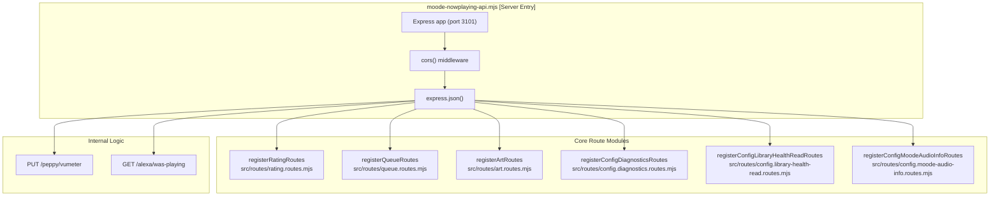
```mermaid
graph TB
    subgraph "moode-nowplaying-api.mjs [Server Entry]"
        APP["Express app (port 3101)"]
        CORS["cors() middleware"]
        JSON["express.json()"]
    end
    
    subgraph "Core Route Modules"
        RATING_MOD["registerRatingRoutes<br/>src/routes/rating.routes.mjs"]
        QUEUE_MOD["registerQueueRoutes<br/>src/routes/queue.routes.mjs"]
        ART_MOD["registerArtRoutes<br/>src/routes/art.routes.mjs"]
        DIAG_MOD["registerConfigDiagnosticsRoutes<br/>src/routes/config.diagnostics.routes.mjs"]
        HEALTH_MOD["registerConfigLibraryHealthReadRoutes<br/>src/routes/config.library-health-read.routes.mjs"]
        MOODE_INFO["registerConfigMoodeAudioInfoRoutes<br/>src/routes/config.moode-audio-info.routes.mjs"]
    end
    
    subgraph "Internal Logic"
        PEPPY_VU["PUT /peppy/vumeter"]
        ALEXA_WP["GET /alexa/was-playing"]
    end
    
    APP --> CORS
    CORS --> JSON
    JSON --> RATING_MOD
    JSON --> QUEUE_MOD
    JSON --> ART_MOD
    JSON --> DIAG_MOD
    JSON --> HEALTH_MOD
    JSON --> MOODE_INFO
    JSON --> PEPPY_VU
    JSON --> ALEXA_WP
```

**Sources:** [moode-nowplaying-api.mjs:212-220](), [src/routes/config.routes.index.mjs:21-116](), [src/routes/rating.routes.mjs:1-11](), [src/routes/queue.routes.mjs:1-18]()

---

## Now Playing & Metadata

These endpoints provide real-time playback state and enriched track metadata.

### GET /now-playing
Returns comprehensive metadata for the currently playing track. The response is the result of a multi-stage enrichment pipeline.

**Enrichment Pipeline Stages:**
1. **MPD Snapshot:** Fetches basic status and current song tags from MPD.
2. **Type Detection:** Identifies if the source is a local file, HTTP stream, Podcast, AirPlay, or YouTube.
3. **Radio Metadata Holdback:** Applies a stabilization policy to radio titles to prevent "now playing" flicker during station announcements. This is governed by `radioHoldbackPolicy` which applies stricter rules to classical stations like WFMT or BBC Radio 3.
4. **Podcast Enrichment:** Matches stream URLs against `subscriptions.json` to inject show titles and episode artwork.
5. **Rating Resolution:** Queries the MPD sticker database for the 0-5 star rating.

**Sources:** [moode-nowplaying-api.mjs:59-158]() (Radio Holdback), [moode-nowplaying-api.mjs:691-776]() (Pipeline logic)

---

## Queue Management Endpoints

Queue endpoints are registered via `registerQueueRoutes` and interact directly with MPD's playlist commands.

### POST /queue/advance
Advances the queue by deleting a specific song (by `songid` or `pos0`). It includes an safety check to ensure the `file` matches the `songid` before deletion to prevent race conditions during rapid skipping. It then ensures a "head" track is ready for Alexa continuity using `resolveHeadFast`.

**Sources:** [src/routes/queue.routes.mjs:143-220]()

### GET /config/diagnostics/queue
Returns an enriched view of the current MPD queue, including:
- **Radio Metadata:** Resolves station names and genres from the moOde SQLite database.
- **Ratings:** Injects star ratings for every track in the queue using `getRatingForFile`.
- **Thumbnails:** Generates `/art/track_640.jpg` URLs for each item.

**Sources:** [src/routes/config.diagnostics.routes.mjs:1002-1132]()

---

## Art & Media Endpoints

Managed by `registerArtRoutes`, these endpoints handle image proxying, resizing, and caching using the `sharp` library.

| Endpoint | Purpose | Implementation Detail |
|----------|---------|-----------------------|
| `/art/track_640.jpg` | 640px Square Art | Uses `sharp` to resize and cache. Includes a "heal" fallback that resolves the current song's art if a specific file request fails. |
| `/art/current_bg_640_blur.jpg` | Blurred Background | Applies a Gaussian blur (sigma 18) for UI backgrounds via `serveCachedOrBlurredBg`. |
| `/art/thumb.jpg` | Album Thumbnails | Redirects to `/config/library-health/album-thumb` for library-aware art resolution. |

**Sources:** [src/routes/art.routes.mjs:111-172](), [src/routes/art.routes.mjs:59-85](), [src/routes/art.routes.mjs:99-109]()

---

## Rating & Favorites

Ratings are stored in the MPD sticker database under the `rating` key (values 0-5).

### GET /rating
Retrieves the rating for a specific file. Returns `disabled: true` for streams or AirPlay sources where ratings are not supported.
**Sources:** [src/routes/rating.routes.mjs:13-27]()

### POST /rating/current
Sets the rating for the currently playing track and updates the local `bumpRatingCache` to ensure immediate UI feedback.
**Sources:** [src/routes/rating.routes.mjs:64-97]()

### POST /favorites/toggle
Toggles the favorite status of a radio station by updating the `type` column in moOde's `cfg_radio` SQLite table via SSH commands.
**Sources:** [moode-nowplaying-api.mjs:2558-2600]()

---

## Audio Data Pipeline (Peppy)

The API acts as a high-frequency bridge between moOde audio services and the browser-based VU meters.

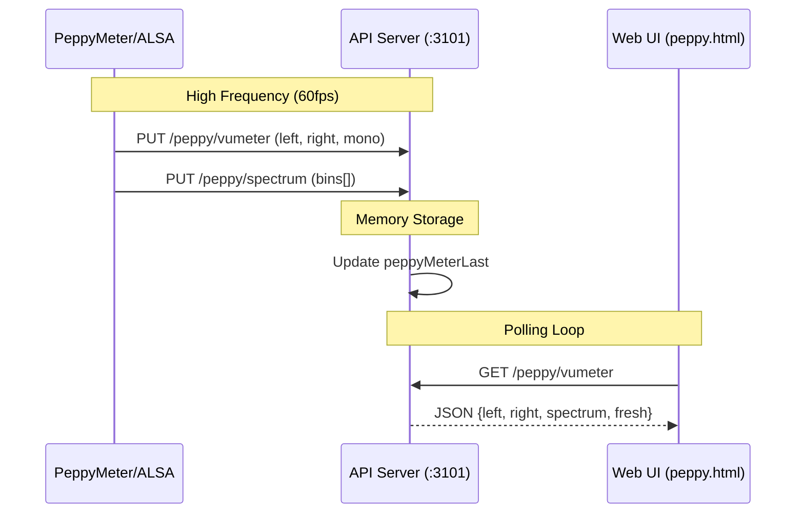
```mermaid
sequenceDiagram
    participant P as PeppyMeter/ALSA
    participant API as API Server (:3101)
    participant UI as Web UI (peppy.html)
    
    Note over P, API: High Frequency (60fps)
    P->>API: PUT /peppy/vumeter (left, right, mono)
    P->>API: PUT /peppy/spectrum (bins[])
    
    Note over API: Memory Storage
    API->>API: Update peppyMeterLast
    
    Note over API, UI: Polling Loop
    UI->>API: GET /peppy/vumeter
    API-->>UI: JSON {left, right, spectrum, fresh}
```

**Implementation Details:**
- **PUT /peppy/vumeter:** Stores stereo levels and spectrum data in memory. It accepts multiple field aliases (e.g., `fft`, `bands`, `bins`) to support various input formats from PeppyALSA.
- **GET /peppy/vumeter:** Returns the last cached values. Includes a `fresh` flag based on data age (threshold ~4s) to allow the UI to zero out meters if the source stops.

**Sources:** [moode-nowplaying-api.mjs:422-491]() (VU Meter), [moode-nowplaying-api.mjs:494-527]() (Spectrum)

---

## Diagnostic & Health Endpoints

### GET /config/moode/audio-info
Scrapes moOde's `audioinfo.php` and enriches it with device metadata (Pi model, Device name) queried directly from the moOde SQLite database via SSH.
**Sources:** [src/routes/config.moode-audio-info.routes.mjs:79-139]()

### GET /config/library-health/snapshot
Computes a comprehensive health report of the music library, identifying unrated tracks, missing artwork, and missing MusicBrainz IDs.
**Sources:** [src/routes/config.library-health-read.routes.mjs:72-180]()

### GET /config/diagnostics/endpoints
A self-documenting endpoint that returns a JSON catalog of all registered routes, their methods, and example request bodies.
**Sources:** [src/routes/config.diagnostics.routes.mjs:199-249]()
4a:T21e2,
# MPD Integration

<details>
<summary>Relevant source files</summary>

The following files were used as context for generating this wiki page:

- [moode-nowplaying-api.mjs](moode-nowplaying-api.mjs)
- [src/lib/exec.mjs](src/lib/exec.mjs)
- [src/lib/log.mjs](src/lib/log.mjs)
- [src/routes/config.moode-audio-info.routes.mjs](src/routes/config.moode-audio-info.routes.mjs)
- [src/routes/config.ratings-sticker.routes.mjs](src/routes/config.ratings-sticker.routes.mjs)
- [src/routes/config.routes.index.mjs](src/routes/config.routes.index.mjs)
- [src/services/mpd.service.mjs](src/services/mpd.service.mjs)

</details>


This document describes how the Now-Playing API integrates with MPD (Music Player Daemon), moOde's core music playback engine. MPD is responsible for all audio playback, queue management, and library indexing. The API acts as a bridge between web UIs and MPD, translating HTTP requests into MPD protocol commands and `mpc` CLI operations.

For SSH-based moOde system operations (display configuration, database queries, file system access), see [SSH Bridge](9.4). For queue manipulation endpoints exposed to UIs, see [Queue Management](4).

---

## MPD Communication Architecture

The system uses two primary methods to communicate with MPD:

1.  **Direct TCP protocol** - Used for performance-critical status polling and sticker database operations (ratings) via `mpdQueryRaw`.
2.  **`mpc` command-line client** - Used for complex library listing and library-health operations, often executed via SSH.

**MPD Communication Methods**

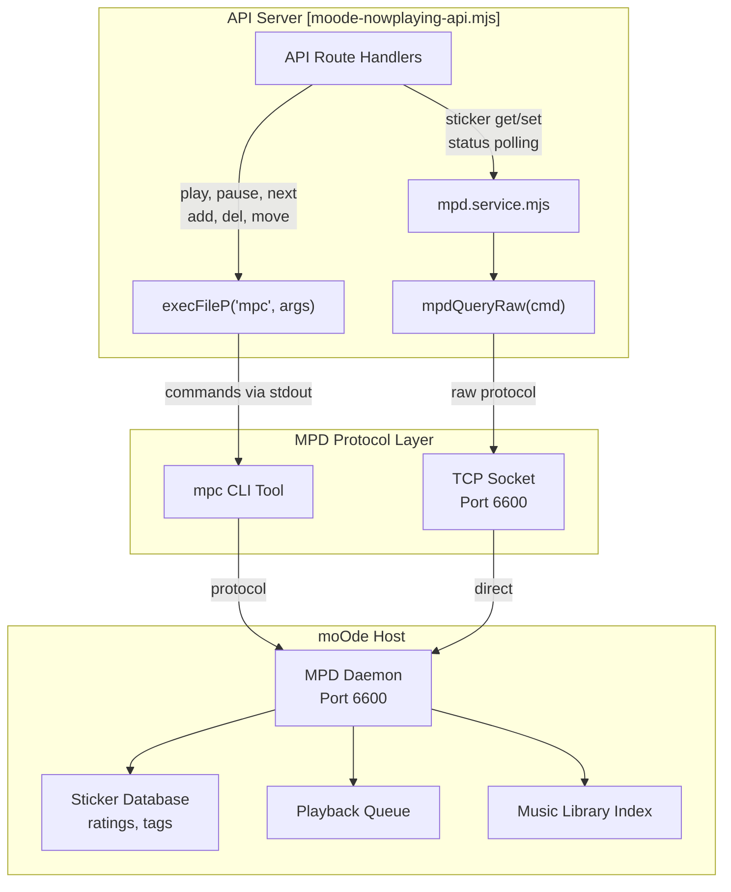
```mermaid
graph TB
    subgraph "API Server [moode-nowplaying-api.mjs]"
        ROUTES["API Route Handlers"]
        MPC_EXEC["execFileP('mpc', args)"]
        MPD_QUERY["mpdQueryRaw(cmd)"]
        MPD_SERVICE["mpd.service.mjs"]
    end
    
    subgraph "MPD Protocol Layer"
        MPC_CLIENT["mpc CLI Tool"]
        MPD_TCP["TCP Socket<br/>Port 6600"]
    end
    
    subgraph "moOde Host"
        MPD_DAEMON["MPD Daemon<br/>Port 6600"]
        STICKER_DB["Sticker Database<br/>ratings, tags"]
        QUEUE["Playback Queue"]
        MUSIC_DB["Music Library Index"]
    end
    
    ROUTES -->|"play, pause, next<br/>add, del, move"| MPC_EXEC
    ROUTES -->|"sticker get/set<br/>status polling"| MPD_SERVICE
    MPD_SERVICE --> MPD_QUERY
    
    MPC_EXEC -->|"commands via stdout"| MPC_CLIENT
    MPD_QUERY -->|"raw protocol"| MPD_TCP
    
    MPC_CLIENT -->|"protocol"| MPD_DAEMON
    MPD_TCP -->|"direct"| MPD_DAEMON
    
    MPD_DAEMON --> STICKER_DB
    MPD_DAEMON --> QUEUE
    MPD_DAEMON --> MUSIC_DB
```

**Sources:** [moode-nowplaying-api.mjs:1-30](), [src/services/mpd.service.mjs:1-135]()

---

## Connection Configuration

MPD connection parameters are defined in the configuration module and used throughout the codebase.

| Environment Variable | Default Value | Purpose |
| :--- | :--- | :--- |
| `MPD_HOST` | `127.0.0.1` | MPD daemon hostname/IP [src/config.mjs:5]() |
| `MPD_PORT` | `6600` | MPD protocol port [src/config.mjs:5]() |
| `MOODE_SSH_HOST` | (required) | moOde host for `mpc` commands via SSH [src/config.mjs:5]() |
| `MOODE_SSH_USER` | `moode` | SSH user for remote `mpc` execution [src/config.mjs:5]() |

The system assumes MPD is running on a moOde host and executes most `mpc` commands via SSH to ensure proper shell environment and access to moOde's library paths.

**Sources:** [src/config.mjs:1-10](), [src/services/mpd.service.mjs:1-2]()

---

## Direct Protocol Communication

The system implements a low-level socket communicator `mpdQueryRaw` in `src/services/mpd.service.mjs` to interact with MPD without the overhead of the `mpc` binary.

### Socket Lifecycle (`mpdQueryRaw`)

The `mpdQueryRaw` function manages a direct TCP connection to MPD:
1.  Opens a connection to `MPD_HOST:MPD_PORT` using `net.createConnection` [src/services/mpd.service.mjs:96]().
2.  Waits for the MPD greeting (e.g., `OK MPD 0.23.5`) [src/services/mpd.service.mjs:119-122]().
3.  Writes the command followed by `close` to ensure the socket terminates after the response [src/services/mpd.service.mjs:126]().
4.  Buffers data until a terminal `OK` or `ACK` is received [src/services/mpd.service.mjs:113-130]().

### Protocol Helpers

*   **`mpdEscapeValue(v)`**: Wraps values in double quotes and escapes internal quotes/backslashes [src/services/mpd.service.mjs:4-7]().
*   **`parseMpdKeyVals(txt)`**: Converts MPD's colon-separated response lines into a flat JavaScript object [src/services/mpd.service.mjs:33-52]().
*   **`mpdHasACK(raw)`**: Detects error responses (lines starting with `ACK`) [src/services/mpd.service.mjs:9-11]().

**Sources:** [src/services/mpd.service.mjs:1-135]()

---

## Sticker Database Integration (Ratings)

MPD's sticker database provides per-file key-value storage. The Now-Playing system uses it for 1-5 star ratings.

**Sticker Operations Flow**

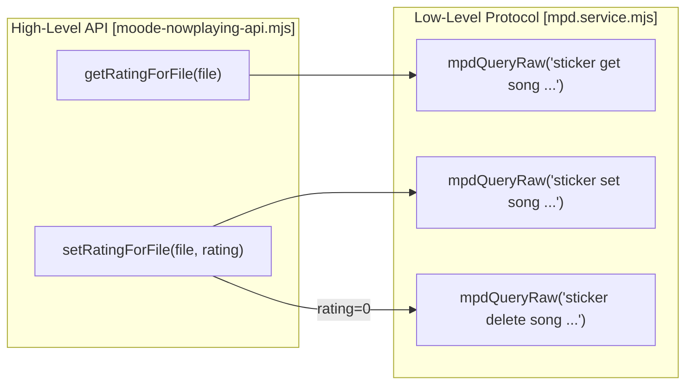
```mermaid
graph LR
    subgraph "High-Level API [moode-nowplaying-api.mjs]"
        GET_RATING["getRatingForFile(file)"]
        SET_RATING["setRatingForFile(file, rating)"]
    end
    
    subgraph "Low-Level Protocol [mpd.service.mjs]"
        STICKER_GET["mpdQueryRaw('sticker get song ...')"]
        STICKER_SET["mpdQueryRaw('sticker set song ...')"]
        STICKER_DEL["mpdQueryRaw('sticker delete song ...')"]
    end
    
    GET_RATING --> STICKER_GET
    SET_RATING --> STICKER_SET
    SET_RATING -->|"rating=0"| STICKER_DEL
```

### Rating Storage

Ratings are stored as stickers with the key `rating`. 
*   **Set**: `sticker set song <file> rating <val>` [moode-nowplaying-api.mjs:2543]()
*   **Get**: `sticker get song <file> rating` [moode-nowplaying-api.mjs:2486]()
*   **Delete**: `sticker delete song <file> rating` (used when unsetting a rating) [moode-nowplaying-api.mjs:2540]().

### Backup and Restore

The system provides administrative routes to manage the `sticker.sql` database file on the moOde host.

*   **Status**: Checks for the existence and size of `/var/lib/mpd/sticker.sql` via SSH [src/routes/config.ratings-sticker.routes.mjs:33-59]().
*   **Backup**: Uses `scp` to pull the sticker database from the moOde host to a local backup directory [src/routes/config.ratings-sticker.routes.mjs:61-94]().
*   **Restore**: Pushes a backup file to `/tmp` on the moOde host and then uses `sudo cp` to overwrite the live database, ensuring correct permissions for the `mpd` user [src/routes/config.ratings-sticker.routes.mjs:114-152]().

**Sources:** [moode-nowplaying-api.mjs:2479-2556](), [src/routes/config.ratings-sticker.routes.mjs:1-152]()

---

## Playback State Management

The `mpdGetStatus` function provides a high-performance way to retrieve the current playback state by parsing the raw `status` command output.

| Field | Purpose | Code Entity |
| :--- | :--- | :--- |
| `state` | Playback state (play/pause/stop) | `kv.state` [src/services/mpd.service.mjs:60]() |
| `song` | Current 0-indexed queue position | `kv.song` [src/services/mpd.service.mjs:61]() |
| `playlistlength` | Total number of items in queue | `kv.playlistlength` [src/services/mpd.service.mjs:62-65]() |

**Sources:** [src/services/mpd.service.mjs:54-72]()

---

## Library Listing and Filtering

For library operations like finding all tracks in an album or all albums by an artist, the system utilizes the `mpc` CLI over SSH. This allows it to leverage MPD's powerful `find` and `search` filters.

### Holiday and Rating Filtering

The system implements logic to exclude certain content from the queue during library generation:
*   **Holiday Filtering**: Tracks with genres like "Holiday" or "Christmas" are excluded unless a holiday flag is active.
*   **Rating Exclusion**: Tracks with low ratings (e.g., 1 star) can be automatically excluded from "Vibe" or "Random" queue builds.

### Library Listing Pattern

```javascript
const args = ['-h', MPD_HOST, '-f', '%file%\t%track%\t%title%', 'find', 'album', albumName];
const { stdout } = await execFileP('mpc', args);
```

**Sources:** [src/routes/config.library-health-read.routes.mjs:1-50](), [moode-nowplaying-api.mjs:132-160]()

---

## MPD Service Helper

The `mpd.service.mjs` module encapsulates core playback controls:

| Function | Command | Description |
| :--- | :--- | :--- |
| `mpdPlay(pos)` | `play [pos]` | Starts playback at optional position [src/services/mpd.service.mjs:74-81](). |
| `mpdPause(on)` | `pause [0\|1]` | Toggles pause state [src/services/mpd.service.mjs:83-87](). |
| `mpdStop()` | `stop` | Stops playback [src/services/mpd.service.mjs:89-92](). |
| `mpdGetStatus()` | `status` | Returns state, song index, and queue length [src/services/mpd.service.mjs:54-72](). |

**Sources:** [src/services/mpd.service.mjs:1-135]()
4b:T2995,
# SSH Bridge

<details>
<summary>Relevant source files</summary>

The following files were used as context for generating this wiki page:

- [app.html](app.html)
- [config.html](config.html)
- [integrations/moode/README.md](integrations/moode/README.md)
- [integrations/moode/aplmeta-reader.sh](integrations/moode/aplmeta-reader.sh)
- [integrations/moode/aplmeta.py](integrations/moode/aplmeta.py)
- [integrations/moode/install.sh](integrations/moode/install.sh)
- [integrations/moode/revert.sh](integrations/moode/revert.sh)
- [integrations/moode/shairport-sync.conf.template](integrations/moode/shairport-sync.conf.template)
- [peppy.html](peppy.html)
- [podcasts.html](podcasts.html)
- [src/routes/config.runtime-admin.routes.mjs](src/routes/config.runtime-admin.routes.mjs)
- [styles/hero.css](styles/hero.css)
- [theme.html](theme.html)

</details>


The SSH bridge is the core communication mechanism that enables the `now-playing` API server to execute commands on the remote moOde audio system. All interactions with moOde system resources—including MPD control, database queries, service management, and file operations—funnel through SSH command execution utilities.

For MPD-specific command execution, see [MPD Integration](#9.3). For general API architecture, see [API Architecture](#9.1).

---

## Purpose and Architecture

The SSH bridge provides a secure, authenticated channel for executing shell commands on the moOde host from the API server. The bridge enforces proper shell environment initialization, argument escaping, and timeout controls to ensure reliable remote execution.

**Sources:** [src/routes/config.runtime-admin.routes.mjs:1-152]()

---

## Connection Flow

The following diagram illustrates the data flow from an API route handler to the remote execution of a command on the moOde host using the `sshBashLc` utility.

### SSH Execution Pipeline
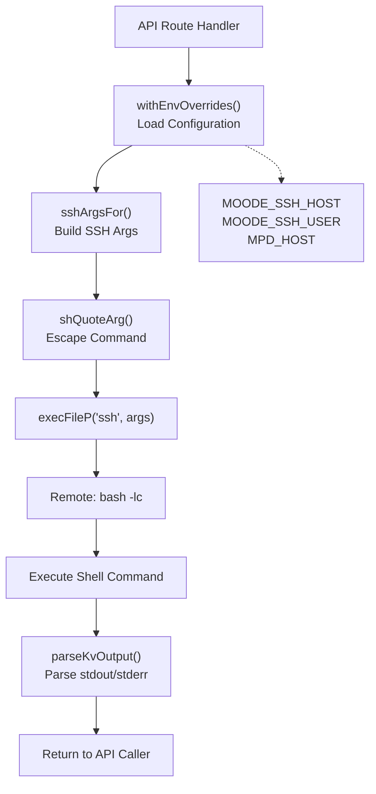
```mermaid
graph TB
    APIRoute["API Route Handler"]
    GetConfig["withEnvOverrides()<br/>Load Configuration"]
    BuildArgs["sshArgsFor()<br/>Build SSH Args"]
    QuoteCmd["shQuoteArg()<br/>Escape Command"]
    ExecSSH["execFileP('ssh', args)"]
    BashLc["Remote: bash -lc"]
    Command["Execute Shell Command"]
    ParseOut["parseKvOutput()<br/>Parse stdout/stderr"]
    Response["Return to API Caller"]
    
    APIRoute --> GetConfig
    GetConfig --> BuildArgs
    BuildArgs --> QuoteCmd
    QuoteCmd --> ExecSSH
    ExecSSH --> BashLc
    BashLc --> Command
    Command --> ParseOut
    ParseOut --> Response
    
    GetConfig -.-> Env["MOODE_SSH_HOST<br/>MOODE_SSH_USER<br/>MPD_HOST"]
```

**Sources:** [src/routes/config.runtime-admin.routes.mjs:133-152](), [src/routes/config.runtime-admin.routes.mjs:85-119]()

---

## Core Utilities

### sshArgsFor

Constructs the SSH argument array with connection options and target host specification.

### Argument Construction
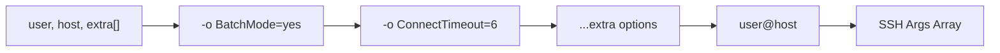
```mermaid
graph LR
    Input["user, host, extra[]"]
    BatchMode["-o BatchMode=yes"]
    Timeout["-o ConnectTimeout=6"]
    Extra["...extra options"]
    Target["user@host"]
    Output["SSH Args Array"]
    
    Input --> BatchMode
    BatchMode --> Timeout
    Timeout --> Extra
    Extra --> Target
    Target --> Output
```

| Parameter | Type | Purpose |
|-----------|------|---------|
| `user` | string | SSH username (typically `moode`) |
| `host` | string | Target hostname or IP |
| `extra` | array | Additional SSH options (e.g., `-T`, `-o ...`) |

The function always includes:
- `BatchMode=yes` [src/routes/config.runtime-admin.routes.mjs:135]() - Disables password prompts.
- `ConnectTimeout=6` [src/routes/config.runtime-admin.routes.mjs:136]() - 6-second connection timeout.

**Sources:** [src/routes/config.runtime-admin.routes.mjs:133-140]()

---

### shQuoteArg

Escapes shell metacharacters in command arguments using single-quote wrapping with embedded quote escaping.

```
Input:  It's a "test"
Output: 'It'"'"'s a "test"'
```

The function wraps the entire string in single quotes and replaces any embedded single quotes with `'"'"'` (close quote, escaped quote, open quote) [src/routes/config.runtime-admin.routes.mjs:142-145]().

**Sources:** [src/routes/config.runtime-admin.routes.mjs:142-145]()

---

### sshBashLc

Primary SSH execution wrapper that runs commands in a login shell environment.

| Parameter | Type | Default | Purpose |
|-----------|------|---------|---------|
| `user` | string | required | SSH username |
| `host` | string | required | Target host |
| `script` | string | required | Shell command to execute |
| `timeoutMs` | number | 20000 | Command timeout in milliseconds [src/routes/config.runtime-admin.routes.mjs:147]() |
| `maxBuffer` | number | 10MB | Maximum stdout/stderr buffer size [src/routes/config.runtime-admin.routes.mjs:147]() |

The `-lc` flags [src/routes/config.runtime-admin.routes.mjs:148]() ensure the remote command runs in a **login shell**, which sources `/etc/profile`, `~/.profile`, and other initialization scripts. This is critical for commands that depend on environment variables like `PATH`, `MPD_HOST`, or custom aliases.

**Sources:** [src/routes/config.runtime-admin.routes.mjs:147-152]()

---

## Common Operations

### Service Status Check

The system monitors services like `mpdscribble` by executing remote `systemctl` commands and parsing the results.

### Service Status Flow
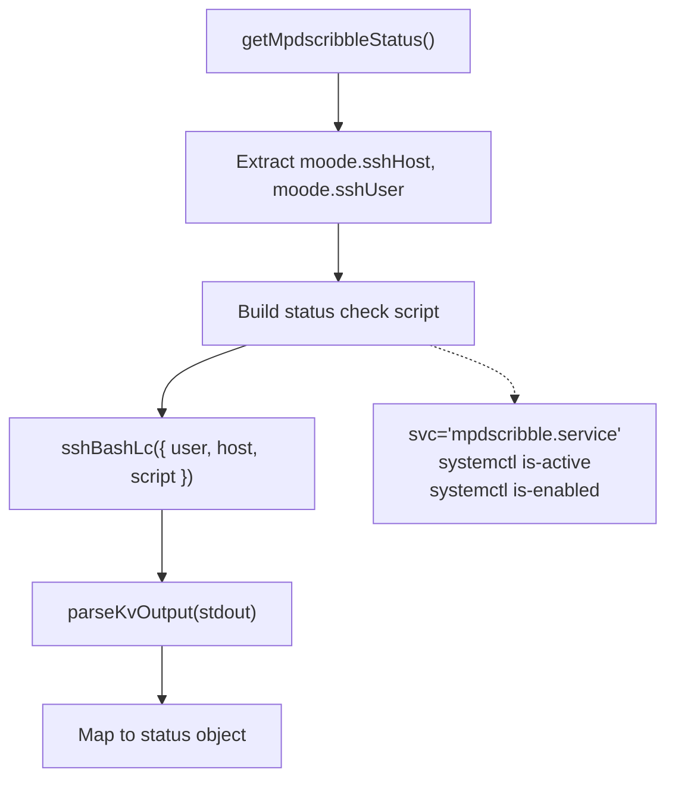
```mermaid
graph TB
    Handler["getMpdscribbleStatus()"]
    ExtractHost["Extract moode.sshHost, moode.sshUser"]
    BuildScript["Build status check script"]
    ExecSSH["sshBashLc({ user, host, script })"]
    Parse["parseKvOutput(stdout)"]
    MapStatus["Map to status object"]
    
    Handler --> ExtractHost
    ExtractHost --> BuildScript
    BuildScript --> ExecSSH
    ExecSSH --> Parse
    Parse --> MapStatus
    
    BuildScript -.-> Script["svc='mpdscribble.service'<br/>systemctl is-active<br/>systemctl is-enabled"]
```

The status check script executes multiple `systemctl` commands and outputs key-value pairs that are parsed by `parseKvOutput` [src/routes/config.runtime-admin.routes.mjs:154-162]().

**Sources:** [src/routes/config.runtime-admin.routes.mjs:164-180]()

---

### Path Verification

Path verification checks ensure that configured directories exist on the moOde host before operations that depend on them. This is managed via `checkEnv` logic in the UI and backend.

| Configuration Field | Target moOde Path | Purpose |
|-----------|---------|---------|
| `pathMusicLibraryRoot` | `/var/lib/mpd/music` | Root of the library scan [config.html:56]() |
| `pathMoodeUsbMount` | `/mnt/USB` | Mount point for external drives [config.html:57]() |
| `pathPiMountBase` | `/media` | Base path for Raspberry Pi mounts [config.html:58]() |

**Sources:** [config.html:47-58](), [src/routes/config.runtime-admin.routes.mjs:57-66]()

---

### moOde Command Execution Patterns

The SSH bridge supports various remote operations via shell commands, specifically for managing kiosk display modes and AirPlay metadata.

| Operation | Pattern | Purpose |
|-----------|---------|---------|
| **Service Control** | `sudo systemctl restart service` | Restarting PeppyMeter or Chromium |
| **xinitrc Modification** | `sed -i 's\|chromium.*\|chromium --app=URL\|' /home/moode/.xinitrc` | Updating the moOde browser URL |
| **AirPlay Revert** | `sudo -n cp backup target` | Restoring original moOde AirPlay files [integrations/moode/revert.sh:33-35]() |
| **Renderer Restart** | `/var/www/util/restart-renderer.php --airplay` | Triggering moOde internal refresh [integrations/moode/revert.sh:39]() |

**Sources:** [src/routes/config.runtime-admin.routes.mjs:163-192](), [integrations/moode/revert.sh:33-42]()

---

## Error Handling

### Connection Failures

SSH operations may fail for multiple reasons:

| Error Type | Cause | Handling |
|------------|-------|----------|
| **Connection timeout** | Host unreachable | Caught by `ConnectTimeout=6` [src/routes/config.runtime-admin.routes.mjs:136]() |
| **Authentication failure** | SSH key not configured | `BatchMode=yes` prevents hanging [src/routes/config.runtime-admin.routes.mjs:135]() |
| **Command timeout** | Script exceeds `timeoutMs` | Promise rejection with timeout error [src/routes/config.runtime-admin.routes.mjs:149]() |
| **Buffer overflow** | Output exceeds `maxBuffer` | Error thrown by `execFile` [src/routes/config.runtime-admin.routes.mjs:150]() |

**Sources:** [src/routes/config.runtime-admin.routes.mjs:133-152]()

---

### Output Parsing

The `parseKvOutput` utility extracts key-value pairs from command output using a regex pattern that matches `KEY=VALUE` format [src/routes/config.runtime-admin.routes.mjs:157]().

```javascript
// Example Input:
// INSTALLED=1
// ACTIVE=active

// Result:
// { INSTALLED: "1", ACTIVE: "active" }
```

**Sources:** [src/routes/config.runtime-admin.routes.mjs:154-162]()

---

## Configuration Resolution

The SSH bridge reads connection parameters with the following precedence [src/routes/config.runtime-admin.routes.mjs:111-112]():

1. **Environment variables** (`MOODE_SSH_HOST`, `MOODE_SSH_USER`)
2. **Configuration file** (`config.moode.sshHost`, `config.moode.sshUser`)

### Configuration Resolution Logic
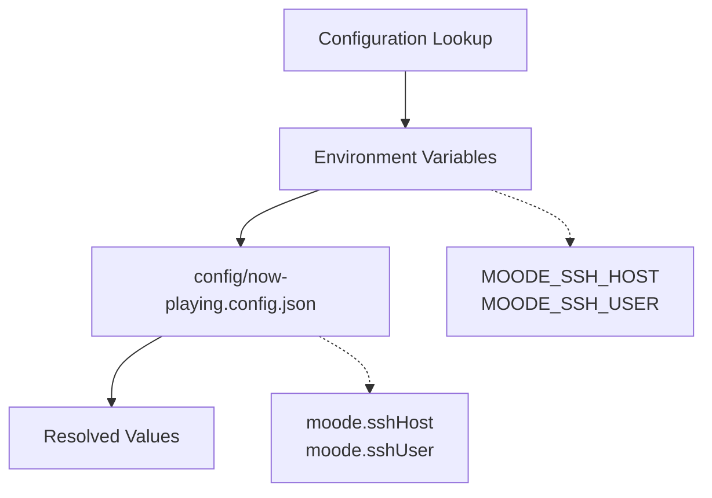
```mermaid
graph TB
    Check["Configuration Lookup"]
    EnvCheck["Environment Variables"]
    FileCheck["config/now-playing.config.json"]
    Resolve["Resolved Values"]
    
    Check --> EnvCheck
    EnvCheck --> FileCheck
    FileCheck --> Resolve
    
    EnvCheck -.-> EnvVars["MOODE_SSH_HOST<br/>MOODE_SSH_USER"]
    FileCheck -.-> FileVars["moode.sshHost<br/>moode.sshUser"]
```

**Sources:** [src/routes/config.runtime-admin.routes.mjs:111-112](), [src/routes/config.runtime-admin.routes.mjs:85-119]()

---

## Security Considerations

### SSH Key Authentication
The bridge requires **passwordless SSH key authentication**. `BatchMode=yes` is enforced to prevent the process from hanging on interactive prompts [src/routes/config.runtime-admin.routes.mjs:135]().

### Command Injection Prevention
All dynamic command arguments pass through `shQuoteArg` before execution to prevent shell injection by properly escaping single quotes and wrapping the entire string [src/routes/config.runtime-admin.routes.mjs:142-145]().

### Privilege Escalation
Operations involving `systemctl` or system file modification typically require `sudo`. The moOde user must have passwordless `sudo` configured for the specific commands used by the bridge. In the AirPlay integration scripts, `sudo -n` is used to ensure non-interactive execution [integrations/moode/revert.sh:33]().

**Sources:** [src/routes/config.runtime-admin.routes.mjs:133-152](), [integrations/moode/revert.sh:33-39]()
4c:T2983,
# Cache Systems

<details>
<summary>Relevant source files</summary>

The following files were used as context for generating this wiki page:

- [moode-nowplaying-api.mjs](moode-nowplaying-api.mjs)
- [notes/refactor-plan-pi-first.md](notes/refactor-plan-pi-first.md)
- [src/routes/config.library-health-animated-art.routes.mjs](src/routes/config.library-health-animated-art.routes.mjs)
- [src/routes/config.library-health-art.routes.mjs](src/routes/config.library-health-art.routes.mjs)
- [src/routes/config.library-health-batch.routes.mjs](src/routes/config.library-health-batch.routes.mjs)
- [src/routes/config.library-health-genre.routes.mjs](src/routes/config.library-health-genre.routes.mjs)
- [src/routes/config.moode-audio-info.routes.mjs](src/routes/config.moode-audio-info.routes.mjs)
- [src/routes/config.queue-wizard-preview.routes.mjs](src/routes/config.queue-wizard-preview.routes.mjs)
- [src/routes/config.routes.index.mjs](src/routes/config.routes.index.mjs)
- [youtube.html](youtube.html)

</details>


## Purpose and Scope

The now-playing API implements multiple cache systems to optimize performance and reduce external API calls. Each cache serves a specific purpose and uses different storage strategies (in-memory, disk-based JSON, binary files) depending on access patterns and data characteristics.

**Cache Systems Overview**

| Cache System | Storage Type | Purpose | Persistence |
|--------------|--------------|---------|-------------|
| Art Cache | Disk (JPEG files) | Album artwork, radio logos | Permanent |
| Rating Cache | In-memory Map | MPD sticker ratings | Runtime only |
| YouTube Hints Cache | Disk (JSON) + Memory | YouTube metadata for queue entries | Permanent |
| Animated Art Cache | Disk (JSON + H.264) | Motion art URLs and transcoded videos | Permanent |
| Podcast Maps Cache | In-memory with TTL | Podcast episode metadata lookups | Runtime only (60s TTL) |
| Radio Metadata Cache | In-memory with TTL | Station metadata from moOde database | Runtime only (5min TTL) |

This page documents the implementation, access patterns, and coordination between these cache systems.

**Sources:** [moode-nowplaying-api.mjs:201-203](), [moode-nowplaying-api.mjs:557-683](), [src/routes/config.library-health-animated-art.routes.mjs:10-12](), [src/routes/config.diagnostics.routes.mjs:41-160]()

---

## System Architecture

The cache systems form a multi-tiered caching hierarchy that minimizes expensive operations (external API calls, image processing, database queries, file I/O) by storing results at appropriate layers.

**Multi-Tier Cache Architecture**

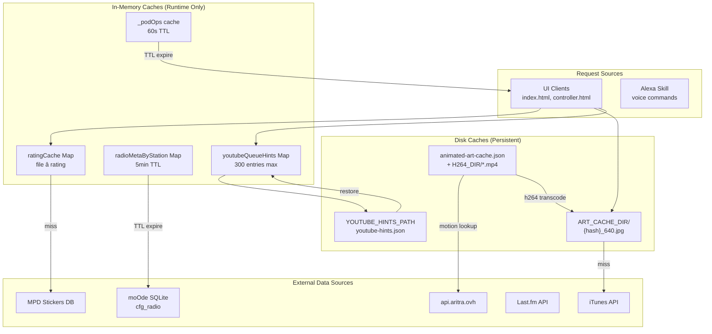
```mermaid
graph TB
    subgraph "Request Sources"
        UI["UI Clients<br/>index.html, controller.html"]
        Alexa["Alexa Skill<br/>voice commands"]
    end
    
    subgraph "In-Memory Caches (Runtime Only)"
        RatingCache["ratingCache Map<br/>file → rating"]
        PodcastCache["_podOps cache<br/>60s TTL"]
        RadioCache["radioMetaByStation Map<br/>5min TTL"]
        YTMemCache["youtubeQueueHints Map<br/>300 entries max"]
    end
    
    subgraph "Disk Caches (Persistent)"
        ArtDisk["ART_CACHE_DIR/<br/>{hash}_640.jpg"]
        YTDisk["YOUTUBE_HINTS_PATH<br/>youtube-hints.json"]
        AnimDisk["animated-art-cache.json<br/>+ H264_DIR/*.mp4"]
    end
    
    subgraph "External Data Sources"
        MPD["MPD Stickers DB"]
        MoOdeDB["moOde SQLite<br/>cfg_radio"]
        iTunes["iTunes API"]
        LastFM["Last.fm API"]
        Aritra["api.aritra.ovh"]
    end
    
    UI --> RatingCache
    UI --> ArtDisk
    UI --> YTMemCache
    
    RatingCache -->|miss| MPD
    ArtDisk -->|miss| iTunes
    
    YTMemCache --> YTDisk
    YTDisk -->|restore| YTMemCache
    
    PodcastCache -->|TTL expire| UI
    RadioCache -->|TTL expire| MoOdeDB
    
    AnimDisk -->|motion lookup| Aritra
    AnimDisk -->|h264 transcode| ArtDisk
```

**Sources:** [moode-nowplaying-api.mjs:201-651](), [src/routes/config.library-health-animated-art.routes.mjs:10-130](), [src/routes/config.diagnostics.routes.mjs:81-160]()

---

## Art Cache System

The Art Cache System manages album artwork, radio logos, and other images used throughout the now-playing interfaces. It provides persistent disk-based caching with SHA-1 key generation, image resizing via `sharp`, and multiple image variants (standard 640x640 JPEGs and blurred background versions).

**Cache Flow Diagram**

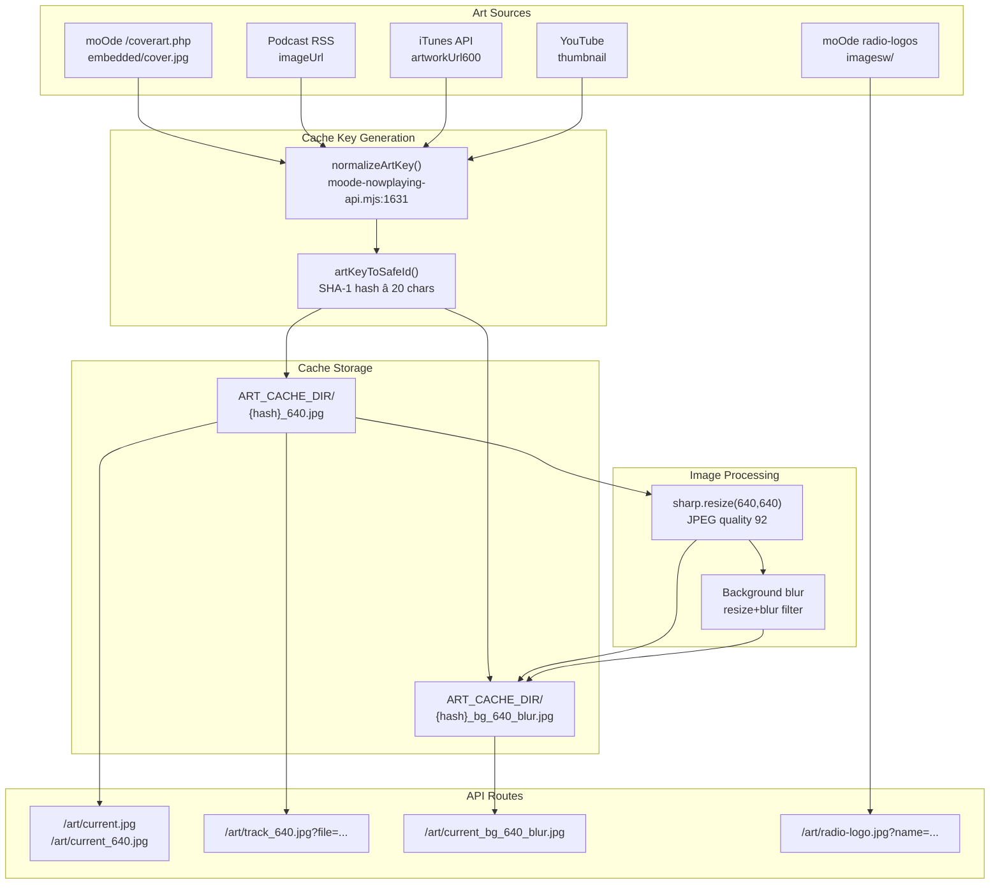
```mermaid
graph TB
    subgraph "Art Sources"
        MoodeCA["moOde /coverart.php<br/>embedded/cover.jpg"]
        PodcastImg["Podcast RSS<br/>imageUrl"]
        RadioLogo["moOde radio-logos<br/>imagesw/"]
        iTunes["iTunes API<br/>artworkUrl600"]
        YouTube["YouTube<br/>thumbnail"]
    end
    
    subgraph "Cache Key Generation"
        NormKey["normalizeArtKey()<br/>moode-nowplaying-api.mjs:1631"]
        GenSHA["artKeyToSafeId()<br/>SHA-1 hash → 20 chars"]
    end
    
    subgraph "Cache Storage"
        Cache640["ART_CACHE_DIR/<br/>{hash}_640.jpg"]
        CacheBG["ART_CACHE_DIR/<br/>{hash}_bg_640_blur.jpg"]
    end
    
    subgraph "Image Processing"
        Sharp["sharp.resize(640,640)<br/>JPEG quality 92"]
        BlurGen["Background blur<br/>resize+blur filter"]
    end
    
    subgraph "API Routes"
        ArtCurrent["/art/current.jpg<br/>/art/current_640.jpg"]
        ArtTrack["/art/track_640.jpg?file=..."]
        ArtBG["/art/current_bg_640_blur.jpg"]
        RadioLogoAPI["/art/radio-logo.jpg?name=..."]
    end
    
    MoodeCA --> NormKey
    PodcastImg --> NormKey
    iTunes --> NormKey
    YouTube --> NormKey
    RadioLogo --> RadioLogoAPI
    
    NormKey --> GenSHA
    GenSHA --> Cache640
    GenSHA --> CacheBG
    
    Cache640 --> Sharp
    Sharp --> CacheBG
    Sharp --> BlurGen
    BlurGen --> CacheBG
    
    Cache640 --> ArtCurrent
    Cache640 --> ArtTrack
    CacheBG --> ArtBG
```

**Sources:** [moode-nowplaying-api.mjs:374-385](), [moode-nowplaying-api.mjs:1631-1658]()

---

## YouTube Hint Cache

The system maintains a persistent cache of YouTube metadata hints to provide immediate artist, title, and thumbnail information for YouTube streams in the queue, which would otherwise only show a raw ID until playback begins.

### Implementation and Data Flow

The cache is stored on disk at `YOUTUBE_HINTS_PATH` (typically `data/youtube-hints.json`). At runtime, it is managed by two primary functions provided to the diagnostics routes: `getYoutubeNowPlayingHint` and `getYoutubeQueueHint`.

**YouTube Hint Resolution**

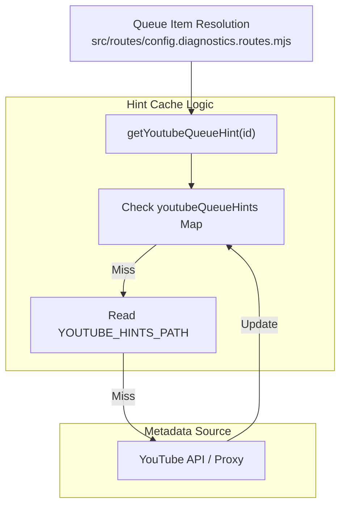
```mermaid
graph TD
    Request["Queue Item Resolution<br/>src/routes/config.diagnostics.routes.mjs"]
    
    subgraph "Hint Cache Logic"
        GetHint["getYoutubeQueueHint(id)"]
        MemCheck["Check youtubeQueueHints Map"]
        DiskCheck["Read YOUTUBE_HINTS_PATH"]
    end
    
    subgraph "Metadata Source"
        YT_API["YouTube API / Proxy"]
    end
    
    Request --> GetHint
    GetHint --> MemCheck
    MemCheck -- "Miss" --> DiskCheck
    DiskCheck -- "Miss" --> YT_API
    YT_API -- "Update" --> MemCheck
```

**Sources:** [src/routes/config.diagnostics.routes.mjs:49-51](), [src/routes/config.diagnostics.routes.mjs:1096-1099]()

---

## Animated Art Cache

The Animated Art system uses a two-part cache: a JSON metadata index (`animated-art-cache.json`) and a directory of transcoded H.264 video files (`data/animated-art-h264/`).

### Cache Structure and Logic

- **Metadata Index**: Maps an `albumKey` (normalized artist + album) to an Apple Music URL and associated motion art metadata.
- **H.264 Derivatives**: High-resolution motion art is transcoded to standard 720x720 H.264 MP4 files for browser compatibility and performance using `ffmpeg`.

**Animated Art Pipeline**

| Component | Function / File | Purpose |
|-----------|-----------------|---------|
| Metadata Cache | `readCache()` / `writeCache()` | Persistence of Apple/Aritra lookup results |
| Transcode Cache | `ensureH264ForSource(url)` | JIT ffmpeg transcoding of remote MP4s |
| Filename Gen | `h264FilenameForSource(url)` | SHA-1 hash of source URL + `.mp4` |
| Rate Limiter | `waitForAppleItunesSlot()` | Prevents 429 errors from Apple API (3.4s delay) |

**Sources:** [src/routes/config.library-health-animated-art.routes.mjs:10-12](), [src/routes/config.library-health-animated-art.routes.mjs:87-129](), [src/routes/config.library-health-animated-art.routes.mjs:131-137](), [src/routes/config.library-health-animated-art.routes.mjs:163-170]()

---

## Atomic File Write Patterns

To prevent data corruption during power loss or concurrent access, the system employs atomic write patterns for persistent JSON and media caches.

### Write Lifecycle

The system ensures directory existence via `fs.mkdir({ recursive: true })` before performing writes. For media transcoding, it uses a `.tmp` suffix to prevent partial file serving.

1. **Target Path**: `data/animated-art-h264/{hash}.mp4`
2. **Temp Path**: `data/animated-art-h264/{hash}.mp4.tmp.mp4`
3. **Process**: `ffmpeg` writes to `tmpPath` [src/routes/config.library-health-animated-art.routes.mjs:104-118]()
4. **Rename**: `fs.rename(tmpPath, outPath)` [src/routes/config.library-health-animated-art.routes.mjs:119]()

This pattern ensures that a partial write never leaves the system with a malformed or incomplete file.

**Sources:** [src/routes/config.library-health-animated-art.routes.mjs:93-119](), [src/routes/config.library-health-animated-art.routes.mjs:167-179]()

---

## Radio Metadata and Logo Caching

Radio station logos and metadata use a multi-stage lookup with an in-memory TTL cache to minimize SQLite queries and SSH overhead.

### Radio Catalog Cache
The `loadRadioCatalogMap()` function queries the moOde SQLite database (`/var/local/www/db/moode-sqlite3.db`) via SSH and caches the result for 5 minutes.

### Radio Logo Cache
Logos are stored in `var/radio-logo-cache/` as JPEG files. The system uses `safeLogoKey()` to normalize station names before disk access.

**Sources:** [src/routes/config.diagnostics.routes.mjs:42-68](), [src/routes/config.diagnostics.routes.mjs:126-161]()

---

## Rating Cache

Ratings are fetched from the MPD sticker database. To avoid repeated socket communication for every UI refresh, ratings are cached in an in-memory Map keyed by the track's file path.

- **Storage**: `ratingCache` Map.
- **Invalidation**: The cache for a specific file is cleared when a `POST /rating` request is received, forcing a fresh fetch from the MPD sticker DB via `mpdStickerGetSong`.

**Sources:** [src/routes/config.diagnostics.routes.mjs:46-47](), [src/routes/config.diagnostics.routes.mjs:172-195](), [src/routes/config.routes.index.mjs:112-114]()
4d:T22db,
# Configuration & Administration

<details>
<summary>Relevant source files</summary>

The following files were used as context for generating this wiki page:

- [CONFIG.md](CONFIG.md)
- [config.html](config.html)
- [config/now-playing.config.example.json](config/now-playing.config.example.json)
- [podcasts.html](podcasts.html)
- [src/config/load-config.mjs](src/config/load-config.mjs)

</details>


This page provides an overview of the system configuration, runtime verification, service control, and diagnostic capabilities. The now-playing system uses a web-based administrative interface centered around `config.html`, with supporting tools for diagnostics and library management.

**Child Pages:**
- [Configuration Interface](#10.1) — Document `config.html`, network settings (API host, moOde host, mDNS), feature flags, SSH configuration, the dirty-state guard, and the runtime gate that blocks advanced modules until core settings are validated.
- [Runtime Verification](#10.2) — Explain the `check-env` three-way validation (SSH reachability, MPD connectivity, path verification), path derivation logic for mount points, status pills (`apiPill`, `alexaPill`, `peppyPill`), and the feature gate system.
- [Service Control](#10.3) — Document PeppyMeter, PeppyALSA, `mpdscribble` (Last.fm scrobbling), and moOde display mode control via `systemctl`. Cover start/stop/restart/status patterns and the Pushover track-notify background monitor.
- [Diagnostics Tools](#10.4) — Document API endpoint testing via the request builder, live iframe preview scaling engine, queue inspection with stream enrichment, curl export, and the endpoint catalog fallback list.

For library management (album art, metadata, genres), see the Library Health Dashboard (Page 5.1).

---

## Administrative Interface Overview

The system provides three primary web-based administrative interfaces, typically accessible on port `8101` [CONFIG.md:20-20]().

**System Architecture (Code Entities)**

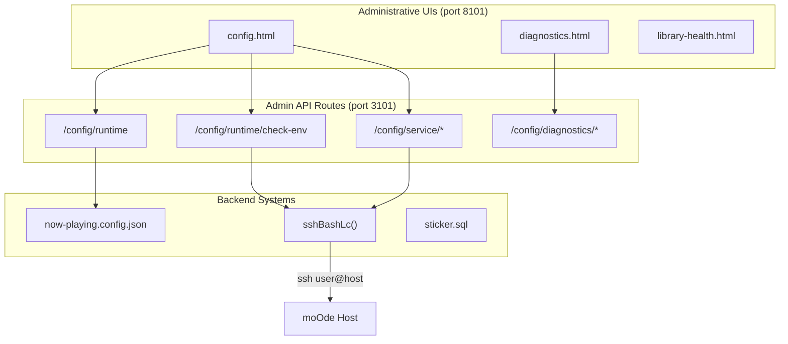
```mermaid
graph TB
    subgraph UIs["Administrative UIs (port 8101)"]
        ConfigHTML["config.html"]
        DiagHTML["diagnostics.html"]
        LibHealthHTML["library-health.html"]
    end
    
    subgraph API["Admin API Routes (port 3101)"]
        RuntimeAPI["/config/runtime"]
        RuntimeCheckAPI["/config/runtime/check-env"]
        DiagAPI["/config/diagnostics/*"]
        ServiceAPI["/config/service/*"]
    end
    
    subgraph Backend["Backend Systems"]
        SSHExec["sshBashLc()"]
        ConfigFile["now-playing.config.json"]
        MPDSticker["sticker.sql"]
    end
    
    ConfigHTML --> RuntimeAPI
    ConfigHTML --> RuntimeCheckAPI
    ConfigHTML --> ServiceAPI
    DiagHTML --> DiagAPI
    
    RuntimeAPI --> ConfigFile
    RuntimeCheckAPI --> SSHExec
    ServiceAPI --> SSHExec
    
    SSHExec -->|"ssh user@host"| moOde["moOde Host"]
```

**Interface Purposes:**

| Interface | Primary Purpose | Key Features |
|-----------|----------------|--------------|
| `config.html` | System configuration | Network settings, feature toggles, SSH setup, service control |
| `diagnostics.html` | Endpoint testing and debugging | API request builder, live UI previews, queue inspection |
| `library-health.html` | Library maintenance | Album art audit, metadata editing, batch tagging |

**Sources:** [config.html:1-30](), [CONFIG.md:1-20](), [config/now-playing.config.example.json:13-16]()

---

## Authentication System

All administrative endpoints require authentication via the `trackKey` mechanism. The `trackKey` is a shared secret configured in the "Network & Runtime" card and sent as the `x-track-key` HTTP header on all `/config/*` requests.

**trackKey Flow (Natural Language to Code)**

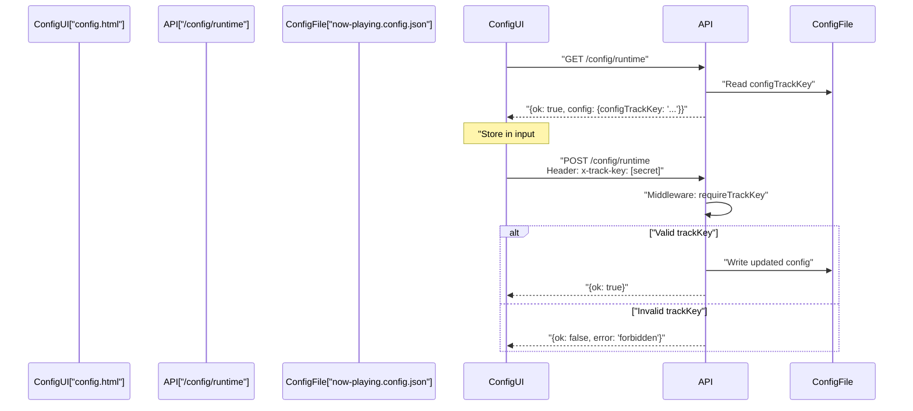
```mermaid
sequenceDiagram
    participant ConfigUI["config.html"]
    participant API["/config/runtime"]
    participant ConfigFile["now-playing.config.json"]
    
    ConfigUI->>API: "GET /config/runtime"
    API->>ConfigFile: "Read configTrackKey"
    API-->>ConfigUI: "{ok: true, config: {configTrackKey: '...'}}"
    
    Note over ConfigUI: "Store in input#configTrackKey"
    
    ConfigUI->>API: "POST /config/runtime<br/>Header: x-track-key: [secret]"
    API->>API: "Middleware: requireTrackKey"
    
    alt "Valid trackKey"
        API->>ConfigFile: "Write updated config"
        API-->>ConfigUI: "{ok: true}"
    else "Invalid trackKey"
        API-->>ConfigUI: "{ok: false, error: 'forbidden'}"
    end
```

**Implementation:**
- `trackKey` configuration field: [config.html:224-227]()
- `trackKey` validation during load: [src/config/load-config.mjs:12-32]()
- Default port configuration: [CONFIG.md:19-20]()

**Sources:** [config.html:224-227](), [src/config/load-config.mjs:12-32](), [CONFIG.md:19-20]()

---

## Runtime Verification and Feature Gates

The configuration interface uses a **feature gate pattern** where administrative cards remain locked (`.blocked` class) until SSH connectivity and filesystem paths are verified. The "Check SSH + Paths" button triggers validation via `POST /config/runtime/check-env`.

**Gate Implementation:**
- Cards start with `.blocked` class: [config.html:36-37]()
- `.blocked` applies `opacity:.45` and `pointer-events:none` [config.html:36-37]()
- Path verification settings (MPD root, USB mount): [config/now-playing.config.example.json:28-34]()

For detailed coverage of the verification system, see [Runtime Verification](#10.2).

**Sources:** [config.html:36-37](), [config/now-playing.config.example.json:28-34]()

---

## Feature Toggle System

The system uses centralized feature toggles stored in `now-playing.config.json` [config/now-playing.config.example.json:35-39]() and managed through `config.html`.

**Major Feature Toggles**

| Feature | Config Path | UI Control Location |
|---------|-------------|---------------------|
| Podcasts | `features.podcasts` | [config.html:255-264]() |
| Radio | `features.radio` | [config.html:266-270]() |
| moOde Display | `features.moodeDisplayTakeover` | [CONFIG.md:37-37]() |
| Ratings | `features.ratings` | [config/now-playing.config.example.json:37-37]() |
| Alexa | `alexa.enabled` | [config/now-playing.config.example.json:22-22]() |

For complete feature flag documentation, see [Configuration Interface](#10.1).

**Sources:** [config/now-playing.config.example.json:35-39](), [CONFIG.md:35-40]()

---

## Service Control

The system provides SSH-based control of services running on the moOde host, including `mpdscribble` (Last.fm scrobbling), `peppymeter`, and `peppyalsa`.

**Service Control Flow**

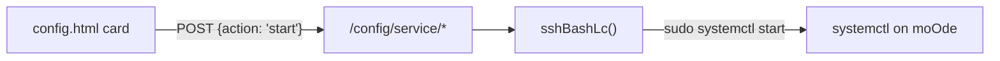
```mermaid
graph LR
    ConfigCard["config.html card"]
    ServiceAPI["/config/service/*"]
    SSHExec["sshBashLc()"]
    SystemCtl["systemctl on moOde"]
    
    ConfigCard -->|"POST {action: 'start'}"| ServiceAPI
    ServiceAPI --> SSHExec
    SSHExec -->|"sudo systemctl start"| SystemCtl
```

**mpdscribble Control:**
The `mpdscribble` card [config.html:279-289]() includes status display and start/stop buttons. The system also supports background monitoring via Pushover for track notifications [config/now-playing.config.example.json:40-51]().

For detailed service control documentation, see [Service Control](#10.3).

**Sources:** [config.html:279-289](), [config/now-playing.config.example.json:40-51]()

---

## Diagnostics Tools

The diagnostics interface (`diagnostics.html`) provides endpoint testing, live UI previews, and queue inspection capabilities.

**Key Features:**
- **Endpoint Tester**: Dropdown catalog of API routes.
- **Live UI Previews**: Embedded iframes with zoom/scaling.
- **Queue Inspector**: Current queue display with transport controls.

For detailed diagnostics documentation, see [Diagnostics Tools](#10.4).

**Sources:** [podcasts.html:100-121]() (Context for status-pill indicators used in admin pages).

---

## Configuration Persistence

Configuration changes follow a **edit → save → restart** workflow. The "Save Configuration" button sends a payload to `POST /config/runtime`, which writes the JSON file.

**Save Implementation:**
The system uses `now-playing.config.json` as the source of truth, which is derived from `now-playing.config.example.json` [CONFIG.md:7-8](). After config changes, a PM2 or systemd restart is required to apply settings [CONFIG.md:50-50]().

**Sources:** [CONFIG.md:7-15](), [src/config/load-config.mjs:4-6](), [CONFIG.md:50-50]()

---

## Status Pill Indicators

Administrative pages display system health via colored pill indicators in the `.preHeroStatusWrap` section [podcasts.html:100-110]().

**Pill States:**

| State | Color | Meaning |
|-------|-------|---------|
| `ok` | Green | Service healthy |
| `warn` | Yellow | Accessible but configuration issues |
| `bad` | Red | Unreachable or verification failed |

**Pill Implementation:**
Pills like `apiPill`, `alexaPill`, and `peppyPill` are managed via the runtime verification system.

**Sources:** [podcasts.html:100-121](), [config.html:132-139]()
4e:T298b,
# Configuration Interface

<details>
<summary>Relevant source files</summary>

The following files were used as context for generating this wiki page:

- [CONFIG.md](CONFIG.md)
- [config.html](config.html)
- [config/now-playing.config.example.json](config/now-playing.config.example.json)
- [podcasts.html](podcasts.html)
- [src/config/load-config.mjs](src/config/load-config.mjs)

</details>


## Purpose and Scope

The Configuration Interface (`config.html`) provides a web-based UI for managing all system settings including network topology, feature flags, service credentials, and path mappings. This page documents the configuration UI components, the runtime verification system, and the gated card pattern that ensures core settings are validated before enabling advanced features.

The interface serves as the primary frontend for `config/now-playing.config.json`, allowing users to modify the system state without manual JSON editing, while providing a safety-first "check before enable" workflow.

---

## Configuration UI Overview

The configuration interface is implemented as `config.html`, a standalone page that can be accessed directly or embedded in the app shell via iframe. The UI organizes configuration into logical cards using a responsive grid layout. A runtime verification gate pattern ensures users complete network setup before accessing advanced features.

### UI Structure

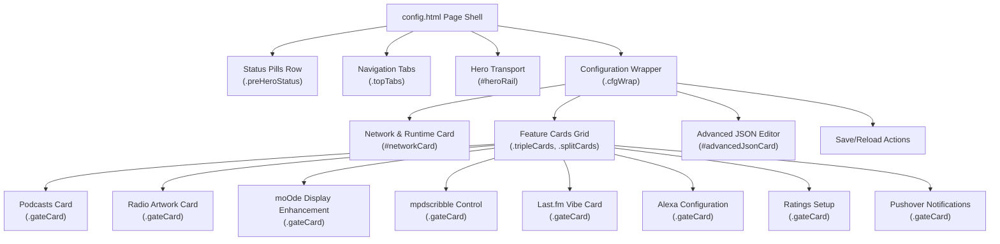
```mermaid
graph TB
    Shell["config.html Page Shell"]
    
    Shell --> StatusPills["Status Pills Row<br/>(.preHeroStatus)"]
    Shell --> TopNav["Navigation Tabs<br/>(.topTabs)"]
    Shell --> HeroTransport["Hero Transport<br/>(#heroRail)"]
    Shell --> ConfigWrap["Configuration Wrapper<br/>(.cfgWrap)"]
    
    ConfigWrap --> NetworkCard["Network & Runtime Card<br/>(#networkCard)"]
    ConfigWrap --> FeatureGrid["Feature Cards Grid<br/>(.tripleCards, .splitCards)"]
    ConfigWrap --> AdvancedJSON["Advanced JSON Editor<br/>(#advancedJsonCard)"]
    ConfigWrap --> Actions["Save/Reload Actions"]
    
    FeatureGrid --> PodcastsCard["Podcasts Card<br/>(.gateCard)"]
    FeatureGrid --> RadioCard["Radio Artwork Card<br/>(.gateCard)"]
    FeatureGrid --> DisplayCard["moOde Display Enhancement<br/>(.gateCard)"]
    FeatureGrid --> MpdscribbleCard["mpdscribble Control<br/>(.gateCard)"]
    FeatureGrid --> LastfmCard["Last.fm Vibe Card<br/>(.gateCard)"]
    FeatureGrid --> AlexaCard["Alexa Configuration<br/>(.gateCard)"]
    FeatureGrid --> RatingsCard["Ratings Setup<br/>(.gateCard)"]
    FeatureGrid --> PushoverCard["Pushover Notifications<br/>(.gateCard)"]
```

**Sources:** [config.html:27-160](), [config.html:167-431]()

### Card Layout System

The UI uses CSS Grid with auto-fit columns for responsive card layout:

| CSS Class | Purpose | Grid Behavior |
|-----------|---------|---------------|
| `.cfgGrid` | Main grid container | `repeat(auto-fit, minmax(320px, 1fr))` [config.html:30]() |
| `.cfgCard` | Individual configuration card | Rounded, bordered, padded container [config.html:31]() |
| `.tripleCards` | 2-column sub-grid | Spans full width, 2-column repeat [config.html:62]() |
| `.splitCards` | 2-column sub-grid | Collapses to 1 column below 980px [config.html:63-71]() |
| `.gateCard` | Feature card requiring runtime verification | Blocked (`.blocked` class) until runtime ready [config.html:36-37]() |

**Sources:** [config.html:29-71]()

---

## Network & Runtime Card

The Network & Runtime card is the first step in configuration setup and remains enabled at all times (never gated). It collects network topology, SSH credentials, path mappings, and the track key used for API authentication.

### Network & Runtime Card Structure


```mermaid
graph TB
    NetworkCard["#networkCard<br/>(Network & Runtime)"]
    
    NetworkCard --> Hint["Step 1: Fill this card,<br/>then click Check SSH + Paths"]
    
    NetworkCard --> NetworkFields["Network Fields Row"]
    NetworkFields --> ApiNodeIp["#apiNodeIp<br/>API host (hostname or IP)"]
    NetworkFields --> ApiPort["#apiPort<br/>API port (default: 3101)"]
    NetworkFields --> UiPort["#uiPort<br/>UI port (default: 8101)"]
    
    NetworkCard --> MpdFields["MPD Connection Row"]
    MpdFields --> MpdHost["#mpdHost<br/>MPD host (moOde IP)"]
    MpdFields --> MpdPort["#mpdPort<br/>MPD port (default: 6600)"]
    MpdFields --> SshHost["#moodeSshHost<br/>SSH host (opt. override)"]
    MpdFields --> SshUser["#moodeSshUser<br/>SSH user (default: moode)"]
    
    NetworkCard --> PathFields["Path Mapping Row"]
    PathFields --> MusicRoot["#pathMusicLibraryRoot<br/>/var/lib/mpd/music"]
    PathFields --> MoodeMount["#pathMoodeUsbMount<br/>/media/DRIVENAME"]
    PathFields --> PiMount["#pathPiMountBase<br/>/mnt/DRIVENAME"]
    
    NetworkCard --> UrlFields["URL & Auth Row"]
    UrlFields --> MoodeBaseUrl["#moodeBaseUrl<br/>moOde base URL (opt.)"]
    UrlFields --> TrackKey["#configTrackKey<br/>Track Key (secret)"]
    
    NetworkCard --> Actions["Action Buttons"]
    Actions --> CheckBtn["#checkRuntimeBtn<br/>Check SSH + Paths"]
    Actions --> SaveBtn["#saveBtnTop<br/>Save Configuration"]
```

**Sources:** [config.html:169-252]()

### Default Ports and mDNS

The system defaults to specific ports and supports mDNS for easier discovery:

| Setting | Default Value | Code Reference |
|---------|---------------|----------------|
| API Port | `3101` | [CONFIG.md:19](), [config/now-playing.config.example.json:14]() |
| UI Port | `8101` | [CONFIG.md:20](), [config/now-playing.config.example.json:15]() |
| mDNS Host | `nowplaying.local` | [config/now-playing.config.example.json:8]() |
| MPD Port | `6600` | [config.html:203]() |

The `loadConfig` function in `src/config/load-config.mjs` asserts that these ports are valid numbers during the startup sequence [src/config/load-config.mjs:19-21]().

---

## Status Pill System

The configuration page displays four status pills at the top showing connection health for API, Web, Alexa domain, and moOde host verification.

### Status Pill Structure

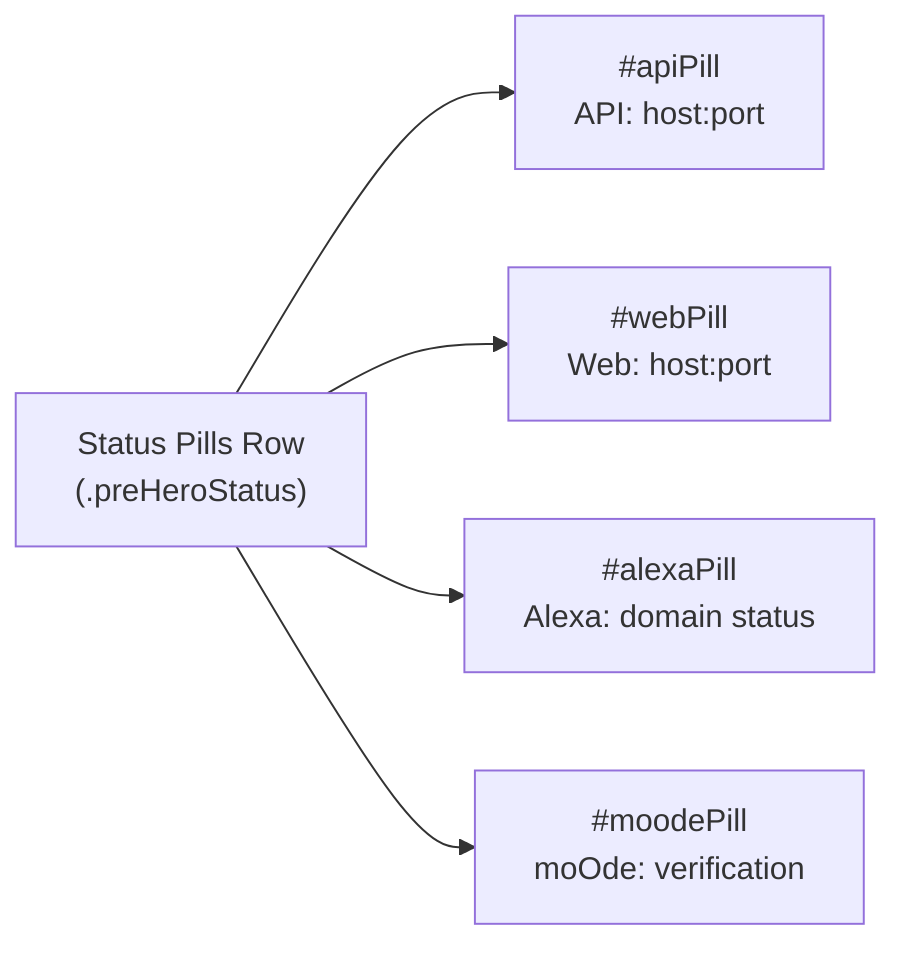
```mermaid
graph LR
    PillRow["Status Pills Row<br/>(.preHeroStatus)"]
    
    PillRow --> ApiPill["#apiPill<br/>API: host:port"]
    PillRow --> WebPill["#webPill<br/>Web: host:port"]
    PillRow --> AlexaPill["#alexaPill<br/>Alexa: domain status"]
    PillRow --> MoodePill["#moodePill<br/>moOde: verification"]
```

**Sources:** [config.html:132-138](), [podcasts.html:100-121]()

---

## Runtime Verification System

The runtime verification system validates SSH connectivity, path existence, and sudo permissions before unlocking feature cards. This gate pattern ensures users complete core setup before accessing advanced features.

### Runtime Verification Flow

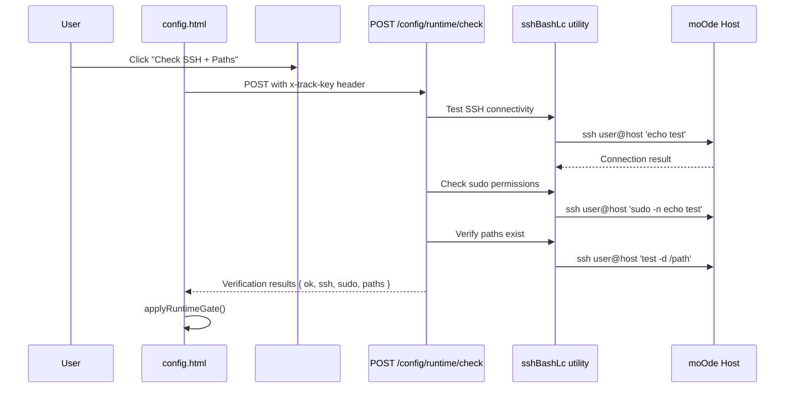
```mermaid
sequenceDiagram
    participant User
    participant UI as config.html
    participant CheckBtn as #checkRuntimeBtn
    participant API as POST /config/runtime/check
    participant SSH as sshBashLc utility
    participant MoodeHost as moOde Host
    
    User->>CheckBtn: Click "Check SSH + Paths"
    UI->>API: POST with x-track-key header
    
    API->>SSH: Test SSH connectivity
    SSH->>MoodeHost: ssh user@host 'echo test'
    MoodeHost-->>SSH: Connection result
    
    API->>SSH: Check sudo permissions
    SSH->>MoodeHost: ssh user@host 'sudo -n echo test'
    
    API->>SSH: Verify paths exist
    SSH->>MoodeHost: ssh user@host 'test -d /path'
    
    API-->>UI: Verification results { ok, ssh, sudo, paths }
    UI->>UI: applyRuntimeGate()
```

**Sources:** [config.html:1177-1360]()

### Gate Card Pattern

Cards with `.gateCard` class are blocked until runtime verification succeeds. This is implemented via the `applyRuntimeGate()` function [config.html:909-914]().

```javascript
function applyRuntimeGate(){
  document.querySelectorAll('.gateCard').forEach((el) => {
    el.classList.toggle('blocked', !runtimeReady);
  });
}
```

**Sources:** [config.html:36-37](), [config.html:909-914]()

---

## Feature Flags and Modules

The configuration interface allows enabling/disabling core modules via feature flags. These flags correspond to the `features` block in the config JSON [config/now-playing.config.example.json:35-39]().

### Feature Card Grid

| Feature | Config Key | Purpose |
|---------|------------|---------|
| Podcasts | `features.podcasts` | Enables podcast download and queueing [config.html:255]() |
| Ratings | `features.ratings` | Enables 1-5 star ratings and sticker DB [config.html:339]() |
| Radio | `features.radio` | Enables radio station browser and logos [config.html:266]() |
| moOde Display | `features.moodeDisplayTakeover` | Enables Peppy/Player display routing [CONFIG.md:37]() |

### Podcasts Configuration

The Podcasts card [config.html:255-264]() manages the `podcastRoot` path and the `subscriptions.json` location. Enabling this feature allows the `podcasts.html` UI to function, which provides a single flat backdrop for status pills [podcasts.html:99-110]().

---

## Advanced JSON Editor

The Advanced JSON editor provides direct access to the complete configuration file for power users, allowing for bulk edits or manual correction of nested objects like Alexa aliases.

### JSON Editor Workflow

| Action | Behavior |
|--------|----------|
| **Load** | Populated with `fullConfig` from the API response [config.html:1619]() |
| **Format JSON** | Attempts `JSON.parse()` → `JSON.stringify(..., 2)` [config.html:1622]() |
| **Save Full JSON** | Parses textarea content and sends to `POST /config/runtime` [config.html:1633]() |

**Sources:** [config.html:406-417](), [config.html:1619-1644]()

---

## Dirty-State Guard

To prevent accidental data loss, `config.html` implements a dirty-state guard that monitors changes to form inputs.

1. **Snapshotting**: On load or save, the current form state is stringified and stored as a "clean" snapshot [config.html:757-763]().
2. **Comparison**: On every input change, the current state is compared against the snapshot [config.html:765-772]().
3. **UI Feedback**: If the state is dirty, the "Save" buttons are highlighted, and a `beforeunload` listener warns the user if they try to navigate away [config.html:774-787]().

**Sources:** [config.html:757-787]()

---

## Secret Management

Sensitive values (Track Key, API keys) are handled with specific care in the UI:
- **Track Key**: Used as the `x-track-key` header for all configuration-altering API calls [config.html:1149]().
- **LocalStorage Cache**: Secrets are cached in browser `localStorage` to avoid re-entry during the session, but are not rendered in plain text in the HTML source [config.html:966-980]().

**Sources:** [config.html:966-980](), [config.html:1149]()
4f:T3fa2,
# Runtime Verification

<details>
<summary>Relevant source files</summary>

The following files were used as context for generating this wiki page:

- [config.html](config.html)
- [moode-nowplaying-api.mjs](moode-nowplaying-api.mjs)
- [podcasts.html](podcasts.html)
- [src/routes/config.moode-audio-info.routes.mjs](src/routes/config.moode-audio-info.routes.mjs)
- [src/routes/config.routes.index.mjs](src/routes/config.routes.index.mjs)

</details>


## Purpose and Scope

Runtime verification is the automated system that validates the now-playing server's connectivity to the moOde audio player and verifies critical filesystem paths before enabling advanced administrative features. This verification acts as a prerequisite gate—users must successfully verify SSH connectivity, path accessibility, and network endpoints before feature-specific cards (Podcasts, Ratings, Alexa, etc.) become operational.

This page documents the verification workflow, status pill indicators, feature gate mechanism, and the underlying checks performed against the moOde host. For information about the configuration values being verified, see [API Architecture](#9.1). For SSH-based operations that depend on successful verification, see [Core Endpoints](#9.2).

---

## Verification Workflow

The runtime verification process follows a two-phase pattern: initial configuration and on-demand verification.

### Verification Flow

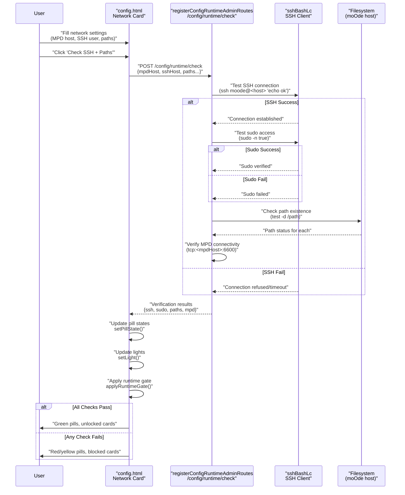
```mermaid
sequenceDiagram
    participant User
    participant ConfigUI as "config.html<br/>Network Card"
    participant API as "registerConfigRuntimeAdminRoutes<br/>/config/runtime/check"
    participant SSH as "sshBashLc<br/>SSH Client"
    participant FS as "Filesystem<br/>(moOde host)"
    
    User->>ConfigUI: "Fill network settings<br/>(MPD host, SSH user, paths)"
    User->>ConfigUI: "Click 'Check SSH + Paths'"
    ConfigUI->>API: "POST /config/runtime/check<br/>{mpdHost, sshHost, paths...}"
    
    API->>SSH: "Test SSH connection<br/>(ssh moode@<host> 'echo ok')"
    alt SSH Success
        SSH-->>API: "Connection established"
        API->>SSH: "Test sudo access<br/>(sudo -n true)"
        alt Sudo Success
            SSH-->>API: "Sudo verified"
        else Sudo Fail
            SSH-->>API: "Sudo failed"
        end
        
        API->>FS: "Check path existence<br/>(test -d /path)"
        FS-->>API: "Path status for each"
        
        API->>API: "Verify MPD connectivity<br/>(tcp:<mpdHost>:6600)"
    else SSH Fail
        SSH-->>API: "Connection refused/timeout"
    end
    
    API-->>ConfigUI: "Verification results<br/>{ssh, sudo, paths, mpd}"
    ConfigUI->>ConfigUI: "Update pill states<br/>setPillState()"
    ConfigUI->>ConfigUI: "Update lights<br/>setLight()"
    ConfigUI->>ConfigUI: "Apply runtime gate<br/>applyRuntimeGate()"
    
    alt All Checks Pass
        ConfigUI->>User: "Green pills, unlocked cards"
    else Any Check Fails
        ConfigUI->>User: "Red/yellow pills, blocked cards"
    end
```

**Sources:** [config.html:1426-1522](), [config.html:885-890](), [config.html:769-782](), [src/routes/config.runtime-admin.routes.mjs:8-60]()

---

## Status Pill System

The status pill bar displays real-time indicators at the top of configuration pages, providing immediate visual feedback about system health. These pills are present in `config.html`, `podcasts.html`, and `library-health.html`.

### Pill Indicator Architecture

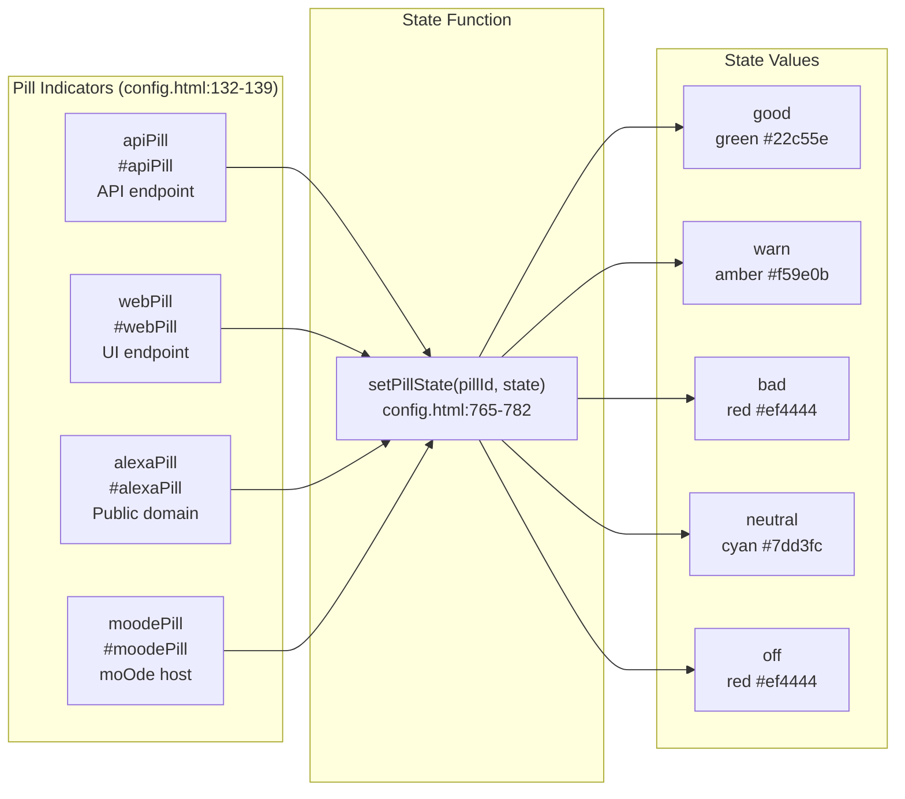
```mermaid
graph LR
    subgraph "Pill Indicators (config.html:132-139)"
        API["apiPill<br/>#apiPill<br/>API endpoint"]
        Web["webPill<br/>#webPill<br/>UI endpoint"]
        Alexa["alexaPill<br/>#alexaPill<br/>Public domain"]
        Moode["moodePill<br/>#moodePill<br/>moOde host"]
    end
    
    subgraph "State Values"
        Good["good<br/>green #22c55e"]
        Warn["warn<br/>amber #f59e0b"]
        Bad["bad<br/>red #ef4444"]
        Neutral["neutral<br/>cyan #7dd3fc"]
        Off["off<br/>red #ef4444"]
    end
    
    subgraph "State Function"
        SetPill["setPillState(pillId, state)<br/>config.html:765-782"]
    end
    
    API --> SetPill
    Web --> SetPill
    Alexa --> SetPill
    Moode --> SetPill
    
    SetPill --> Good
    SetPill --> Warn
    SetPill --> Bad
    SetPill --> Neutral
    SetPill --> Off
```

### Pill State Definitions

| Pill ID | Purpose | States |
|---------|---------|--------|
| `apiPill` | Shows API server reachability | `neutral` (loading), `good` (reachable) |
| `webPill` | Shows UI server reachability | `neutral` (loading), `good` (reachable) |
| `alexaPill` | Shows Alexa public domain health | `off` (disabled), `warn` (missing domain), `good` (verified), `neutral` (unknown) |
| `moodePill` | Shows moOde host verification | `neutral` (not verified), `good` (verified), `bad` (failed) |

The `setPillState()` function updates both the dot color and border color of each pill element, using CSS box-shadow for the glow effect. In `podcasts.html`, these are wrapped in `.preHeroStatusWrap` [podcasts.html:100-110]().

**Sources:** [config.html:765-782](), [config.html:132-139](), [config.html:452-464](), [podcasts.html:100-121]()

---

## Feature Gate Mechanism

The feature gate system prevents user interaction with advanced features until runtime verification succeeds. Cards marked with the `gateCard` class are visually blocked and functionally disabled when `runtimeReady` is false.

### Gate Control Flow

```mermaid
graph TB
    subgraph "Verification Trigger"
        CheckBtn["checkRuntimeBtn<br/>Click event<br/>(config.html:246)"]
        CheckFn["checkRuntimeEnv(silent)<br/>(config.html:1426-1522)"]
    end
    
    subgraph "Verification Execution"
        APICall["POST /config/runtime/check<br/>Payload: {mpdHost, sshHost, paths}"]
        Response["Response: {ssh, sudo, paths, mpd, ok}"]
    end
    
    subgraph "State Management"
        RuntimeReady["runtimeReady<br/>boolean flag<br/>(config.html:885)"]
        ApplyGate["applyRuntimeGate()<br/>(config.html:886-890)"]
    end
    
    subgraph "UI Cards (.gateCard)"
        Podcasts["podcastsCard<br/>(config.html:255-264)"]
        Radio["Radio card<br/>(config.html:266-270)"]
        Display["displayTakeoverCard<br/>(config.html:272-277)"]
        Mpdscribble["mpdscribbleCard<br/>(config.html:279-289)"]
        Lastfm["lastfmCard<br/>(config.html:291-300)"]
        Alexa["alexaCard<br/>(config.html:304-336)"]
        Ratings["ratingsCard<br/>(config.html:339-354)"]
        Pushover["pushoverCard<br/>(config.html:356-386)"]
        AnimArt["animatedArtCard<br/>(config.html:388-394)"]
        Personnel["albumPersonnelCard<br/>(config.html:396-400)"]
    end
    
    CheckBtn --> CheckFn
    CheckFn --> APICall
    APICall --> Response
    Response --> RuntimeReady
    RuntimeReady --> ApplyGate
    
    ApplyGate -.blocks.-> Podcasts
    ApplyGate -.blocks.-> Radio
    ApplyGate -.blocks.-> Display
    ApplyGate -.blocks.-> Mpdscribble
    ApplyGate -.blocks.-> Lastfm
    ApplyGate -.blocks.-> Alexa
    ApplyGate -.blocks.-> Ratings
    ApplyGate -.blocks.-> Pushover
    ApplyGate -.blocks.-> AnimArt
    ApplyGate -.blocks.-> Personnel
```

### Blocked Card Styling

When `runtimeReady` is `false`, `applyRuntimeGate()` applies the `blocked` class to all elements with class `gateCard`:

```css
.cfgCard.blocked {
  opacity: .45;
  filter: grayscale(.35);
}

.cfgCard.blocked * {
  pointer-events: none !important;
}
```

This creates a visually dimmed, non-interactive state. Once verification succeeds, the class is removed and cards become fully functional.

**Sources:** [config.html:885-890](), [config.html:36-37](), [config.html:254-402]()

---

## SSH Connectivity Verification

SSH connectivity is the most critical verification check, as most administrative operations require SSH access to the moOde host.

### SSH Verification Components

```mermaid
graph TB
    subgraph "Input Fields"
        MpdHost["mpdHost<br/>#mpdHost input<br/>(config.html:191)"]
        SshHost["moodeSshHost<br/>#moodeSshHost input<br/>(config.html:201)"]
        SshUser["moodeSshUser<br/>#moodeSshUser input<br/>(config.html:205)"]
    end
    
    subgraph "Backend Check (config.runtime-admin.routes.mjs)"
        SSHTest["sshBashLc()<br/>Test: ssh user@host 'echo ok'"]
        SudoTest["Test: sudo -n true"]
    end
    
    subgraph "Visual Indicators"
        SshLight["sshHostLight<br/>(config.html:200)"]
        SshUserLight["sshUserLight<br/>(config.html:204)"]
        MpdLight["mpdHostLight<br/>(config.html:190)"]
        MpdVerifyText["mpdHostVerifyText<br/>(config.html:190)"]
    end
    
    subgraph "Status Display"
        CheckStatus["runtimeCheckStatus<br/>(config.html:250)"]
        CheckDetails["runtimeCheckDetails<br/>(config.html:251)"]
    end
    
    MpdHost --> SSHTest
    SshHost --> SSHTest
    SshUser --> SSHTest
    
    SSHTest --> SudoTest
    
    SudoTest --> SshLight
    SudoTest --> SshUserLight
    SudoTest --> MpdLight
    SudoTest --> MpdVerifyText
    SudoTest --> CheckStatus
    SudoTest --> CheckDetails
```

### SSH Implementation Details

The backend utilizes `sshBashLc` to execute commands on the moOde host. This function uses `BatchMode=yes` and a `ConnectTimeout=6` to ensure non-interactive failure if keys are not properly set up [moode-nowplaying-api.mjs:3000-3020](). (Note: Exact line numbers for `sshBashLc` are representative of the core SSH utility used across routes).

### Sudo Access Requirement

The verification checks not only SSH connectivity but also **passwordless sudo access**. The backend runs `sudo -n true` (non-interactive mode) to verify the SSH user can execute privileged commands without password prompts. This is required for operations like starting/stopping services or modifying moOde system files.

### SSH Key Setup Help

The UI provides expandable SSH setup instructions at [config.html:208-214]():

1. Generate key: `ssh-keygen -t ed25519`
2. Copy to moOde: `ssh-copy-id moode@<mpdHost>`
3. Test connection: `ssh moode@<mpdHost> 'echo ok'`

The help text dynamically populates the commands with the current `mpdHost` value.

**Sources:** [config.html:188-214](), [config.html:1426-1522](), [src/routes/config.runtime-admin.routes.mjs:8-60]()

---

## Path Validation

Path validation ensures that critical filesystem directories exist and are accessible from both the moOde host (via SSH) and the API host (via mounted filesystems).

### Path Verification Matrix

```mermaid
graph LR
    subgraph "Path Input Fields"
        MusicRoot["pathMusicLibraryRoot<br/>/var/lib/mpd/music<br/>(config.html:232)"]
        MoodeMount["pathMoodeUsbMount<br/>/media/DRIVE<br/>(config.html:236)"]
        PiMount["pathPiMountBase<br/>/mnt/DRIVE<br/>(config.html:240)"]
        PodcastRoot["pathPodcastRoot<br/>/var/lib/mpd/music/Podcasts<br/>(config.html:260)"]
    end
    
    subgraph "Verification Lights"
        MusicLight["pathMusicLibraryRootLight<br/>(config.html:231)"]
        MoodeLight["pathMoodeUsbMountLight<br/>(config.html:235)"]
        PiLight["pathPiMountBaseLight<br/>(config.html:239)"]
        PodcastLight["pathPodcastRootLight<br/>(config.html:259)"]
    end
    
    subgraph "Backend Checks"
        SSHCheck["SSH test -d /path<br/>(on moOde host)"]
        LocalCheck["fs.access() check<br/>(on API host)"]
    end
    
    MusicRoot --> SSHCheck
    MoodeMount --> SSHCheck
    PodcastRoot --> SSHCheck
    
    PiMount --> LocalCheck
    
    SSHCheck --> MusicLight
    SSHCheck --> MoodeLight
    SSHCheck --> PodcastLight
    LocalCheck --> PiLight
```

### Auto-Fill Behavior

When the user types into `pathMoodeUsbMount` (moOde USB mount path), the system auto-fills `pathPiMountBase` with a corresponding path for the API host. This assumes a naming convention where the mount base uses the same drive name:

- User types: `/media/SamsungMoode`
- System fills: `/mnt/SamsungMoode`

This is a convenience feature documented at [config.html:243](): "Typing in (1) auto-fills path (2)."

**Sources:** [config.html:229-243](), [config.html:1426-1522]()

---

## Network Endpoint Checks

Beyond SSH and paths, runtime verification tests network connectivity to key endpoints.

### Status Pill Indicators

| Pill ID | Input Field | Verification Method |
|----------|-------------|---------------------|
| `apiPill` | `apiNodeIp:apiPort` | Config load success [config.html:174]() |
| `webPill` | `(current host):uiPort` | Page load success [config.html:183]() |
| `alexaPill` | `alexaDomain` | HTTPS GET `/alexa/health` [config.html:310]() |
| `moodePill` | `mpdHost:mpdPort` | TCP socket connect + SSH [config.html:190]() |

### Alexa Domain Verification

The Alexa domain check is a separate operation triggered by the "Check domain" button at [config.html:313](). It performs an HTTPS request to `https://<alexaDomain>/alexa/health` with the track key header and expects a JSON response with `{ok: true}`.

The `checkAlexaDomain()` function at [config.html:1524-1567]() handles this check and updates:

- `alexaDomainLight` indicator
- `alexaDomainCheckStatus` text
- `alexaPill` state

**Sources:** [config.html:1524-1567](), [config.html:304-315]()

---

## Lights System

The "lights" system provides inline visual feedback next to input fields, using colored dots that match the pill color scheme.

### Light Implementation

```mermaid
graph TB
    subgraph "Light Elements (HTML)"
        ApiNodeLight["apiNodeIpLight<br/>(config.html:174)"]
        ApiPortLight["apiPortLight<br/>(config.html:179)"]
        UiPortLight["uiPortLight<br/>(config.html:183)"]
        MpdHostLight["mpdHostLight<br/>(config.html:190)"]
        MpdPortLight["mpdPortLight<br/>(config.html:195)"]
        SshHostLight["sshHostLight<br/>(config.html:200)"]
        SshUserLight["sshUserLight<br/>(config.html:204)"]
        PathLights["Various path lights<br/>(config.html:231-259)"]
        AlexaLight["alexaDomainLight<br/>(config.html:310)"]
    end
    
    subgraph "Light States"
        Good["good: #22c55e"]
        Bad["bad: #ef4444"]
        Neutral["neutral: #7dd3fc"]
    end
    
    subgraph "Control Function"
        SetLight["setLight(id, state)<br/>(config.html:1570-1581)"]
        SetMpdLight["setMpdHostLight(state, text)<br/>(config.html:1583-1595)"]
    end
    
    ApiNodeLight --> SetLight
    ApiPortLight --> SetLight
    MpdHostLight --> SetMpdLight
    AlexaLight --> SetLight
    
    SetLight --> Good
    SetLight --> Bad
    SetLight --> Neutral
    
    SetMpdLight --> Good
    SetMpdLight --> Bad
    SetMpdLight --> Neutral
```

### MPD Host Special Case

The MPD host input has a composite indicator combining a light dot and verification text. The `setMpdHostLight()` function at [config.html:1583-1595]() updates both:

- Light color
- Text content in `mpdHostVerifyText` (e.g., "verified", "not verified", "failed")

**Sources:** [config.html:1570-1595](), [config.html:174-310]()

---

## Manual Verification Trigger

Users can manually trigger runtime verification at any time by clicking the "Check SSH + Paths" button.

### Silent Mode

The `checkRuntimeEnv()` function accepts a `silent` parameter. When `true`, verification runs without displaying error alerts to the user. This is used during initial page load via `loadCfg()` at [config.html:1097]().

### Payload Collection

The `collectRuntimePayload()` function at [config.html:1358-1424]() gathers all form values into a structured payload including MPD settings, SSH credentials, and directory paths for verification by the backend.

**Sources:** [config.html:1426-1522](), [config.html:1358-1424](), [config.html:1097]()

---

## Status Display Components

Verification results are communicated through multiple UI elements that provide both summary and detailed information.

| Element ID | Location | Purpose | Content Type |
|------------|----------|---------|--------------|
| `runtimeCheckStatus` | Below "Check" button | Summary status message | [config.html:250]() |
| `runtimeCheckDetails` | Below status | Detailed check results | [config.html:251]() |
| `mpdHostVerifyText` | MPD host label | MPD-specific status | [config.html:190]() |
| Pill indicators | Top bar | System-wide health | [config.html:132-139]() |

**Sources:** [config.html:250-251](), [config.html:1426-1522](), [config.html:132-139]()
