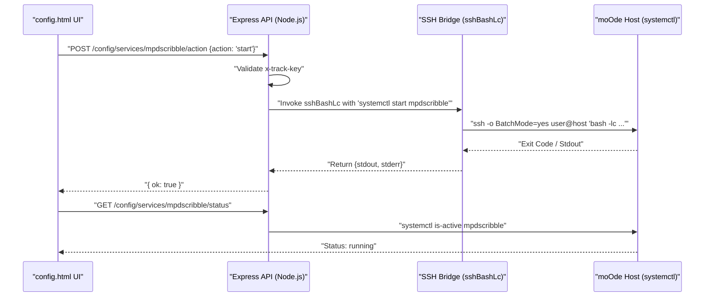
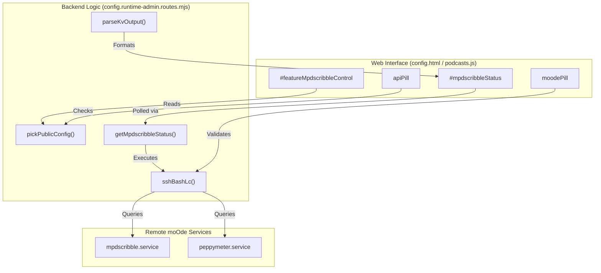

# Service Control

<details>
<summary>Relevant source files</summary>

The following files were used as context for generating this wiki page:

- [app.html](app.html)
- [config.html](config.html)
- [peppy.html](peppy.html)
- [podcasts.html](podcasts.html)
- [scripts/podcasts.js](scripts/podcasts.js)
- [src/config.mjs](src/config.mjs)
- [src/routes/config.runtime-admin.routes.mjs](src/routes/config.runtime-admin.routes.mjs)
- [src/routes/podcasts-download.routes.mjs](src/routes/podcasts-download.routes.mjs)
- [src/routes/podcasts-refresh.routes.mjs](src/routes/podcasts-refresh.routes.mjs)
- [src/routes/podcasts-subscriptions.routes.mjs](src/routes/podcasts-subscriptions.routes.mjs)
- [styles/hero.css](styles/hero.css)
- [theme.html](theme.html)

</details>


**Purpose**: This page documents the service management system that allows the `now-playing` API to remotely control and monitor services running on the moOde audio player host. This includes starting/stopping scrobbling services (`mpdscribble`), VU meter data bridges (`PeppyMeter`), and managing moOde display modes via `systemctl` and SSH.

---

## Overview

The Service Control subsystem enables administrative operations on moOde services without requiring direct terminal access to the moOde host. All service control actions are:

1.  **SSH-based**: Commands execute via `sshBashLc` from the API host to the moOde host [src/routes/config.runtime-admin.routes.mjs:147-152]().
2.  **Feature-gated**: Requires explicit enablement in the `features` configuration block (e.g., `mpdscribbleControl`, `moodeDisplayTakeover`) [src/routes/config.runtime-admin.routes.mjs:73-81]().
3.  **Authenticated**: Requires the `x-track-key` header for all state-changing control actions [src/routes/config.runtime-admin.routes.mjs:22]().
4.  **Asynchronous**: Uses `systemctl` status polling to prevent UI blocking during slow SSH operations.

The primary services managed are `mpdscribble` (Last.fm scrobbling), `PeppyMeter` (VU meters), and the background monitors for track notifications (Pushover).

**Sources**: [src/routes/config.runtime-admin.routes.mjs:6-82](), [src/config.mjs:75-99]()

---

## Architecture

### Service Management Flow
The system bridges the Web UI to the Linux `systemctl` utility on the remote moOde host using Node.js `child_process.execFile`.



**Sources**: [src/routes/config.runtime-admin.routes.mjs:147-152](), [src/routes/config.runtime-admin.routes.mjs:164-181]()

---

### Code Entity Mapping
This diagram maps UI elements and configuration keys to the specific backend functions that handle service logic.



**Sources**: [src/routes/config.runtime-admin.routes.mjs:11-83](), [src/routes/config.runtime-admin.routes.mjs:147-181](), [scripts/podcasts.js:49-62]()

---

## Service Implementation Details

### mpdscribble (Last.fm Scrobbling)
`mpdscribble` is a daemon that monitors MPD and scrobbles to Last.fm. The system provides remote management via the `getMpdscribbleStatus` function.

*   **Status Check**: Executes a multi-line bash script via SSH to check if the unit file exists, if it is active, and if it is enabled [src/routes/config.runtime-admin.routes.mjs:165-173]().
*   **Parsing**: Uses `parseKvOutput` to convert `KEY=VALUE` shell output into a JavaScript object [src/routes/config.runtime-admin.routes.mjs:154-162]().
*   **UI Feedback**: Status is reflected in the configuration interface, allowing users to toggle the service state remotely.

**Sources**: [src/routes/config.runtime-admin.routes.mjs:164-181](), [src/routes/config.runtime-admin.routes.mjs:78]()

### Track Notifications (Pushover)
The system includes a background monitor for track changes that can send Pushover notifications.

*   **Configuration**: Managed via the `notifications.trackNotify` and `notifications.pushover` blocks [src/routes/config.runtime-admin.routes.mjs:45-56]().
*   **Parameters**: Supports `pollMs` (frequency), `dedupeMs` (anti-spam), and `alexaMaxAgeMs` (voice command window) [src/routes/config.runtime-admin.routes.mjs:47-51]().
*   **Environment Overrides**: Settings can be overridden via environment variables like `TRACK_NOTIFY_ENABLED` and `PUSHOVER_TOKEN` [src/routes/config.runtime-admin.routes.mjs:90-108]().
*   **Constants**: Default values and logic are exported from the core config module [src/config.mjs:76-99]().

**Sources**: [src/routes/config.runtime-admin.routes.mjs:45-56](), [src/config.mjs:76-99]()

### Podcast Automation (Nightly Run)
Podcast management includes a service-like "Nightly Run" cron job that handles subscription updates and file retention.

*   **Cron Command**: A curl-based command designed to be placed in the moOde crontab [scripts/podcasts.js:36-39]().
*   **Retention Service**: Cleans up audio files older than a specified number of days [src/routes/podcasts-download.routes.mjs:89-138]().
*   **Status Monitoring**: The UI tracks the `nightly-status` to report the last run time and result [src/routes/podcasts-download.routes.mjs:69-76]().

**Sources**: [scripts/podcasts.js:36-39](), [src/routes/podcasts-download.routes.mjs:89-138]()

---

## moOde Display Control

The system manages the moOde "Display Mode" by modifying the local environment on the moOde host.

### Display Takeover Architecture
When `moodeDisplayTakeover` is enabled [src/routes/config.runtime-admin.routes.mjs:79](), the system can switch the moOde HDMI/LCD output between standard moOde UI and the `now-playing` kiosk.

| Component | Role | Implementation |
| :--- | :--- | :--- |
| **SSH Utility** | `sshBashLc` | Executes commands as `moode` user with `-lc` (login shell) [src/routes/config.runtime-admin.routes.mjs:147-152](). |
| **Timeout** | 20s | Default timeout for service operations to account for slow SD cards [src/routes/config.runtime-admin.routes.mjs:147](). |
| **Batch Mode** | Enabled | Prevents SSH from hanging on interactive prompts [src/routes/config.runtime-admin.routes.mjs:135](). |

**Sources**: [src/routes/config.runtime-admin.routes.mjs:79](), [src/routes/config.runtime-admin.routes.mjs:133-152]()

---

## Configuration & Runtime Gates

Service controls are protected by a "Runtime Gate" in the UI.

1.  **Verification**: The `loadRuntimeHints` process validates SSH reachability and `systemctl` access before enabling the service indicators [scripts/podcasts.js:64-104]().
2.  **Blocking**: UI cards can be visually dimmed or disabled (e.g., `cfgCard.blocked`) until the backend is verified [config.html:36-37]().
3.  **Status Pills**: The UI uses status pills (`apiPill`, `moodePill`, `alexaPill`) to provide visual feedback on the health of the connection to these services [scripts/podcasts.js:49-62]().

**Sources**: [config.html:36-37](), [scripts/podcasts.js:64-104](), [scripts/podcasts.js:88-91]()

---

## SSH Command Configuration

The backend uses a helper to construct safe SSH arguments for `systemctl` execution.

```javascript
function sshArgsFor(user, host, extra = []) {
  return [
    '-o', 'BatchMode=yes',
    '-o', 'ConnectTimeout=6',
    ...extra,
    `${user}@${host}`,
  ];
}
```
*   **BatchMode**: Ensures the process fails immediately if keys are not set up, rather than hanging for a password [src/routes/config.runtime-admin.routes.mjs:135]().
*   **ConnectTimeout**: Prevents the API from hanging if the moOde host is offline [src/routes/config.runtime-admin.routes.mjs:136]().

**Sources**: [src/routes/config.runtime-admin.routes.mjs:133-140]()
