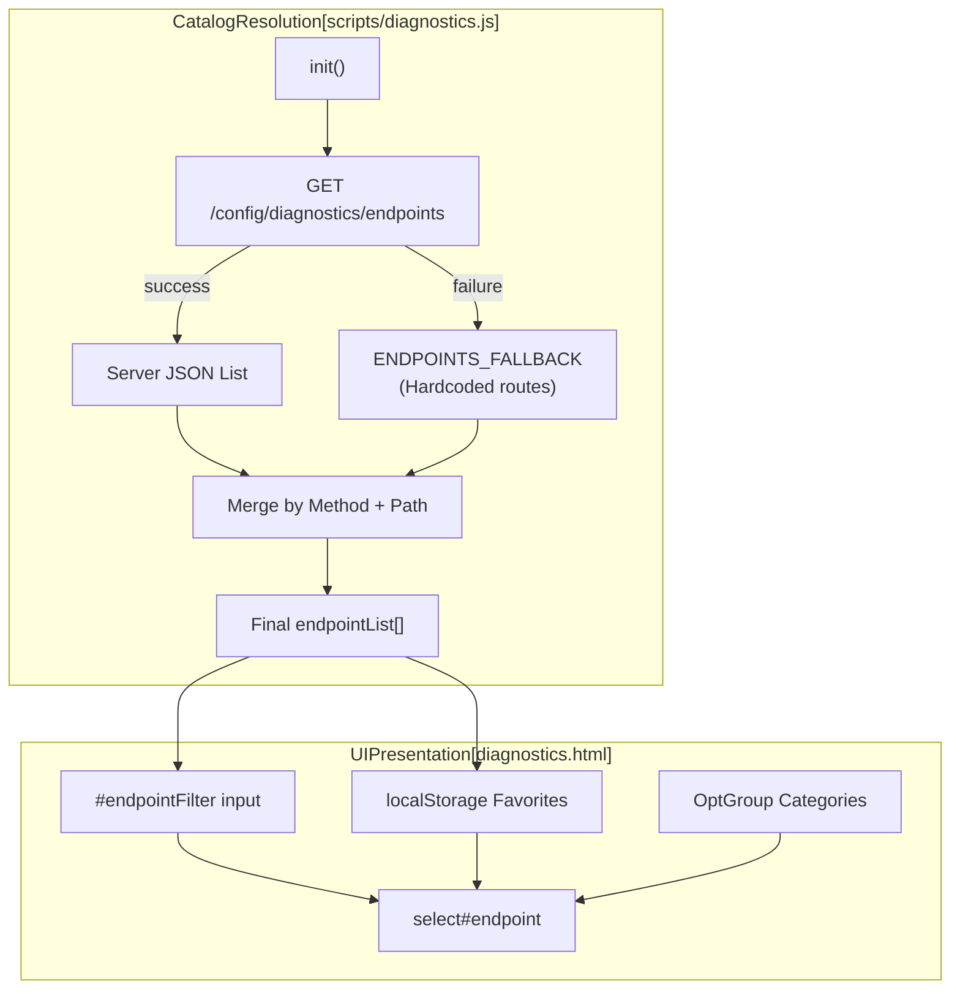
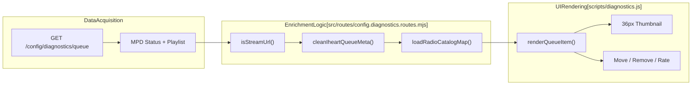

# Diagnostics Tools

<details>
<summary>Relevant source files</summary>

The following files were used as context for generating this wiki page:

- [diagnostics.html](diagnostics.html)
- [queue-wizard.html](queue-wizard.html)
- [scripts/diagnostics.js](scripts/diagnostics.js)
- [scripts/queue-wizard.js](scripts/queue-wizard.js)
- [src/routes/config.diagnostics.routes.mjs](src/routes/config.diagnostics.routes.mjs)
- [styles/podcasts.css](styles/podcasts.css)

</details>


The diagnostics interface (`diagnostics.html`) is a comprehensive development and debugging tool that provides API endpoint testing via a request builder, live UI previews with a scaling engine, and queue inspection with stream enrichment. It is designed for developers and administrators to test API contracts, monitor UI rendering across different device profiles, and control playback state.

---

## Overview

The diagnostics interface serves three primary functions:

1.  **API Request Builder**: Interactive testing of backend API endpoints with request customization, header injection (e.g., `x-track-key`), and response inspection (JSON or images). [diagnostics.html:136-174]()
2.  **Live UI Previews**: Real-time embedded previews of all system UI variants (Desktop, Player, Peppy, Mobile, Kiosk) using a CSS-based scaling engine. [diagnostics.html:179-287]()
3.  **Queue Inspector**: Visual queue management with playback controls, 5-star ratings, and track manipulation, including JIT metadata enrichment for radio streams. [scripts/diagnostics.js:411-477]()

The interface is accessible at `http://<host>:8101/diagnostics.html` and can be embedded within `app.html` as a tab or accessed standalone via the `?standalone=1` query parameter. [diagnostics.html:1-24]()

**Sources:** [diagnostics.html:1-24](), [scripts/diagnostics.js:411-477]()

---

## Accessing the Interface

### Shell Redirect Pattern
When accessed as a standalone page without the `?standalone=1` parameter, the interface automatically redirects to the application shell (`app.html`) to maintain consistent navigation and theme propagation. This behavior is controlled by an inline script: [diagnostics.html:6-22]()

```javascript
// Shell redirect logic in diagnostics.html
if (window.top !== window.self) return; 
const file = String(location.pathname.split('/').pop() || 'diagnostics.html');
const app = new URL('app.html', location.href);
app.searchParams.set('page', file);
location.replace(app.toString());
```

### Standalone Mode
Adding `?standalone=1` prevents the redirect and adds the `standaloneMode` CSS class to hide shell-specific elements like the navigation rail and hero status bars. [diagnostics.html:10-14](), [diagnostics.html:27-28]()

**Sources:** [diagnostics.html:6-28]()

---

## API Request Builder

### Endpoint Catalog Architecture
The diagnostics interface maintains a catalog of available endpoints. It attempts to load a dynamic list from the backend but relies on a robust `ENDPOINTS_FALLBACK` list containing over 90 predefined routes to ensure functionality even if the API server is unreachable or outdated. [scripts/diagnostics.js:8-96]()

**Endpoint Catalog Loading Flow**


**Sources:** [scripts/diagnostics.js:8-96](), [scripts/diagnostics.js:156-185](), [scripts/diagnostics.js:481-490]()

### Request Configuration & curl Export
The builder supports `GET`, `POST`, `PUT`, and `DELETE` methods, custom JSON bodies, and `x-track-key` header injection for authenticated routes. [diagnostics.html:136-174]()

A key feature is the **curl Export** function, which generates a copy-pasteable shell command replicating the current UI state, including headers and escaped JSON bodies. [scripts/diagnostics.js:775-796]()

```javascript
// curl generation logic in scripts/diagnostics.js
const parts = [`curl -s -X ${method}`];
if (useKey && key) parts.push(`-H 'x-track-key: ${key.replace(/'/g, "'\\''")}'`);
if (method === 'POST') {
  parts.push(`-H 'Content-Type: application/json'`);
  parts.push(`-d '${JSON.stringify(bodyObj).replace(/'/g, "'\\''")}'`);
}
parts.push(`'${url}'`);
```

**Sources:** [scripts/diagnostics.js:775-796](), [diagnostics.html:136-174]()

---

## Live UI Previews

### Scaling Engine
The interface embeds multiple UI variants as iframes. To fit high-resolution displays (like the 1920x1080 `index.html`) into the diagnostics page, it uses a custom scaling engine that applies CSS `transform: scale()` to a wrapper while maintaining fixed internal dimensions for the iframe. [scripts/diagnostics.js:225-238]()

**Preview Configurations:**
| Viewport | Page | Target Resolution | Default Scale |
| :--- | :--- | :--- | :--- |
| **Desktop** | `index.html` | 1920 × 1080 | 55% |
| **Player** | `player.html` | 1280 × 400 | 45% |
| **Peppy** | `peppy.html` | 1280 × 400 | 60% |
| **Mobile** | `controller.html` | 430 × 932 | 65% |
| **Kiosk** | `kiosk.html` | 1280 × 400 | 55% |

**Sources:** [scripts/diagnostics.js:214-223](), [scripts/diagnostics.js:225-238]()

### Frame Management
The `refreshPreviewFrame` function handles URL construction, ensuring that iframes are pointed to the correct UI port (default 8101) and include a cache-busting timestamp `t=${Date.now()}`. [scripts/diagnostics.js:246-279]()

**Sources:** [scripts/diagnostics.js:246-279](), [scripts/diagnostics.js:301-344]()

---

## Queue Inspector & Stream Enrichment

### Queue Data Flow
The Queue Inspector fetches data from `/config/diagnostics/queue`. This endpoint returns the current MPD queue enriched with metadata. [scripts/diagnostics.js:411-477]()

**Queue Enrichment Pipeline**


### JIT Stream Enrichment
For radio streams, the backend uses `cleanIheartQueueMeta` to extract artist and title from messy stream headers and `loadRadioCatalogMap` to resolve station names and logos from the moOde SQLite database. [src/routes/config.diagnostics.routes.mjs:9-30](), [src/routes/config.diagnostics.routes.mjs:126-161]()

The inspector also performs a secondary "Just-In-Time" fetch to the `/now-playing` endpoint. This allows the UI to display high-resolution iTunes or external album art for the current stream, overriding generic station logos. [scripts/diagnostics.js:428-439]()

**Sources:** [scripts/diagnostics.js:411-477](), [src/routes/config.diagnostics.routes.mjs:126-161](), [scripts/diagnostics.js:428-439]()

### Interactive Controls
The queue list supports direct manipulation:
*   **Ratings**: 5-star ratings for local tracks using optimistic UI updates before sending the POST to `/config/diagnostics/playback`. [scripts/diagnostics.js:385-398](), [scripts/diagnostics.js:686-712]()
*   **Reordering**: Up/Down buttons trigger `action: "move"` commands. [scripts/diagnostics.js:714-729]()
*   **Radio Favorites**: Heart icons toggle favorite status for streams via `/config/queue-wizard/radio-favorite`. [scripts/diagnostics.js:454-456](), [scripts/diagnostics.js:647-671]()

**Sources:** [scripts/diagnostics.js:627-738](), [scripts/diagnostics.js:358-374]()

---

## Diagnostics State Persistence

The interface heavily utilizes `localStorage` to persist developer preferences across sessions:

| Key | Content | Purpose |
| :--- | :--- | :--- |
| `diagnostics:favorites:v1` | Array of keys | Pinned API endpoints in the dropdown. [scripts/diagnostics.js:102]() |
| `diagnostics:requestState:v1` | Object | Per-endpoint overrides for Path, Method, and Body. [scripts/diagnostics.js:101]() |
| `diagnostics:endpointFilter:v1` | String | Last used search term in the catalog. [scripts/diagnostics.js:134]() |
| `diagnostics:*Collapsed:v1` | Boolean | Collapse/Expand state for preview cards. [scripts/diagnostics.js:104-108]() |

**Sources:** [scripts/diagnostics.js:100-154](), [scripts/diagnostics.js:820-834]()
