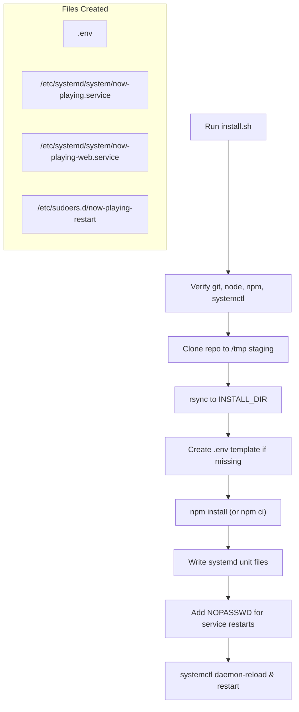

# Development Setup

Relevant source files

The following files were used as context for generating this wiki page:

- [build_moode_index.py](build_moode_index.py)
- [docs/04-library-health.md](docs/04-library-health.md)
- [docs/11-deploy-pm2-rollback.md](docs/11-deploy-pm2-rollback.md)
- [docs/21-moode-airplay-metadata-hardening.md](docs/21-moode-airplay-metadata-hardening.md)
- [docs/INSTALL_VALIDATION.md](docs/INSTALL_VALIDATION.md)
- [docs/README.md](docs/README.md)
- [ecosystem.config.cjs](ecosystem.config.cjs)
- [lastfm_vibe_radio.py](lastfm_vibe_radio.py)
- [notes/refactor-endpoint-inventory.md](notes/refactor-endpoint-inventory.md)
- [now-playing.config.example.json](now-playing.config.example.json)
- [scripts/deploy-pi4-safe.sh](scripts/deploy-pi4-safe.sh)
- [scripts/install.sh](scripts/install.sh)
- [scripts/uninstall.sh](scripts/uninstall.sh)
- [src/routes/config.alexa-alias.routes.mjs](src/routes/config.alexa-alias.routes.mjs)
- [src/routes/config.queue-wizard-vibe.routes.mjs](src/routes/config.queue-wizard-vibe.routes.mjs)

This page documents the prerequisites, installation procedures, and service management for the now-playing system. It covers the automated installation scripts, PM2 process management, development mode, and the critical validation checklists required for a stable deployment.

---

## Prerequisites

The system targets **Node.js 18+** and **systemd** hosts (typically Raspberry Pi OS or Ubuntu).

| Requirement | Purpose | Verification |
|-------------|---------|--------------|
| **Node.js** | Backend API runtime [scripts/install.sh:103]() | `node -v` |
| **npm** | Dependency management [scripts/install.sh:104]() | `npm -v` |
| **systemd** | Service orchestration [scripts/install.sh:107-110]() | `systemctl --version` |
| **rsync** | File deployment [scripts/install.sh:102]() | `rsync --version` |
| **python3** | Static web server and library indexing [scripts/install.sh:238](), [build_moode_index.py:1]() | `python3 --version` |
| **MPD** | Music Player Daemon connectivity [build_moode_index.py:5]() | `mpc version` |

**Sources:** [scripts/install.sh:101-115](), [build_moode_index.py:1-10]()

---

## Installation (install.sh)

The `scripts/install.sh` script automates the deployment of both the API and Web UI services. It handles cloning, dependency installation, and systemd unit generation.

### Installation Flags

| Flag | Default | Description |
|------|---------|-------------|
| `--mode` | `split` | `split` (separate API/Player) or `single-box` [scripts/install.sh:10]() |
| `--install-dir` | `/opt/now-playing` | Target installation path [scripts/install.sh:5]() |
| `--port` | `3101` | API server port [scripts/install.sh:6]() |
| `--ref` | `main` | Git branch, tag, or SHA to deploy [scripts/install.sh:8]() |
| `--fresh` | `false` | Destructive refresh; does NOT preserve `.env` or `data/` [scripts/install.sh:32]() |
| `--allow-root` | `false` | Required if running as root user [scripts/install.sh:31]() |

### Implementation Flow

**Sources:** [scripts/install.sh:20-35](), [scripts/install.sh:133-255]()

---

## Service Management

The system uses two systemd services to ensure high availability and automatic restarts.

### Service Definitions

1.  **now-playing.service**: Runs the Express API using `moode-nowplaying-api.mjs`. It loads environment variables from the `.env` file [scripts/install.sh:211-227]().
2.  **now-playing-web.service**: Runs a simple Python-based HTTP server on `WEB_PORT` (default 8101) to serve static assets [scripts/install.sh:230-245]().

### PM2 Management

While the installer uses systemd, developers often use **PM2** for local management as described in the rollback patterns. PM2 is used to manage the `api` and `webserver` processes [docs/11-deploy-pm2-rollback.md:14-15]().

| Command | Action |
|---------|--------|
| `pm2 restart api webserver` | Restarts both backend and frontend [docs/11-deploy-pm2-rollback.md:19]() |
| `pm2 logs api --lines 100` | Views recent backend logs [docs/11-deploy-pm2-rollback.md:21]() |
| `pm2 save` | Persists current process list [docs/11-deploy-pm2-rollback.md:20]() |

### Rollback Pattern
The recommended rollback flow involves checking out a previous commit and restarting the managed services [docs/11-deploy-pm2-rollback.md:33-37]().

**Sources:** [scripts/install.sh:211-245](), [docs/11-deploy-pm2-rollback.md:1-37]()

---

## Development Mode & Safe Deployment

For active development on a Raspberry Pi 4, `scripts/deploy-pi4-safe.sh` provides a mechanism to push local code changes to a remote target while preserving runtime state (configuration, caches, and environment).

### Exclusion Rules
To prevent overwriting user data, the following paths are excluded during rsync:
*   `.git`, `node_modules` [scripts/deploy-pi4-safe.sh:17-18]()
*   `config/now-playing.config.json` [scripts/deploy-pi4-safe.sh:19]()
*   `data/***`, `var/***` [scripts/deploy-pi4-safe.sh:20-21]()
*   `.env`, `*.log` [scripts/deploy-pi4-safe.sh:22-23]()

### Environment Configuration
The `.env` file is the primary configuration source for the API. Key variables include:
*   `PORT`: API port [scripts/install.sh:189]()
*   `WEB_PORT`: Static UI port [scripts/install.sh:190]()
*   `ART_CACHE_DIR`: Directory for processed artwork [scripts/install.sh:195]()
*   `NOW_PLAYING_CONFIG_PATH`: Path to the main JSON config [docs/11-deploy-pm2-rollback.md:9]()

**Sources:** [scripts/deploy-pi4-safe.sh:1-27](), [scripts/install.sh:183-200](), [docs/11-deploy-pm2-rollback.md:6-12]()

---

## Installation Validation Checklist

Before marking a release as stable, the following validation steps from `INSTALL_VALIDATION.md` must be performed.

### 1. Endpoint Smoke Tests
Verify core API connectivity using default port `3101`:
*   `GET /healthz`: Should return 200 OK [docs/INSTALL_VALIDATION.md:60]()
*   `GET /now-playing`: Should return JSON metadata [docs/INSTALL_VALIDATION.md:61]()
*   `GET /art/current.jpg`: Should respond without crashing [docs/INSTALL_VALIDATION.md:62]()

### 2. Idempotency & Persistence
*   **First Install**: `.env` is created with template keys [docs/INSTALL_VALIDATION.md:80]()
*   **Re-run**: Existing `.env` is **not** overwritten [docs/INSTALL_VALIDATION.md:81]()
*   **Permissions**: Verify `/opt/now-playing` is owned by the install user [docs/INSTALL_VALIDATION.md:115]()

### 3. Negative Testing
*   Verify that an invalid git ref causes a non-zero exit [docs/INSTALL_VALIDATION.md:128]()
*   Verify that an out-of-range port (e.g., 99999) triggers a validation error [docs/INSTALL_VALIDATION.md:136]()

**Sources:** [docs/INSTALL_VALIDATION.md:1-158]()

---

## Uninstallation (uninstall.sh)

The `scripts/uninstall.sh` script reverses the installation process by stopping services and removing systemd units.

*   **Standard Uninstall**: Removes services and sudoers rules but keeps the installation directory [scripts/uninstall.sh:115]()
*   **Purge Mode (`--purge`)**: Deletes the entire installation directory, including all local `.env` and configuration files [scripts/uninstall.sh:109-110]()

**Sources:** [scripts/uninstall.sh:1-137]()
